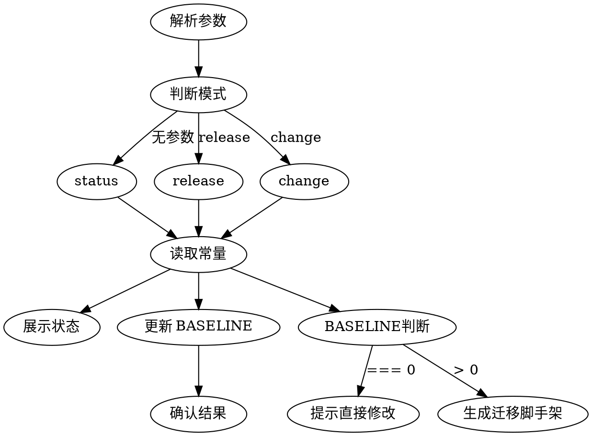

# db-schema — 数据库 Schema 版本管理

管理 `packages/hub/src/store/index.ts` 中的 `SCHEMA_VERSION` 和 `SCHEMA_RELEASE_BASELINE`。

## 用法

- `/db-schema` — 查看当前 schema 状态
- `/db-schema release` — 发布时调用，锁定当前版本
- `/db-schema change` — 准备 schema 变更（已发布时自动生成迁移脚手架）

## 流程



## 第 1 步：读取当前状态

读取 `packages/hub/src/store/index.ts`，提取：
- `SCHEMA_VERSION` 的值
- `SCHEMA_RELEASE_BASELINE` 的值

## 第 2 步：按模式执行

### 模式：status（默认，无参数）

展示当前 schema 状态：

```
## Schema 状态

- SCHEMA_VERSION: {VERSION}
- SCHEMA_RELEASE_BASELINE: {BASELINE}
- 状态: {状态描述}
```

状态描述规则：
- `BASELINE === 0` → `🔓 未发布 — schema 可直接修改，无需迁移脚本`
- `BASELINE > 0 && BASELINE === VERSION` → `🔒 已发布 (v{VERSION}) — schema 变更需写迁移`
- `BASELINE > 0 && BASELINE < VERSION` → `🔄 已发布 (v{BASELINE})，当前 v{VERSION} — 已有 {VERSION - BASELINE} 次迁移`

### 模式：release

锁定当前 schema 版本。

**操作：**
1. 读取当前 `SCHEMA_VERSION` 和 `SCHEMA_RELEASE_BASELINE`
2. **判断是否需要操作：**
   - `VERSION === BASELINE` → 无待迁移变更，输出 `✅ 无 schema 变更，BASELINE 无需更新`，结束
   - `VERSION > BASELINE` → 继续第 3 步
3. 编辑 `packages/hub/src/store/index.ts`，将 `SCHEMA_RELEASE_BASELINE` 的赋值改为 `SCHEMA_VERSION` 的值
4. 展示变更结果：

```
## Schema 版本已锁定

- SCHEMA_RELEASE_BASELINE: {OLD_BASELINE} → {VERSION}
- 后续 schema 变更将需要编写迁移脚本
```

### 模式：change

根据 `SCHEMA_RELEASE_BASELINE` 判断策略：

**当 `BASELINE === 0`（未发布）：**
- 输出提示：`当前未发布，直接修改 createSchema() 即可，无需递增 SCHEMA_VERSION`
- 列出 `createSchema()` 中的表清单，方便用户指定要修改的表
- 结束

**当 `BASELINE > 0`（已发布）：**

1. **递增 `SCHEMA_VERSION`**：将 `SCHEMA_VERSION` 加 1
2. **在 `initSchema()` 的迁移区域添加版本分支**：
   在 `// Schema 变更策略` 注释块之后、`if (currentVersion !== SCHEMA_VERSION)` 之前插入：
   ```typescript
   if (currentVersion === {OLD_VERSION}) {
       this.migrateFromV{OLD_VERSION}ToV{NEW_VERSION}()
       this.setUserVersion(SCHEMA_VERSION)
       return
   }
   ```
3. **添加迁移方法脚手架**（在 `assertRequiredTablesPresent` 方法之后）：
   ```typescript
   private migrateFromV{OLD_VERSION}ToV{NEW_VERSION}(): void {
       this.db.run('BEGIN')
       try {
           // TODO: 在此实现迁移逻辑
           // 例如：this.db.run('ALTER TABLE sessions ADD COLUMN new_field TEXT')
           this.db.run('COMMIT')
       } catch (error) {
           this.db.run('ROLLBACK')
           throw error
       }
   }
   ```
4. **展示变更摘要**：
   ```
   ## Schema 迁移脚手架已生成

   - SCHEMA_VERSION: {OLD} → {NEW}
   - 新增迁移方法: migrateFromV{OLD}ToV{NEW}()
   - 下一步: 实现迁移方法中的 TODO 逻辑，然后更新 createSchema() 的建表语句
   ```

## 注意事项

- 只修改 `packages/hub/src/store/index.ts` 中的常量和方法
- 迁移方法必须用事务包裹（BEGIN / COMMIT / ROLLBACK）
- 变更后记得同步更新 `createSchema()` 的建表语句（新安装时使用）
- 修改完 schema 后运行测试验证
