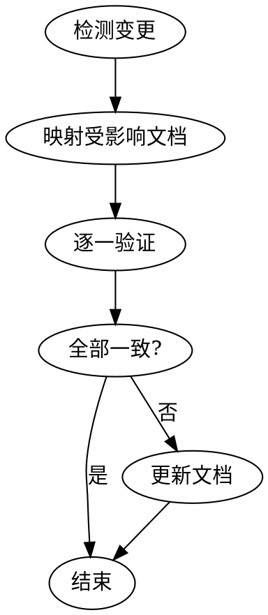

# sync-docs

代码变更完成后，检查并更新受影响的项目文档。

## 触发时机

- 新增 / 删除 / 重命名了源文件
- 修改了模块接口、导出、API 端点
- 调整了目录结构或新增了包
- 修改了通信协议或数据流

## 检查流程



### 第 1 步：检测变更

查看本次会话中修改的文件：

- 使用 `git diff --name-only` 和 `git diff --name-only --cached` 获取变更文件列表
- 使用 `git ls-files --others --exclude-standard` 获取新增文件
- 将变更文件按包分类（shared/ hub/ cli/ web/）

### 第 2 步：映射受影响文档

根据变更内容和项目文档结构（参考 CLAUDE.md 文档索引），自行判断哪些文档可能受影响。重点关注：

- 变更涉及的包 → 该包的 `CLAUDE.md`（关键文件表是否需要更新）
- 变更涉及的模式/风格 → `docs/conventions/` 对应文件
- 变更涉及的架构/流程 → `docs/architecture/` 对应文件
| 修改消息处理流程 | `docs/architecture/message-lifecycle.md` |
| 修改配置或环境变量 | `hub/CLAUDE.md` 配置段 |
| 新增编码模式或约束 | `docs/conventions/` 对应包的规范 |

### 第 3 步：逐一验证

对第 2 步中识别的每个文档：

1. **读取文档**中涉及变更区域的内容
2. **读取实际代码**，确认文档描述与代码一致
3. **标记不一致项**：
   - 关键文件表中缺少新增文件？
   - 文档描述的接口签名与实际不符？
   - 架构图遗漏了新组件？

### 第 4 步：更新文档

对每个不一致项：

1. 编辑文档使其与代码一致
2. 保持文档风格统一（中文注释、表格格式、Mermaid 图）
3. **不要**为不存在的内容添加文档（只更新，不虚构）

## 输出格式

检查完成后，输出摘要：

```
## sync-docs 检查结果

检查了 N 个文档：
- ✅ xxx.md — 一致
- ✏️ xxx.md — 已更新：[具体变更]
- ⚠️ xxx.md — 建议人工检查：[原因]
```

## 注意事项

- **只更新，不虚构**：文档必须反映实际代码，不为"理想状态"写文档
- **最小变更**：只更新受影响的部分，不重写无关内容
- **保持风格**：中文描述、表格格式、Mermaid 图风格与现有文档一致
- **编码规范**：如果发现了新的编码模式（如新的组件写法），更新 `docs/conventions/` 对应文件
