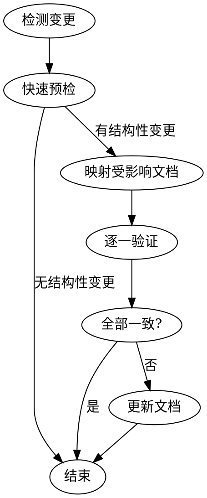

# sync-docs

代码变更完成后，检查并更新受影响的项目文档。

## 触发时机

- 新增 / 删除 / 重命名了源文件
- 修改了模块接口、导出、API 端点
- 调整了目录结构或新增了包
- 修改了通信协议或数据流

## 检查流程



### 第 1 步：检测变更

查看本次会话中修改的文件：

- 使用 `git diff --name-only` 和 `git diff --name-only --cached` 获取变更文件列表
- 使用 `git ls-files --others --exclude-standard` 获取新增文件
- 将变更文件按包分类（shared/ hub/ cli/ web/）

### 第 1.5 步：快速预检

如果满足以下**全部**条件，直接跳过并报告"无结构性变更，跳过文档同步"：

1. **无文件增删**：没有新增、删除、重命名 `.ts` / `.tsx` 文件
2. **无签名变更**：diff 中没有修改 `export type` / `export interface` / `Schema`（Zod）的签名
3. **无 API 变更**：变更文件不涉及 `routes/`、`rpcGateway`、`socket` 目录
4. **纯内部修改**：所有变更仅限函数体内部实现，不改变对外接口

有任何一条不满足，继续第 2 步。

### 第 2 步：映射受影响文档

根据以下映射表，将变更文件精确映射到受影响的文档。

#### Hub — 数据层

| 代码变更 glob | 影响文档 |
|---|---|
| `packages/hub/src/store/*` | `docs/architecture/hub/store/README.md` |
| `packages/hub/src/sync/syncEngine.ts` | `docs/architecture/hub/sync/README.md` |
| `packages/hub/src/sync/eventPublisher.ts` | `docs/architecture/hub/sync/event-publisher.md` |
| `packages/hub/src/sync/sessionCache.ts` | `docs/architecture/hub/sync/session-cache.md` |
| `packages/hub/src/sync/machineCache.ts` | `docs/architecture/hub/sync/machine-cache.md` |
| `packages/hub/src/sync/messageService.ts` | `docs/architecture/hub/sync/message-service.md` |
| `packages/hub/src/sync/rpcGateway.ts` | `docs/architecture/hub/sync/rpc-gateway.md` |
| `packages/hub/src/sync/backgroundTasks.ts` | `docs/architecture/hub/sync/README.md` |
| `packages/hub/src/sync/tasks.ts` | `docs/architecture/hub/sync/README.md` |
| `packages/hub/src/sync/teams.ts` | `docs/architecture/hub/sync/README.md` |
| `packages/hub/src/sync/todos.ts` | `docs/architecture/hub/sync/README.md` |

#### Hub — 通信层

| 代码变更 glob | 影响文档 |
|---|---|
| `packages/hub/src/socket/server.ts` | `docs/architecture/hub/socket/README.md` |
| `packages/hub/src/socket/handlers.ts` | `docs/architecture/hub/socket/handlers.md` |
| `packages/hub/src/socket/rpc.ts` | `docs/architecture/hub/socket/rpc.md` |
| `packages/hub/src/socket/terminal.ts` | `docs/architecture/hub/socket/terminal.md` |
| `packages/hub/src/sse/*` | `docs/architecture/hub/sse/README.md` |

#### Hub — Web API

| 代码变更 glob | 影响文档 |
|---|---|
| `packages/hub/src/web/routes/sessions.ts` | `docs/architecture/hub/web/api/sessions.md` |
| `packages/hub/src/web/routes/messages.ts` | `docs/architecture/hub/web/api/messages.md` |
| `packages/hub/src/web/routes/permissions.ts` | `docs/architecture/hub/web/api/permissions.md` |
| `packages/hub/src/web/routes/push.ts` | `docs/architecture/hub/web/api/push.md` |
| `packages/hub/src/web/routes/git.ts` | `docs/architecture/hub/web/api/git.md` |
| `packages/hub/src/web/routes/manifest.ts` | `docs/architecture/hub/web/README.md` |
| `packages/hub/src/web/auth.ts` | `docs/architecture/hub/web/auth.md` |

#### Hub — 基础设施

| 代码变更 glob | 影响文档 |
|---|---|
| `packages/hub/src/config/*` | `docs/architecture/hub/config/README.md` |
| `packages/hub/src/notification/*` | `docs/architecture/hub/notification/README.md` |
| `packages/hub/src/push/*` | `docs/architecture/hub/push/README.md` |
| `packages/hub/src/visibility/*` | `docs/architecture/hub/visibility/README.md` |
| `packages/hub/src/index.ts` | `docs/architecture/hub/README.md` |

#### CLI

| 代码变更 glob | 影响文档 |
|---|---|
| `packages/cli/src/commands/**/*.ts` | `docs/architecture/cli/commands/<command>/README.md` |
| `packages/cli/src/commands/registry.ts` | `docs/architecture/cli/README.md` |
| `packages/cli/src/claude/*.ts` | `docs/architecture/cli/commands/claude/*.md` |
| `packages/cli/src/api/*.ts` | `docs/architecture/cli/api/*.md` |
| `packages/cli/src/modules/common/rpc/*.ts` | `docs/architecture/cli/api/common-rpc/*.md` |
| `packages/cli/src/modules/common/handlers/*.ts` | `docs/architecture/cli/api/common-rpc/<handler>.md` |

#### Web

| 代码变更 glob | 影响文档 |
|---|---|
| `packages/web/src/core/**` | `docs/architecture/web/README.md` |
| `packages/web/src/domain/**` | `docs/architecture/web/README.md`、`message-lifecycle.md` |
| `packages/web/src/components/**` | `docs/architecture/web/README.md` |
| `packages/web/src/router.tsx` | `docs/architecture/web/README.md` |
| `packages/web/src/components/tool-card/*` | `docs/architecture/web/agent-rendering.md` |

#### Shared（跨模块）

| 代码变更 glob | 影响文档 |
|---|---|
| `packages/shared/src/schemas.ts` | `docs/architecture/hub/web/api/types.md`、`message-lifecycle.md` |
| `packages/shared/src/modes.ts` | `docs/architecture/hub/web/api/types.md` |
| `packages/shared/src/types.ts` | `docs/architecture/hub/web/api/types.md` |
| `packages/shared/src/messages.ts` | `docs/architecture/message-lifecycle.md` |
| `packages/shared/src/socket.ts` | `docs/architecture/hub/socket/README.md` |

#### 跨模块文档

| 触发条件 | 影响文档 |
|---|---|
| 消息处理流程相关变更 | `docs/architecture/message-lifecycle.md` |
| 权限处理相关变更 | `docs/architecture/tool-permission.md` |
| 打包构建相关变更 | `docs/architecture/packaging.md` |
| 各包新增/删除源文件 | 对应包的 `CLAUDE.md`（关键文件表） |
| 新的编码模式或约束 | `docs/conventions/<package>.md` |

### 第 3 步：逐一验证

对第 2 步中映射的每个文档：

1. **读取文档**中涉及变更区域的内容
2. **读取实际代码**，确认文档描述与代码一致
3. **按维度检查**：
   - **文件表**：关键文件表是否包含新增文件？是否移除了已删除文件？
   - **接口签名**：文档描述的类型/函数签名与实际是否一致？
   - **API 端点**：路由路径、请求/响应体是否与代码一致？
   - **架构图**：组件关系和数据流是否反映最新结构？
   - **字段枚举**：事件类型、子类型、状态值等枚举是否完整？

### 第 4 步：更新文档

对每个不一致项：

1. 编辑文档使其与代码一致
2. 保持文档风格统一（中文注释、表格格式、Mermaid 图）
3. **不要**为不存在的内容添加文档（只更新，不虚构）

## 输出格式

检查完成后，输出摘要：

```
## sync-docs 检查结果

检查了 N 个文档：
- ✅ xxx.md — 一致
- ✏️ xxx.md — 已更新：[具体变更]
- ⚠️ xxx.md — 建议人工检查：[原因]
- ⏭️ 无结构性变更，跳过文档同步
```

## 注意事项

- **只更新，不虚构**：文档必须反映实际代码，不为"理想状态"写文档
- **最小变更**：只更新受影响的部分，不重写无关内容
- **保持风格**：中文描述、表格格式、Mermaid 图风格与现有文档一致
- **编码规范**：如果发现了新的编码模式（如新的组件写法），更新 `docs/conventions/` 对应文件
