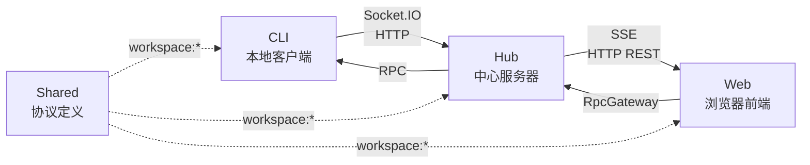
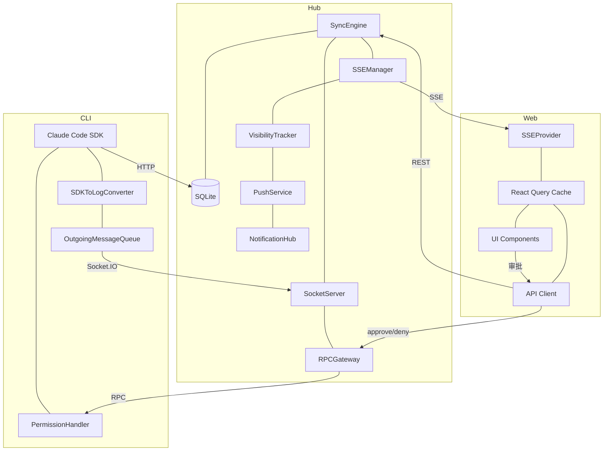

# 系统架构

Mobi 由四个包组成，围绕 **"CLI 在本地运行 Claude Code，Hub 在远端桥接，Web 在浏览器操控"** 的核心架构。

## 整体架构



## 四个包

| 包 | 职责 | 技术栈 | 详细文档 |
|---|---|---|---|
| **shared** | 跨包共享的 Zod Schema 和类型 | TypeScript + Zod | — |
| **hub** | 中心服务器，桥接 CLI 和 Web | Bun + Hono + Socket.IO + SQLite | [→ hub/](hub/) |
| **cli** | 本地客户端，启动和管理 Claude Code 会话 | Bun + Ink + Claude Agent SDK | [→ cli/](cli/) |
| **web** | 浏览器前端，远程交互界面 | React 19 + Ant Design X + TanStack | [→ web/](web/) |

## 数据流

### 上行（CLI → Web）

```
Claude SDK → sdkToLogConverter → Socket.IO → SyncEngine → SSE → SSEProvider → React Query → UI
```

### 下行（Web → CLI）

```
UI → API Client → Hub REST → RpcGateway → Socket.IO → CLI RPC Handler → Claude SDK
```

### 跨切面

- **[消息生命周期](message-lifecycle.md)**：一条消息从 SDK 产生到 UI 渲染的完整路径（过滤、转换、标准化、归约、渲染）
- **[Agent 消息渲染](web/agent-rendering.md)**：Agent 工具（Task/Agent）的内联渲染和 Drawer 详情渲染架构，包括 sidechain 子对话
- **[工具权限审批流](tool-permission.md)**：SDK 工具调用的用户授权机制，包括普通工具、ExitPlanMode、AskUserQuestion 三种场景
- **认证**：JWT（Web ↔ Hub），Token（CLI ↔ Hub）
- **终端**：CLI ↔ Socket.IO(/terminal) ↔ Web，实时双向，独立于 SyncEngine

## 核心组件关系


