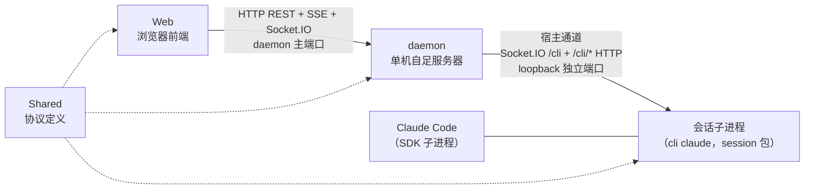
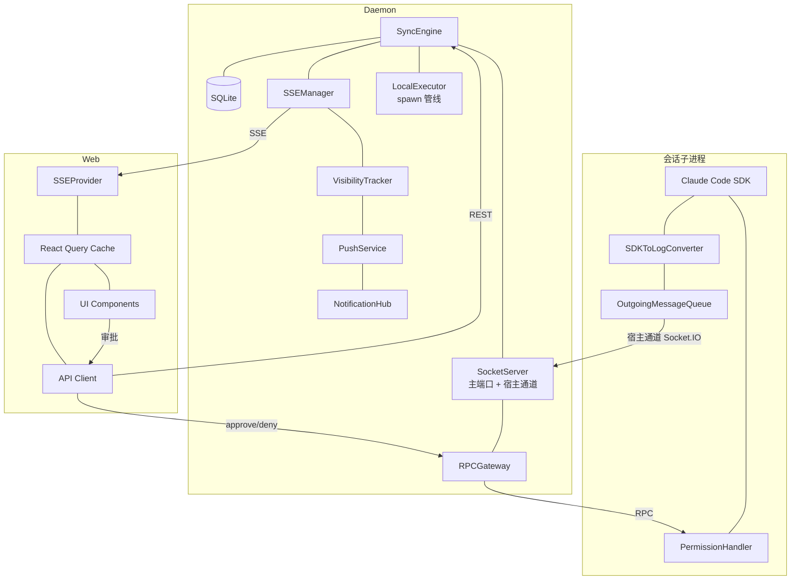

# 系统架构

Mobi 由六个包组成，围绕**「单机 daemon 托管 Claude Code 会话子进程，Web 在浏览器操控」**的核心架构（personal-agent-rewrite 后的最终形态）：每台机器的 mobi 自给自足，daemon 同时承载 Web 服务与会话 spawn（执行层为进程内 executor）。

## 整体架构（单机拓扑）


```mermaid
graph LR
    WEB["Web<br/>浏览器前端"] -->|"HTTP REST + SSE + Socket.IO<br/>daemon 主端口"| D["daemon<br/>单机自足服务器"]
    D -->|"宿主通道<br/>Socket.IO /cli + /cli/* HTTP<br/>loopback 独立端口"| SESSION["会话子进程<br/>（cli claude，session 包）"]
    SESSION2["Claude Code<br/>（SDK 子进程）"] --- SESSION
    SHARED["Shared<br/>协议定义"] -.-> D & SESSION & WEB
```

要点：

- **单机假设**：machines 表已删除（remove-machine，见 [ADR 0011](../adr/0011-remove-machine-concept.md)），无任何「他机」概念；executor 状态为内存单例（executorRuntime），经 `/api/daemon/status` 与 `daemon-status` SSE 暴露。
- **会话子进程**由 daemon 进程内 executor spawn（`cli claude ...`，源码直跑），经**宿主通道**回连 daemon。宿主通道是 loopback-only 的独立 Socket.IO listener（端口 = 主端口 + 10000，`MOBI_HOST_PORT` 覆盖；详见 [ADR 0009](../adr/0009-host-channel-loopback-listener.md)）。
- **supervisor**（`mobi service supervise`）只托管单个 daemon 组件；daemon 的进程状态单源是 `daemon.state.json`。

## 六个包

| 包 | 职责 | 技术栈 | 详细文档 |
|---|---|---|---|
| **shared** | 跨包共享的 Zod Schema 和类型 | TypeScript + Zod | — |
| **node-core** | 节点侧共享库（git 簇 / logger / configuration / persistence / handlers / api 四件） | TypeScript + Bun | — |
| **daemon** | 单机 daemon：Web + Socket.IO + SQLite + spawn 管线（executor），一个进程 | Bun + Hono + Socket.IO + SQLite | [→ daemon/](daemon/) |
| **session** | 会话宿主：与 Claude Code 会话进程共处的一切（claude/agent/mcp/terminal、local/remote 循环） | TypeScript + Claude Agent SDK | [→ cli/](cli/)（会话宿主叙述） |
| **cli** | 组合根：二进制入口、命令路由、supervisor/setup/upgrader/auth UI | Bun | [→ cli/](cli/) |
| **web** | 浏览器前端，远程交互界面 | React 19 + Ant Design X + TanStack | [→ web/](web/) |

依赖方向：`daemon ⟂ session`（互不依赖），两者只依赖 `node-core` 与 `shared`；`cli` 组合根按需动态 import daemon / session。

## 数据流

### 上行（会话 → Web）

```
Claude SDK → sdkToLogConverter → 宿主通道 Socket.IO → SyncEngine → SSE → SSEProvider → React Query → UI
```

### 下行（Web → 会话）

```
UI → API Client → daemon REST → RpcGateway → 宿主通道 Socket.IO → 会话 RPC Handler → Claude SDK
```

### 跨切面

- **[消息生命周期](message-lifecycle.md)**：一条消息从 SDK 产生到 UI 渲染的完整路径（分类、过滤、转换、标准化、归约、渲染）
- **[Agent 消息渲染](web/agent-rendering.md)**：Agent 工具（Task/Agent）的内联渲染和 Drawer 详情渲染架构，包括 sidechain 子对话
- **[工具权限审批流](tool-permission.md)**：SDK 工具调用的用户授权机制，包括普通工具、ExitPlanMode、AskUserQuestion 三种场景
- **认证**：JWT（Web ↔ daemon），Token（会话子进程 ↔ 宿主通道）
- **终端**：Web ↔ Socket.IO(/terminal) ↔ daemon 内 TerminalManager（pty），实时双向，独立于 SyncEngine
- **[单文件打包](packaging.md)**：Bun `--compile` 原理、构建流水线、资产嵌入、工具提取、分发模式
- **[CLI 命令体系](cli-commands.md)**：所有 mobi 命令的用法、子命令、内部实现与公共约定

## 核心组件关系


```mermaid
graph TB
    subgraph Daemon
        SE[SyncEngine] --- Store[(SQLite)]
        SE --- SSEMgr[SSEManager]
        SE --- Socket[SocketServer<br/>主端口 + 宿主通道]
        Socket --- RPC[RPCGateway]
        SE --- Host[LocalExecutor<br/>spawn 管线]
        SSEMgr --- Visibility[VisibilityTracker]
        Visibility --- Push[PushService]
        Push --- Notification[NotificationHub]
    end

    subgraph 会话子进程
        Claude[Claude Code SDK] --- Converter[SDKToLogConverter]
        Converter --- OutQueue[OutgoingMessageQueue]
        Claude --- PermHandler[PermissionHandler]
    end

    subgraph Web
        SSEProv[SSEProvider] --- RQC[React Query Cache]
        RQC --- UI[UI Components]
        API[API Client] --- RQC
    end

    OutQueue -->|"宿主通道 Socket.IO"| Socket
    SSEMgr -->|"SSE"| SSEProv
    API -->|"REST"| SE
    UI -->|"审批"| API -->|"approve/deny"| RPC -->|"RPC"| PermHandler
```
