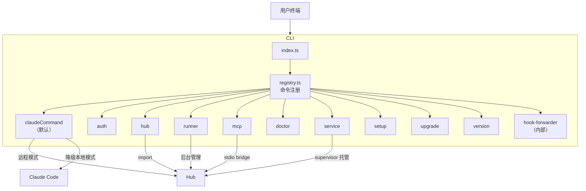
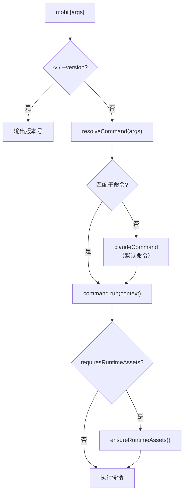
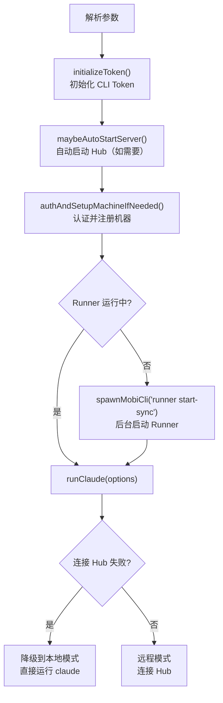

# CLI 模块

CLI 是 Mobi 的客户端，在本地启动 Claude Code 会话并通过 Hub 实现远程控制。

## 整体架构



## 命令体系

### 入口与路由



命令通过 `CommandDefinition` 定义，由 `registry.ts` 统一注册和路由：

```typescript
// 命令定义
type CommandDefinition = {
    name: string
    requiresRuntimeAssets: boolean  // 是否需要运行时资源
    run: (context: CommandContext) => Promise<void>
}

// 命令路由
resolveCommand(args) → { command, context }
// 未匹配任何子命令 → claudeCommand（默认）
```

### 命令一览

| 命令 | 别名 | 运行时资源 | 职责 |
|------|------|-----------|------|
| **(default)** | `claude` | ✅ | 启动 Claude Code 会话，连接 Hub 实现远程控制 |
| [`auth`](./commands/auth) | — | ✅ | 认证管理（login / logout / status） |
| [`hub`](./commands/hub) | `service hub` | ✅ | 启动/管理 Hub（经 supervisor 托管） |
| [`runner`](./commands/runner) | `service runner` | ✅ | 后台 Runner 管理（start/stop/status 经 supervisor；list / stop-session / logs 直连） |
| [`mcp`](./commands/mcp) | — | ❌ | MCP Server，暴露 `change_title` 工具（随 Claude 会话自动启动） |
| [`doctor`](./commands/doctor) | — | ✅ | 系统诊断与故障排除 |
| [`service`](./commands/service) | — | ✅ | supervisor 托管 hub+runner（start / stop / restart / status，可按组件） |
| [`setup`](./commands/setup) | — | ✅ | 交互式配置向导（settings / service / 完整 wizard） |
| [`upgrade`](./commands/upgrade) | — | ❌ | 版本升级 |
| [`version`](./commands/version) | — | ❌ | 版本信息（show / list） |
| [`hook`](./commands/hook) | — | ❌ | 内部命令，转发 Claude SessionStart hook |

### 命令详解

#### (default) / claude — 核心会话命令

CLI 的主要使用方式：`mobi [options]`，所有未匹配子命令的参数都走此命令。

**启动流程**：



**参数处理**：

| 参数 | 说明 |
|------|------|
| `--yolo` | 透传为 `--dangerously-skip-permissions`，跳过权限确认 |
| `--model <model>` | 指定 Claude 模型 |
| `--mobi-starting-mode <mode>` | 启动模式：`local` / `remote` |
| `--started-by <source>` | 启动来源：`runner` / `terminal` |
| `--project <id>` | 归属项目 id（Web spawn 透传；终端亦可手动指定） |
| 其他参数 | 透传给 Claude Code |

**降级策略**：连接 Hub 失败时自动降级为本地模式（`runLocalMode`），直接 `spawn` claude 进程，不提供远程控制功能。

#### [auth](./auth) — 认证管理

| 子命令 | 说明 |
|--------|------|
| `status` | 显示当前连接配置（API URL、Token 状态、Machine ID） |
| `login` | 交互式输入并保存 CLI_API_TOKEN |
| `logout` | 清除本地凭据（Token 和 Machine ID） |

Token 优先级：环境变量 `CLI_API_TOKEN` > `~/.mobi/settings.json` > 交互式输入。

详见 [Auth 认证系统](./commands/auth)。

#### [hub](./hub) — 启动 Hub 服务器

解析 `--host`/`--port` 参数后加载 Hub 模块。CLI 主命令会通过 `maybeAutoStartServer()` 自动启动 Hub。

详见 [Hub 命令](./commands/hub)。

#### [runner](./runner) — 后台 Runner 管理

| 子命令 | 说明 |
|--------|------|
| `start` | 后台启动 Runner（detached 进程） |
| `start-sync` | 同步启动 Runner（供内部调用） |
| `stop` | 停止 Runner（会话继续运行） |
| `status` | 显示 Runner 状态 |
| `list` | 列出活跃会话 |
| `stop-session <id>` | 停止指定会话 |
| `logs` | 显示最新 Runner 日志路径 |

Runner 在后台运行，管理 Claude 会话的生命周期，允许用户离开终端后会话继续运行。

详见 [Runner 命令](./commands/runner)。

#### [mcp](./mcp) — MCP Server

随 Claude 会话自动启动 HTTP MCP Server，暴露 `change_title` 工具让 Claude Code 修改会话标题，通过 Socket.IO 同步到 Hub。

详见 [MCP 系统](./commands/mcp)。

#### [doctor](./doctor) — 系统诊断

| 子命令 | 说明 |
|--------|------|
| (无) | 运行完整诊断检查 |
| `clean` | 清理失控的 mobi 进程 |

详见 [Doctor 系统诊断](./commands/doctor)。

#### [hook](./commands/hook) — SessionStart Hook 转发

转发 Claude 的 SessionStart hook 到主 CLI 进程。由三个协作组件构成：Hook Server（HTTP 服务）、Hook Settings（配置生成）、Hook Forwarder（stdin → HTTP 桥梁）。

详见 [Hook 系统](./commands/hook)。

#### [service](./commands/service) — supervisor 进程托管

| 子命令 | 说明 |
|--------|------|
| `start [--host] [--port]` | 托管 hub + runner（崩溃自动退避重启，连续 5 次放弃） |
| `stop` / `restart` / `status` | 全量操作；托管集清空时 supervisor 自动退出 |
| `hub <action>` / `runner <action>` | 单组件操作 |
| `supervise --sync`（内部） | 前台运行 supervisor 本体 |

`mobi hub` / `mobi runner` 顶层的 start/stop/restart/status 是 service 子命令的别名。`status`/`stop` 冷启动只探活不拉起 supervisor。详见 [Service 命令与 Supervisor](./commands/service)。

#### setup — 交互式配置向导

| 子命令 | 说明 |
|--------|------|
| `settings` | 配置 API URL、Token 等 |
| `service install` | 安装系统服务（launchd/systemd 直接 ExecStart supervisor，开机自启） |
| `service remove` | 卸载系统服务 |
| `service status` | 查看系统服务状态 |
| (无) | 完整向导：settings + 选择启动方式 |

首次使用时的引导式配置工具。

#### upgrade — 版本升级

检查并升级 Mobi CLI 到最新版本。

#### version — 版本信息

| 子命令 | 说明 |
|--------|------|
| (无) | 显示当前版本 |
| `list` | 列出可用版本 |
| `list --all` | 列出稳定版 + RC 版本 |
| `list rc` | 仅列出 RC 版本 |

## API 通信层

CLI 通过 `packages/cli/src/api/` 与 Hub 通信，包括 HTTP REST 和 Socket.IO WebSocket。

详见 [API 通信层](./api)。

## 代码入口

```
packages/cli/src/
├── index.ts                     # 主入口，调用 runCli()
├── commands/
│   ├── runCli.ts                # CLI 启动流程：版本检查、命令路由、运行时资源
│   ├── registry.ts              # 命令注册表，resolveCommand()
│   ├── types.ts                 # CommandDefinition、CommandContext 类型
│   ├── claude.ts                # 默认命令，启动 Claude 会话
│   ├── claudeArgs.ts            # claude 命令参数解析（parseStartOptions 纯函数）
│   ├── auth.ts                  # 认证管理命令
│   ├── hub.ts                   # Hub 服务器启动命令
│   ├── runner.ts                # Runner 管理命令
│   ├── mcp.ts                   # MCP 命令入口
│   ├── doctor.ts                # 系统诊断命令
│   ├── service.ts               # service 命令矩阵 + supervise --sync 入口
│   ├── serviceOps.ts            # service 命令族共用操作（ensure + IPC + 输出）
│   ├── serviceArgs.ts           # --host/--port 解析纯函数（含端口校验）
│   ├── setup.ts                 # 交互式配置向导命令
│   ├── upgrade.ts               # 版本升级命令
│   ├── version.ts               # 版本信息命令
│   └── hookForwarder.ts         # 内部 hook 转发命令
├── supervisor/                  # 进程托管（见 docs/architecture/cli/commands/service/）
│   ├── index.ts                 # runSupervisor 编排入口
│   ├── supervisor.ts            # 托管状态机（依赖注入，纯单测）
│   ├── control.ts               # Unix socket IPC server/client
│   ├── desiredState.ts          # 期望状态持久化
│   ├── restartPolicy.ts         # 退避/崩溃计数纯函数
│   ├── ppidWatchdog.ts          # 父进程死亡看门狗
│   └── orphanCleanup.ts         # 启动孤儿清理
└── utils/httpHealth.ts          # waitForUrlOk HTTP 健康轮询
```
