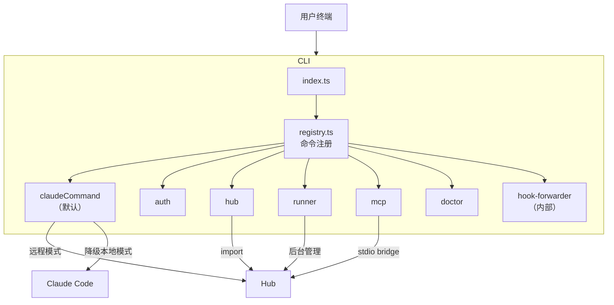
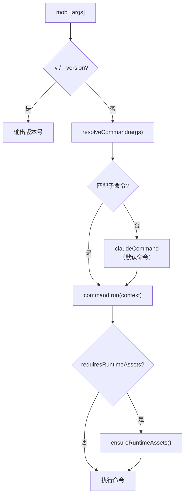
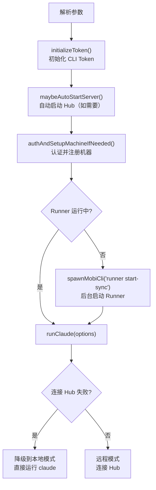

# CLI 模块

CLI 是 Mobi 的客户端，在本地启动 Claude Code 会话并通过 Hub 实现远程控制。

## 整体架构



## 命令体系

### 入口与路由



命令通过 `CommandDefinition` 定义，由 `registry.ts` 统一注册和路由：

```typescript
// 命令定义
type CommandDefinition = {
    name: string
    requiresRuntimeAssets: boolean  // 是否需要运行时资源
    run: (context: CommandContext) => Promise<void>
}

// 命令路由
resolveCommand(args) → { command, context }
// 未匹配任何子命令 → claudeCommand（默认）
```

### 命令一览

| 命令 | 别名 | 运行时资源 | 职责 |
|------|------|-----------|------|
| **(default)** | `claude` | ✅ | 启动 Claude Code 会话，连接 Hub 实现远程控制 |
| [`auth`](./auth) | — | ✅ | 认证管理（login / logout / status） |
| `hub` | — | ✅ | 启动 Hub 服务器 |
| `runner` | — | ✅ | 后台 Runner 管理（start / stop / list / status / logs） |
| `mcp` | — | ❌ | MCP stdio bridge，转发 MCP 请求 |
| [`doctor`](./doctor) | — | ✅ | 系统诊断与故障排除 |
| `hook-forwarder` | — | ❌ | 内部命令，转发 Claude SessionStart hook |

### 命令详解

#### (default) / claude — 核心会话命令

CLI 的主要使用方式：`mobi [options]`，所有未匹配子命令的参数都走此命令。

**启动流程**：



**参数处理**：

| 参数 | 说明 |
|------|------|
| `--yolo` | 透传为 `--dangerously-skip-permissions`，跳过权限确认 |
| `--model <model>` | 指定 Claude 模型 |
| `--mobi-starting-mode <mode>` | 启动模式：`local` / `remote` |
| `--started-by <source>` | 启动来源：`runner` / `terminal` |
| 其他参数 | 透传给 Claude Code |

**降级策略**：连接 Hub 失败时自动降级为本地模式（`runLocalMode`），直接 `spawn` claude 进程，不提供远程控制功能。

#### [auth](./auth) — 认证管理

| 子命令 | 说明 |
|--------|------|
| `status` | 显示当前连接配置（API URL、Token 状态、Machine ID） |
| `login` | 交互式输入并保存 CLI_API_TOKEN |
| `logout` | 清除本地凭据（Token 和 Machine ID） |

Token 优先级：环境变量 `CLI_API_TOKEN` > `~/.mobi/settings.json` > 交互式输入。

详见 [Auth 认证系统](./auth)。

#### hub — 启动 Hub 服务器

通过 `import('../../../hub/src/index')` 直接加载 Hub 模块，支持 `--host` 和 `--port` 参数。

#### runner — 后台 Runner 管理

| 子命令 | 说明 |
|--------|------|
| `start` | 后台启动 Runner（detached 进程） |
| `start-sync` | 同步启动 Runner（供内部调用） |
| `stop` | 停止 Runner（会话继续运行） |
| `status` | 显示 Runner 状态 |
| `list` | 列出活跃会话 |
| `stop-session <id>` | 停止指定会话 |
| `logs` | 显示最新 Runner 日志路径 |

Runner 在后台运行，管理 Claude 会话的生命周期，允许用户离开终端后会话继续运行。

#### mcp — MCP stdio bridge

启动 MCP stdio bridge，将 MCP 请求转发给 Hub，不需要运行时资源。

#### [doctor](./doctor) — 系统诊断

| 子命令 | 说明 |
|--------|------|
| (无) | 运行完整诊断检查 |
| `clean` | 清理失控的 mobi 进程 |

详见 [Doctor 系统诊断](./doctor)。

#### hook-forwarder — 内部命令

转发 Claude 的 SessionStart hook 到主 CLI 进程。不触发完整的 CLI 启动流程，不需要运行时资源。

## 代码入口

```
cli/src/
├── index.ts                     # 主入口，调用 runCli()
├── commands/
│   ├── runCli.ts                # CLI 启动流程：版本检查、命令路由、运行时资源
│   ├── registry.ts              # 命令注册表，resolveCommand()
│   ├── types.ts                 # CommandDefinition、CommandContext 类型
│   ├── claude.ts                # 默认命令，启动 Claude 会话
│   ├── auth.ts                  # 认证管理命令
│   ├── hub.ts                   # Hub 服务器启动命令
│   ├── runner.ts                # Runner 管理命令
│   ├── mcp.ts                   # MCP stdio bridge 命令
│   ├── doctor.ts                # 系统诊断命令
│   └── hookForwarder.ts         # 内部 hook 转发命令
```
