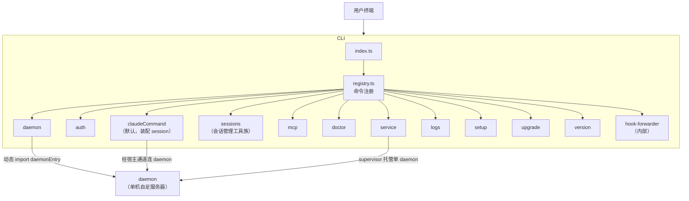
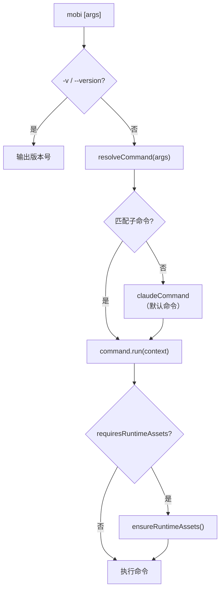
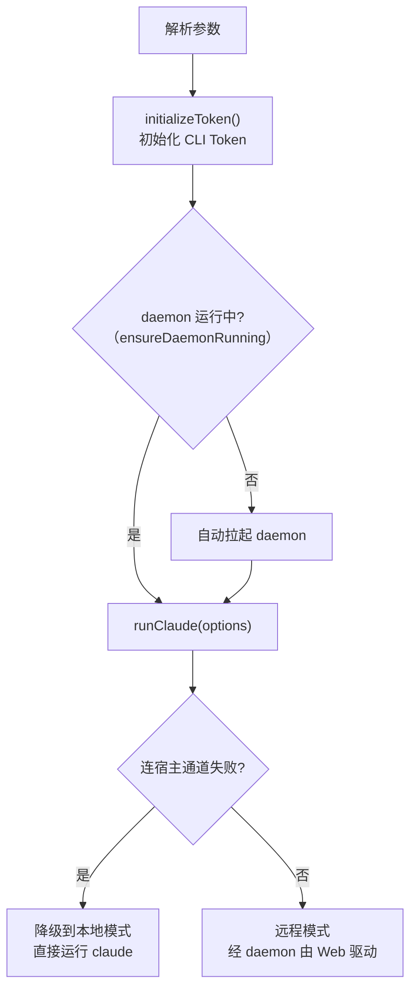

# CLI 模块

cli 是 mobi 的组合根与二进制入口：命令路由、supervisor、setup/upgrader/auth UI 与 runtime 编译期资产。会话宿主代码在 [session 包](../../../packages/session/)，daemon 在 [daemon 包](../daemon/)，cli 自身无业务逻辑。

## 整体架构


```mermaid
graph TB
    User["用户终端"] --> CLI["mobi CLI"]

    subgraph CLI
        Entry["index.ts"]
        Registry["registry.ts<br/>命令注册"]
        CmdDefault["claudeCommand<br/>（默认，装配 session）"]
        CmdAuth["auth"]
        CmdDaemon["daemon"]
        CmdSessions["sessions<br/>（会话管理工具族）"]
        CmdMcp["mcp"]
        CmdDoctor["doctor"]
        CmdService["service"]
        CmdLogs["logs"]
        CmdSetup["setup"]
        CmdUpgrade["upgrade"]
        CmdVersion["version"]
        CmdHook["hook-forwarder<br/>（内部）"]
    end

    Entry --> Registry
    Registry --> CmdDefault & CmdAuth & CmdDaemon & CmdSessions & CmdMcp & CmdDoctor & CmdService & CmdLogs & CmdSetup & CmdUpgrade & CmdVersion & CmdHook

    CmdDaemon -->|"动态 import daemonEntry"| Daemon["daemon<br/>（单机自足服务器）"]
    CmdDefault -->|"经宿主通道连 daemon"| Daemon
    CmdService -->|"supervisor 托管单 daemon"| Daemon
```

依赖方向：cli 按需动态 import daemon / session；daemon ⟂ session（互不依赖），两者只依赖 node-core 与 shared。

## 命令体系

### 入口与路由


```mermaid
flowchart TB
    Start["mobi [args]"] --> Version{"-v / --version?"}
    Version -->|是| PrintVersion["输出版本号"]
    Version -->|否| Resolve["resolveCommand(args)"]
    Resolve --> Match{"匹配子命令?"}
    Match -->|是| Run["command.run(context)"]
    Match -->|否| Default["claudeCommand<br/>（默认命令）"]
    Default --> Run
    Run --> Assets{"requiresRuntimeAssets?"}
    Assets -->|是| Ensure["ensureRuntimeAssets()"]
    Assets -->|否| Exec["执行命令"]
    Ensure --> Exec
```

命令通过 `CommandDefinition` 定义，由 `registry.ts` 统一注册和路由：

```typescript
// 命令定义
type CommandDefinition = {
    name: string
    requiresRuntimeAssets: boolean  // 是否需要运行时资源
    run: (context: CommandContext) => Promise<void>
}

// 命令路由
resolveCommand(args) → { command, context }
// 未匹配任何子命令 → claudeCommand（默认）
```

### 命令一览

| 命令 | 别名 | 运行时资源 | 职责 |
|------|------|-----------|------|
| **(default)** | `claude` | ✅ | 启动 Claude Code 会话（session 包装配），经宿主通道连 daemon |
| `auth` | — | ✅ | 认证管理（login / logout / status） |
| [`daemon`](./commands/daemon) | `service daemon` | ✅ | 启动/管理单机 daemon（经 supervisor 托管） |
| [`sessions`](./commands/sessions) | — | ✅ | 会话管理工具族（list / stop；进程级操作走 `mobi daemon`） |
| [`mcp`](./commands/mcp) | — | ❌ | MCP stdio bridge，把 `change_title` 调用转发给已有 HTTP MCP（当前无实际场景） |
| [`doctor`](./commands/doctor) | — | ✅ | 系统诊断与故障排除 |
| [`service`](./commands/service) | — | ✅ | supervisor 托管 daemon（start / stop / restart / status） |
| `logs` | — | ✅ | 打印各进程最新日志路径 |
| `setup` | — | ✅ | 交互式配置向导（settings / service / 完整 wizard） |
| `upgrade` | — | ❌ | 版本升级 |
| `version` | — | ❌ | 版本信息（show / list） |
| [`hook`](./commands/hook) | — | ❌ | 内部命令，转发 Claude SessionStart hook |

> `mobi hub` / `mobi runner` 命令已删除（ticket-22 与 remove-machine 601，runner 与 hub 已合并为单 daemon）：会话管理走 `mobi sessions`。

### 命令详解

#### (default) / claude — 核心会话命令

CLI 的主要使用方式：`mobi [options]`，所有未匹配子命令的参数都走此命令。

**启动流程**：


```mermaid
flowchart TB
    Start["解析参数"] --> Token["initializeToken()<br/>初始化 CLI Token"]
    Token --> Daemon{"daemon 运行中?<br/>（ensureDaemonRunning）"}
    Daemon -->|否| StartDaemon["自动拉起 daemon"]
    Daemon -->|是| RunClaude["runClaude(options)"]
    StartDaemon --> RunClaude
    RunClaude --> ConnError{"连宿主通道失败?"}
    ConnError -->|是| LocalMode["降级到本地模式<br/>直接运行 claude"]
    ConnError -->|否| RemoteMode["远程模式<br/>经 daemon 由 Web 驱动"]
```

**参数处理**：

| 参数 | 说明 |
|------|------|
| `--yolo` | 透传为 `--dangerously-skip-permissions`，跳过权限确认 |
| `--model <model>` | 指定 Claude 模型 |
| `--mobi-starting-mode <mode>` | 启动模式：`local` / `remote` |
| `--started-by <source>` | 启动来源：`daemon`（宿主 spawn） / `terminal` |
| `--workspace <id>` | 归属工作区 id（Web spawn 透传；终端亦可手动指定） |
| 其他参数 | 透传给 Claude Code |

**降级策略**：连接 daemon 失败时自动降级为本地模式（`runLocalMode`），直接 `spawn` claude 进程，不提供远程控制功能。

#### auth — 认证管理

| 子命令 | 说明 |
|--------|------|
| `status` | 显示当前连接配置（Token 状态、Host） |
| `login` | 交互式输入并保存 CLI_API_TOKEN |
| `logout` | 清除本地凭据（Token） |

Token 优先级：环境变量 `CLI_API_TOKEN` > `~/.mobi/settings.cli.json` > 交互式输入。


#### [daemon](./commands/daemon) — 启动/管理单机 daemon

| 子命令 | 说明 |
|--------|------|
| `start [--host] [--port]` | 后台启动 daemon（经 supervisor 托管） |
| `start-sync` | 前台直跑 daemon（内部子命令，动态 import `daemonEntry`） |
| `stop` / `restart` / `status` | 进程级操作（会话子进程保持存活） |

详见 [Daemon 命令](./commands/daemon)。

#### [sessions](./commands/sessions) — 会话管理工具族

| 子命令 | 说明 |
|--------|------|
| `list` | 列出活跃会话 |
| `stop <id>` | 停止指定会话 |

会话运行在 daemon 内，进程级操作走 `mobi daemon` / `mobi service`；spawn 管线、controlServer 等内部结构见 [daemon executor 架构](../daemon/)。

#### [mcp](./commands/mcp) — MCP stdio bridge

启动一个只暴露 `change_title` 的 stdio MCP server，把调用转发给已存在的 mobi HTTP MCP server（`--url` 或 `MOBI_HTTP_MCP_URL`）。当前无实际使用场景。

会话内的 MCP 工具族（remote 进程内 / local HTTP 壳 / 工具工厂）在 session 包，见 [MCP 模块](./mcp/)。

详见 [mcp 命令](./commands/mcp)。

#### [doctor](./commands/doctor) — 系统诊断

| 子命令 | 说明 |
|--------|------|
| (无) | 运行完整诊断检查 |
| `clean [profile]` | 清理失控的 mobi 进程 |
| `exits` | 查看近期进程退出记录 |

详见 [Doctor 系统诊断](./commands/doctor)。

#### [hook](./commands/hook) — SessionStart Hook 转发

转发 Claude 的 SessionStart hook 到主 CLI 进程。由三个协作组件构成：Hook Server（HTTP 服务）、Hook Settings（配置生成）、Hook Forwarder（stdin → HTTP 桥梁）。

详见 [Hook 系统](./commands/hook)。

#### [service](./commands/service) — supervisor 进程托管

| 子命令 | 说明 |
|--------|------|
| `start [--host] [--port]` | 托管 daemon（崩溃自动退避重启，连续 5 次放弃） |
| `stop` / `restart` / `status` | 全量操作；托管集清空时 supervisor 自动退出 |
| `daemon <action>` | 单组件操作 |
| `supervise --sync`（内部） | 前台运行 supervisor 本体 |

`mobi daemon` 顶层命令是 service 子命令的别名。`status`/`stop` 冷启动只探活不拉起 supervisor。详见 [Service 命令与 Supervisor](./commands/service)。

#### setup — 交互式配置向导

| 子命令 | 说明 |
|--------|------|
| `settings` | 配置 Token、监听等 |
| `service install` | 安装系统服务（launchd/systemd 直接 ExecStart supervisor，开机自启） |
| `service remove` | 卸载系统服务 |
| `service status` | 查看系统服务状态 |
| (无) | 完整向导：settings + 选择启动方式 |

首次使用时的引导式配置工具。

#### upgrade — 版本升级

检查并升级 Mobi CLI 到最新版本。

#### version — 版本信息

| 子命令 | 说明 |
|--------|------|
| (无) | 显示当前版本 |
| `list` | 列出可用版本 |
| `list --all` | 列出稳定版 + RC 版本 |
| `list rc` | 仅列出 RC 版本 |

## API 通信层

会话子进程通过 `packages/session/src/api/` 与 daemon 通信（HTTP REST + Socket.IO，走宿主通道）。

详见 [API 通信层](./api)。

## 代码入口

（只列入口与命令层；会话宿主模块见 session 包，daemon 见 [daemon 架构](../daemon/)）

```
packages/cli/src/
├── index.ts                     # 主入口，调用 runCli()
├── commands/
│   ├── runCli.ts                # CLI 启动流程：版本检查、命令路由、运行时资源
│   ├── registry.ts              # 命令注册表，resolveCommand()
│   ├── types.ts                 # CommandDefinition、CommandContext 类型
│   ├── claude.ts                # 默认命令，启动 Claude 会话
│   ├── claudeArgs.ts            # claude 命令参数解析（parseStartOptions 纯函数）
│   ├── auth.ts                  # 认证管理命令
│   ├── daemon.ts                # daemon 管理命令（start / start-sync / stop / restart / status）
│   ├── sessions.ts              # 会话管理工具族（list / stop）
│   ├── mcp.ts                   # MCP 命令入口
│   ├── doctor.ts                # 系统诊断命令
│   ├── service.ts               # service 命令矩阵 + supervise --sync 入口
│   ├── serviceOps.ts            # service 命令族共用操作（ensure + IPC + 输出）
│   ├── serviceArgs.ts           # --host/--port 解析纯函数（含端口校验）
│   ├── logs.ts                  # 日志路径打印命令
│   ├── setup.ts                 # 交互式配置向导命令
│   ├── upgrade.ts               # 版本升级命令
│   ├── version.ts               # 版本信息命令
│   └── hookForwarder.ts         # 内部 hook 转发命令
├── supervisor/                  # 进程托管（见 docs/architecture/cli/commands/service/）
│   ├── index.ts                 # runSupervisor 编排入口
│   ├── supervisor.ts            # 托管状态机（依赖注入，纯单测）
│   ├── control.ts               # Unix socket IPC server/client
│   ├── desiredState.ts          # 期望状态持久化
│   ├── restartPolicy.ts         # 退避/崩溃计数纯函数
│   ├── ppidWatchdog.ts          # 父进程死亡看门狗
│   └── orphanCleanup.ts         # 启动孤儿清理
└── utils/httpHealth.ts          # waitForUrlOk HTTP 健康轮询
```
