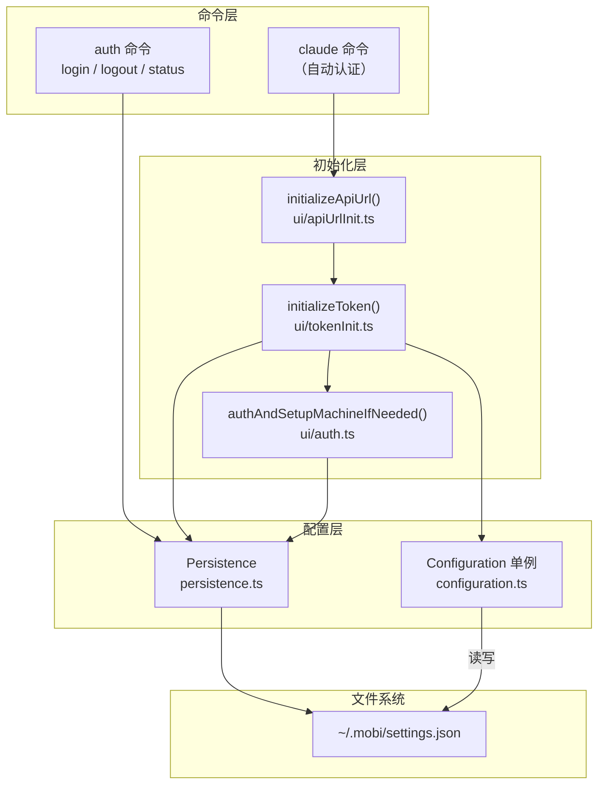
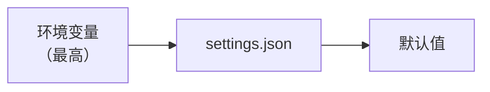
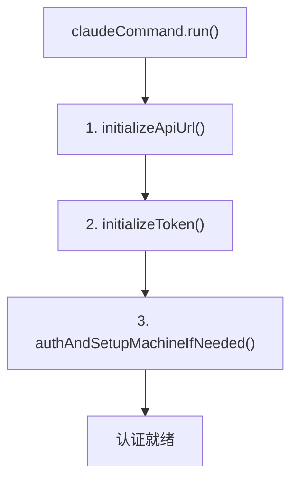
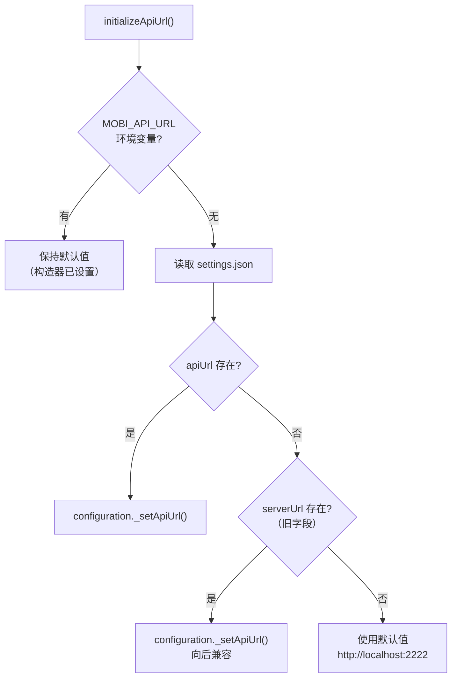
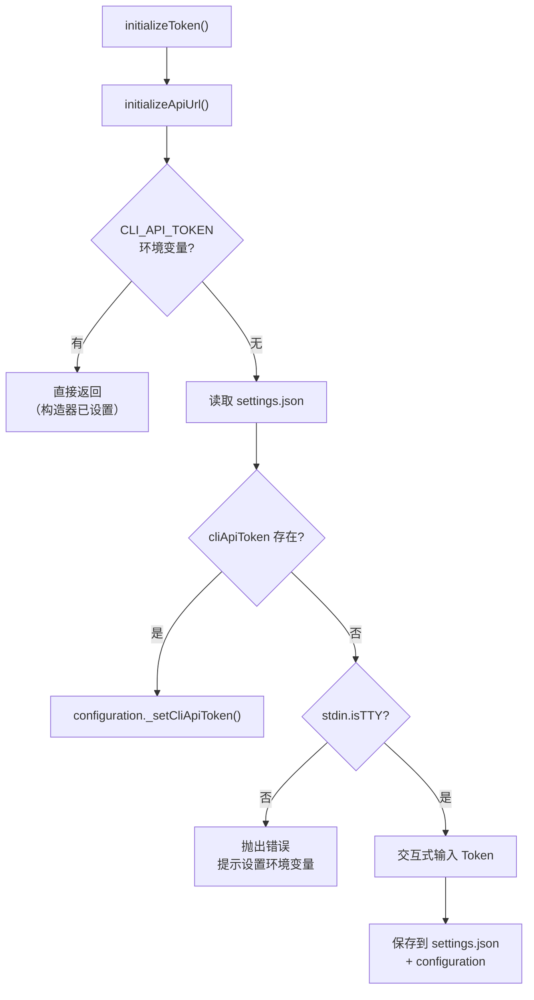
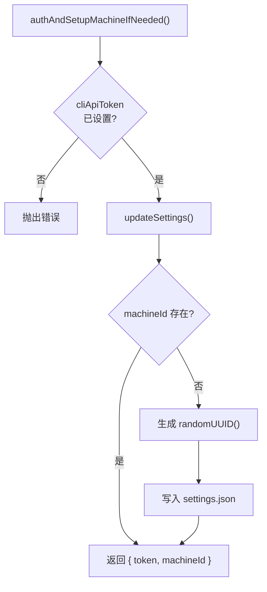
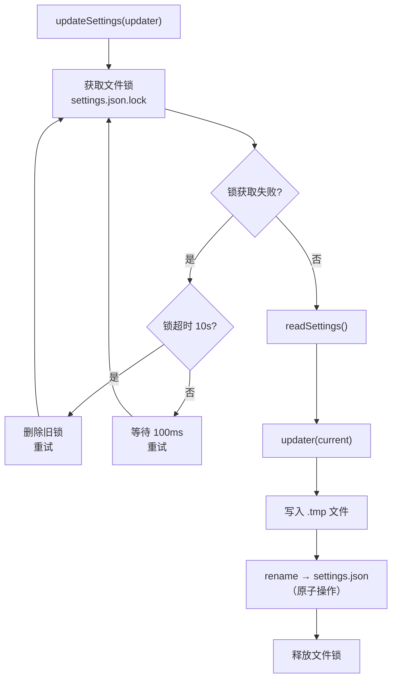

# Auth 认证系统

文件 [`cli/src/commands/auth.ts`](/cli/src/commands/auth.ts)

CLI 的认证系统管理 API Token 和机器身份，确保 CLI 能安全连接 Hub。

## 架构概览



## 认证维度

CLI 认证包含两个维度：

| 维度 | 说明 | 存储位置 |
|------|------|----------|
| **API Token** | CLI 与 Hub 的共享密钥，用于 Socket.IO 认证 | `~/.mobi/settings.json` → `cliApiToken` |
| **Machine ID** | 机器唯一标识，用于多租户隔离 | `~/.mobi/settings.json` → `machineId` |

此外还有 API URL 配置：

| 维度 | 说明 | 存储位置 |
|------|------|----------|
| **API URL** | Hub 服务器地址 | `~/.mobi/settings.json` → `apiUrl` |

## 优先级链

三个配置项遵循相同的优先级策略：



### API URL (`MOBI_API_URL`)

| 优先级 | 来源 | 说明 |
|--------|------|------|
| 1 | `MOBI_API_URL` 环境变量 | 最高优先级，临时覆盖 |
| 2 | `settings.json` → `apiUrl` | 持久化配置 |
| 2' | `settings.json` → `serverUrl` | 旧字段名，向后兼容 |
| 3 | `http://localhost:2222` | 默认值 |

**初始化**：`initializeApiUrl()`（`ui/apiUrlInit.ts`）

### API Token (`CLI_API_TOKEN`)

| 优先级 | 来源 | 说明 |
|--------|------|------|
| 1 | `CLI_API_TOKEN` 环境变量 | 最高优先级，临时覆盖 |
| 2 | `settings.json` → `cliApiToken` | 持久化配置 |
| 3 | 交互式输入 | 首次运行时提示输入 |

**初始化**：`initializeToken()`（`ui/tokenInit.ts`）

### Machine ID

首次需要时自动生成 UUID v4，写入 `settings.json`。不会从环境变量读取。

**初始化**：`authAndSetupMachineIfNeeded()`（`ui/auth.ts`）

## 初始化流程

`claudeCommand` 启动时自动执行三步初始化：



### Step 1: initializeApiUrl()



### Step 2: initializeToken()



### Step 3: authAndSetupMachineIfNeeded()



## auth 命令

`mobi auth` 提供手动管理认证状态的子命令。

### 子命令

#### status — 查看认证状态

显示当前连接配置，不做任何修改：

```
MOBI_API_URL:    http://localhost:2222
CLI_API_TOKEN:   set / missing
Token Source:    environment / settings file / none
Machine ID:      xxxxxxxx-xxxx-xxxx-xxxx-xxxxxxxxxxxx
Host:            my-machine
```

#### login — 交互式登录

1. 检查 `stdin.isTTY`，非 TTY 环境拒绝执行
2. 提示输入 Token
3. 保存到 `settings.json`
4. 更新内存中的 `configuration.cliApiToken`

#### logout — 登出

1. 从 `settings.json` 清除 `cliApiToken`
2. 清除 `machineId`
3. 环境变量中的 Token 仍然生效（提示用户）

## Configuration 单例

**文件**: [`cli/src/configuration.ts`](/cli/src/configuration.ts)

全局配置单例，在模块加载时同步创建：

| 属性 | 来源 | 默认值 |
|------|------|--------|
| `apiUrl` | `MOBI_API_URL` | `http://localhost:2222` |
| `cliApiToken` | `CLI_API_TOKEN` | `''` |
| `mobiHomeDir` | `MOBI_HOME` | `~/.mobi` |
| `settingsFile` | 派生 | `{mobiHomeDir}/settings.json` |
| `isRunnerProcess` | 进程参数 | `false` |

构造器自动创建 `~/.mobi/` 和 `~/.mobi/logs/` 目录。

`_setApiUrl()` 和 `_setCliApiToken()` 是内部方法，仅供初始化层使用。

## Persistence 持久化

**文件**: [`cli/src/persistence.ts`](/cli/src/persistence.ts)

### Settings 文件操作

| 函数 | 说明 |
|------|------|
| `readSettings()` | 读取 `settings.json`，不存在或解析失败返回空对象 |
| `writeSettings()` | 直接写入 `settings.json` |
| `updateSettings(updater)` | 原子更新：文件锁 → 读取 → 更新 → tmp + rename 写入 |

### updateSettings 原子更新机制



- **文件锁**：`settings.json.lock`，`wx` 模式创建（排他）
- **重试**：最多 50 次，每次间隔 100ms
- **过期**：锁文件超过 10s 自动视为过期
- **原子写入**：先写 `.tmp` 再 `rename`，保证数据完整性

### Settings 数据结构

```typescript
interface Settings {
    machineId?: string                    // 机器唯一标识
    machineIdConfirmedByServer?: boolean   // 服务器是否已确认
    runnerAutoStartWhenRunningMobi?: boolean // 是否自动启动 Runner
    cliApiToken?: string                   // CLI API Token
    apiUrl?: string                        // Hub API URL
    serverUrl?: string                     // 旧字段名（向后兼容读取）
}
```

## 代码结构

```
cli/src/
├── commands/
│   └── auth.ts                # auth 命令：login / logout / status
├── ui/
│   ├── apiUrlInit.ts           # API URL 初始化
│   ├── tokenInit.ts            # Token 初始化（含交互式输入）
│   └── auth.ts                 # Machine ID 初始化
├── configuration.ts            # 全局配置单例
└── persistence.ts              # 文件持久化（Settings 读写 + 文件锁）
```

## 文件分布

```
~/.mobi/
├── settings.json       # 配置（Token、Machine ID、API URL）
└── settings.json.lock  # 更新时的文件锁（临时）
```
