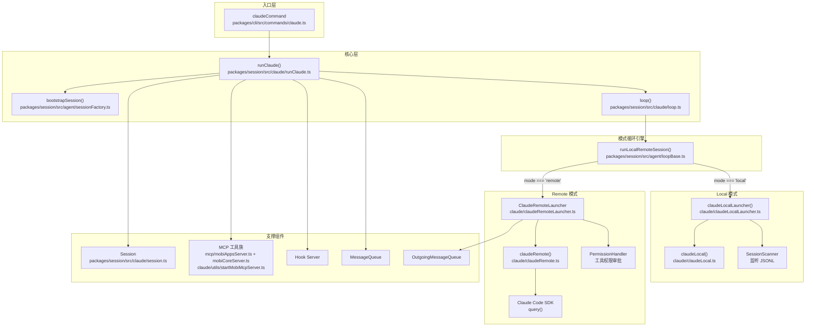
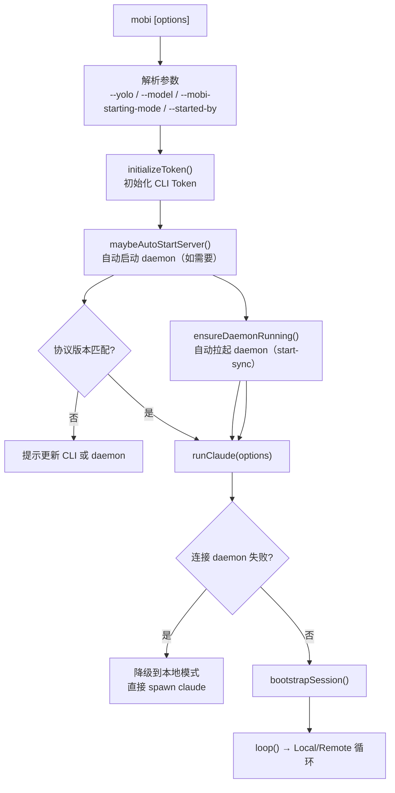
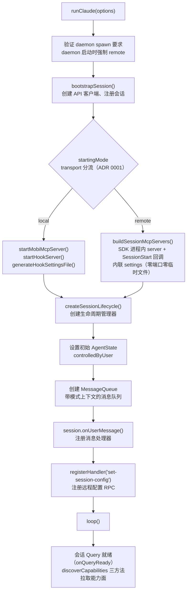
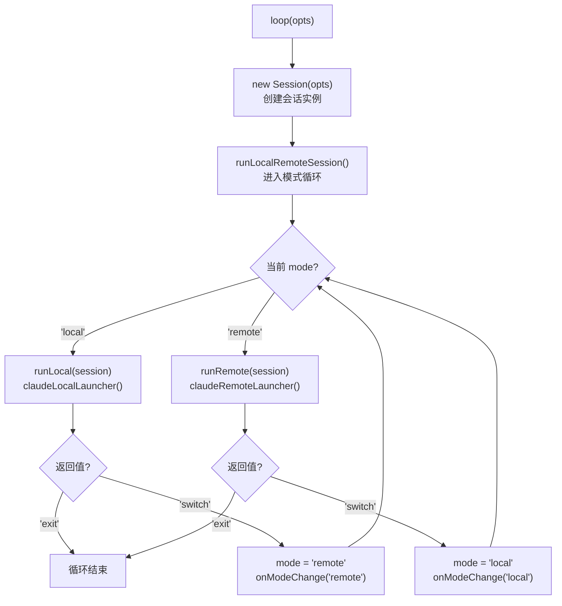
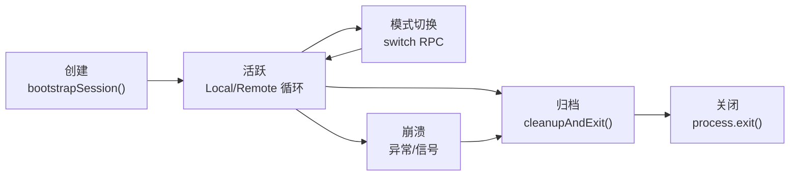
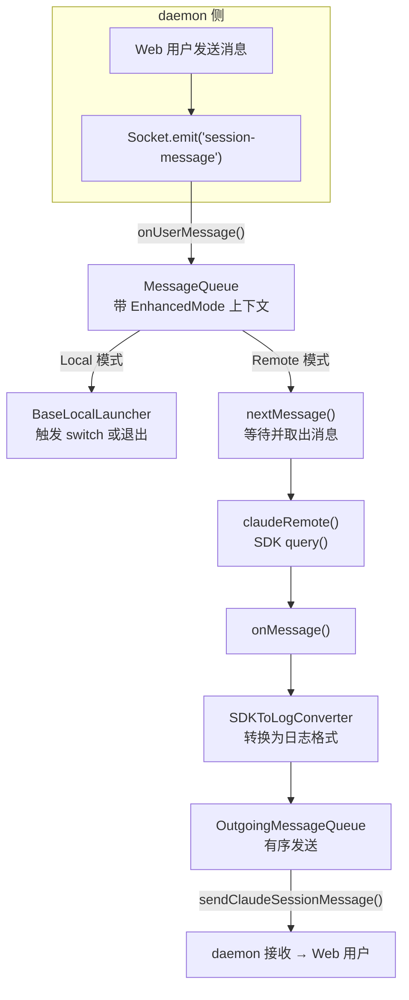
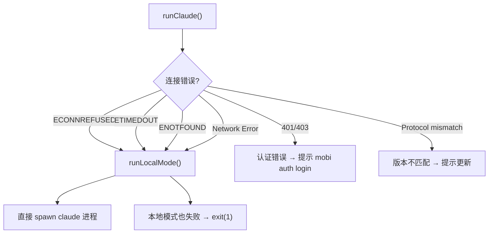

# Claude 命令 — 核心会话命令

CLI 的主要使用方式：`mobi [options]`，所有未匹配子命令的参数都走此命令。启动 Claude Code 会话并通过 daemon 实现远程控制。

**入口文件**: [`packages/cli/src/commands/claude.ts`](/packages/cli/src/commands/claude.ts)

---

## 新人阅读指引

### 建议阅读顺序

```
第 1 步: 本文档（README.md）           ← 你在这里，建立全局认知
    │
第 2 步: local-mode.md                ← 理解 Local 模式：如何 spawn Claude 进程
    │
第 3 步: remote-mode.md               ← 理解 Remote 模式：如何通过 SDK 远程驱动 Claude
    │
第 4 步: 按需阅读
    ├── message-queue.md              ← 理解入站消息队列：按模式分批收集用户消息
    ├── outgoing-message-queue.md     ← 理解出站消息队列：有序发送 Claude 输出到 daemon
    ├── session-scanner.md            ← 理解 Local 模式 JSONL 扫描：增量读取、去重、会话追踪
    ├── api/ 通信层文档                ← 理解与 daemon 的通信机制
    └── hook 文档                      ← 理解 SessionStart Hook 转发
```

### 前置知识

| 前置内容 | 位置 | 为什么需要 |
|----------|------|-----------|
| daemon 架构 | [daemon 架构](../../../daemon/) | Claude 命令通过 daemon 实现远程控制 |
| API 通信层 | [docs/architecture/cli/api/](../../api/) | Session 通过 Socket.IO 与 daemon 通信 |
| MCP 工具族 | [docs/architecture/cli/mcp/](../../mcp/) | Claude 命令装配会话内 MCP 工具（remote 进程内 / local HTTP 壳） |

### 术语表

| 术语 | 含义 |
|------|------|
| **Local 模式** | 直接 spawn Claude 进程，用户在终端直接交互，不经过 daemon |
| **Remote 模式** | 通过 Claude Code SDK 驱动 Claude，消息经由 daemon 中转，支持远程控制 |
| **Session** | 一次 Claude Code 交互会话，包含完整的状态和消息历史 |
| **Session ID** | Claude Code 的会话标识（UUID），由 Claude 生成，用于 `--resume` |
| **daemon Session** | daemon 侧的会话记录，一个 daemon Session 可对应多个 Claude Session（如 /clear 后） |
| **Launcher** | 启动器，封装 Local/Remote 模式的具体实现 |
| **Mode 切换** | 在 Local 和 Remote 之间切换，通过 daemon 侧的 `switch` RPC 触发 |
| **PermissionHandler** | Remote 模式下的工具权限审批处理器 |
| **SessionScanner** | Local 模式下监听 Claude JSONL 文件的扫描器 |
| **HookServer** | HTTP 服务，接收 Claude 的 SessionStart Hook 通知 |
| **OutgoingMessageQueue** | Remote 模式下有序发送消息到 daemon 的队列 |
| **MessageQueue** | 带模式上下文的消息队列，管理用户消息和 mode 切换，支持 localId 追踪与排队取消 |
| **KeepAlive** | 定时心跳（2 秒），向 daemon 报告会话状态（thinking、mode 等） |
| **controlledByUser** | AgentState 字段，标记会话当前由用户控制（Local）还是远程控制（Remote） |

---

## 架构概览


```mermaid
graph TB
    subgraph Entry["入口层"]
        Cmd["claudeCommand<br/>packages/cli/src/commands/claude.ts"]
    end

    subgraph Core["核心层"]
        RunClaude["runClaude()<br/>packages/session/src/claude/runClaude.ts"]
        Bootstrap["bootstrapSession()<br/>packages/session/src/agent/sessionFactory.ts"]
        Loop["loop()<br/>packages/session/src/claude/loop.ts"]
    end

    subgraph LoopEngine["模式循环引擎"]
        LoopBase["runLocalRemoteSession()<br/>packages/session/src/agent/loopBase.ts"]
    end

    subgraph LocalMode["Local 模式"]
        LocalLauncher["claudeLocalLauncher()<br/>claude/claudeLocalLauncher.ts"]
        ClaudeLocal["claudeLocal()<br/>claude/claudeLocal.ts"]
        Scanner["SessionScanner<br/>监听 JSONL"]
    end

    subgraph RemoteMode["Remote 模式"]
        RemoteLauncher["ClaudeRemoteLauncher<br/>claude/claudeRemoteLauncher.ts"]
        ClaudeRemote["claudeRemote()<br/>claude/claudeRemote.ts"]
        Permission["PermissionHandler<br/>工具权限审批"]
        SDK["Claude Code SDK<br/>query()"]
    end

    subgraph Support["支撑组件"]
        Session["Session<br/>packages/session/src/claude/session.ts"]
        MCP["MCP 工具族<br/>mcp/mobiAppsServer.ts + mobiCoreServer.ts<br/>claude/utils/startMobiMcpServer.ts"]
        HookServer["Hook Server"]
        MessageQ["MessageQueue"]
        OutgoingQ["OutgoingMessageQueue"]
    end

    Cmd --> RunClaude
    RunClaude --> Bootstrap
    RunClaude --> Loop
    Loop --> LoopBase

    LoopBase -->|"mode === 'local'"| LocalLauncher
    LoopBase -->|"mode === 'remote'"| RemoteLauncher

    LocalLauncher --> ClaudeLocal
    LocalLauncher --> Scanner
    RemoteLauncher --> ClaudeRemote
    RemoteLauncher --> Permission
    ClaudeRemote --> SDK

    RunClaude --> Session & MCP & HookServer & MessageQ
    RemoteLauncher --> OutgoingQ
```

## 启动流程

`mobi` 命令的完整启动链路：


```mermaid
flowchart TB
    Start["mobi [options]"] --> Parse["解析参数<br/>--yolo / --model / --mobi-starting-mode / --started-by"]
    Parse --> Token["initializeToken()<br/>初始化 CLI Token"]
    Token --> AutoStart["maybeAutoStartServer()<br/>自动启动 daemon（如需要）"]
    AutoStart --> ProtoCheck{"协议版本匹配?"}
    ProtoCheck -->|否| VersionHint["提示更新 CLI 或 daemon"]
    ProtoCheck -->|是| RunClaude["runClaude(options)"]
    AutoStart --> StartDaemon["ensureDaemonRunning()<br/>自动拉起 daemon（start-sync）"]
    StartDaemon --> RunClaude
    StartDaemon --> RunClaude
    RunClaude --> ConnError{"连接 daemon 失败?"}
    ConnError -->|是| LocalMode["降级到本地模式<br/>直接 spawn claude"]
    ConnError -->|否| Bootstrap["bootstrapSession()"]
    Bootstrap --> Loop["loop() → Local/Remote 循环"]
```

### 阶段一：入口初始化（`claude.ts`）

**文件**: `packages/cli/src/commands/claude.ts`

1. **参数解析** — 提取 mobi 特有参数（`--yolo`、`--model`、`--mobi-starting-mode`、`--started-by`），其余透传给 Claude
2. **Token 初始化** — `initializeToken()` 确保 CLI_API_TOKEN 可用
3. **daemon 自动启动** — `maybeAutoStartServer()` 在需要时启动本地 daemon
4. **daemon 自动拉起** — `ensureDaemonRunning()` 检查 daemon 是否运行，必要时后台启动
5. **协议版本检查** — CLI 与 daemon 协议版本不匹配时提示更新
6. **降级策略** — 连接 daemon 失败时自动降级为纯本地模式（`runLocalMode`），直接 spawn claude 进程

**参数说明**：

| 参数 | 说明 |
|------|------|
| `--yolo` | 透传为 `--dangerously-skip-permissions`，跳过权限确认 |
| `--model <model>` | 指定 Claude 模型 |
| `--mobi-starting-mode <mode>` | 强制启动模式：`local` / `remote` |
| `--started-by <source>` | 启动来源：`daemon` / `terminal`（daemon executor 启动时强制 remote） |
| `--workspace <id>` | 归属工作区 id（Web spawn 透传；终端亦可手动指定） |
| 其他参数 | 透传给 Claude Code |

参数解析由 `commands/claudeArgs.ts` 的 `parseStartOptions()` 纯函数完成（mobi 自身 flag 进 options，其余透传 claudeArgs）。

### 阶段二：会话启动（`runClaude.ts`）

**文件**: `packages/session/src/claude/runClaude.ts:49-385`


```mermaid
flowchart TB
    Start["runClaude(options)"] --> Validate["验证 daemon spawn 要求<br/>daemon 启动时强制 remote"]
    Validate --> Bootstrap["bootstrapSession()<br/>创建 API 客户端、注册会话"]
    Bootstrap --> Branch{"startingMode<br/>transport 分流（ADR 0001）"}
    Branch -->|"local"| LocalTransport["startMobiMcpServer()<br/>startHookServer()<br/>generateHookSettingsFile()"]
    Branch -->|"remote"| RemoteTransport["buildSessionMcpServers()<br/>SDK 进程内 server + SessionStart 回调<br/>内联 settings（零端口零临时文件）"]
    LocalTransport --> Lifecycle["createSessionLifecycle()<br/>创建生命周期管理器"]
    RemoteTransport --> Lifecycle
    Lifecycle --> State["设置初始 AgentState<br/>controlledByUser"]
    State --> Queue["创建 MessageQueue<br/>带模式上下文的消息队列"]
    Queue --> UserMsg["session.onUserMessage()<br/>注册消息处理器"]
    UserMsg --> RPC["registerHandler('set-session-config')<br/>注册远程配置 RPC"]
    RPC --> Loop["loop()"]
    Loop --> Caps["会话 Query 就绪（onQueryReady）<br/>discoverCapabilities 三方法拉取能力面"]
```

核心组件初始化：

| 组件 | 文件 | 职责 |
|------|------|------|
| **ApiClient** | `packages/node-core/src/api/api.ts` | HTTP 客户端，与 daemon REST API 通信 |
| **ApiSessionClient** | `packages/session/src/api/apiSession.ts` | Socket.IO 客户端，实时通信 |
| **Session** | `packages/session/src/claude/session.ts` | 会话状态管理（ID、mode、model 等） |
| **MCP 工具族** | remote：`packages/session/src/mcp/mobiAppsServer.ts` + `mobiCoreServer.ts`（进程内）；local：`packages/session/src/claude/utils/startMobiMcpServer.ts`（HTTP 壳，仅 change_title） | 详见 [MCP 模块](../../mcp/) |
| **Hook Server** | `packages/session/src/claude/utils/startHookServer.ts`（local HTTP）；remote 走 SDK `hooks.SessionStart` 进程内回调 | 接收 Claude SessionStart 通知，绑定守卫见 `claude/utils/sessionIdBinding.ts` |
| **MessageQueue** | `packages/node-core/src/utils/MessageQueue.ts` | 带模式 hash 的消息队列 |
| **SessionLifecycle** | `packages/session/src/agent/sessionLifecycle.ts` | 进程信号处理和清理 |

### 阶段三：模式循环（`loop.ts` + `loopBase.ts`）

**文件**: `packages/session/src/claude/loop.ts:58-92` → `packages/session/src/agent/loopBase.ts`


```mermaid
flowchart TB
    Start["loop(opts)"] --> CreateSession["new Session(opts)<br/>创建会话实例"]
    CreateSession --> RunLR["runLocalRemoteSession()<br/>进入模式循环"]

    RunLR --> Mode{"当前 mode?"}
    Mode -->|"'local'"| Local["runLocal(session)<br/>claudeLocalLauncher()"]
    Mode -->|"'remote'"| Remote["runRemote(session)<br/>claudeRemoteLauncher()"]

    Local --> Result1{"返回值?"}
    Remote --> Result2{"返回值?"}

    Result1 -->|"'exit'"| Done["循环结束"]
    Result1 -->|"'switch'"| Switch1["mode = 'remote'<br/>onModeChange('remote')"]
    Result2 -->|"'exit'"| Done
    Result2 -->|"'switch'"| Switch2["mode = 'local'<br/>onModeChange('local')"]

    Switch1 --> Mode
    Switch2 --> Mode
```

**模式切换**：两种模式通过 Launcher 返回值实现切换。daemon 侧发送 `switch` RPC 触发从 Remote 切到 Local；Local 模式中收到 daemon 消息时自动切换到 Remote。

## Local / Remote 模式对比

| 维度 | Local 模式 | Remote 模式 |
|------|-----------|-------------|
| **本质** | 直接 spawn Claude 进程 | 通过 SDK `query()` 驱动 Claude |
| **终端交互** | 用户直接与 Claude 交互 | 消息经由 daemon 中转 |
| **消息流向** | Claude → JSONL 文件 → SessionScanner → daemon | SDK → onMessage → OutgoingMessageQueue → daemon |
| **权限管理** | Claude 自行处理 | PermissionHandler + daemon 侧审批 |
| **UI** | Claude 原生终端 UI | Ink 渲染的自定义 UI |
| **适用场景** | 用户在终端本地使用 | 远程控制（手机浏览器等） |
| **会话恢复** | `--resume` 传递给 Claude 进程 | 通过 SDK `resume` 参数 |

详见 [Local 模式](./local-mode.md) 和 [Remote 模式](./remote-mode.md)。

## 会话生命周期


```mermaid
flowchart LR
    Create["创建<br/>bootstrapSession()"] --> Active["活跃<br/>Local/Remote 循环"]
    Active --> Switch["模式切换<br/>switch RPC"]
    Switch --> Active
    Active --> Archive["归档<br/>cleanupAndExit()"]
    Archive --> Close["关闭<br/>process.exit()"]

    Active --> Crash["崩溃<br/>异常/信号"]
    Crash --> Archive
```

### 创建（bootstrapSession）

**文件**: `packages/session/src/agent/sessionFactory.ts`

```
bootstrapSession({ flavor, startedBy, workingDirectory, workspaceId, ... })
    │
    ├── ApiClient.create()                    ← HTTP 客户端
    ├── buildSessionMetadata(workingDir, ...) ← 构建会话元数据
    ├── api.getOrCreateSession(metadata, { workspaceId })  ← 创建/获取会话（响应含 workspace 实体）
    ├── resolveAdditionalDirectories(workspace) ← 从 workspace.folders 派生附加目录并冻结进 metadata
    ├── api.sessionSyncClient(sessionInfo)    ← Socket.IO 客户端
    └── notifyRunnerSessionStarted()          ← 会话自报宿主通道（RUNNER_SESSION_STARTED_PATH，中性保留）
```

**工作区目录解析（`resolveAdditionalDirectories`）**：带 `workspaceId` 创建会话时，从响应中的 `workspace.folders` 派生附加工作目录（路径解析 + 存在性校验，过滤掉等于 cwd 的项；primary 失效硬失败），冻结进 `metadata.additionalDirectories` 并回写 daemon。后续 resume 时直接回放冻结值、忽略响应中的 workspace——历史会话不受工作区 folders 变更影响。

### 关闭（cleanupAndExit）

**文件**: `packages/session/src/agent/sessionLifecycle.ts`

关闭顺序：

```
cleanupAndExit()
    │
    ├── restoreTerminal()               ← 恢复终端状态
    ├── session.stopKeepAlive()         ← 停止心跳
    ├── onBeforeClose()                 ← 归档元数据、发送 session-end
    ├── session.close()                 ← 关闭 Socket.IO 连接
    ├── onAfterClose()                  ← 停止 MCP Server、Hook Server、清理配置
    └── process.exit(exitCode)          ← 退出进程
```

**退出码**：
- `0` — 正常退出（用户终止或切换）
- `1` — 异常退出（崩溃或 Local 模式启动失败）

**信号处理**：注册 SIGTERM、SIGINT、uncaughtException、unhandledRejection 处理器，均触发 `cleanupAndExit()`。

## 与 daemon 的交互

### Socket.IO 事件

Session 通过 `ApiSessionClient` 与 daemon 保持双向实时通信：

| 事件 | 方向 | 说明 |
|------|------|------|
| `message` | CLI → daemon | 发送用户消息 / Agent 输出 |
| `session-alive` | CLI → daemon | 心跳（2 秒），报告 thinking 状态和 mode |
| `update-metadata` | CLI → daemon | 更新会话元数据（版本化，乐观锁） |
| `update-state` | CLI → daemon | 更新 AgentState（版本化，乐观锁） |
| `session-end` | CLI → daemon | 通知会话结束 |
| `messages-facts` | CLI → daemon | 统一消息事实事件（`{ sid, facts: MessageFact[] }`）：pushed / bound / attached / acked / lifecycle 五 kind 批内合并一次往返；旧 4 独立事件已下线，daemon 只受理 messages-facts |
| `cancel-queued-message` | daemon → CLI | RPC：取消 CLI 内存队列中缓冲的排队消息 |
| `update` | daemon → CLI | 接收状态更新（消息、session） |
| `rpc-request` | daemon → CLI | RPC 请求（abort、switch、set-session-config 等） |
| `terminal:*` | 双向 | 终端事件（open/write/resize/close） |

### 状态同步机制

CLI 与 daemon 的状态同步采用**版本化乐观锁**：

```
CLI: metadataVersion = 5
    │
    ├── updateMetadata(draft => { ...draft, status: 'active' })
    │   └── socket.emit('update-metadata', { version: 5, metadata: ... })
    │
    ├── daemon 成功: version 6 → CLI 更新本地 version = 6
    │
    └── daemon 失败（version-mismatch）: CLI 重试，重新获取最新版本再更新
```

### RPC 系统

daemon 可通过 RPC 远程控制 CLI 会话：

| RPC 方法 | 说明 |
|----------|------|
| `abort` | 中止当前操作 |
| `switch` | 切换 Local/Remote 模式 |
| `set-session-config` | 远程修改 permissionMode 或 model |
| `cancel-queued-message` | 取消 CLI 内存队列中缓冲的排队消息（两阶段取消的 CLI 侧） |
| Common RPC（bash、files、git 等） | 供 daemon 远程执行本地操作 |

## 消息处理流程


```mermaid
flowchart TB
    subgraph daemon["daemon 侧"]
        User["Web 用户发送消息"] --> Emit["Socket.emit('session-message')"]
    end

    Emit -->|"onUserMessage()"| Queue["MessageQueue<br/>带 EnhancedMode 上下文"]

    Queue -->|"Local 模式"| LocalPath["BaseLocalLauncher<br/>触发 switch 或退出"]
    Queue -->|"Remote 模式"| RemotePath["nextMessage()<br/>等待并取出消息"]

    RemotePath --> SDK["claudeRemote()<br/>SDK query()"]
    SDK --> OnMsg["onMessage()"]
    OnMsg --> Convert["SDKToLogConverter<br/>转换为日志格式"]
    Convert --> Outgoing["OutgoingMessageQueue<br/>有序发送"]
    Outgoing -->|"sendClaudeSessionMessage()"| DaemonRecv["daemon 接收 → Web 用户"]
```

## 代码结构

```
packages/cli/src/
├── commands/
│   ├── claude.ts                         # 命令入口，参数解析、降级策略
│   └── claudeArgs.ts                     # 参数解析纯函数 parseStartOptions()
├── claude/
│   ├── runClaude.ts                      # 核心启动流程，组件编排
│   ├── loop.ts                           # 模式循环入口
│   ├── session.ts                        # Session 类（扩展 AgentSessionBase）
│   ├── claudeLocalLauncher.ts            # Local 模式启动器
│   ├── claudeRemoteLauncher.ts           # Remote 模式启动器（类）
│   ├── claudeLocal.ts                    # Local 模式：spawn Claude 进程
│   ├── claudeRemote.ts                   # Remote 模式：SDK query() 驱动
│   ├── model.ts                          # 模型名称规范化
│   ├── registerKillSessionHandler.ts     # 注册 kill-session RPC
│   ├── types.ts                          # 类型定义
│   ├── sdk/
│   │   ├── index.ts                      # SDK 重导出 + 工具函数
│   │   ├── types.ts                      # PermissionResult 等类型
│   │   ├── utils.ts                      # Claude 路径查找、调试日志
│   │   ├── prompts.ts                    # Plan mode 相关常量
│   │   └── metadataExtractor.ts          # SDK 元数据 refreshMetadata RPC 兜底提取（headless 进程；首次激活补拉 / SWR 后台刷新触发）
│   └── utils/
│       ├── capabilityDiscovery.ts         # 会话 Query 三方法能力面发现（onQueryReady 后拉取落 metadata）
│       ├── permissionHandler.ts          # 工具权限审批处理器（506 行）
│       ├── sessionScanner.ts             # Local 模式 JSONL 监听（243 行）
│       ├── OutgoingMessageQueue.ts       # 有序消息发送队列（207 行）
│       ├── startMobiMcpServer.ts        # MCP Server（local 模式 HTTP transport 壳）
│       ├── startHookServer.ts            # Hook HTTP Server（local 模式）
│       ├── sessionIdBinding.ts          # sessionId 绑定幂等守卫（双 transport 共享核心）
│       ├── sessionHookForwarder.ts       # Hook 转发器（151 行）
│       ├── sdkToLogConverter.ts          # SDK 消息 → 日志格式转换
│       ├── systemPrompt.ts               # 系统提示词
│       ├── mcpConfig.ts                  # MCP 配置生成
│       ├── claudeSettings.ts             # Claude 设置读写
│       ├── claudeCheckSession.ts         # 会话有效性检查
│       ├── getToolDescriptor.ts          # 工具描述生成
│       └── getToolName.ts               # 工具名称映射
├── agent/
│   ├── loopBase.ts                       # Local/Remote 模式循环引擎
│   ├── sessionBase.ts                    # AgentSessionBase 基类
│   ├── sessionFactory.ts                 # 会话工厂（bootstrap）
│   └── sessionLifecycle.ts             # 生命周期管理
├── modules/common/
│   ├── launcher/BaseLocalLauncher.ts     # Local 启动器基类
│   └── remote/RemoteLauncherBase.ts     # Remote 启动器基类
└── api/
    ├── api.ts                            # ApiClient（HTTP）
    ├── apiSession.ts                     # ApiSessionClient（Socket.IO）
    └── rpc/RpcHandlerManager.ts          # RPC 处理器管理
```

## 环境变量

| 变量 | 默认值 | 说明 |
|------|--------|------|
| `DISABLE_AUTOUPDATER` | `1` | Local/Remote 模式均禁用 Claude 自动更新 |
| `DEBUG` | — | 开启时输出详细错误堆栈 |
| `MOBI_API_URL` | — | 指定 daemon 地址（跳过自动启动） |

## 错误处理

### 连接错误降级


```mermaid
flowchart TB
    Try["runClaude()"] --> Error{"连接错误?"}
    Error -->|ECONNREFUSED| Fallback["runLocalMode()"]
    Error -->|ETIMEDOUT| Fallback
    Error -->|ENOTFOUND| Fallback
    Error -->|Network Error| Fallback
    Fallback --> Spawn["直接 spawn claude 进程"]
    Fallback --> Fail["本地模式也失败 → exit(1)"]
    Error -->|"401/403"| Auth["认证错误 → 提示 mobi auth login"]
    Error -->|"Protocol mismatch"| Version["版本不匹配 → 提示更新"]
```

### 协议版本检查

错误响应中包含 `serverProtocolVersion`，与本地 `PROTOCOL_VERSION` 对比：
- daemon 版本落后 → 提示更新 daemon
- CLI 版本落后 → 提示更新 CLI
