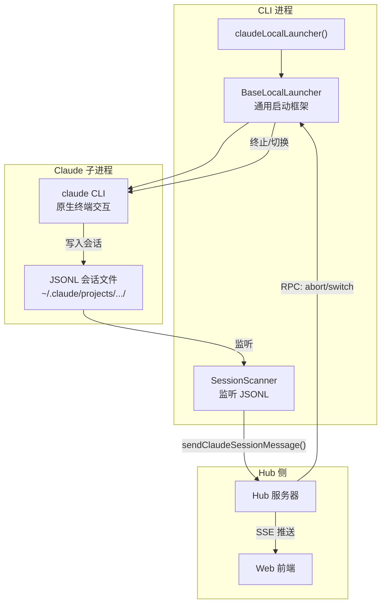
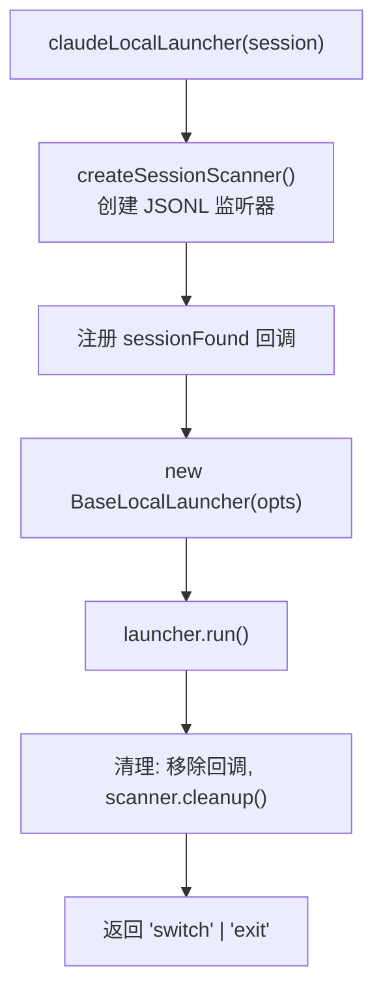
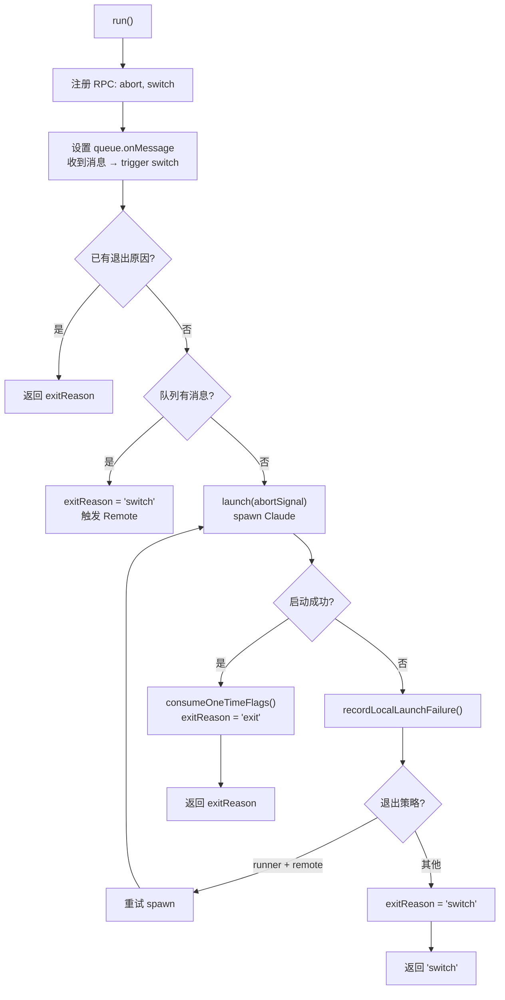
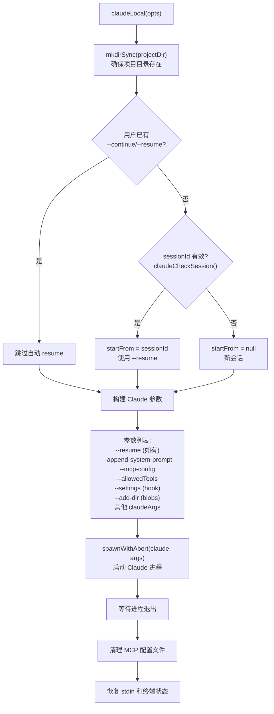
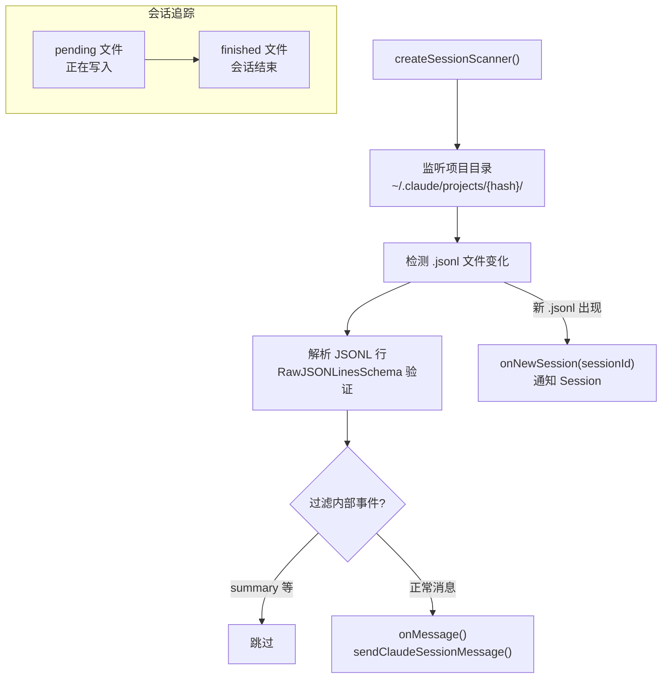

# Local 模式

Local 模式是 Claude 命令的基础模式：直接 spawn Claude 进程，用户在终端与 Claude 交互。Mobi 作为旁观者，通过监听 JSONL 文件将消息同步到 Hub。

---

## 架构



## 启动流程

### claudeLocalLauncher

**文件**: `cli/src/claude/claudeLocalLauncher.ts`



Launcher 配置：

| 配置项 | 值 | 说明 |
|--------|-----|------|
| `launch` | `claudeLocal()` | 实际的 spawn 函数 |
| `queue` | `session.queue` | MessageQueue 实例 |
| `rpcHandlerManager` | `session.client.rpcHandlerManager` | 用于注册 abort/switch RPC |
| `startedBy` / `startingMode` | 来自 Session | 决定退出行为 |
| `onLaunchSuccess` | `session.consumeOneTimeFlags()` | 消费 --resume 等一次性参数 |

### BaseLocalLauncher.run()

**文件**: `cli/src/modules/common/launcher/BaseLocalLauncher.ts`



**退出策略**：
- `startedBy === 'runner' && startingMode === 'remote'` → 重试 spawn（Runner 启动的远程会话不应切换到 Local）
- 其他场景 → 返回 `'switch'`，触发模式切换到 Remote

## claudeLocal — Spawn Claude 进程

**文件**: `cli/src/claude/claudeLocal.ts`



### Claude 进程参数

| 参数 | 说明 |
|------|------|
| `--resume <id>` | 恢复已有会话（仅当 sessionId 有效时） |
| `--append-system-prompt` | 追加 mobi 系统提示词 |
| `--mcp-config` | MCP 服务器配置（mobi MCP Server） |
| `--allowedTools` | 允许的工具列表 |
| `--settings` | Hook 配置文件路径 |
| `--add-dir` | 添加 blobs 目录（用于文件上传） |
| 其他 `claudeArgs` | 用户透传的 Claude 参数 |

### 环境变量

```typescript
{
    ...process.env,
    DISABLE_AUTOUPDATER: '1',    // 禁止 Claude 自动更新
    ...opts.claudeEnvVars          // 自定义环境变量
}
```

## SessionScanner — JSONL 监听

**文件**: `cli/src/claude/utils/sessionScanner.ts`

SessionScanner 在 Local 模式下监听 Claude 写入的 JSONL 会话文件，将消息转发到 Hub：



**消息过滤**：
- 跳过 `summary` 类型消息（Mobi 自己生成摘要）
- 保留 `user`、`assistant`、`tool_result` 等正常消息

**会话追踪**：
- `pending` 文件 — Claude 正在写入的会话
- `finished` 文件 — 会话已结束
- 新文件出现时触发 `onNewSession` 回调，更新 Session ID

## Hub 侧消息流

Local 模式下的完整消息流：

```
Claude 进程
    │
    ├── 写入 JSONL 文件（~/.claude/projects/{hash}/{sessionId}.jsonl）
    │
    └── SessionScanner 监听文件变化
         │
         ├── 解析 JSONL 行
         ├── 过滤内部事件
         └── session.client.sendClaudeSessionMessage(message)
              │
              └── Socket.IO emit → Hub
                   │
                   ├── SyncEngine 接收
                   ├── EventPublisher 广播
                   └── SSE → Web 前端
```

## Local → Remote 切换触发

Local 模式在以下场景切换到 Remote：

| 触发方式 | 说明 |
|----------|------|
| **Hub 消息到达** | `queue.onMessage` 回调触发，用户通过 Web 发送消息 |
| **RPC switch** | Hub 侧发送 `switch` RPC 请求 |
| **RPC abort** | Hub 侧发送 `abort` RPC，终止当前 Claude 进程 |
| **Claude 进程退出** | 非 runner 启动的会话，启动失败时切换到 Remote |

## 与 Remote 模式的关键差异

| 维度 | Local | Remote |
|------|-------|--------|
| Claude 进程 | 独立子进程，直连终端 | SDK 内嵌，消息通过 API |
| 消息获取 | SessionScanner 监听 JSONL | SDK `for await` 迭代 |
| 消息发送到 Hub | `sendClaudeSessionMessage()` | `OutgoingMessageQueue` 有序发送 |
| 权限审批 | Claude 自行处理 | `PermissionHandler` + Hub 审批 |
| 终端 UI | Claude 原生界面 | Ink 自定义界面 |
| 进程管理 | `spawnWithAbort()` | SDK `AbortController` |
