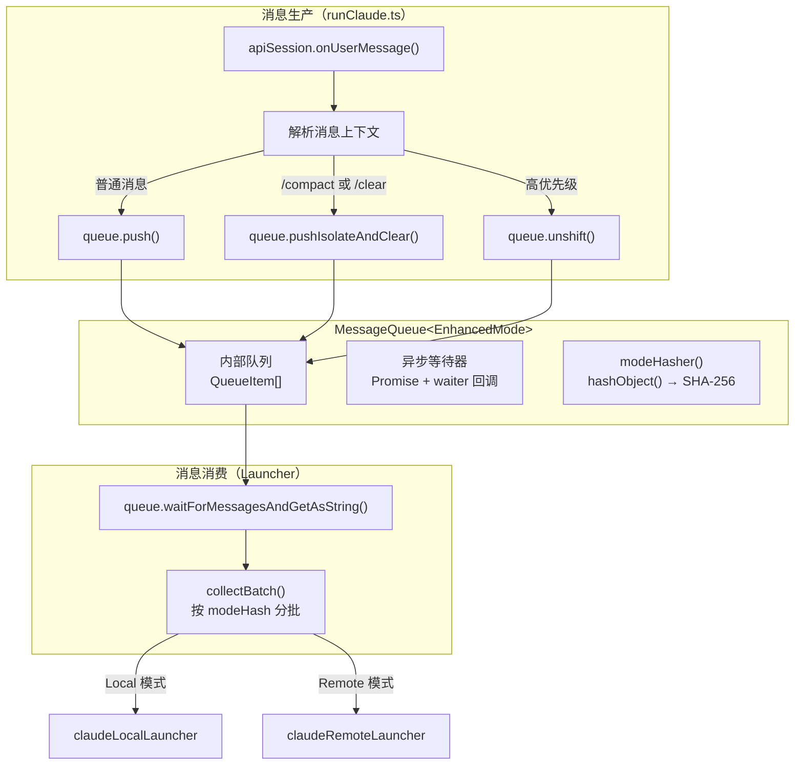
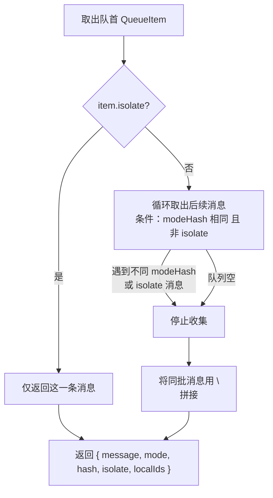

# MessageQueue — 带模式上下文的消息队列

一个泛型、mode-aware 的异步消息队列，按 mode hash 将连续消息分批处理，是 Claude 命令消息流转的核心组件。

**文件**: [`packages/cli/src/utils/MessageQueue.ts`](/packages/cli/src/utils/MessageQueue.ts)

---

## 解决的问题

Claude 命令在运行时需要处理来自 Hub（Web 用户）的消息，这些消息携带不同的运行模式（permissionMode、model、systemPrompt 等）。核心挑战：

1. **模式一致性** — 同一批次送给 Claude 的消息必须具有相同的运行模式，否则会触发不必要的会话重配置
2. **特殊命令隔离** — `/compact`、`/clear` 等命令必须独占处理，不能与普通消息混批
3. **异步等待** — Claude 会话循环在处理完一批消息后需要阻塞等待下一批

## 架构



## 数据模型

### QueueItem

```typescript
interface QueueItem<T> {
    message: PromptPayload; // 消息内容：string 或 Anthropic content 元素数组（PromptContentBlock[]，见 utils/promptBuilder.ts）——2026-08-27 多模态穿透
    mode: T;              // 模式上下文（如 EnhancedMode）
    modeHash: string;     // 模式的确定性哈希值（由 modeHasher 计算）
    isolate?: boolean;    // 是否要求隔离处理
    localId?: string;     // 用户消息的本地 ID，用于通知 Hub 已消费
}
```

批合并语义：多条消息合并时 string+string 用 `\n` 连接；任一侧为数组则走元素级 concat（`\n` 作独立 text 元素插入，元素零丢失）。pushUserMessage 直接把 payload 透传给 `SDKUserMessage.message.content`（SDK 类型本就 `string | ContentBlock[]`）。

### EnhancedMode

在 Claude 命令中使用的具体 mode 类型，定义在 [`packages/cli/src/claude/loop.ts`](/packages/cli/src/claude/loop.ts)：

```typescript
interface EnhancedMode {
    permissionMode: PermissionMode;    // 权限模式
    model?: string;                    // Claude 模型
    fallbackModel?: string;            // 备选模型
    customSystemPrompt?: string;       // 自定义系统提示词
    appendSystemPrompt?: string;       // 追加系统提示词
    allowedTools?: string[];           // 允许的工具列表
    disallowedTools?: string[];        // 禁止的工具列表
}
```

### Mode Hash 计算

使用 [`hashObject()`](/packages/cli/src/utils/deterministicJson.ts)（基于 SHA-256 的确定性 JSON 序列化）对 mode 对象计算哈希。在 `runClaude.ts` 中构造 modeHasher 时，将 `isPlan`（从 permissionMode 派生）也纳入哈希：

```typescript
const messageQueue = new MessageQueue<EnhancedMode>(mode => hashObject({
    isPlan: mode.permissionMode === 'plan',
    model: mode.model,
    fallbackModel: mode.fallbackModel,
    customSystemPrompt: mode.customSystemPrompt,
    appendSystemPrompt: mode.appendSystemPrompt,
    allowedTools: mode.allowedTools,
    disallowedTools: mode.disallowedTools
}));
```

hash 相同 = 所有影响 Claude 运行行为的参数一致 → 可以合并到同一批次。

## 核心方法

### 写入操作

| 方法 | 用途 | 行为 |
|------|------|------|
| `push(message, mode)` | 追加普通消息 | 加入队列尾部，相同 modeHash 的连续消息将被分到同一批 |
| `pushImmediate(message, mode)` | 追加即时消息 | 与 `push` 相同，语义上标记为"立即处理"，但行为一致 |
| `pushIsolateAndClear(message, mode)` | 追加隔离消息 | **清空**队列中所有待处理消息，以隔离模式插入 |
| `unshift(message, mode)` | 插入队首 | 加入队列头部，优先被消费 |

### 读取操作

| 方法 | 用途 | 行为 |
|------|------|------|
| `waitForMessagesAndGetAsString(signal?)` | 等待并获取一批消息 | 阻塞直到有消息，按 modeHash 分批返回，返回值含 `localIds`（本批已消费的 localId 列表） |
| `cancelByLocalId(localId)` | 取消排队消息 | 删除仍排队（未消费）的 localId 消息，返回是否删除成功 |
| `size()` | 获取队列长度 | — |
| `isClosed()` | 检查是否已关闭 | — |

### 回调

| 方法 | 用途 |
|------|------|
| `setOnBatchConsumed(handler)` | 注册批次消费回调，`collectBatch` 取出一批后触发，参数为本批 `localIds`。`runClaude` 绑定此回调 → `apiSession.emitMessagesConsumed(localIds)` 通知 Hub |

### 生命周期

| 方法 | 用途 |
|------|------|
| `close()` | 关闭队列，通知等待中的消费者返回 `null` |
| `reset()` | 重置队列，清空消息并恢复为开放状态 |

## 分批算法（collectBatch）



关键规则：
- **隔离消息独占一批** — `isolate: true` 的消息不与任何其他消息合并
- **同 mode 合批** — 连续且 modeHash 相同的非隔离消息合并为一条（用 `\n` 分隔）
- **遇异即停** — 遇到不同 modeHash 的消息时停止收集，剩余消息留给下一次取
- **localIds 收集** — 批次内所有带 `localId` 的 item 收集为 `localIds`，collectBatch 完成后触发 `onBatchConsumed(localIds)` 回调

## 使用场景

### 在 runClaude.ts 中的使用

```
用户消息到达（Socket.IO）
    │
    ├── 解析当前运行模式（permissionMode、model、prompts、tools）
    ├── 检查是否为特殊命令（/compact、/clear）
    │
    ├── 特殊命令 → queue.pushIsolateAndClear(text, enhancedMode)
    │               清空队列 + 隔离处理，确保命令不与任何消息混批
    │
    └── 普通消息 → queue.push(text, enhancedMode)
                    按当前 mode 分批
```

### 在 Launcher 中的消费

Local 模式和 Remote 模式的 Launcher 都通过 `session.queue` 消费消息：

```
const batch = await queue.waitForMessagesAndGetAsString(abortSignal);
// batch.message   — 合并后的文本（多条消息用 \n 拼接）
// batch.mode     — 这一批的 EnhancedMode
// batch.isolate  — 是否为隔离消息
// batch.hash     — modeHash
// batch.localIds — 本批已消费的 localId 列表（已通过 onBatchConsumed 回调通知 Hub）
```

## 线程模型

MessageQueue 是单生产者-单消费者模型：

- **生产者**：`apiSession.onUserMessage()` 回调（Socket.IO 事件线程）
- **消费者**：Launcher 中的 `waitForMessagesAndGetAsString()` 调用（异步事件循环）

通过 `waiter` 回调机制实现通知：生产者 push 后检查是否有等待中的消费者，有则立即唤醒。

## 与 OutgoingMessageQueue 的区别

| 维度 | MessageQueue（本组件） | OutgoingMessageQueue |
|------|----------------------|---------------------|
| **方向** | Hub → CLI → Claude（入站） | Claude → CLI → Hub（出站） |
| **文件** | `packages/cli/src/utils/MessageQueue.ts` | `packages/cli/src/claude/utils/OutgoingMessageQueue.ts` |
| **功能** | 按 mode 分批收集用户消息 | 有序发送 Claude 输出到 Hub |
| **模式** | 仅 Remote 模式 | 仅 Remote 模式 |
| **核心关注** | 模式一致性 | 消息顺序和完整性（tool call 配对） |

## 测试覆盖

**文件**: [`packages/cli/src/utils/MessageQueue.test.ts`](/packages/cli/src/utils/MessageQueue.test.ts)

覆盖场景：
- 基本 push/pop 和 mode 分批
- 不同 mode 的消息分离
- 复杂 mode 对象的哈希一致性
- 异步等待和通知机制
- AbortSignal 中止
- 关闭队列的处理
- `pushIsolateAndClear` 的隔离和清空行为
- `pushImmediate` 的正常分批行为
- 隔离消息打断普通消息分批
- `pushImmediate` 与 `pushIsolateAndClear` 的行为差异
