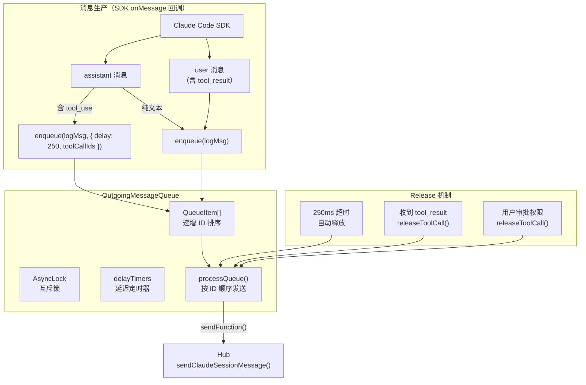
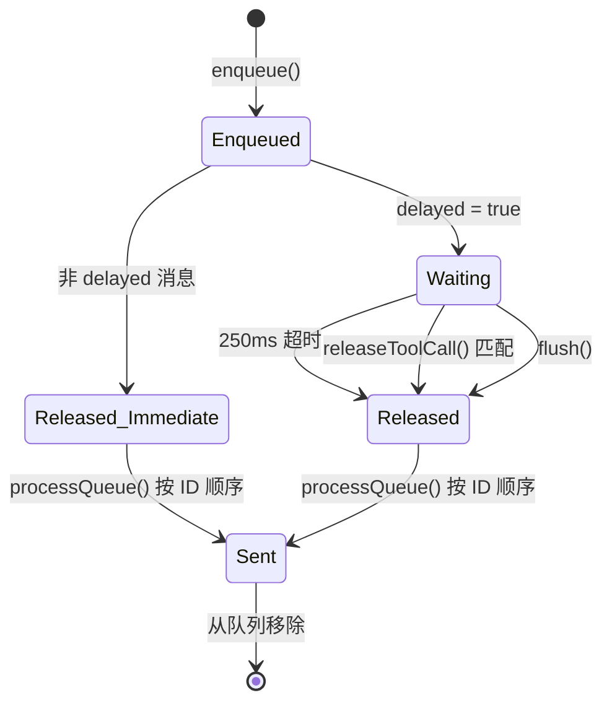
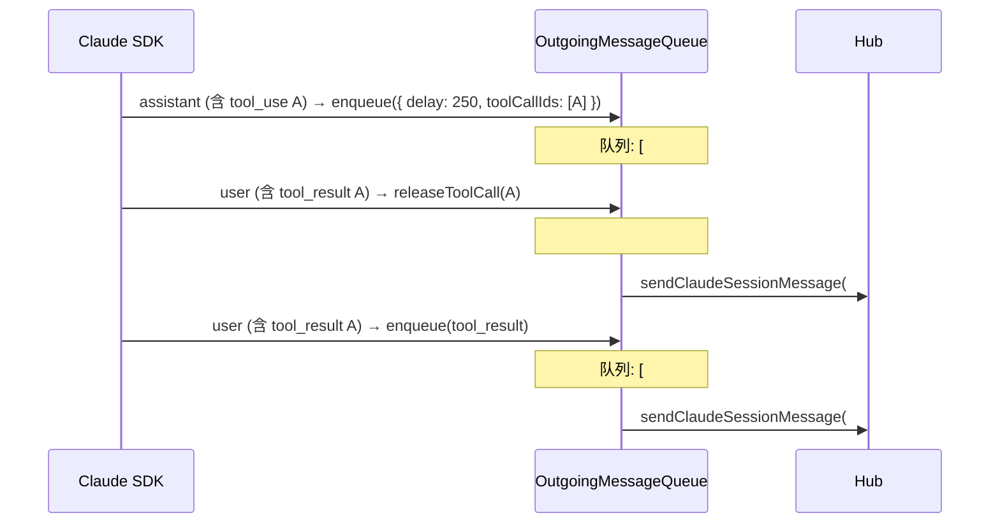
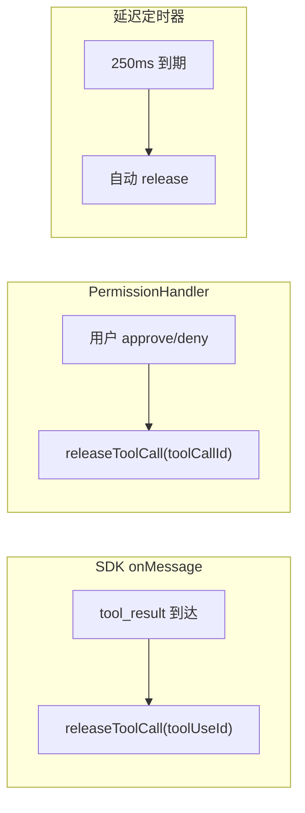
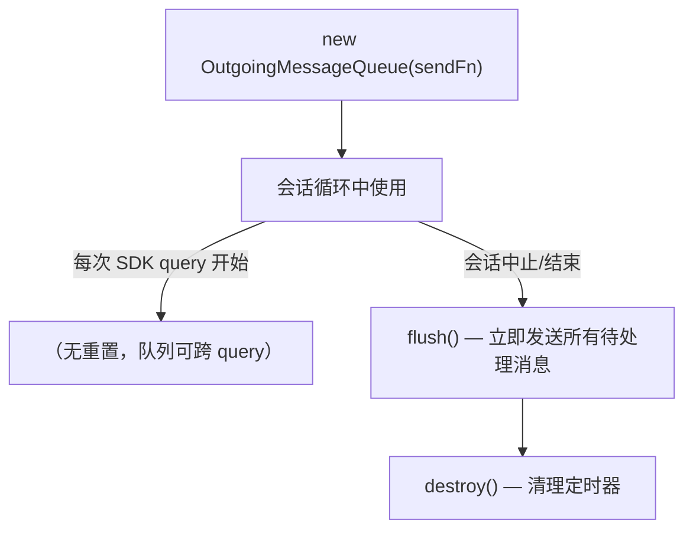

# OutgoingMessageQueue — 有序出站消息队列

一个严格保序的出站消息队列，确保 Claude 的流式输出按接收顺序发送给 Hub，并支持 tool call 的延迟释放机制。

**文件**: [`packages/cli/src/claude/utils/OutgoingMessageQueue.ts`](/packages/cli/src/claude/utils/OutgoingMessageQueue.ts)

---

## 解决的问题

Remote 模式下，Claude Code SDK 以流式方式产生消息（assistant 文本、tool_use、tool_result 等），这些消息需要实时发送给 Hub 以供 Web 用户查看。核心挑战：

1. **严格保序** — Hub 和 Web 前端依赖消息顺序来还原对话流，乱序会导致 UI 错乱
2. **tool_use / tool_result 配对** — assistant 消息包含 tool_use 后，对应的 tool_result 可能延迟到达（需要用户审批权限），在此期间不能发送后续消息
3. **并发安全** — SDK 回调、定时器、权限审批回调来自不同微任务，需要互斥保护

## 架构



## 数据模型

### QueueItem

```typescript
interface QueueItem {
    id: number;              // 递增 ID，保证顺序
    logMessage: any;         // 转换后的日志消息
    delayed: boolean;        // 是否被延迟（等待 tool call 完成）
    delayMs: number;         // 延迟时长（如 250ms）
    toolCallIds?: string[];  // 关联的 tool call ID 列表
    released: boolean;       // 延迟是否已释放
    sent: boolean;           // 是否已发送
}
```

### 状态转换



## 核心机制

### 1. 递增 ID 保序

每条消息入队时分配递增 ID，`processQueue()` 始终按 ID 排序后从队首开始处理。一旦遇到未释放（`released = false`）的消息就停止，确保后续消息不会越过前面试探性发送。

### 2. Delay + Release 模式

assistant 消息中如果包含 `tool_use`，入队时标记为 `delayed` 并设置 250ms 延迟定时器。这是为了给 tool_result 到达留出时间窗口：



三种释放途径：
- **tool_result 到达** — SDK 回调中检测到 tool_result，调用 `releaseToolCall(toolUseId)`
- **用户审批权限** — PermissionHandler 检测到用户 approve/deny，调用 `releaseToolCall(toolCallId)`
- **超时兜底** — 250ms 定时器到期自动释放，防止消息永远卡住

### 3. AsyncLock 互斥

使用 [`AsyncLock`](/packages/cli/src/utils/lock.ts)（信号量实现）保护队列操作，防止以下并发竞争：

| 来源 | 触发方式 |
|------|---------|
| SDK `onMessage` 回调 | 微任务 |
| 250ms 延迟定时器 | `setTimeout` |
| PermissionHandler 回调 | 用户交互事件 |
| `flush()` 清理 | 会话结束时 |

### 4. nextTick 调度

`scheduleProcessing()` 使用 `setTimeout(fn, 0)` 将 `processQueue()` 调度到下一个微任务，避免在 `enqueue()` 调用链中同步发送消息（可能导致重入问题）。

## 在 claudeRemoteLauncher 中的使用

**文件**: [`packages/cli/src/claude/claudeRemoteLauncher.ts`](/packages/cli/src/claude/claudeRemoteLauncher.ts)

### 初始化

```typescript
const messageQueue = new OutgoingMessageQueue(
    (logMessage) => session.client.sendClaudeSessionMessage(logMessage)
);
```

sendFunction 直接调用 `ApiSessionClient.sendClaudeSessionMessage()`，将消息通过 Socket.IO 发送给 Hub。

### 消息入队逻辑

在 `onMessage` 回调中，根据消息类型决定入队策略：

| 消息类型 | 条件 | 入队策略 |
|---------|------|---------|
| assistant | 包含 tool_use 且非 sidechain | `enqueue(logMsg, { delay: 250, toolCallIds })` — 延迟发送 |
| assistant | 纯文本或 sidechain | `enqueue(logMsg)` — 立即发送 |
| user | 含 tool_result | 先调用 `releaseToolCall()` 释放对应 tool_use，再 `enqueue(logMsg)` |
| user | 其他 | `enqueue(logMsg)` — 立即发送 |
| assistant + sidechain | `Task` 工具调用 | 额外转换 sidechain 用户消息并入队 |

### 释放触发点



### 生命周期



在 `finally` 块中清理：

```typescript
// 会话结束时
await messageQueue.flush();      // 释放所有延迟消息并发送
messageQueue.destroy();          // 清理定时器
```

## 设计决策

### 为什么 tool_use 消息需要延迟？

Claude SDK 的消息流中，assistant（含 tool_use）和 user（含 tool_result）是成对出现的。但 tool_result 的到达可能因为权限审批而延迟。如果不延迟 tool_use 消息：

1. Web 用户先看到 tool_use（"我要执行 Bash 命令"）
2. 等待审批期间看到的是"悬空"状态
3. 审批后 tool_result 才到达

延迟 250ms 是一个经验值，大多数情况下 tool_result 会在这段时间内到达（特别是自动审批的工具），使得 tool_use 和 tool_result 可以连续发送，Web 端体验更流畅。

### 为什么 sidechain 消息不延迟？

`isSidechain`（有 `parent_tool_use_id`）表示嵌套工具调用（如 Task agent）。这些消息不会触发用户权限审批，tool_result 几乎即时返回，不需要延迟。

## 与 MessageQueue 的对比

| 维度 | MessageQueue | OutgoingMessageQueue |
|------|-------------|---------------------|
| **方向** | 入站：Hub → Claude | 出站：Claude → Hub |
| **核心关注** | 按模式分批（哪些消息一起处理） | 严格保序（消息按什么顺序发出去） |
| **分批策略** | 相同 modeHash 的消息合并为一条 | 不合并，每条独立发送 |
| **延迟机制** | 无 | delay + release（tool call 配对） |
| **线程安全** | 无锁（单线程事件循环） | AsyncLock 互斥 |
| **使用模式** | Remote + Local | 仅 Remote |
| **文件位置** | `packages/cli/src/utils/` | `packages/cli/src/claude/utils/` |
