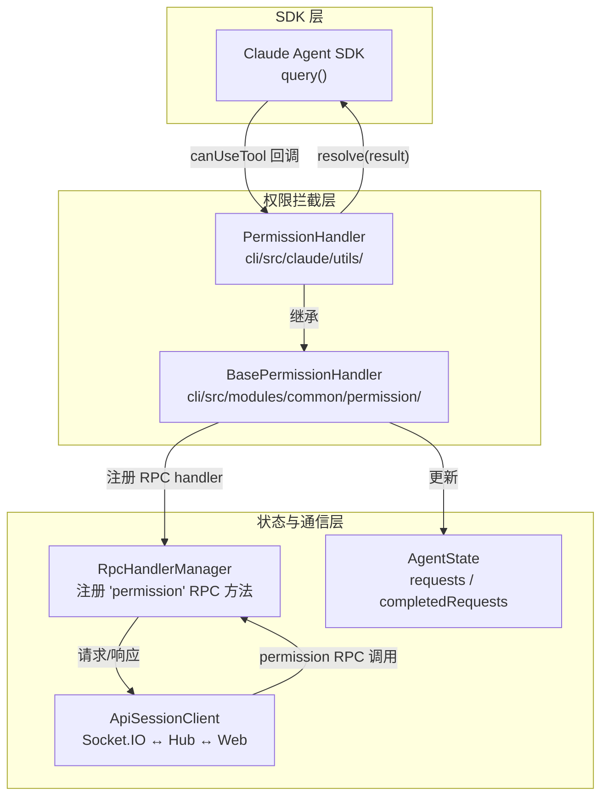
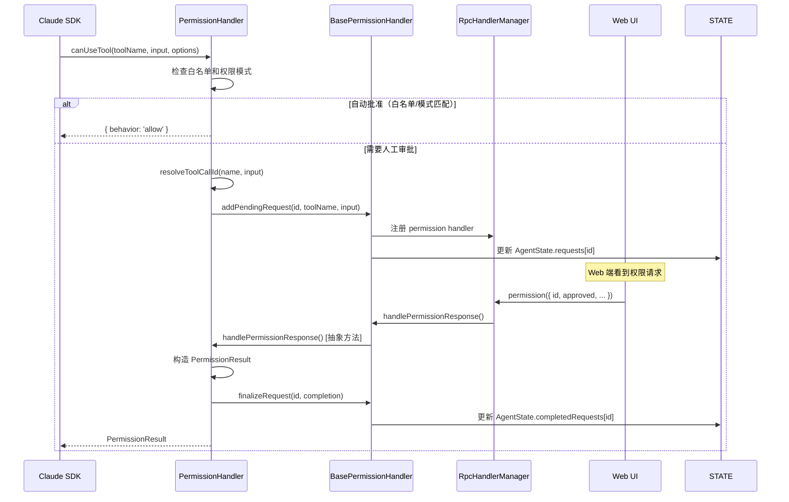

# 权限系统 (Permission System)

CLI 权限系统拦截 Claude Code SDK 的工具调用请求，通过 RPC 通道将审批决策权交给远程 Web 用户。

## 架构总览



## 两层继承结构

### BasePermissionHandler（通用基类）

**路径**: `cli/src/modules/common/permission/BasePermissionHandler.ts`

提供所有权限处理器的通用基础设施，与具体 Agent 类型无关：

| 职责 | 说明 |
|------|------|
| **RPC 注册** | 构造时自动注册 `permission` RPC 方法到 `RpcHandlerManager` |
| **请求生命周期** | `addPendingRequest()` → 等待 RPC 响应 → `handlePermissionResponse()` → `finalizeRequest()` |
| **状态同步** | 将 pending/completed 请求写入 `AgentState`，供 Web 端读取 |
| **取消机制** | `cancelPendingRequests()` 批量拒绝所有挂起请求 |
| **自动审批** | `resolveAutoApprovalDecision()` 根据 `PermissionMode` 和工具名判断是否跳过人工审批 |

**自动审批规则**（`resolveToolAutoApprovalDecision`）：

```
bypassPermissions 模式 → 所有工具自动 approved_for_session
工具名包含 change_title/think/save_memory → 自动 approved
工具 ID 包含 change_title/save_memory → 自动 approved
```

### PermissionHandler（Claude 专用实现）

**路径**: `cli/src/claude/utils/permissionHandler.ts`

继承 `BasePermissionHandler`，实现 Claude Code 特有的权限逻辑：

| 职责 | 说明 |
|------|------|
| **工具调用追踪** | `onMessage()` 从 SDK 消息流中收集 `tool_use` 块，建立 ID→工具映射 |
| **ID 解析** | `resolveToolCallId()` 通过工具名 + 输入参数匹配找到对应的 SDK tool_use_id |
| **白名单管理** | 维护 `allowedTools`、`allowedBashLiterals`、`allowedBashPrefixes` 三类白名单 |
| **特殊工具处理** | 对 `AskUserQuestion`、`request_user_input`、`ExitPlanMode` 有定制逻辑 |
| **权限模式** | 支持 `default`、`acceptEdits`、`bypassPermissions` 三种模式 |

## 权限请求处理流程



### 详细步骤

1. **SDK 调用 `canUseTool`** — Claude Code 要执行工具前回调
2. **白名单检查** — 已批准过的工具直接放行（`allowedTools` / `allowedBashLiterals` / `allowedBashPrefixes`）
3. **模式检查** — `bypassPermissions` 全放行；`acceptEdits` 放行编辑类工具
4. **ID 解析** — 通过 `resolveToolCallId()` 从历史 `tool_use` 消息中找到匹配的 ID
5. **挂起等待** — 创建 Promise，通过 `addPendingRequest()` 注册等待
6. **状态广播** — 写入 `AgentState.requests`，Web 端通过 Socket.IO 获取
7. **用户决策** — Web 端通过 `permission` RPC 返回审批结果
8. **结果处理** — 根据工具类型和用户选择构造 `PermissionResult` 返回 SDK

## 特殊工具处理

### AskUserQuestion / request_user_input

这两个"提问工具"不走常规审批，而是将用户答案注入回工具输入：

```
Web 返回 answers → buildAskUserQuestionUpdatedInput() / buildRequestUserInputUpdatedInput()
→ resolve({ behavior: 'allow', updatedInput: { ...input, answers } })
```

### ExitPlanMode

Plan 模式退出采用"假拒绝"策略：

```
用户批准 → queue.unshift(PLAN_FAKE_RESTART) → resolve({ behavior: 'deny', message: PLAN_FAKE_REJECT })
```

SDK 收到 `deny` 后停止当前轮次，但 `PLAN_FAKE_RESTART` 已插入消息队列，下一轮以新模式继续。`claudeRemoteLauncher` 会拦截 `PLAN_FAKE_REJECT` 的 `tool_result`，将其替换为 `"Plan approved"`。

## 白名单与权限透传

### 白名单管理

当用户选择"本会话允许"时，`PermissionHandler` 更新内部白名单：

| 类型 | 数据结构 | 匹配规则 |
|------|----------|----------|
| **普通工具** | `allowedTools: Set<string>` | 精确匹配工具名 |
| **Bash 精确** | `allowedBashLiterals: Set<string>` | 命令字符串完全匹配 |
| **Bash 前缀** | `allowedBashPrefixes: Set<string>` | 命令以前缀开头即匹配 |

Bash 权限解析（`parseBashPermission`）：
- `Bash(git status)` → 精确匹配 `git status`
- `Bash(npm run:*)` → 前缀匹配 `npm run`
- `Bash` → 忽略（不记录）

### SDK 权限建议透传

SDK 在调用 `canUseTool` 时可能附带 `suggestions`（权限建议）。当用户选择"本会话允许"时，这些建议被原样透传回 SDK：

```typescript
// PermissionHandler.handlePermissionResponse()
{
    behavior: 'allow',
    updatedPermissions: pending.suggestions,  // 透传 SDK 建议
    decisionClassification: 'user_permanent'
}
```

## 集成点

### claudeRemote — SDK 调用侧

```typescript
// claudeRemote.ts 中注册 canUseTool 回调
const sdkOptions = {
    canUseTool: async (toolName, input, options) => {
        return opts.canCallTool(toolName, input, mode, {
            signal: options.signal,
            suggestions: options.suggestions,
            toolUseID: options.toolUseID,
        });
    },
};
```

### claudeRemoteLauncher — 生命周期管理

```typescript
// claudeRemoteLauncher.ts 中创建并管理 PermissionHandler
const permissionHandler = new PermissionHandler(session);

// 注册到 claudeRemote
claudeRemote({
    canCallTool: permissionHandler.handleToolCall,
    // ...
});

// 新会话时重置
permissionHandler.reset();
```

### RPC 通信协议

**请求**（Web → CLI）：

```typescript
// 方法: session:permission
{
    id: string;           // tool_use ID
    approved: boolean;    // 是否批准
    reason?: string;      // 拒绝原因
    mode?: PermissionMode; // 权限模式变更
    allowTools?: string[]; // "本会话允许"的工具列表
    answers?: Record<string, string[]>; // 提问工具的答案
}
```

**响应**（CLI → SDK）：

```typescript
// PermissionResult
{
    behavior: 'allow' | 'deny';
    updatedInput?: Record<string, unknown>;  // 修改后的工具输入
    updatedPermissions?: PermissionUpdate[]; // 透传的权限建议
    decisionClassification?: 'user_permanent' | 'user_temporary' | 'user_reject';
    message?: string;  // deny 时的拒绝消息
    toolUseID?: string;
}
```

## 生命周期

| 事件 | 行为 |
|------|------|
| **会话开始** | `new PermissionHandler(session)` → 注册 RPC handler |
| **新 Claude 会话** | `permissionHandler.reset()` → 清空白名单、取消挂起请求 |
| **模式切换** | `handleModeChange(mode)` → 更新内部 `permissionMode` + 通知 Session |
| **会话结束** | `reset()` → 清理所有状态 |

## 关键文件

| 文件 | 职责 |
|------|------|
| `cli/src/claude/utils/permissionHandler.ts` | Claude 专用权限处理器，工具调用追踪和白名单管理 |
| `cli/src/modules/common/permission/BasePermissionHandler.ts` | 通用权限基类，RPC 注册、请求生命周期、自动审批 |
| `cli/src/claude/claudeRemote.ts` | SDK 集成点，注册 `canUseTool` 回调 |
| `cli/src/claude/claudeRemoteLauncher.ts` | 生命周期管理，创建和重置 PermissionHandler |
| `cli/src/claude/sdk/types.ts` | `PermissionResult` 等类型定义 |
| `cli/src/claude/utils/getToolDescriptor.ts` | 工具描述符（判断编辑类/Plan 模式工具） |
| `cli/src/api/rpc/RpcHandlerManager.ts` | RPC 方法注册和请求分发 |
