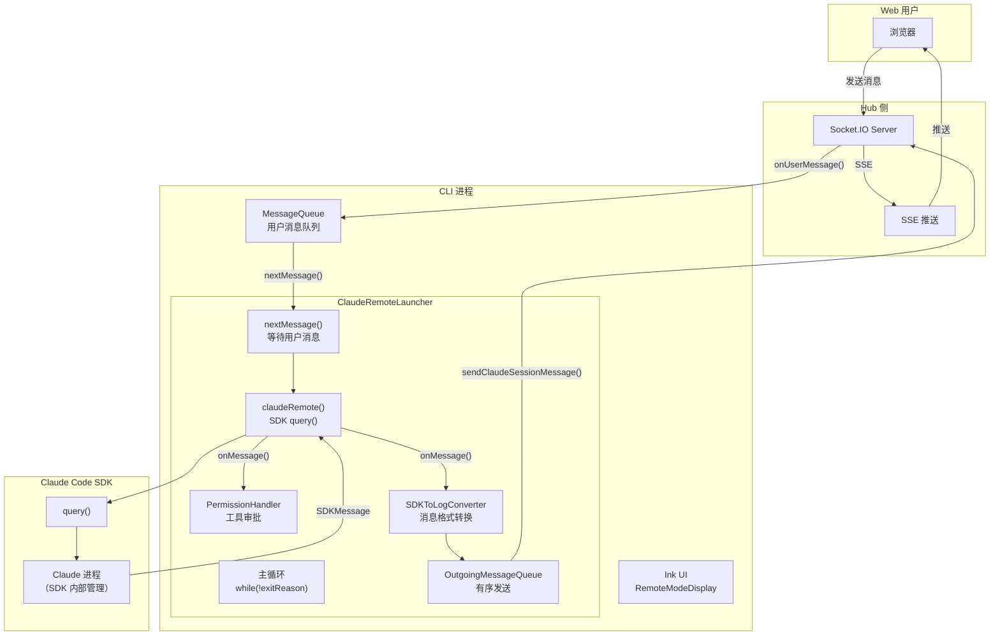
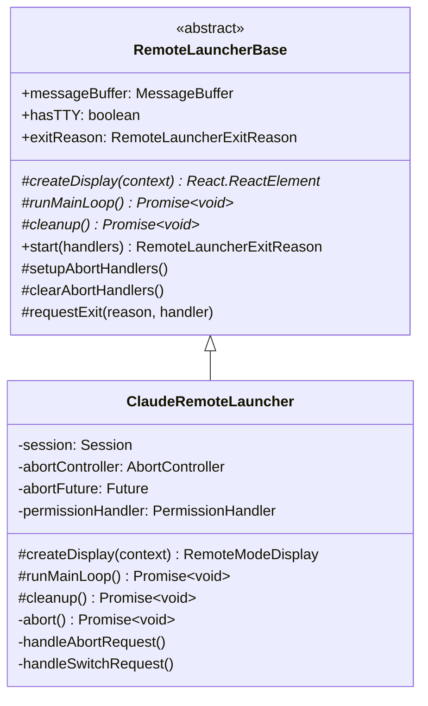
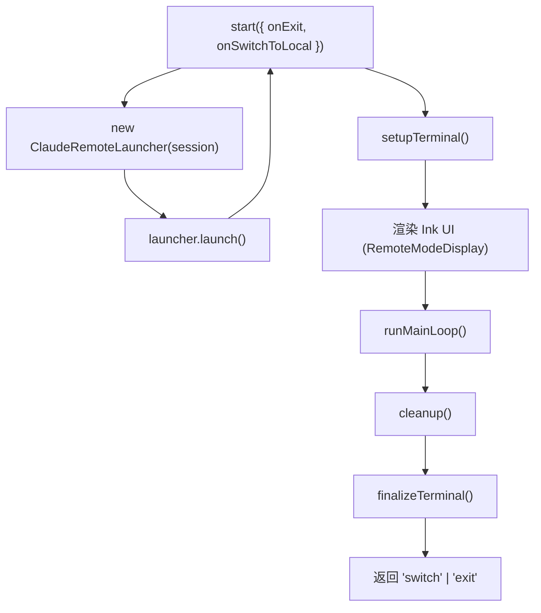
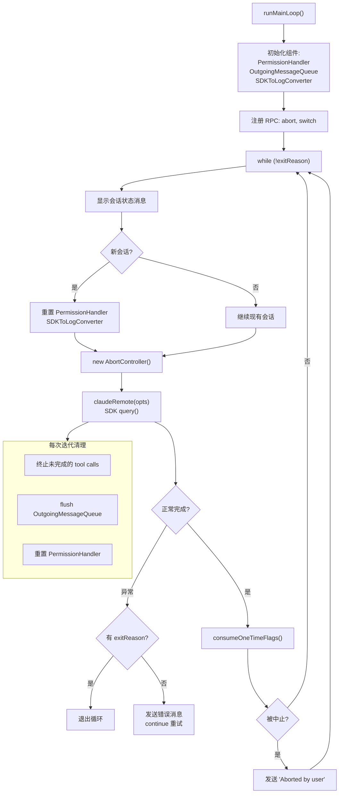
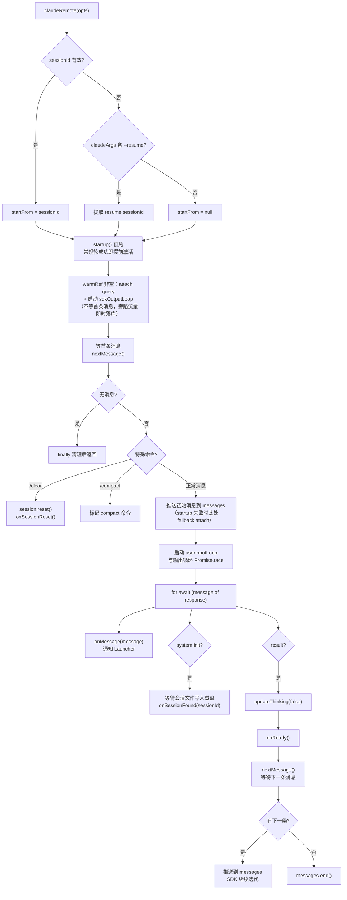
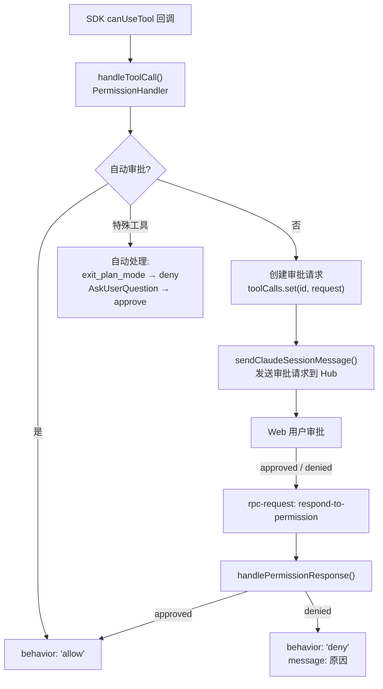
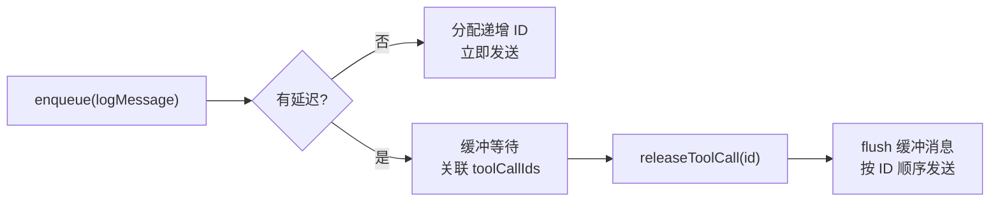
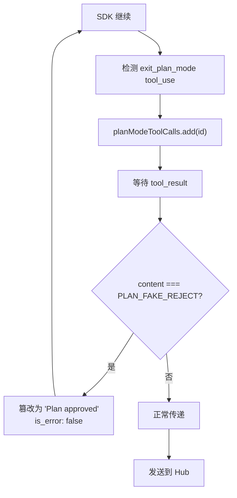

# Remote 模式

Remote 模式通过 Claude Code SDK 的 `query()` 函数驱动 Claude，消息经由 Hub 中转，支持 Web 端远程控制。这是 Mobi 的核心价值所在。

---

## 架构



## ClaudeRemoteLauncher

**文件**: `packages/cli/src/claude/claudeRemoteLauncher.ts`（440 行）

`ClaudeRemoteLauncher` 继承自 `RemoteLauncherBase`，是 Remote 模式的核心编排器。

### 类结构



### 启动流程



### 主循环（runMainLoop）



### 退出控制

| 操作 | 触发方式 | 效果 |
|------|----------|------|
| **Ctrl+C** | 终端 `onExit` handler | `requestExit('exit')` → 中止 SDK → 清理退出 |
| **双击空格** | 终端 `onSwitchToLocal` handler | `requestExit('switch')` → 切换到 Local |
| **RPC abort** | Hub 侧发送 abort RPC | 三档分派（`stopKind`，批次 A）：`'turn'` 只停本轮（含撤回两段式判定）；`'turn-queue'` 加 `interrupt({cancelQueued:true})` 清 CC 层队列；`'turn-queue-tasks'` 再遍历 `stopTask` 终止后台任务（`perTaskStopAffordance: true` 下点按不再连带后台） |
| **RPC switch** | Hub 侧发送 switch RPC | 切换到 Local 模式 |

## claudeRemote — SDK 集成

**文件**: `packages/cli/src/claude/claudeRemote.ts`（720 行）

`claudeRemote` 是与 Claude Code SDK 交互的核心函数，通过 `query()` 驱动 Claude。内部维护**双循环**：`sdkOutputLoop`（消费 SDK 输出）和 `userInputLoop`（拉取用户输入，带 gated pump 门控）。

### 提前激活（2026-08-28）

startup 预热成功后**不等首条用户消息**即 attach query 并启动 `sdkOutputLoop`——首条消息等待窗口内的 SDK 旁路流量（Claude Code 原生跨会话消息等）从会话第一秒起被消费落库。配套语义：

- `LoopContext.hasInput`：init 仅在已有输入 push 时置 running=true（提前激活后启动 init 不代表 turn 运行，无 result 复位会令 web 永久显示「运行中」）；置位由 `markInputPushed` 在各 push 路径统一驱动
- `LoopContext.initialModel`：循环先于首条消息启动，模型名在 initial 处理后回填（stream_event 缺 model 时的快照兜底）
- 首条消息消费路径不变（`nextMessage` → `handleSpecialCommand` → push）；`userInputLoop` 在 initial 处理后才启动，避免双消费者竞争绕过首条特殊命令
- startup 失败回落现状（首条消息到了再 fallback attach）；rewind 截断轮保持串行不提前激活
- 详见 `docs/superpowers/specs/2026-08-28-cross-session-visibility-design.md`

### 入站跨会话消息观测

SDK 进程内 hook（`sdkOptions.hooks.UserPromptSubmit`）把入站 prompt 直达 wrapper（`onInboundPrompt` → launcher `handleInboundPrompt`）：`parseInboundCrossSession`（`claude/utils/inboundCrossSession.ts`）按 `source` 字段 + `<cross-session-message>` 信封甄别后，经 `ApiSessionClient.sendInboundCrossSessionMessage` 落库为带 `meta.crossSession = { from }` 的 user 消息（web 端渲染「📨 来自 xxx」标签）。会话 hook settings 注入 `crossSessionInbound: "accept"` 防 headless 默认 hold 吞消息。

### 执行流程



### SDK Options 构建

```typescript
const sdkOptions: Options = {
    cwd: opts.path,
    resume: startFrom ?? undefined,
    mcpServers: opts.mcpServers,
    permissionMode: mode.permissionMode,
    model: mode.model,
    fallbackModel: mode.fallbackModel,
    systemPrompt: ...,           // 自定义系统提示词 + mobi 提示词
    allowedTools: [...],         // 合并 mode 和 mobi 工具（含 mcp__mobi-web__* 预授权）
    disallowedTools: mode.disallowedTools,
    toolAliases: {               // web 工具替换（常驻注入）：模型 emit WebSearch/WebFetch
        WebSearch: 'mcp__mobi-web__web_search',   // → 执行层重定向到 mobi-web in-process 工具
        WebFetch: 'mcp__mobi-web__web_fetch',     // （见 src/webtools/，local 模式不替换）
    },
    canUseTool: canCallTool,     // 权限审批回调
    abortController,
    pathToClaudeCodeExecutable,
    settings: hookSettingsPath,
    additionalDirectories: [blobsDir, ...(opts.additionalDirectories ?? [])],
}
```

### 消息流（PushableAsyncIterable）

`claudeRemote` 使用 `PushableAsyncIterable` 实现消息推送。采用**双循环架构**：`sdkOutputLoop` 消费 SDK 输出，`userInputLoop` 拉取用户输入。`userInputLoop` 带 **gated pump（门控泵 C-2）**：agent 运行时不 pull 消息（`isRunning()` 为 true 时先 `waitForIdle`），等 result（running 翻 false）才拉取，消息始终停留在 MessageQueue 中排队：

```
初始消息 → messages.push(userMessage)
    │
    SDK query({ prompt: messages })
    │
    ├── for await (message of response)
    │   ├── onMessage(message)           ← 通知 Launcher 处理
    │   ├── system init → onSessionFound
    │   ├── result → updateThinking(false) → resolveIdle → nextMessage()
    │   │   ├── gated pump 放行（agent idle）→ pull 一批
    │   │   ├── 有消息 → messages.push() ← SDK 自动继续
    │   │   └── 无消息 → messages.end()  ← SDK 结束迭代
    │   └── user → 检查 aborted tool_result
    │
    └── catch AbortError → 忽略
```

**门控效果**：用户在 agent 运行期间发送的消息（status='queued'）会排队悬浮在 Web 端，等 agent idle（result 到达）后才被真正拉取并送给 SDK，此时 CLI 通过 `onBatchConsumed` → `emitMessagesSubmitted`（内部走 `emitFacts` 统一出口，`messages-facts` 事件 pushed fact）通知 Hub 将这批消息的 `lifecycle` 推进为 `'pushed'`（`lifecycleAt` 落库）。

**command_lifecycle 帧拦截**：CC 对排队消息（push 时预设的 `command_uuid` = nativeId）发出 `command_lifecycle` 生命周期回执。`onMessage` 中纯函数 `commandLifecycleToFact`（`claudeRemote.ts`）把 started→processing、completed→done、cancelled/discarded/refused 直传（帧上可选 `terminal_reason` 原样透传进 fact），控制帧不 convert 不落库（分类层 discard 兜底），只取信号 `emitLifecycleFact`（`messages-facts` lifecycle fact）上报 Hub 终态推进。

## PermissionHandler — 工具权限审批

**文件**: `packages/cli/src/claude/utils/permissionHandler.ts`（506 行）

Remote 模式下，Claude 的所有工具调用都需经过 `PermissionHandler` 审批。

### 架构



### 自动审批规则

| 工具 | 规则 | 说明 |
|------|------|------|
| `exit_plan_mode` / `ExitPlanMode` | 自动拒绝 | Plan mode 退出由 Mobi 控制 |
| `AskUserQuestion` | 自动允许 | 用户问题工具始终通过 |
| `request_user_input` | 自动允许 | 用户输入工具始终通过 |
| 已缓存允许的工具 | 自动允许 | 同一工具名 + 相同参数模式 |
| `allowedTools` 列表内 | 自动允许 | mode 中指定的允许工具 |
| Bash 命令 | 前缀/字面量匹配 | 已允许的 Bash 模式自动通过 |

### Bash 权限缓存

```typescript
// 允许的 Bash 字面量（如 "git status"）
allowedBashLiterals: Set<string>

// 允许的 Bash 前缀（如 "git " → 匹配所有 git 命令）
allowedBashPrefixes: Set<string>

// 允许的工具列表
allowedTools: string[]
```

## SDKToLogConverter — 消息格式转换

**文件**: `packages/cli/src/claude/utils/sdkToLogConverter.ts`

将 Claude Code SDK 的 `SDKMessage` 转换为 Hub 可理解的日志格式：

```
SDKMessage (type: 'assistant')
    │
    ├── SDKToLogConverter.convert()
    │   ├── 提取 content blocks
    │   ├── 关联 parent_tool_use_id
    │   ├── 添加时间戳、sessionId、cwd
    │   └── 返回 LogMessage
    │
    └── OutgoingMessageQueue.enqueue(logMessage)
         └── sendClaudeSessionMessage() → Hub
```

### 消息类型映射

| SDK 类型 | 日志类型 | 说明 |
|----------|----------|------|
| `system` (init) | — | 不生成日志，仅触发 onSessionFound |
| `assistant` | `assistant` | Claude 的回复（含 tool_use） |
| `user` (tool_result) | `user` | 工具执行结果 |
| `result` | — | 不生成日志，标记完成 |

### Sidechain 消息处理

SDK 中的 `Task` 工具会创建 sidechain（子任务）。`SDKToLogConverter` 为每个 sidechain 的 prompt 生成虚拟 user message：

```
assistant (tool_use: Task, input.prompt)
    │
    └── convertSidechainUserMessage(toolCallId, prompt)
         └── { type: 'user', parent_tool_use_id: toolCallId, ... }
```

## OutgoingMessageQueue — 有序消息发送

**文件**: `packages/cli/src/claude/utils/OutgoingMessageQueue.ts`（207 行）

确保发送到 Hub 的消息有序且完整。

### 工作原理



**延迟机制**：
- Assistant 消息包含 tool_use → 延迟 250ms（等待可能的 tool_result）
- tool_result 到达 → 立即释放关联的延迟消息
- 防止 tool_use 和 tool_result 在 Hub 侧顺序错乱

### 保序策略

```typescript
// 递增 ID 保证顺序
private nextId = 0

// 消息结构
{
    id: nextId++,          // 递增 ID
    message: logMessage,   // 日志内容
    delay: number | null,  // 延迟毫秒数
    toolCallIds: string[]  // 关联的 tool call IDs
}
```

## Plan Mode 特殊处理

Remote 模式对 Claude 的 Plan Mode 有特殊处理：



**原因**：Mobi 通过 Web 端控制 Plan Mode 的退出，需要拦截 SDK 默认的 plan rejection 行为。

## Ink UI

Remote 模式使用 Ink 渲染终端界面：

**组件**: `RemoteModeDisplay`（`packages/cli/src/ui/ink/RemoteModeDisplay.tsx`）

```
┌──────────────────────────────────────┐
│ Mobi - Remote Mode                   │
│ Session: abc123                      │
│──────────────────────────────────────│
│ ═══════════════════════════════════  │ ← 分隔线（新会话开始）
│ Starting new Claude session...       │ ← 状态消息
│                                      │
│ [Claude 回复内容]                     │ ← formatClaudeMessageForInk
│                                      │
│ ● Thinking...                        │ ← 思考状态指示
│──────────────────────────────────────│
│ Ctrl+C: Exit  |  Space×2: Local Mode │ ← 操作提示
└──────────────────────────────────────┘
```

**仅在 DEBUG 模式下显示**（`process.env.DEBUG ? session.logPath : undefined`），生产环境不渲染 Ink UI。
