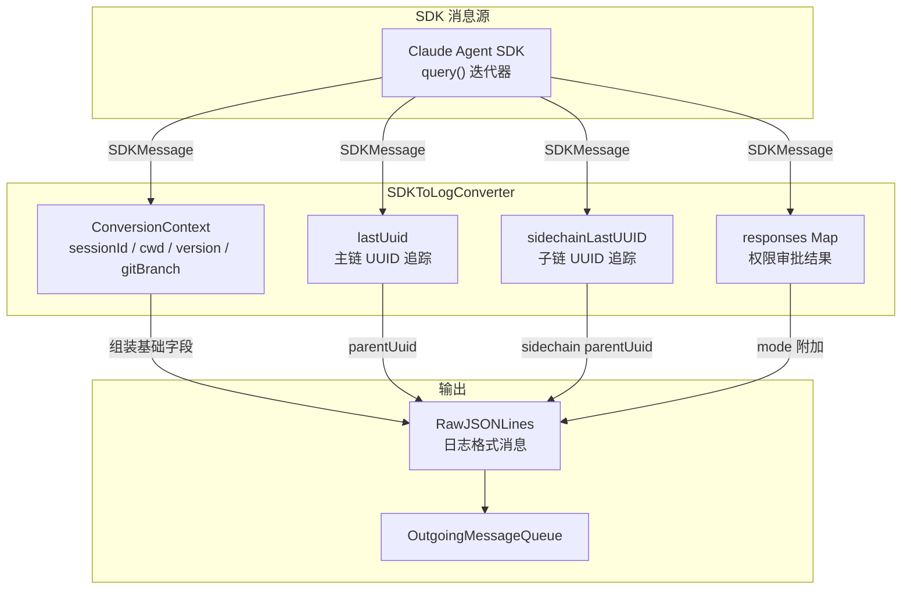
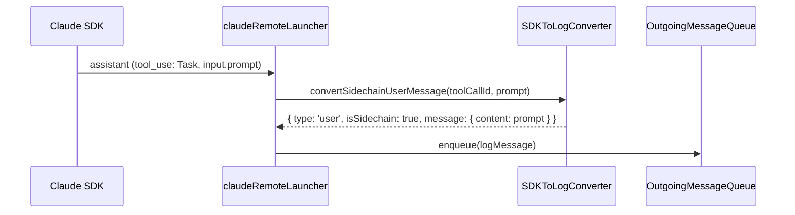

# SDK 消息转换器 (SDKToLogConverter)

将 Claude Agent SDK 的 `SDKMessage` 转换为 Hub/Web 可理解的 `RawJSONLines` 日志格式，是 Remote 模式下消息从 SDK 流向 Hub 的关键桥梁。

## 架构总览



## 数据结构

### ConversionContext（输入上下文）

```typescript
interface ConversionContext {
    sessionId: string       // 会话 ID
    cwd: string             // 工作目录
    version?: string        // CLI 版本号
    gitBranch?: string      // 当前 git 分支（构造时自动获取）
    parentUuid?: string | null  // 上一条消息的 UUID（内部维护）
}
```

### RawJSONLines（输出格式）

由 `packages/cli/src/claude/types.ts` 定义，`RawJSONLinesSchema` 是一个 discriminated union：

| 类型 | 必填字段 | 说明 |
|------|----------|------|
| `user` | `uuid`, `message` | 用户消息 / tool_result |
| `assistant` | `uuid` | Claude 回复（message 可选） |
| `summary` | `summary`, `leafUuid` | 压缩摘要 |
| `system` | `uuid` | 系统消息（init / error 等） |

所有类型共享 `RawJSONLinesBaseSchema` 基础字段：

```typescript
{
    uuid?: string
    parentUuid?: string | null   // 父消息 UUID（链式结构）
    isSidechain?: boolean        // 是否子链消息
    userType?: string            // 固定为 'external'
    cwd?: string                 // 工作目录
    sessionId?: string           // 会话 ID
    version?: string             // 版本号
    gitBranch?: string           // git 分支
    timestamp?: string           // ISO 时间戳
}
```

## 消息类型映射

### SDK → Log 转换规则

| SDK `message.type` | Log `type` | 处理逻辑 |
|---------------------|------------|----------|
| `user` | `user` | 直接转换，检查 tool_result 附加 mode |
| `assistant` | `assistant` | 直接转换，附加 requestId |
| `system` (subtype=`init`) | `system` | 更新 sessionId，全字段透传 |
| `system` (其他 subtype) | `system` | 全字段透传 |
| `result` | — | **不生成日志**（返回 null） |

### UUID 链路规则

```
普通消息：
  lastUuid = prev_uuid  →  当前消息使用 prev_uuid 作为 parentUuid  →  lastUuid = 当前 uuid

Sidechain 消息（有 parent_tool_use_id）：
  sidechainLastUUID.get(parent_tool_use_id) = prev_uuid
  → 当前消息使用 prev_uuid 作为 parentUuid
  → sidechainLastUUID.set(parent_tool_use_id, 当前 uuid)
  → lastUuid 不变（主链不受影响）
```

**关键区别**：普通消息更新 `lastUuid`（主链推进），sidechain 消息只更新 `sidechainLastUUID`（子链推进，主链不动）。

## 特殊转换方法

### convertSidechainUserMessage

**用途**：为 `Task` 工具的 subagent prompt 生成虚拟 user message。



在 `claudeRemoteLauncher.ts:282-294` 中调用。当检测到 `Task` 工具调用且 `input.prompt` 存在时，生成一条虚拟 user 消息作为 subagent 的输入展示。

### generateInterruptedToolResult

**用途**：当工具调用被用户中断时，生成错误 tool_result 日志。

```typescript
// 生成结构
{
    type: 'user',
    isSidechain: boolean,        // 取决于是否有 parentToolUseId
    message: {
        role: 'user',
        content: [{
            type: 'tool_result',
            content: '[Request interrupted by user for tool use]',
            is_error: true,
            tool_use_id: toolUseId
        }]
    },
    toolUseResult: 'Error: [Request interrupted by user for tool use]'
}
```

在 `claudeRemoteLauncher.ts:397-403` 的 `finally` 块中调用，为所有未完成的 tool call 生成中断结果，确保 Hub 侧消息链完整。

### resetParentChain

**用途**：清空主链追踪，用于新会话开始时。

在 `claudeRemoteLauncher.ts:312` 调用（检测到新会话时）。注意：不重置 `sidechainLastUUID`，因为跨轮次不会复用 toolUseId。

## 状态生命周期

| 事件 | 操作 | 调用位置 |
|------|------|----------|
| **构造** | 创建 context，获取 gitBranch | `claudeRemoteLauncher.ts:133` |
| **session 文件落盘** | `updateSessionId()` | `convert()` 内部，system init 时自动调用 |
| **新会话开始** | `resetParentChain()` | `claudeRemoteLauncher.ts:312` |
| **轮次结束** | 无操作（sidechain 状态自然过期） | — |

## 关键文件

| 文件 | 职责 |
|------|------|
| `packages/cli/src/claude/utils/sdkToLogConverter.ts` | SDK 消息 → 日志格式转换 |
| `packages/cli/src/claude/types.ts` | `RawJSONLines` 类型定义和 Zod schema |
| `packages/cli/src/claude/claudeRemoteLauncher.ts` | 创建和使用 SDKToLogConverter |
| `packages/cli/src/claude/utils/OutgoingMessageQueue.ts` | 转换结果的有序发送 |
