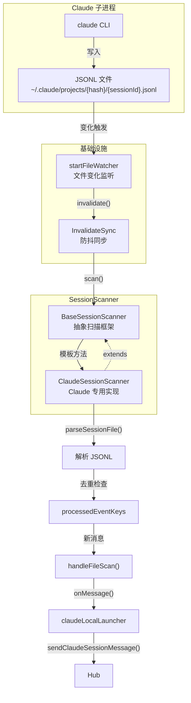
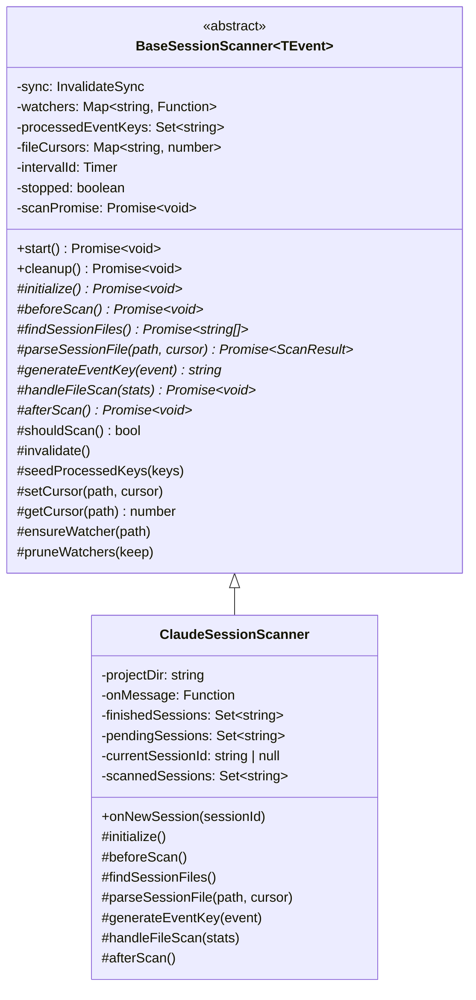
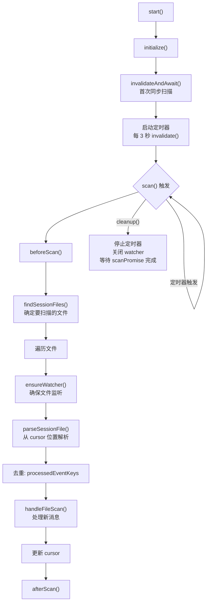
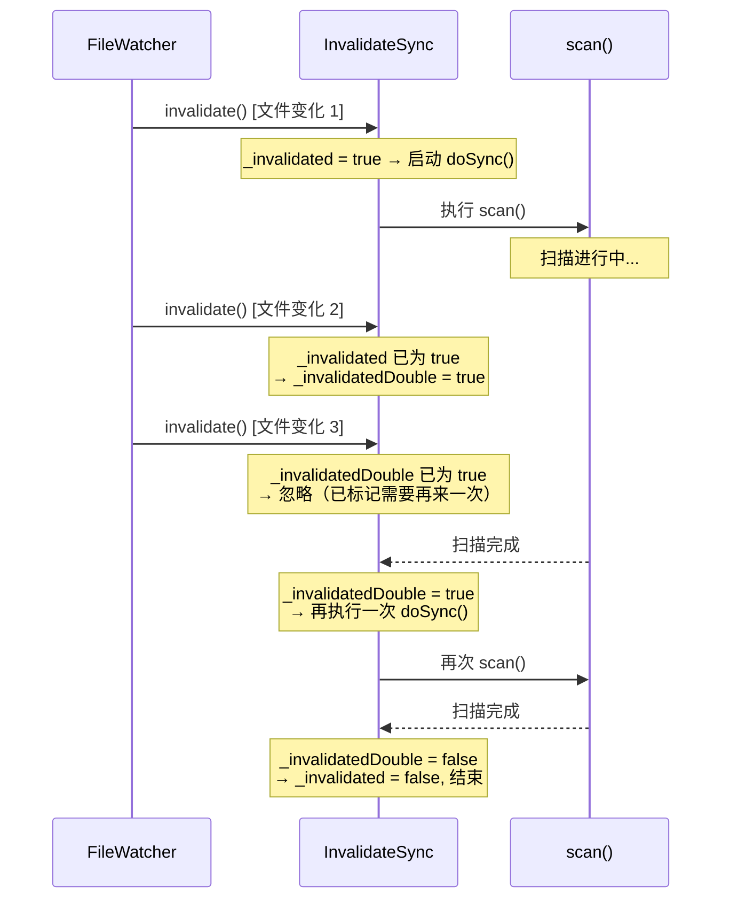
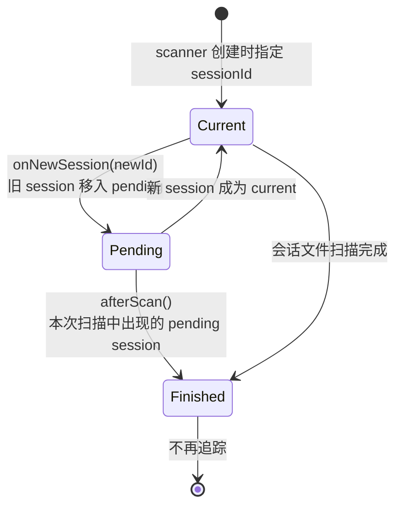
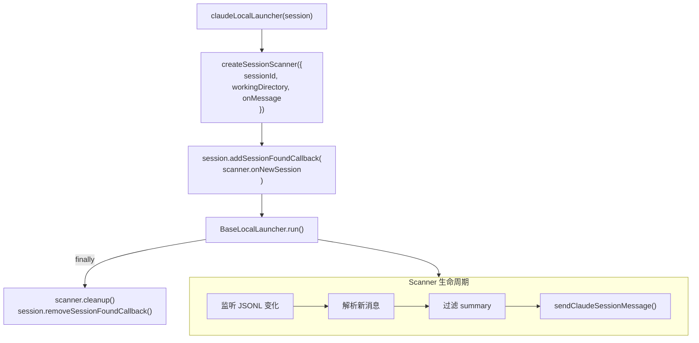

# SessionScanner — Local 模式的会话文件扫描器

Local 模式下，Claude 进程将消息写入 JSONL 文件。SessionScanner 负责监听这些文件的变化，解析新消息并转发到 Hub。

**文件**:
- [`cli/src/claude/utils/sessionScanner.ts`](/cli/src/claude/utils/sessionScanner.ts) — Claude 专用实现（243 行）
- [`cli/src/modules/common/session/BaseSessionScanner.ts`](/cli/src/modules/common/session/BaseSessionScanner.ts) — 抽象基类（205 行）

---

## 解决的问题

Local 模式下 Claude 是独立子进程，直接在终端与用户交互。Mobi 作为旁观者需要获取对话内容，但不能干预 Claude 的正常运行。核心挑战：

1. **无侵入监听** — 不能修改 Claude 进程，只能通过文件系统间接获取消息
2. **增量读取** — JSONL 文件持续增长，每次扫描只读取新增部分（cursor 机制）
3. **去重** — 文件可能被多次扫描（定时轮询 + 文件变化通知），同一条消息不能重复发送
4. **多会话追踪** — Claude 可能在运行中创建新会话（如 `/clear`），需要追踪 pending → current → finished 的会话状态转换
5. **内部事件过滤** — Claude 会写入一些非对话事件（`file-history-snapshot`、`change`、`queue-operation`），需要静默跳过

## 架构



## 类层次



## 扫描生命周期



### 1. 启动（start）

```typescript
async start(): Promise<void> {
    await this.initialize();         // 子类：初始化 cursor 和已处理 key
    await this.sync.invalidateAndAwait();  // 首次扫描（阻塞等待完成）
    this.intervalId = setInterval(
        () => this.sync.invalidate(), // 定时触发扫描
        this.options.intervalMs       // Claude: 3000ms
    );
}
```

启动时 `initialize()` 将已有消息标记为已处理（避免启动时重发历史消息），然后执行首次全量扫描。

### 2. 扫描触发

两种触发方式：

| 触发源 | 机制 | 说明 |
|--------|------|------|
| **文件变化** | `startFileWatcher` → `invalidate()` | JSONL 文件被 Claude 写入时立即触发 |
| **定时轮询** | `setInterval` → `invalidate()` | 每 3 秒兜底扫描，防止文件监听遗漏 |

两种方式都通过 `InvalidateSync` 汇聚，自动防抖和合并。

### 3. 单次扫描流程（runScan）

```
beforeScan()           ← 子类：清空扫描追踪
    │
    ├── findSessionFiles()   ← 子类：返回待扫描文件列表
    │
    └── 对每个文件:
        ├── ensureWatcher()     ← 注册文件监听
        ├── getCursor(path)     ← 获取上次读取位置
        ├── parseSessionFile()  ← 子类：从 cursor 解析新行
        ├── generateEventKey()  ← 子类：为每条消息生成去重 key
        ├── 去重检查            ← processedEventKeys 过滤
        ├── handleFileScan()    ← 子类：处理新消息（发送到 Hub）
        ├── setCursor()         ← 更新读取位置
        └── 记录新 key          ← 加入已处理集合
    │
afterScan()           ← 子类：清理完成的会话
```

### 4. 停止（cleanup）

```typescript
async cleanup(): Promise<void> {
    this.stopped = true;         // 阻止新扫描
    clearInterval(this.intervalId); // 停止定时器
    this.sync.stop();            // 停止同步机制
    for (const stop of this.watchers.values()) {
        stop();                  // 关闭所有文件监听
    }
    if (this.scanPromise) {
        await this.scanPromise.catch(() => {}); // 等待进行中的扫描完成
    }
}
```

## 核心机制

### InvalidateSync — 防抖同步

**文件**: `cli/src/utils/sync.ts`

`InvalidateSync` 是一个带"双重失效"保护的去抖执行器，确保在持续变化中不遗漏消息：



关键设计：

| 状态 | 含义 |
|------|------|
| `_invalidated` | 是否有扫描正在进行或待执行 |
| `_invalidatedDouble` | 扫描进行中是否又收到了新的变化通知 |

- 扫描进行中收到新变化 → 标记 `_invalidatedDouble`，当前扫描完成后自动再执行一次
- 多次变化只触发一次额外扫描，避免无限循环
- 失败时通过 `backoff` 自动重试

### Cursor 增量读取

每个文件维护一个 cursor（行号），每次只读取 cursor 之后的新行：

```
第一次扫描: cursor = 0 → 读取全部 → cursor = 50
第二次扫描: cursor = 50 → 读取第 51-75 行 → cursor = 75
第三次扫描: cursor = 75 → 无新行 → cursor = 75（不变）
```

如果 cursor 超过文件行数（如文件被截断或替换），重置为 0 从头读取。

### 去重（processedEventKeys）

每条消息通过 `generateEventKey()` 生成唯一 key，存入 `processedEventKeys` 集合：

| 消息类型 | Key 生成规则 |
|---------|-------------|
| `user` | `message.uuid` |
| `assistant` | `message.uuid` |
| `summary` | `"summary: " + leafUuid + ": " + summary` |
| `system` | `message.uuid` |

去重是幂等的 —— 同一条消息即使出现在多次扫描中，也只会被处理一次。

### File Watcher — 文件变化监听

**文件**: `cli/src/modules/watcher/startFileWatcher.ts`

使用 Node.js `fs/promises` 的 `watch()` API 监听文件变化：

```
startFileWatcher(filePath, onFileChange)
    │
    ├── watch(filePath, { persistent: true, signal })
    │   └── for await (event of watcher)
    │       └── onFileChange(filePath) → invalidate()
    │
    └── 出错时: 等待 1 秒后重启监听
```

- 每个文件一个独立的 watcher（通过 AbortController 管理）
- 监听失败自动重连（1 秒延迟）
- 返回清理函数，调用时 abort watcher

## 会话追踪

`ClaudeSessionScanner` 维护三个集合追踪多会话状态：



| 状态 | 集合 | 说明 |
|------|------|------|
| **current** | `currentSessionId` | 当前活跃会话（只一个） |
| **pending** | `pendingSessions` | 等待确认完成的旧会话（可能多个） |
| **finished** | `finishedSessions` | 已完成会话（不再扫描） |

### 会话切换场景

Claude 运行中用户执行 `/clear` 时：

```
1. 当前会话 S1 正在扫描
2. Hook Server 通知新会话 S2 → onNewSession("S2")
3. S1 移入 pendingSessions, currentSessionId = "S2"
4. findSessionFiles() 返回 [S1 文件, S2 文件]
5. afterScan() 中：如果 S1 在本次扫描中出现 → 移入 finishedSessions
6. 后续扫描只关注 S2
```

### onNewSession 防重入

```typescript
onNewSession(sessionId: string): void {
    // 同一个 session 不重复处理
    if (this.currentSessionId === sessionId) return;
    // 已完成的 session 不处理
    if (this.finishedSessions.has(sessionId)) return;
    // 已在 pending 中的不处理
    if (this.pendingSessions.has(sessionId)) return;
    // 合法切换：旧 session 移入 pending
    if (this.currentSessionId) {
        this.pendingSessions.add(this.currentSessionId);
    }
    this.currentSessionId = sessionId;
    this.invalidate(); // 立即触发扫描
}
```

## 消息过滤

`readSessionLog()` 解析 JSONL 时有两层过滤：

### 第一层：内部事件过滤

```typescript
const INTERNAL_CLAUDE_EVENT_TYPES = new Set([
    'file-history-snapshot',  // 文件历史快照
    'change',                 // 变更追踪
    'queue-operation',        // 队列操作
]);
```

这些是 Claude Code 写入的内部状态事件，不是对话消息，静默跳过。

### 第二层：Schema 验证

```typescript
let parsed = RawJSONLinesSchema.safeParse(message);
if (!parsed.success) {
    continue; // 未知类型静默跳过
}
```

只有符合 `RawJSONLines` schema 的消息才会被处理：
- `user` — 用户消息
- `assistant` — Claude 回复
- `summary` — 会话摘要
- `system` — 系统消息

### 第三层：summary 过滤（在 Launcher 中）

```typescript
// claudeLocalLauncher.ts
onMessage: (message) => {
    if (message.type !== 'summary') {
        session.client.sendClaudeSessionMessage(message);
    }
}
```

summary 消息由 Mobi 自己生成（通过 MCP `change_title` 工具），不转发 Claude 的版本。

## 在 claudeLocalLauncher 中的使用

**文件**: `cli/src/claude/claudeLocalLauncher.ts`



生命周期与 `BaseLocalLauncher.run()` 绑定：
- 创建：在 launcher 启动前
- 运行：Claude 进程运行期间持续监听
- 清理：在 `finally` 块中，无论正常退出还是异常都保证清理

## BaseSessionScanner 扩展点

`BaseSessionScanner` 采用模板方法模式，定义扫描骨架，子类通过覆盖钩子方法自定义行为：

| 方法 | 类型 | 说明 |
|------|------|------|
| `findSessionFiles()` | 抽象（必须实现） | 返回本次扫描要检查的文件列表 |
| `parseSessionFile(path, cursor)` | 抽象（必须实现） | 从 cursor 位置解析文件，返回新事件 |
| `generateEventKey(event)` | 抽象（必须实现） | 为事件生成去重 key |
| `initialize()` | 可选 | 启动前初始化（如 seed processed keys） |
| `beforeScan()` | 可选 | 每次扫描前（如清空临时状态） |
| `afterScan()` | 可选 | 每次扫描后（如清理完成的会话） |
| `handleFileScan(stats)` | 可选 | 处理新发现的事件 |
| `shouldScan()` | 可选 | 是否允许扫描（可用于暂停） |
| `shouldWatchFile(path)` | 可选 | 是否为文件注册 watcher |

目前唯一的子类是 `ClaudeSessionScanner`，但基类设计支持其他 Agent 的会话文件扫描。

## 相关文件

| 文件 | 职责 |
|------|------|
| `cli/src/utils/sync.ts` | `InvalidateSync` — 防抖同步执行器 |
| `cli/src/modules/watcher/startFileWatcher.ts` | 文件变化监听封装 |
| `cli/src/claude/utils/path.ts` | `getProjectPath()` — Claude 项目目录定位 |
| `cli/src/claude/types.ts` | `RawJSONLines` — JSONL 行类型定义 |
