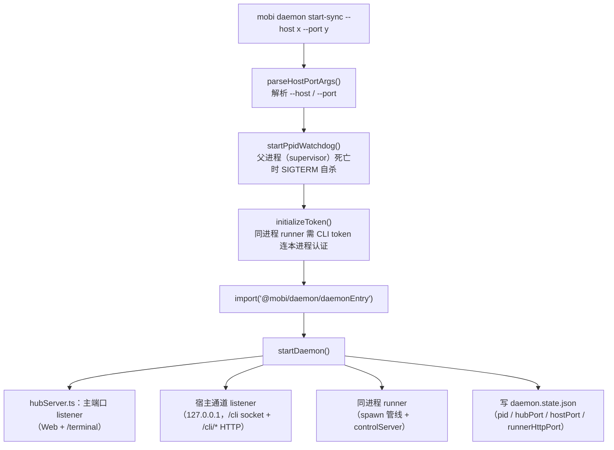

# Daemon 命令 — 启动/管理单机 daemon

文件 [`packages/cli/src/commands/daemon.ts`](/packages/cli/src/commands/daemon.ts)

`mobi daemon` 命令是 daemon 进程的 CLI 入口。`start`/`stop`/`restart`/`status` 是 [`mobi service daemon`](../service/) 子命令的别名（经 supervisor 托管）；`start-sync` 前台直跑，解析参数后动态 import daemon 入口。

> `mobi hub` 命令已删除（ticket-22）：hub 与 runner 合并为单 daemon，旧命令与别名一并退场。

## 架构

## 参数

| 参数 | 格式 | 说明 |
|------|------|------|
| `--host` | `--host <addr>` / `--host=<addr>` | 监听地址（主端口） |
| `--port` | `--port <port>` / `--port=<port>` | 监听端口（主端口；宿主端口 = 主端口 + 10000，`MOBI_HOST_PORT` 覆盖） |

## 子命令

| 子命令 | 说明 |
|--------|------|
| `start [--host] [--port]` | 后台启动（spawn `daemon start-sync` detached，轮询 `/health` 就绪） |
| `start-sync` | 前台直跑（内部子命令，不应对用户暴露） |
| `stop` | 停止 daemon（会话子进程保持存活） |
| `restart` | 重启 |
| `status` | 显示状态（读 `daemon.state.json` + 探活） |

## 进程状态

daemon 的进程状态单源是 `~/.mobi/daemon.state.json`（ticket-22 起 hub.state.json / runner.state.json 停写）：`{ pid, hubPort, hostPort, runnerHttpPort, startTime }`。读取方：controlServer 探活、doctor、upgrader/processRestarter、supervisor 孤儿清理、e2e 脚本。
