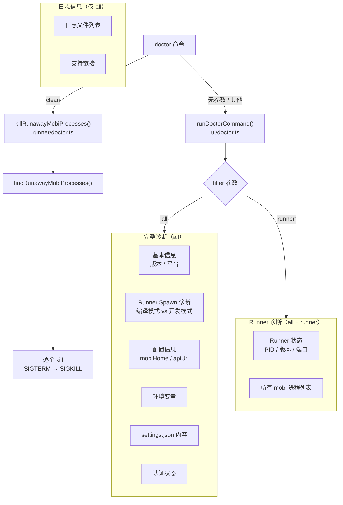
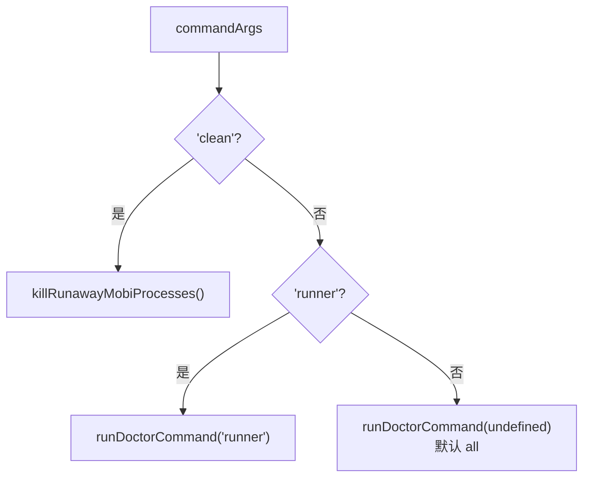
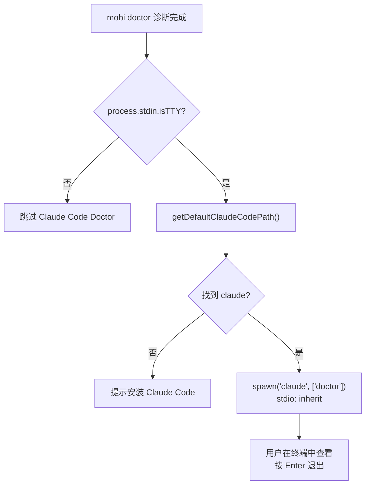
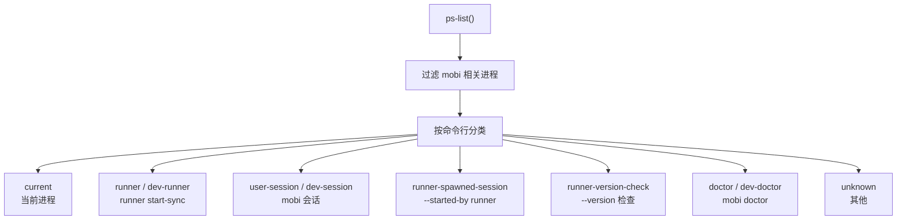
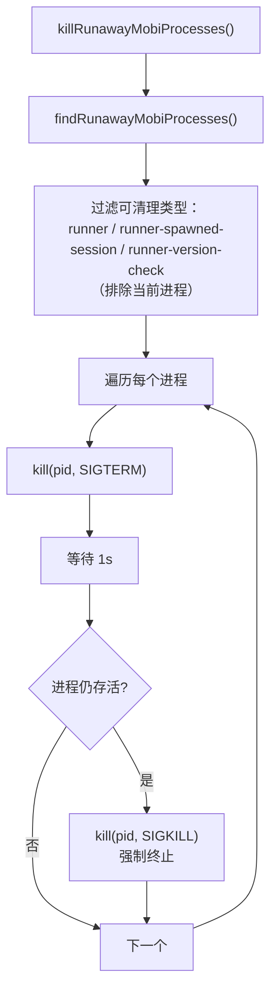

# Doctor 系统诊断

文件 [`cli/src/commands/doctor.ts`](/cli/src/commands/doctor.ts)

Doctor 提供 CLI 环境的诊断检查和进程清理功能，帮助排查问题。

## 架构



### 命令路由



`commands/doctor.ts` 的路由逻辑：
- `commandArgs[0] === 'clean'` → 进程清理
- `commandArgs[0] === 'runner'` → 仅 Runner 诊断
- 其他 → 完整诊断（默认）

## 子命令

| 子命令 | 说明 |
|--------|------|
| (无) | 运行完整诊断检查 |
| `runner` | 仅输出 Runner 诊断（等同于 `mobi runner status`） |
| `clean` | 清理失控的 mobi 进程 |

## 诊断报告内容

### filter = all（完整诊断）

`mobi doctor` 默认输出完整诊断，包含以下区块：

| 区块 | 内容 |
|------|------|
| **Basic Information** | CLI 版本、平台、Node.js 版本 |
| **Runner Spawn Diagnostics** | 编译模式（executable + runtime assets）或开发模式（project root + entrypoint） |
| **Configuration** | mobiHome 路径、Hub URL、日志目录 |
| **Environment Variables** | MOBI_HOME、MOBI_API_URL、CLI_API_TOKEN（脱敏）、DEBUG 等 |
| **Settings** | `settings.json` 内容（Token 脱敏为 `***`） |
| **Direct Connect Auth** | Token 来源和状态 |
| **Runner Status** | Runner 运行状态、PID、启动时间、CLI 版本、HTTP 端口 |
| **All mobi CLI Processes** | 所有相关进程，按类型分组 |
| **Log Files** | 近期日志文件列表（普通日志 + Runner 日志） |
| **Support & Bug Reports** | Issue 链接、文档链接 |

### filter = runner（仅 Runner 诊断）

`mobi doctor runner` 或 `mobi runner status`，仅输出 Runner Status 区块。

## Claude Code Doctor 集成

`filter = all` 且 `process.stdin.isTTY` 为 `true` 时，mobi doctor 会在自身诊断完成后自动 spawn `claude doctor`：



**设计决策**：
- **TTY 检查**：`claude doctor` 是交互式命令（等待用户按 Enter），非 TTY 环境（管道、重定向）下跳过，避免进程挂起
- **stdio: inherit**：直接将 stdin/stdout/stderr 透传给 `claude doctor`，用户获得完整交互体验
- **filter = all only**：仅完整诊断模式才触发，`runner` 模式跳过

## 进程发现与分类

**文件**: [`cli/src/runner/doctor.ts`](/cli/src/runner/doctor.ts)

通过 `ps-list` 枚举系统进程，识别 mobi 相关进程：



识别规则（按优先级）：

| 类型 | 匹配规则 |
|------|----------|
| `current` | `pid === process.pid` |
| `runner-version-check` | 命令包含 `--version` |
| `runner` | 命令包含 `runner start-sync` 或 `runner start` |
| `runner-spawned-session` | 命令包含 `--started-by runner` |
| `doctor` | 命令包含 `doctor` |
| `user-session` | 其他（生产模式） |
| `dev-*` | 上述类型的开发模式变体（命令包含 `src/index.ts`） |

mobi 进程识别条件：进程名包含 `Mobi`，或进程名为 `node` 且命令包含 `mobi`，或命令包含 `Mobi-coder`，或进程名/命令匹配 `mobi` 二进制，或开发模式（`src/index.ts`）。

## 进程清理（clean）

`mobi doctor clean` 清理失控的 mobi 进程：



**可清理的进程类型**：`runner`、`dev-runner`、`runner-spawned-session`、`dev-runner-spawned`、`runner-version-check`、`dev-runner-version-check`。排除当前进程和用户会话进程。

## 代码结构

```
cli/src/
├── commands/
│   └── doctor.ts                # doctor 命令入口
├── ui/
│   └── doctor.ts                # 诊断报告输出
└── runner/
    └── doctor.ts                # 进程发现、分类、清理
```

| 文件 | 入口 |
|------|------|
| `cli/src/commands/doctor.ts` | [`doctorCommand`](/cli/src/commands/doctor.ts) |
| `cli/src/ui/doctor.ts` | [`runDoctorCommand()`](/cli/src/ui/doctor.ts) |
| `cli/src/runner/doctor.ts` | [`findAllMobiProcesses()` / `killRunawayMobiProcesses()`](/cli/src/runner/doctor.ts) |
