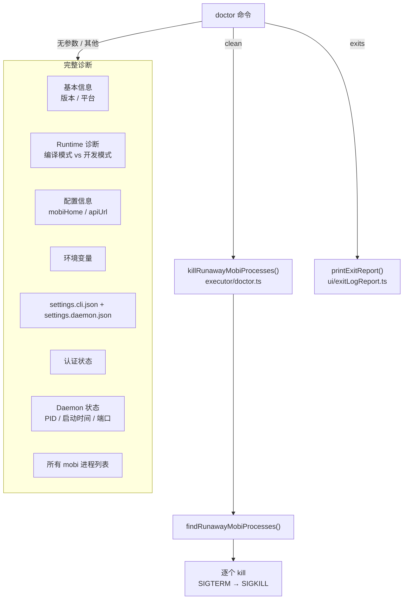
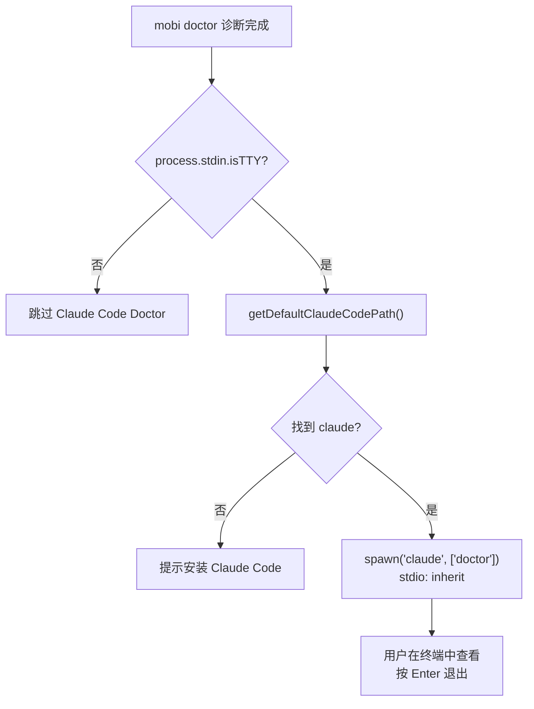
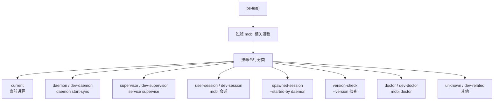
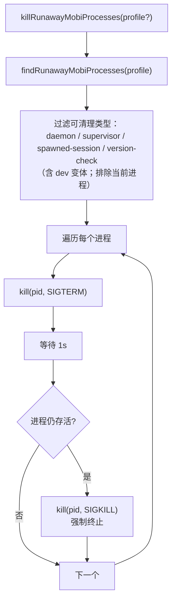

# Doctor 系统诊断

文件 [`packages/cli/src/commands/doctor.ts`](/packages/cli/src/commands/doctor.ts)

Doctor 提供 CLI 环境的诊断检查和进程清理功能，帮助排查问题。

## 架构


```mermaid
flowchart TB
    Cmd["doctor 命令"] -->|"clean"| Clean["killRunawayMobiProcesses()<br/>executor/doctor.ts"]
    Cmd -->|"exits"| Exits["printExitReport()<br/>ui/exitLogReport.ts"]
    Cmd -->|"无参数 / 其他"| Run["runDoctorCommand()<br/>ui/doctor.ts"]

    subgraph Run["完整诊断"]
        Basic["基本信息<br/>版本 / 平台"]
        Runtime["Runtime 诊断<br/>编译模式 vs 开发模式"]
        Config["配置信息<br/>mobiHome / apiUrl"]
        Env["环境变量"]
        Settings["settings.cli.json + settings.daemon.json"]
        Auth["认证状态"]
        Status["Daemon 状态<br/>PID / 启动时间 / 端口"]
        Processes["所有 mobi 进程列表"]
    end

    Clean --> FindRunaway["findRunawayMobiProcesses()"]
    FindRunaway --> Kill["逐个 kill<br/>SIGTERM → SIGKILL"]
```

### 命令路由

`commands/doctor.ts` 的路由逻辑：
- `commandArgs[0] === 'clean'` → 进程清理（可选 positional profile / 全局 `--profile`）
- `commandArgs[0] === 'exits'` → 打印进程退出记录（`--process daemon|cli` / `--limit N`）
- 其他已知子命令（历史 `daemon`/`runner` filter 已随 machine 概念收敛删除，601）→ 警告后忽略
- 无参数 → 完整诊断（默认）

## 子命令

| 子命令 | 说明 |
|--------|------|
| (无) | 运行完整诊断检查 |
| `clean` | 清理失控的 mobi 进程（可限定 profile） |
| `exits` | 打印进程退出记录（`exits.log`），支持 `--process daemon\|cli` / `--limit N` |

## 诊断报告内容

`mobi doctor` 默认输出完整诊断，包含以下区块：

| 区块 | 内容 |
|------|------|
| **Basic Information** | CLI 版本、平台、Node.js 版本 |
| **Runtime Diagnostics** | 编译模式（executable + runtime assets）或开发模式（project root + entrypoint） |
| **Configuration** | mobiHome 路径、daemon URL、日志目录 |
| **Environment Variables** | MOBI_HOME、MOBI_API_URL、CLI_API_TOKEN（脱敏）、DEBUG 等 |
| **CLI Settings** | `settings.cli.json` 内容（Token 脱敏为 `***`） |
| **Daemon Settings** | `settings.daemon.json` 内容（本机无此文件时提示 daemon 可能远程部署） |
| **Direct Connect Auth** | Token 来源和状态 |
| **Daemon Status** | `daemon.state.json` 运行状态、PID、启动时间、HTTP/宿主通道端口（读旧 `hubPort` 容错） |
| **All mobi CLI Processes** | 所有相关进程，按类型分组 |
| **Log Files** | 近期日志文件列表（daemon 桶含历史 `-hub.log` / `-runner.log` 文件名） |
| **Support & Bug Reports** | Issue 链接、文档链接 |

## Claude Code Doctor 集成

`process.stdin.isTTY` 为 `true` 时，mobi doctor 会在自身诊断完成后自动 spawn `claude doctor`：


```mermaid
flowchart TB
    MobiDone["mobi doctor 诊断完成"] --> TTY{"process.stdin.isTTY?"}
    TTY -->|否| Skip["跳过 Claude Code Doctor"]
    TTY -->|是| Find["getDefaultClaudeCodePath()"]
    Find --> Found{"找到 claude?"}
    Found -->|否| Warn["提示安装 Claude Code"]
    Found -->|是| Spawn["spawn('claude', ['doctor'])<br/>stdio: inherit"]
    Spawn --> Interactive["用户在终端中查看<br/>按 Enter 退出"]
```

**设计决策**：
- **TTY 检查**：`claude doctor` 是交互式命令（等待用户按 Enter），非 TTY 环境（管道、重定向）下跳过，避免进程挂起
- **stdio: inherit**：直接将 stdin/stdout/stderr 透传给 `claude doctor`，用户获得完整交互体验

## 进程发现与分类

**文件**: [`packages/daemon/src/executor/doctor.ts`](/packages/daemon/src/executor/doctor.ts)

通过 `ps-list` 枚举系统进程，识别 mobi 相关进程：


```mermaid
flowchart TB
    Start["ps-list()"] --> Filter["过滤 mobi 相关进程"]
    Filter --> Classify["按命令行分类"]

    Classify --> Current["current<br/>当前进程"]
    Classify --> Daemon["daemon / dev-daemon<br/>daemon start-sync"]
    Classify --> Supervisor["supervisor / dev-supervisor<br/>service supervise"]
    Classify --> Session["user-session / dev-session<br/>mobi 会话"]
    Classify --> Spawned["spawned-session<br/>--started-by daemon"]
    Classify --> Version["version-check<br/>--version 检查"]
    Classify --> Doctor["doctor / dev-doctor<br/>mobi doctor"]
    Classify --> Unknown["unknown / dev-related<br/>其他"]
```

识别规则（按优先级）：

| 类型 | 匹配规则 |
|------|----------|
| `current` | `pid === process.pid` |
| `version-check` | 命令包含 `--version` |
| `daemon` | 命令包含 `daemon start-sync` 或 `daemon start` |
| `supervisor` | 命令包含 `service supervise` |
| `spawned-session` | 命令包含 `--started-by daemon`（daemon executor spawn 会话子进程注入词） |
| `doctor` | 命令包含 `doctor` |
| `dev-session` | 命令包含 `--yolo` |
| `user-session` / `dev-related` | 其他（兜底） |
| `dev-*` | 上述类型的开发模式变体（命令包含 `src/index.ts`） |

> ⚠️ 分类规则尚未识别 `daemon start-sync` 进程形态（落 `user-session`，不在清理集合）——见 docs/pending.md #96。

mobi 进程识别条件：进程名包含 `Mobi`，或进程名为 `node` 且命令包含 `mobi`，或命令包含 `Mobi-coder`，或进程名/命令匹配 `mobi` 二进制，或开发模式（`src/index.ts`）。

## 进程清理（clean）

`mobi doctor clean [profile]` 清理失控的 mobi 进程：


```mermaid
flowchart TB
    Start["killRunawayMobiProcesses(profile?)"] --> Find["findRunawayMobiProcesses(profile)"]
    Find --> Filter["过滤可清理类型：<br/>daemon / supervisor / spawned-session / version-check<br/>（含 dev 变体；排除当前进程）"]
    Filter --> Loop["遍历每个进程"]
    Loop --> SigTerm["kill(pid, SIGTERM)"]
    SigTerm --> Wait["等待 1s"]
    Wait --> Alive{"进程仍存活?"}
    Alive -->|是| SigKill["kill(pid, SIGKILL)<br/>强制终止"]
    Alive -->|否| Next["下一个"]
    SigKill --> Next
    Next --> Loop
```

**可清理的进程类型**（`RUNNABLE_TYPES`）：`daemon`、`dev-daemon`、`supervisor`、`dev-supervisor`、`spawned-session`、`dev-spawned-session`、`version-check`、`dev-version-check`。历史类型（runner 形态、runner-version-check 等）随 machine 概念收敛从识别集合删除（601）。

- **profile 过滤**：传入 profile 时按进程 env 的 `MOBI_HOME`（`ps -E` 读 env）批量归属，并叠加该 profile 的 `daemon.state.json` pid 兜底
- **supervisor 必须可识别**：否则 E2E/dev 清理脚本绕过它强杀子进程后会残留「无子进程却永不退出」的幽灵

## 进程退出记录（exits）

`mobi doctor exits` 打印 `~/.mobi/logs/exits.log` 中的进程退出记录，用于排查 daemon/cli 无故退出。

**文件**: [`packages/cli/src/ui/exitLogReport.ts`](/packages/cli/src/ui/exitLogReport.ts)

### 退出日志机制

两个长生命周期进程（daemon / cli）启动时挂载 `@mobi/shared` 的 `installExitLogger`，捕获退出事件统一写入 `exits.log`：

| 事件 | reason | 写 exits.log | 写 dump |
|---|---|---|---|
| `uncaughtException` | `crash-uncaught` | ✓ | ✓ + heapsnapshot |
| `unhandledRejection` | `crash-unhandled` | ✓ | ✓ + heapsnapshot |
| `SIGINT` | `signal-int` | ✓ | ✗ |
| `SIGTERM` / `SIGBREAK` | `signal-term` | ✓ | ✗ |
| `exit` | `normal` / `error-exit` | ✓ | ✗ |

历史记录的 `processType`（`hub` / `runner`）读取侧归并到 `daemon` 桶展示。

### SIGKILL / OOM 兜底

进程被 SIGKILL / OOM killer / 段错误终止时，JS 运行时来不及执行任何代码，崩溃 handler 无法触发。为此 daemon 在**下次启动时**检测持久化 pid 标记（`daemon.state.json`），若上次 pid 已死则补记一条 `killed-externally` 记录。CLI 主进程无长驻标记，不做此兜底（但仍捕获 crash）。

### 文件布局

```
~/.mobi/logs/
  exits.log                              # JSONL，每次退出追加一行
  exits.log.1 ...                        # 超 5MB 滚动，保留最近 5 个
  dumps/
    <ts>-<processType>-pid-<pid>.json    # 结构化 dump（stack + 上下文 + 近 200 条 log）
    <ts>-<processType>-pid-<pid>.heapsnapshot
```

dump 仅保留非敏感 env（`MOBI_HOME` / `MOBI_PROFILE` / `MOBI_API_URL` / `NODE_ENV`），严禁记录任何 token / secret。

### 用法

```bash
mobi doctor exits                         # 最近 20 条
mobi doctor exits --process daemon        # 仅 daemon
mobi doctor exits --limit 50              # 最近 50 条
```

## 代码结构

```
packages/cli/src/
├── commands/
│   └── doctor.ts                # doctor 命令入口
├── ui/
│   ├── doctor.ts                # 诊断报告输出
│   └── exitLogReport.ts         # 进程退出记录报告（mobi doctor exits）
└── daemon（@mobi/daemon）
    └── src/executor/doctor.ts   # 进程发现、分类、清理
```

| 文件 | 入口 |
|------|------|
| `packages/cli/src/commands/doctor.ts` | [`doctorCommand`](/packages/cli/src/commands/doctor.ts) |
| `packages/cli/src/ui/doctor.ts` | [`runDoctorCommand()`](/packages/cli/src/ui/doctor.ts) |
| `packages/cli/src/ui/exitLogReport.ts` | [`printExitReport()`](/packages/cli/src/ui/exitLogReport.ts) |
| `packages/daemon/src/executor/doctor.ts` | [`findAllMobiProcesses()` / `killRunawayMobiProcesses()`](/packages/daemon/src/executor/doctor.ts) |
