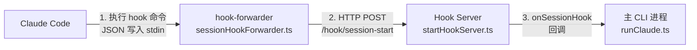
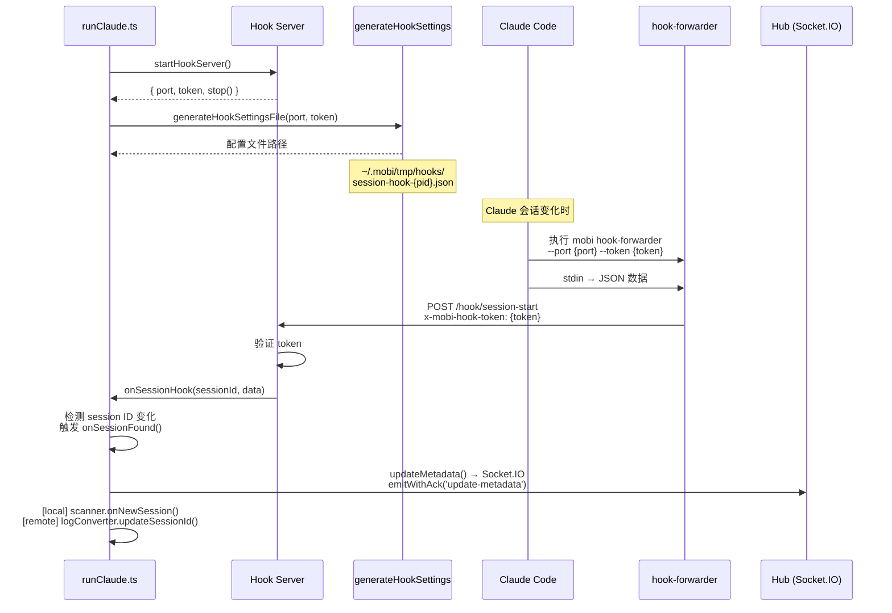
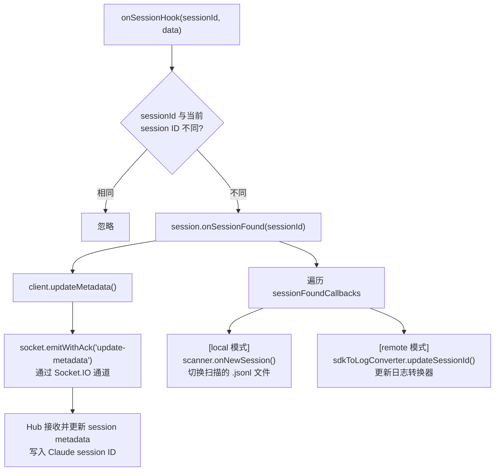
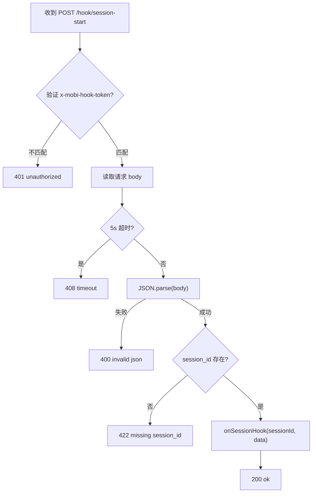
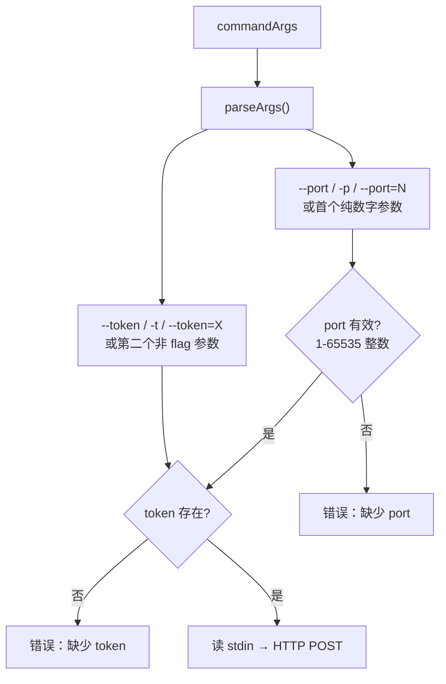

# Hook 系统 — SessionStart Hook 转发

文件 
- [`packages/cli/src/commands/hookForwarder.ts`](/packages/cli/src/commands/hookForwarder.ts)
- [`packages/cli/src/claude/utils/startHookServer.ts`](/packages/cli/src/claude/utils/startHookServer.ts)
- [`packages/cli/src/modules/common/hooks/generateHookSettings.ts`](/packages/cli/src/modules/common/hooks/generateHookSettings.ts)

Hook 系统将 Claude Code 的 SessionStart hook 通知转发给主 CLI 进程，用于感知 Claude 会话 ID 的变化（新建、恢复、压缩、分叉等）。由三个协作组件构成：Hook Server、Hook Settings、Hook Forwarder。

## 架构概览

Hook 转发由三个协作组件构成：



| 组件 | 文件 | 职责 |
|------|------|------|
| **Hook Server** | [`claude/utils/startHookServer.ts`](/packages/cli/src/claude/utils/startHookServer.ts) | 本地 HTTP 服务器，接收 `/hook/session-start` POST 请求 |
| **Hook Settings** | [`modules/common/hooks/generateHookSettings.ts`](/packages/cli/src/modules/common/hooks/generateHookSettings.ts) | 生成 Claude Code hooks 配置文件 |
| **Hook Forwarder** | [`claude/utils/sessionHookForwarder.ts`](/packages/cli/src/claude/utils/sessionHookForwarder.ts) | Claude Code 实际执行的 hook 命令，读 stdin → HTTP POST 转发 |

## 为什么需要 Forwarder？

Claude Code 的 `SessionStart` hook 仅支持 `type: 'command'`（执行命令），无法直接 HTTP 调用。Hook Forwarder 作为桥梁，将 Claude Code 的命令式 hook 转换为 HTTP 通知。

## 完整流程



### 启动阶段（runClaude.ts）

1. **启动 Hook Server**：`startHookServer()` 创建本地 HTTP 服务，绑定 `127.0.0.1:0`（随机端口），生成随机 token
2. **生成配置文件**：`generateHookSettingsFile()` 将 forwarder 命令写入 Claude Code hooks 配置
3. **传递配置**：配置文件路径通过 `--settings` 参数传给 Claude Code

### 运行阶段

1. Claude Code 每次 session 变化（新建/恢复/压缩/分叉）时，触发 SessionStart hook
2. 执行 `mobi hook-forwarder --port {port} --token {token}`，将 session 数据通过 stdin 传入
3. Forwarder 读取 stdin，通过 HTTP POST 转发到 Hook Server
4. Hook Server 验证 token 后，触发 `onSessionHook` 回调
5. 主进程检测 session ID 是否变化，触发 `onSessionFound()` 通知同步引擎

### 回调链路

`onSessionHook` 触发后，执行以下逻辑：



**核心作用**：

| 动作 | 通道 | 说明 |
|------|------|------|
| `updateMetadata()` | Socket.IO (`emitWithAck`) | 将 Claude session ID 写入 Hub 侧的 metadata，携带乐观锁版本号 `expectedVersion` |
| `scanner.onNewSession()` | 本地调用（local 模式） | Session Scanner 切换到新 session 的 `.jsonl` 文件，旧 session 移入 `pendingSessions` |
| `sdkToLogConverter.updateSessionId()` | 本地调用（remote 模式） | 更新日志转换器的 sessionId，用于后续日志格式化 |

### 清理阶段

`runClaude.ts` 的 `onAfterClose` 回调中：
- 关闭 Hook Server
- 删除临时配置文件（`cleanupHookSettingsFile`）

## Hook Server

**文件**: [`packages/cli/src/claude/utils/startHookServer.ts`](/packages/cli/src/claude/utils/startHookServer.ts)

### 请求处理



### SessionHookData 结构

```typescript
interface SessionHookData {
    session_id?: string;          // Claude 会话 ID（优先）
    sessionId?: string;           // 会话 ID（备选字段名）
    transcript_path?: string;     // 会话记录文件路径
    cwd?: string;                 // 工作目录
    hook_event_name?: string;     // hook 事件名称
    source?: string;              // 来源
    [key: string]: unknown;       // 其他字段
}
```

session ID 优先使用 `session_id`，备选 `sessionId`。

## Hook Forwarder 命令

**文件**: [`packages/cli/src/claude/utils/sessionHookForwarder.ts`](/packages/cli/src/claude/utils/sessionHookForwarder.ts)

### 参数解析



支持的参数格式：
- `--port 12345` / `-p 12345` / `--port=12345`
- `--token abc` / `-t abc` / `--token=abc`
- 位置参数：首个有效数字 → port，第二个 → token

### 转发逻辑

1. 从 `process.stdin` 异步读取全部数据
2. 通过 `node:http.request` 发送 POST 到 `127.0.0.1:{port}/hook/session-start`
3. 设置 `Content-Type: application/json` 和 `x-mobi-hook-token` header
4. 根据响应状态码判断成功/失败

错误信息输出到 stderr，前缀 `[hook-forwarder]`。

## Hook Settings 生成

**文件**: [`packages/cli/src/modules/common/hooks/generateHookSettings.ts`](/packages/cli/src/modules/common/hooks/generateHookSettings.ts)

### 配置文件结构

```json
{
  "hooksConfig": { "enabled": true },
  "hooks": {
    "SessionStart": [{
      "matcher": "*",
      "hooks": [{
        "type": "command",
        "command": "\"/path/to/mobi\" hook-forwarder --port 12345 --token abc123..."
      }]
    }]
  }
}
```

### 文件管理

| 函数 | 说明 |
|------|------|
| `generateHookSettingsFile(port, token, options)` | 生成配置文件到 `~/.mobi/tmp/hooks/{prefix}-{pid}.json` |
| `cleanupHookSettingsFile(filepath, logLabel)` | 删除临时配置文件 |

命令行通过 `getMobiCliCommand()` 获取当前 mobi 可执行文件路径（支持编译模式和开发模式），再通过 `shellQuote` 进行 shell 转义。

## 安全机制

| 机制 | 说明 |
|------|------|
| **Token 认证** | `randomBytes(16).toString('hex')`，每次启动随机生成，通过 `x-mobi-hook-token` header 验证 |
| **本地绑定** | `127.0.0.1`，外部不可访问 |
| **超时保护** | Hook Server 对请求设置 5s 超时，防止挂起 |
| **轻量进程** | `requiresRuntimeAssets: false`，不触发完整 CLI 启动流程 |

## 代码结构

```
packages/cli/src/
├── commands/
│   └── hookForwarder.ts                    # hook-forwarder 命令入口
├── claude/
│   ├── runClaude.ts                        # 启动 Hook Server + 生成配置 + 处理回调
│   └── utils/
│       ├── startHookServer.ts              # Hook Server HTTP 服务
│       └── sessionHookForwarder.ts         # Forwarder 逻辑：stdin → HTTP POST
└── modules/common/hooks/
    └── generateHookSettings.ts             # Claude Code hooks 配置文件生成
```

| 文件 | 入口 |
|------|------|
| `packages/cli/src/commands/hookForwarder.ts` | [`hookForwarderCommand`](/packages/cli/src/commands/hookForwarder.ts) |
| `packages/cli/src/claude/utils/startHookServer.ts` | [`startHookServer()`](/packages/cli/src/claude/utils/startHookServer.ts) |
| `packages/cli/src/claude/utils/sessionHookForwarder.ts` | [`runSessionHookForwarder()`](/packages/cli/src/claude/utils/sessionHookForwarder.ts) |
| `packages/cli/src/modules/common/hooks/generateHookSettings.ts` | [`generateHookSettingsFile()` / `cleanupHookSettingsFile()`](/packages/cli/src/modules/common/hooks/generateHookSettings.ts) |

## 临时文件

```
~/.mobi/tmp/hooks/
└── session-hook-{pid}.json     # Claude Code hooks 配置（进程退出时清理）
```
