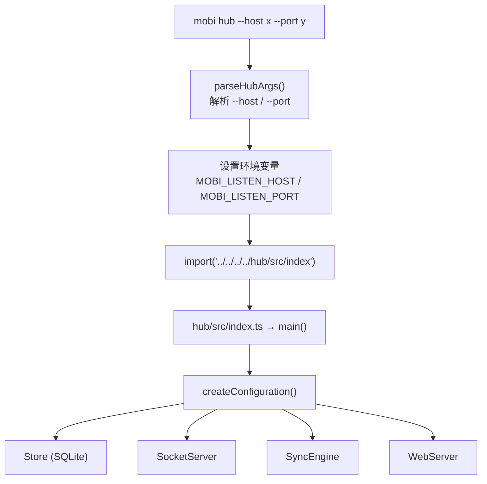
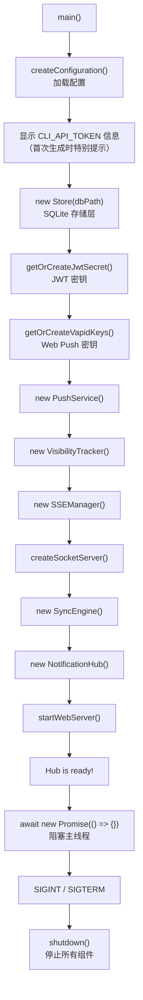
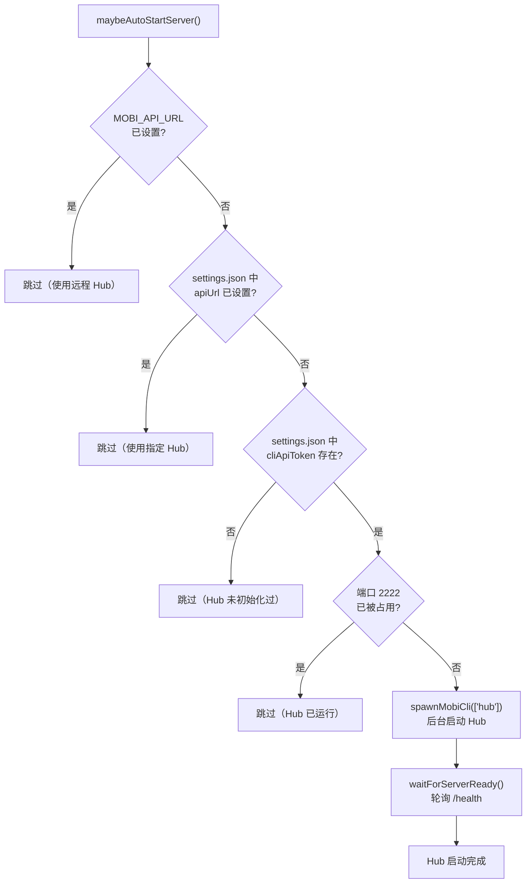

# Hub 命令 — 启动 Hub 服务器

文件 [`cli/src/commands/hub.ts`](/cli/src/commands/hub.ts)

`mobi hub` 命令是 Hub 模块的 CLI 入口，解析参数后通过 `import` 加载 Hub 模块启动服务器。

## 架构



## 参数

| 参数 | 格式 | 说明 |
|------|------|------|
| `--host` | `--host <addr>` / `--host=<addr>` | 设置 `MOBI_LISTEN_HOST` 环境变量 |
| `--port` | `--port <port>` / `--port=<port>` | 设置 `MOBI_LISTEN_PORT` 环境变量 |

## Hub 模块启动流程

Hub 模块（`hub/src/index.ts`）的 `main()` 函数按顺序初始化各组件：



| 组件 | 说明 |
|------|------|
| **Configuration** | 加载配置：env > settings.json > 默认值 |
| **Store** | SQLite（WAL 模式）数据存储 |
| **SocketServer** | Socket.IO 服务端，处理 CLI 连接 |
| **SyncEngine** | 同步引擎，管理会话状态和事件分发 |
| **SSEManager** | SSE 推送，向 Web 端实时推送更新 |
| **VisibilityTracker** | 追踪 Web 端页面可见性 |
| **NotificationHub** | 通知中心，管理推送通道 |
| **PushService** | Web Push 推送服务 |
| **WebServer** | HTTP + 静态资源服务 |

## 配置优先级

Hub 配置通过 `loadServerSettings()` 加载，优先级：

```
环境变量 > settings.json > 默认值
```

| 配置项 | 环境变量 | 默认值 |
|--------|----------|--------|
| 监听地址 | `MOBI_LISTEN_HOST` | `127.0.0.1` |
| 监听端口 | `MOBI_LISTEN_PORT` | `2222` |
| 公开 URL | `MOBI_PUBLIC_URL` | `http://localhost:{port}` |
| CORS 来源 | `CORS_ORIGINS` | 从 publicUrl 派生 |
| 数据目录 | `MOBI_HOME` | `~/.mobi` |
| 数据库路径 | `DB_PATH` | `{MOBI_HOME}/mobi.db` |
| CLI Token | `CLI_API_TOKEN` | 自动生成 |

环境变量的值会自动持久化到 `settings.json`（仅在文件中尚未设置时）。

## 自动启动

CLI 主命令（`mobi`）通过 `maybeAutoStartServer()` 自动启动 Hub：



自动启动条件（需同时满足）：
1. `MOBI_API_URL` 未设置（使用默认 localhost）
2. `settings.json` 中未指定 `apiUrl`
3. `settings.json` 中存在 `cliApiToken`（Hub 曾初始化过）
4. 默认端口 2222 未被占用

## 关闭

Hub 进程监听 `SIGINT`/`SIGTERM`，按顺序关闭组件：

```
NotificationHub.stop() → SyncEngine.stop() → SSEManager.stop() → WebServer.stop()
```

## 代码结构

```
cli/src/commands/
└── hub.ts                    # hub 命令入口
```

| 文件 | 入口 |
|------|------|
| `cli/src/commands/hub.ts` | [`hubCommand`](/cli/src/commands/hub.ts) |
| `cli/src/utils/autoStartServer.ts` | [`maybeAutoStartServer()`](/cli/src/utils/autoStartServer.ts) |
