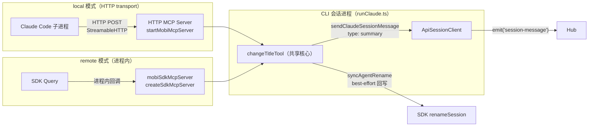
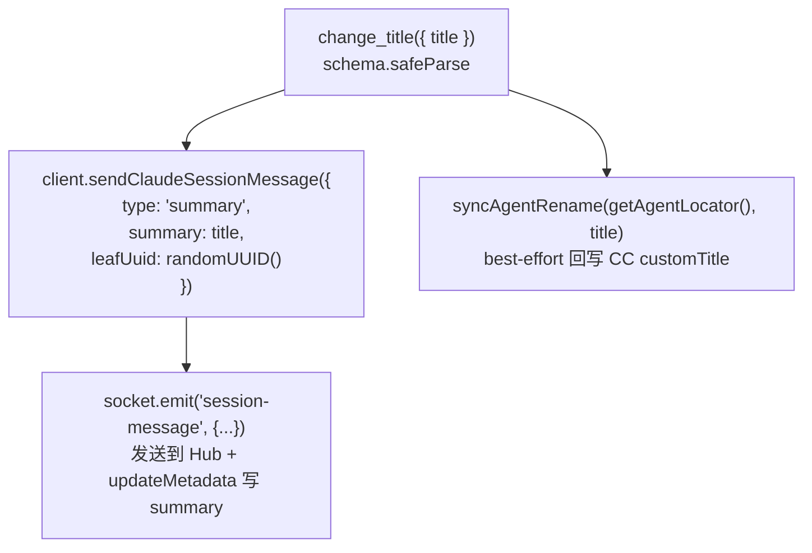
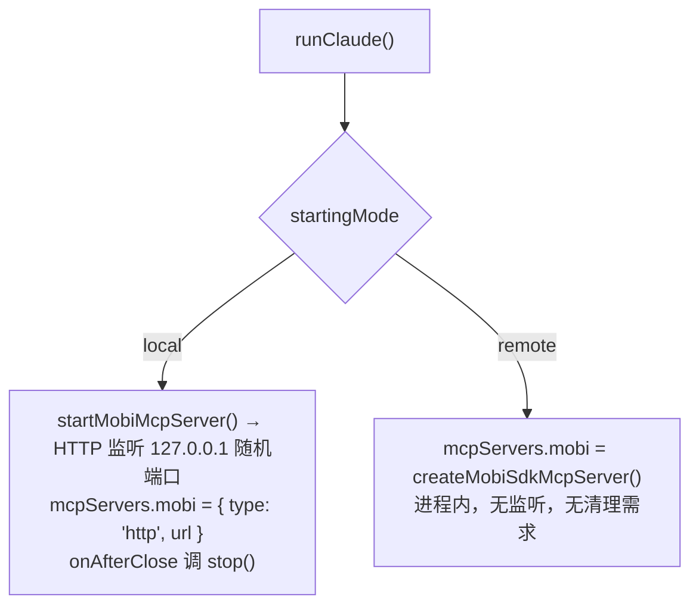

# MCP — change_title 工具（transport 按 local/remote 分流）

文件
- [`packages/cli/src/mcp/changeTitleTool.ts`](/packages/cli/src/mcp/changeTitleTool.ts)（核心：工具工厂，transport 无关）
- [`packages/cli/src/mcp/mobiSdkMcpServer.ts`](/packages/cli/src/mcp/mobiSdkMcpServer.ts)（remote：SDK 进程内 server 壳）
- [`packages/cli/src/claude/utils/startMobiMcpServer.ts`](/packages/cli/src/claude/utils/startMobiMcpServer.ts)（local：HTTP server 壳）
- [`packages/cli/src/mcp/sessionTransports.ts`](/packages/cli/src/mcp/sessionTransports.ts)（按模式装配）
- [`packages/cli/src/mcp/mobiMcpStdioBridge.ts`](/packages/cli/src/mcp/mobiMcpStdioBridge.ts)（未使用）

MCP 系统对外暴露 `change_title` 工具，让 Claude Code 能够修改当前会话标题。核心逻辑（工具定义 + handler）单点承载在 `changeTitleTool.ts`，transport 按控制方向分流——**local 模式（终端控制，claude 是独立子进程）走 HTTP server；remote 模式（Web 控制，SDK Query 在 mobi 进程内）走 SDK 进程内 server**，零端口零临时文件。决策记录见 [ADR 0001](/docs/adr/0001-transport-split-local-remote.md)。

## 架构

| 组件 | 文件 | 职责 |
|------|------|------|
| **共享核心** | [`mcp/changeTitleTool.ts`](/packages/cli/src/mcp/changeTitleTool.ts) | 工具工厂：schema 校验、发 hub summary、best-effort 回写 agent 标题；依赖注入便于单测与多 transport 复用 |
| **remote 壳** | [`mcp/mobiSdkMcpServer.ts`](/packages/cli/src/mcp/mobiSdkMcpServer.ts) | `createSdkMcpServer({ name: 'mobi' })` 包装共享核心 |
| **local 壳** | [`claude/utils/startMobiMcpServer.ts`](/packages/cli/src/claude/utils/startMobiMcpServer.ts) | stateless HTTP transport（每请求独立 StreamableHTTPServerTransport） |
| **装配** | [`mcp/sessionTransports.ts`](/packages/cli/src/mcp/sessionTransports.ts) | `buildSessionMcpServers()` 按 startingMode 选择壳；remote 的内联 hook settings 也在此 |
| ~~Stdio Bridge~~ | [`mcp/mobiMcpStdioBridge.ts`](/packages/cli/src/mcp/mobiMcpStdioBridge.ts) | 未使用。`mobi mcp` 命令将 stdio 转发到 HTTP，但当前架构中无实际场景 |

关键不变量：
- MCP server name: `mobi`（两种模式一致）
- 工具前缀: `mcp__mobi__change_title`（allowedTools 预授权零变更）

## change_title 核心

`sendClaudeSessionMessage` 对 `type: 'summary'` 的处理：
1. 通过 Socket.IO `emit('session-message')` 发送消息到 Hub
2. 自动调用 `updateMetadata()` 将标题写入 session metadata（`summary.text` + `summary.updatedAt`）

`syncAgentRename`（经 agent capability registry 按 flavor 分发）调 SDK `renameSession(claudeSessionId, title, { dir })` 把标题回写到 Claude Code 的 session 文件（`custom-title` entry），保持 CC 会话列表标题与 mobi 一致（LWW）。会话未就绪 / SDK 失败时静默吞错（best-effort），不影响 mobi 侧已完成的改名。与 Web UI 重命名走 `rename-session` RPC → `syncAgentRename` 复用同一函数。

## 装配与清理

在 `runClaude.ts` 中按 `startingMode` 分流（ADR 0001）：

测试入口：`packages/cli/tests/mcp/changeTitleTool.test.ts`（核心三路径 + 非法入参）、`packages/cli/tests/mcp/sessionTransports.test.ts`（装配形态断言）。

## 安全机制（local HTTP 壳）

| 机制 | 说明 |
|------|------|
| **本地绑定** | `127.0.0.1`，外部不可访问 |
| **随机端口** | 端口由 OS 分配，每次启动不同 |
| **敏感环境变量过滤** | `TerminalManager` 将 `MOBI_HTTP_MCP_URL` 列入敏感变量，不传递给子进程 |

remote 进程内 server 不经网络，无攻击面。
