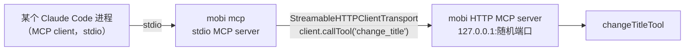

# mcp 命令 — MCP stdio bridge

**文件**: [`packages/cli/src/commands/mcp.ts`](/packages/cli/src/commands/mcp.ts) → [`packages/cli/src/mcp/mobiMcpStdioBridge.ts`](/packages/cli/src/mcp/mobiMcpStdioBridge.ts)

`mobi mcp` 启动一个只暴露 `change_title` 的 **stdio MCP server**，把工具调用转发给一个已经跑着的 mobi HTTP MCP server。

**当前无实际使用场景**。mobi 自己启动的会话走 SDK 进程内 server（remote）或进程内 HTTP 壳（local），都不经过这个 bridge；它保留给「外部进程想调 mobi 的 MCP 工具」这一类将来场景。

## 行为

| 项 | 值 |
|----|-----|
| 目标 URL | `--url <http://127.0.0.1:PORT>` > 环境变量 `MOBI_HTTP_MCP_URL`；都没有则以 exit code 2 退出 |
| 暴露的工具 | 仅 `change_title`（调用时 lazy 建立到 HTTP 的客户端连接，之后复用） |
| stdout | **一个字都不能写**——stdout 是 MCP 协议通道。所有诊断信息走 stderr |
| 运行时资源 | 不需要（`requiresRuntimeAssets: false`） |
| 转发结果 | 原样透传 HTTP 端返回的 `CallToolResult`；失败包成 `isError: true` 的文本结果 |

MCP 工具本身的架构（工具族划分、transport 分流、工具工厂模式）见 [MCP 模块文档](/docs/architecture/cli/mcp/README.md)。
