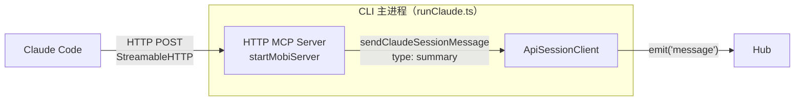
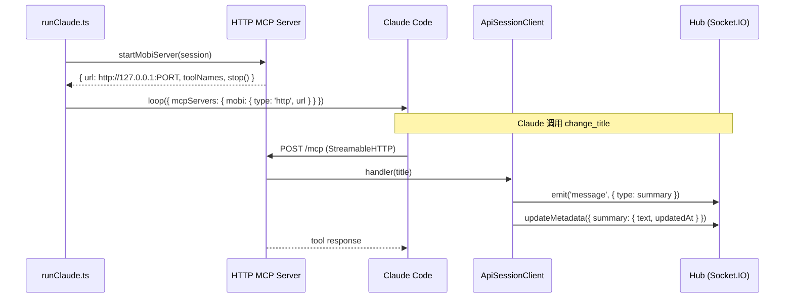
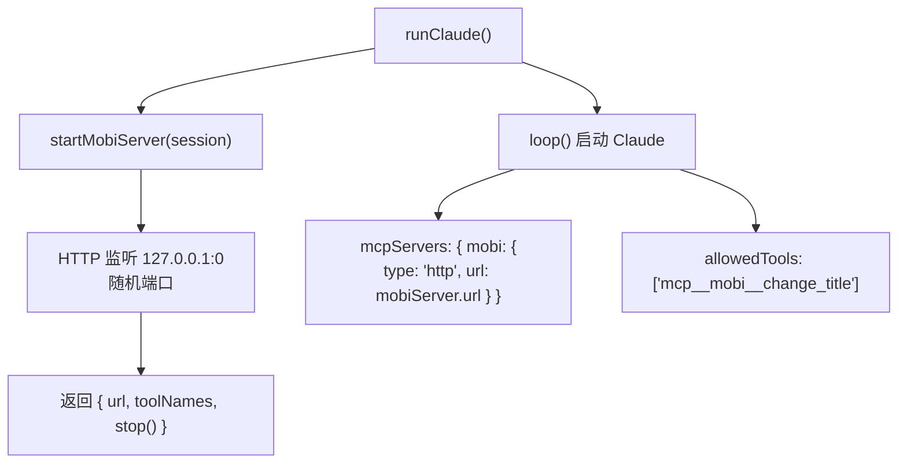
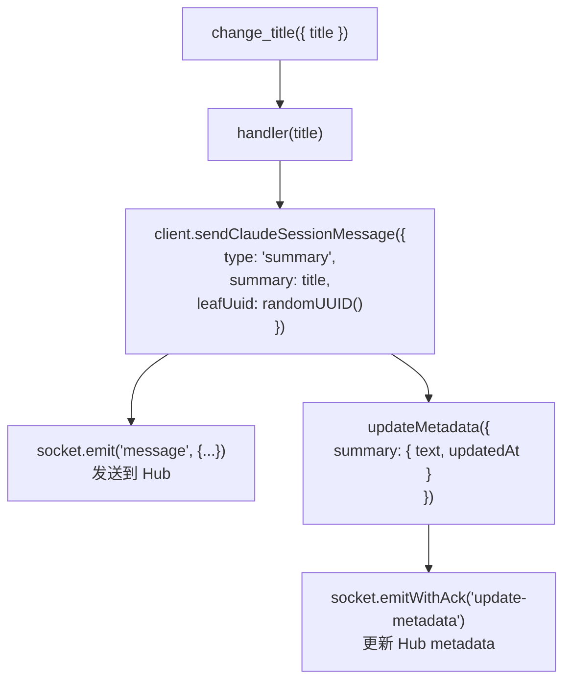

# MCP — HTTP Server

文件
- [`packages/cli/src/claude/utils/startMobiServer.ts`](/packages/cli/src/claude/utils/startMobiServer.ts)
- [`packages/cli/src/mcp/mobiMcpStdioBridge.ts`](/packages/cli/src/mcp/mobiMcpStdioBridge.ts)（未使用）

MCP 系统的核心是随 Claude 会话启动的 HTTP MCP Server，对外暴露 `change_title` 工具，让 Claude Code 能够修改当前会话标题。

## 架构



| 组件 | 文件 | 职责 |
|------|------|------|
| **HTTP MCP Server** | [`claude/utils/startMobiServer.ts`](/packages/cli/src/claude/utils/startMobiServer.ts) | 随 Claude 会话启动的本地 HTTP MCP 服务，注册 `change_title` 工具 |
| ~~Stdio Bridge~~ | [`mcp/mobiMcpStdioBridge.ts`](/packages/cli/src/mcp/mobiMcpStdioBridge.ts) | 未使用。`mobi mcp` 命令将 stdio 转发到 HTTP，但当前架构中无实际场景 |

## 完整流程



## 启动与注册

在 `runClaude.ts` 中启动，随 Claude 会话生命周期存在：



关键注册信息：
- MCP server name: `mobi`
- 工具前缀: `mcp__mobi__change_title`（Claude Code 自动拼接 `mcp__{server}__{tool}`）
- `sessionIdGenerator: undefined` — 不使用 session ID，避免 Claude SDK spawn 报错

## change_title 工具



`sendClaudeSessionMessage` 对 `type: 'summary'` 的处理：
1. 通过 Socket.IO `emit('message')` 发送消息到 Hub
2. 自动调用 `updateMetadata()` 将标题写入 session metadata（`summary.text` + `summary.updatedAt`）

## 清理

`runClaude.ts` 的 `onAfterClose` 回调中调用 `mobiServer.stop()`，关闭 MCP server 和 HTTP server。

## 安全机制

| 机制 | 说明 |
|------|------|
| **本地绑定** | `127.0.0.1`，外部不可访问 |
| **随机端口** | 端口由 OS 分配，每次启动不同 |
| **敏感环境变量过滤** | `TerminalManager` 将 `MOBI_HTTP_MCP_URL` 列入敏感变量，不传递给子进程 |

## 代码结构

```
packages/cli/src/
├── commands/
│   └── mcp.ts                             # mcp 命令入口（未使用）
├── mcp/
│   └── mobiMcpStdioBridge.ts              # Stdio Bridge（未使用）
└── claude/
    ├── runClaude.ts                        # 启动 MCP Server + 注册到 Claude Code
    └── utils/
        └── startMobiServer.ts             # HTTP MCP Server：注册工具 + 处理调用
```

| 文件 | 入口 |
|------|------|
| `packages/cli/src/claude/utils/startMobiServer.ts` | [`startMobiServer()`](/packages/cli/src/claude/utils/startMobiServer.ts) |
| `packages/cli/src/mcp/mobiMcpStdioBridge.ts` | [`runMobiMcpStdioBridge()`](/packages/cli/src/mcp/mobiMcpStdioBridge.ts)（未使用） |
