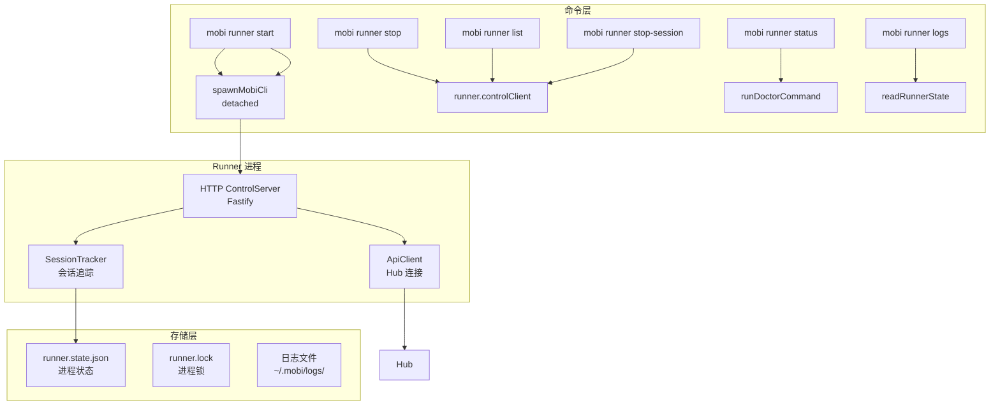
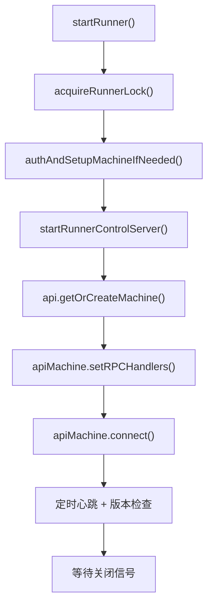
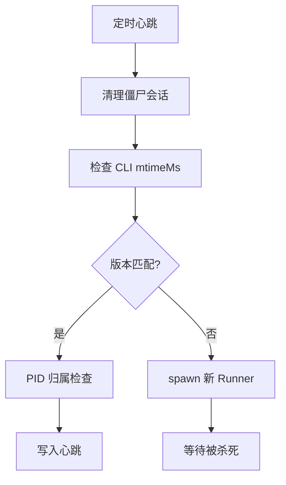
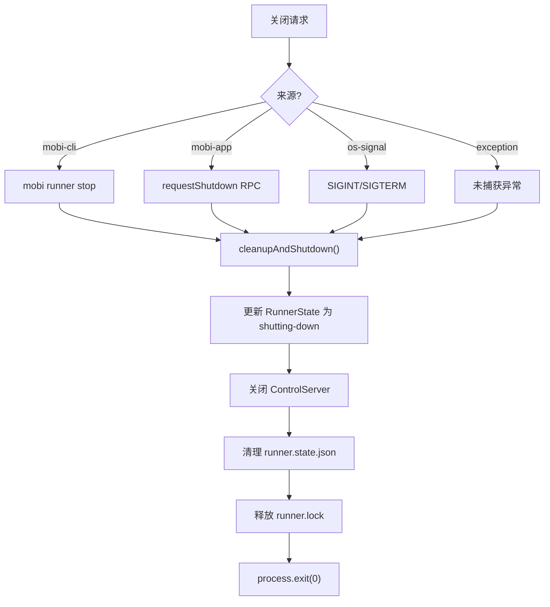

# Runner 命令

Runner 是 Mobi 的后台进程管理器，负责 Claude 会话的生命周期管理，允许用户离开终端后会话继续运行。

**入口文件**: [`cli/src/commands/runner.ts`](/cli/src/commands/runner.ts)

---

## 新人阅读指引

### 建议阅读顺序

```
第 1 步: 本文档（README.md）         ← 你在这里，建立全局认知
    │
第 2 步: start.md + start-sync.md   ← 理解 Runner 如何启动
    │
第 3 步: controlServer.md           ← 理解 Runner 对外暴露的 HTTP API
    │
第 4 步: spawn-session.md           ← 核心中的核心，会话创建全流程
    │
第 5 步: controlClient.md           ← CLI 命令如何与 Runner 通信
    │
第 6 步: 按需阅读
    ├── stop.md / stop-session.md   ← 停止相关
    ├── list.md / status.md / logs.md ← 运维相关
    └── doctor.md                   ← 进程诊断与清理
```

### 前置知识

阅读 Runner 文档前，建议先了解：

| 前置内容 | 位置 | 为什么需要 |
|----------|------|-----------|
| API 通信层 | [docs/architecture/cli/api/](../../api/) | Runner 通过 `ApiClient` / `ApiMachineClient` 与 Hub 通信 |
| Common RPC | [docs/architecture/cli/api/common-rpc/](../../api/common-rpc/) | 理解 RPC 注册模式，Runner 中的 `setRPCHandlers` 使用相同机制 |
| 项目整体架构 | [docs/architecture.md](../../../architecture.md) | 理解 CLI / Hub / Web 三端关系 |

### 术语表

| 术语 | 含义 |
|------|------|
| **Runner** | Mobi 的后台守护进程，管理 Claude 会话的生命周期 |
| **Hub** | Mobi 服务端，Runner 通过 Socket.IO 与之保持长连接 |
| **Session** | 一次 Claude Code 交互会话，由 Runner 创建的子进程运行 |
| **ControlServer** | Runner 内置的 HTTP 服务器（Fastify），监听 `127.0.0.1` 随机端口 |
| **controlClient** | CLI 侧的 HTTP 客户端，各命令通过它与 Runner 通信 |
| **Webhook** | 子会话启动后通过 `POST /session-started` 向 Runner 报告自己的存在 |
| **TrackedSession** | Runner 内部的会话追踪数据结构，以 PID 为 key |
| **Awaiter** | spawnSession 中的等待机制，子进程启动后等待 Webhook 确认 |
| **Worktree** | Git Worktree，为会话创建独立的工作目录和分支 |
| **mtimeMs** | 文件修改时间戳，用于检测 CLI 是否已更新（比版本号更可靠） |
| **僵尸会话** | 已退出但未被正常清理的会话，由心跳定时器兜底清理 |
| **失控进程** | Runner 或其子进程异常残留，由 doctor 命令发现和清理 |
| **runner.state.json** | Runner 进程状态文件，包含 PID、端口、版本等信息 |
| **runner.lock** | 文件锁，防止同时运行多个 Runner 实例 |

---

## 架构概览



## Runner 进程

Runner 是一个后台守护进程，核心职责：

1. **会话生命周期管理** - 启动、追踪、停止 Claude 会话
2. **版本自检与热更新** - 检测 CLI 升级后自动重启
3. **健康检查** - 定期心跳、清理僵尸会话

### 启动流程



### 通信机制

Runner 使用三种通信方式，分别服务不同场景：

| 方式 | 协议 | 方向 | 说明 |
|------|------|------|------|
| **[ControlServer](./controlServer.md)** | HTTP | CLI → Runner | 本地管理（list / stop / spawn 等） |
| **Socket.IO** | WebSocket | Runner ↔ Hub | 远程控制（RPC）+ 状态同步 |
| **Webhook** | HTTP | Session → Runner | 会话启动后自我报告 |

数据流示意：

```
Hub ←──Socket.IO──→ Runner ←──HTTP──→ CLI 命令
                       ↑
                       └── HTTP Webhook ← 子会话
```

### 会话追踪

Runner 追踪两种来源的会话：

| 来源 | startedBy 标识 | 说明 |
|------|----------------|------|
| Runner 启动 | `runner` | 通过 RPC 或 HTTP 请求远程启动 |
| 用户启动 | `mobi directly - likely by user from terminal` | 用户在终端直接运行 `mobi` |

## 子命令

| 子命令 | 说明 | 通信方式 |
|--------|------|----------|
| [`start`](./start.md) | 后台启动 Runner | 本地 spawn |
| [`start-sync`](./start-sync.md) | 同步启动（内部使用） | 直接调用 |
| [`stop`](./stop.md) | 停止 Runner | HTTP → Runner |
| [`status`](./status.md) | 查看状态 | doctor 命令 |
| [`list`](./list.md) | 列出活跃会话 | HTTP → Runner |
| [`stop-session`](./stop-session.md) | 停止指定会话 | HTTP → Runner |
| [`logs`](./logs.md) | 查看日志路径 | 本地文件读取 |

## 核心机制

| 机制 | 说明 |
|------|------|
| [**spawnSession**](./spawn-session.md) | 会话创建：目录准备 → Worktree → Spawn → Webhook 确认 |
| [**controlClient**](./controlClient.md) | CLI → Runner HTTP 客户端：状态检查、版本检测、进程管理 |
| [**doctor**](./doctor.md) | 进程诊断与清理：发现失控进程、两阶段终止 |

## 文件结构

```
cli/src/
├── commands/
│   └── runner.ts              # 命令入口，路由子命令
├── runner/
│   ├── run.ts                 # Runner 核心逻辑（833 行）
│   ├── controlServer.ts       # HTTP 控制服务器（Fastify）
│   ├── controlClient.ts       # HTTP 客户端（CLI → Runner）
│   ├── types.ts               # TrackedSession 类型定义
│   ├── worktree.ts            # Git Worktree 会话支持
│   └── doctor.ts              # 进程诊断与清理工具
├── persistence.ts             # runner.state.json 读写
└── ui/
    └── logger.ts              # 日志系统
```

## 持久化

| 文件 | 路径 | 说明 |
|------|------|------|
| runner.state.json | `~/.mobi/runner.state.json` | Runner 进程状态（PID、端口、版本） |
| runner.lock | `~/.mobi/runner.lock` | 进程锁，防止多实例 |
| 日志文件 | `~/.mobi/logs/*-runner.log` | Runner 运行日志 |

### runner.state.json 结构

```typescript
interface RunnerLocallyPersistedState {
  pid: number                      // Runner 进程 PID
  httpPort: number                 // ControlServer 端口
  startTime: string                // 启动时间
  startedWithCliVersion: string    // 启动时的 CLI 版本
  startedWithCliMtimeMs?: number   // CLI 文件修改时间（用于版本检测）
  lastHeartbeat?: string           // 最后心跳时间
  runnerLogPath?: string           // 日志文件路径
}
```

## 版本检测与热更新

Runner 定时执行健康检查（默认 60 秒）：

1. 清理僵尸会话 — `isProcessAlive(pid)` 检查，移除已退出但未被 `onChildExited` 清理的会话
2. 检测 CLI 是否更新 — 通过 mtimeMs 对比
3. PID 归属检查 — 确认 `runner.state.json` 中的 PID 仍是当前进程
4. 写入心跳 — 更新 `lastHeartbeat` 字段
5. 若版本过时，自动 spawn 新 Runner 并等待被杀死



## 环境变量

| 变量 | 默认值 | 说明 | 使用位置 |
|------|--------|------|----------|
| `MOBI_RUNNER_HEARTBEAT_INTERVAL` | `60000` (60s) | 心跳与健康检查间隔（毫秒） | `run.ts:712` |
| `MOBI_RUNNER_HTTP_TIMEOUT` | `10000` (10s) | controlClient HTTP 请求超时（毫秒） | `controlClient.ts:71` |

## 关闭流程



四种关闭来源详见 [start-sync 文档](./start-sync.md#shutdown-来源分类)。
