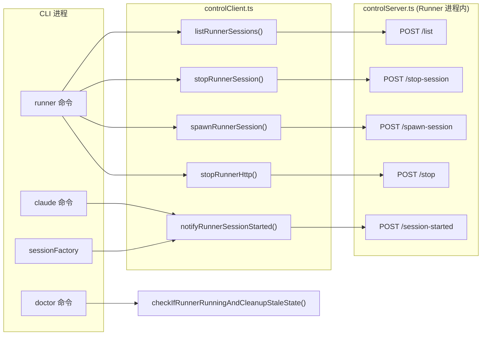
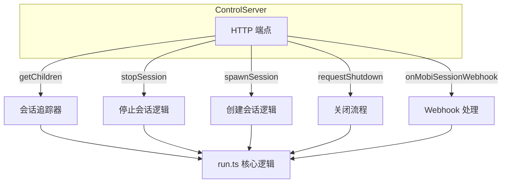
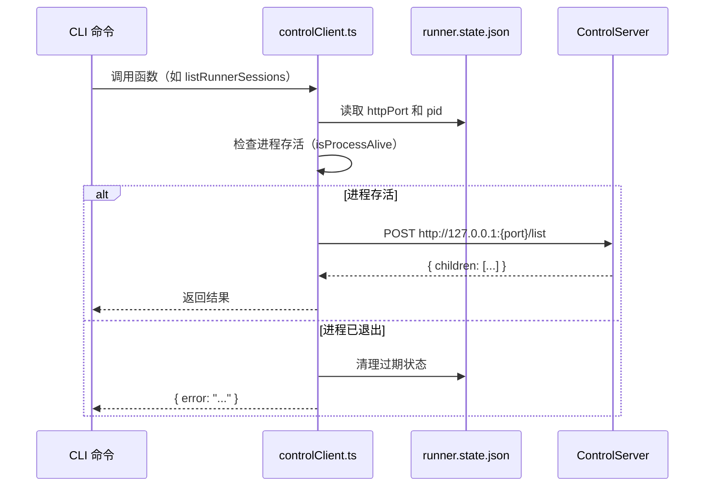

# ControlServer

Runner 内置的 HTTP 控制服务器，基于 Fastify 构建，提供本地管理接口。

**文件**: [`packages/cli/src/runner/controlServer.ts`](/packages/cli/src/runner/controlServer.ts)

## 为什么用 Fastify

| 需求 | 方案 |
|------|------|
| 纯 HTTP API，无 WebSocket | Fastify 专注于 HTTP，轻量高效 |
| 请求/响应类型安全 | `fastify-type-provider-zod` + Zod schema 编译 |
| 本地回环通信 | 不需要 Bun.serve 的静态文件/WebSocket 能力 |

> 对比：Hub 使用 `Bun.serve` + Hono 是因为需要 WebSocket（Socket.IO）和静态文件托管。

## 通信架构



所有通信走 `http://127.0.0.1:{port}`，端口在 Runner 启动时随机分配并写入 `runner.state.json`。

## 回调架构

`startRunnerControlServer()` 接收 5 个回调函数，由 `run.ts` 在 Runner 启动时注入：

```typescript
// packages/cli/src/runner/run.ts:600-607
const { port: controlPort, stop: stopControlServer } = await startRunnerControlServer({
  getChildren,      // () => TrackedSession[]    获取当前追踪的会话列表
  stopSession,      // (sessionId) => boolean     停止指定会话
  spawnSession,     // (options) => Promise<...>   创建新会话
  requestShutdown,  // () => void                 请求关闭 Runner
  onMobiSessionWebhook  // (sessionId, metadata) => void  会话启动回调
});
```



## API 端点

### POST /session-started

会话创建后自我报告，将 metadata 与会话关联。

| 字段 | 类型 | 说明 |
|------|------|------|
| **请求** | | |
| `sessionId` | `string` | 会话 ID |
| `metadata` | `Metadata` | 会话元数据 |
| **响应 200** | | |
| `status` | `"ok"` | 确认 |

**调用方**: `sessionFactory.ts` 通过 `notifyRunnerSessionStarted()` 调用

### POST /list

列出所有活跃会话。

| 字段 | 类型 | 说明 |
|------|------|------|
| **响应 200** | | |
| `children` | `Array<{startedBy, MobiSessionId, pid}>` | 会话列表 |

仅返回已关联 `MobiSessionId` 的会话。

**调用方**: `mobi runner list` 命令

### POST /stop-session

停止指定会话。

| 字段 | 类型 | 说明 |
|------|------|------|
| **请求** | | |
| `sessionId` | `string` | 要停止的会话 ID |
| **响应 200** | | |
| `success` | `boolean` | 是否成功 |

**调用方**: `mobi runner stop-session` 命令

### POST /spawn-session

创建新会话，支持目录创建审批流程。

| 字段 | 类型 | 说明 |
|------|------|------|
| **请求** | | |
| `directory` | `string` | 工作目录 |
| `sessionId` | `string?` | 指定会话 ID |
| `sessionType` | `"simple" \| "worktree"?` | 会话类型 |
| `worktreeName` | `string?` | Worktree 名称 |

**三种响应**:

| 状态码 | 场景 | 返回 |
|--------|------|------|
| `200` | 成功 | `{ success, sessionId, approvedNewDirectoryCreation }` |
| `409` | 需要用户审批目录创建 | `{ success: false, requiresUserApproval, actionRequired: "CREATE_DIRECTORY", directory }` |
| `500` | 错误 | `{ success: false, error }` |

**调用方**: `mobi runner list --spawn` 或 RPC 远程启动

### POST /stop

停止 Runner 进程。

| 字段 | 类型 | 说明 |
|------|------|------|
| **响应 200** | | |
| `status` | `string` | `"stopping"` |

收到请求后延迟 50ms 触发关闭，确保响应能送达。

**调用方**: `mobi runner stop` 命令

## 端口分配

```typescript
// 随机端口，仅监听本地回环
app.listen({ port: 0, host: '127.0.0.1' })
```

端口 `0` 让操作系统分配可用端口，启动后写入 `runner.state.json` 的 `httpPort` 字段，供 `controlClient.ts` 读取。

## 类型安全

使用 `fastify-type-provider-zod` 实现 Zod schema → TypeScript 类型编译：

```typescript
const typed = app.withTypeProvider<ZodTypeProvider>();

typed.post('/endpoint', {
  schema: {
    body: z.object({ ... }),      // 请求体验证
    response: { 200: z.object({ ... }) }  // 响应序列化
  }
}, async (request) => { ... });
```

每个端点的请求和响应都有 Zod schema 定义，编译时自动推导类型。

## 与 controlClient.ts 的关系

`controlClient.ts` 是 ControlServer 的客户端封装，CLI 各命令通过它间接调用 Runner：



## 代码入口

| 文件 | 说明 |
|------|------|
| [`controlServer.ts`](/packages/cli/src/runner/controlServer.ts) | 服务端定义 |
| [`controlClient.ts`](/packages/cli/src/runner/controlClient.ts) | 客户端封装 |
| [`run.ts:600-607`](/packages/cli/src/runner/run.ts) | 服务端初始化与回调注入 |
| [`types.ts`](/packages/cli/src/runner/types.ts) | `TrackedSession` 类型定义 |
| [`rpcTypes.ts`](/packages/cli/src/modules/common/rpcTypes.ts) | `SpawnSessionOptions` / `SpawnSessionResult` 类型 |
