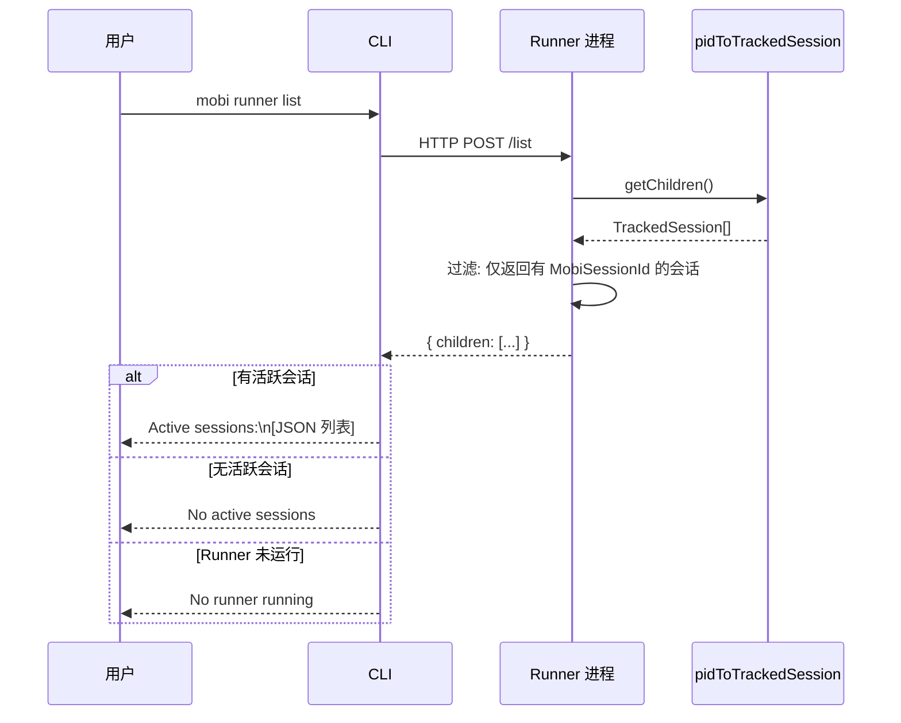

# list 子命令

列出 Runner 管理的所有活跃会话。

## 命令流程



## 响应结构

每个会话条目包含：

| 字段 | 类型 | 说明 |
|------|------|------|
| `startedBy` | `string` | 启动来源（`runner` 或 `mobi directly...`） |
| `MobiSessionId` | `string` | Mobi 会话 ID |
| `pid` | `number` | 进程 ID |

### 过滤规则

ControlServer 的 `/list` 端点仅返回已关联 `MobiSessionId` 的会话：

```typescript
children.filter(child => child.MobiSessionId !== undefined)
```

尚未收到 Webhook 的会话（刚 spawn 还在等待中）不会出现在列表中。

## 两种会话来源

| startedBy | 含义 | 出现场景 |
|-----------|------|----------|
| `runner` | Runner 主动创建 | Hub 通过 RPC 远程启动，或 CLI 通过 `/spawn-session` 启动 |
| `mobi directly - likely by user from terminal` | 用户直接启动 | 用户在终端运行 `mobi claude`，会话通过 `/session-started` webhook 注册到 Runner |

## 代码入口

- **命令入口**: [`cli/src/commands/runner.ts:37-51`](/cli/src/commands/runner.ts)
- **客户端调用**: [`cli/src/runner/controlClient.ts:108-111`](/cli/src/runner/controlClient.ts) — `listRunnerSessions()`
- **服务端端点**: [`cli/src/runner/controlServer.ts`](/cli/src/runner/controlServer.ts) — `POST /list`
