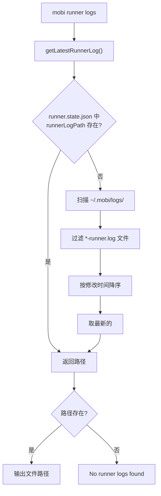

# logs 子命令

显示最新 Runner 日志文件的路径，用于调试排查问题。

## 命令流程



## 日志查找逻辑

两阶段查找：

| 优先级 | 方式 | 说明 |
|--------|------|------|
| 1 | `runner.state.json` → `runnerLogPath` | Runner 启动时写入的日志路径 |
| 2 | 扫描 `~/.mobi/logs/` 目录 | 兜底，适用于 Runner 已停止但日志仍在的场景 |

## 日志文件命名

```
~/.mobi/logs/YYYY-MM-DD-HH-mm-ss-pid-<PID>-runner.log
```

示例: `~/.mobi/logs/2026-03-30-22-13-45-pid-12345-runner.log`

命名中包含时间戳和 PID，方便区分不同 Runner 实例的日志。

## 使用示例

```bash
# 查看日志路径
mobi runner logs
# 输出: ~/.mobi/logs/2026-03-30-22-13-45-pid-12345-runner.log

# 直接查看日志内容
cat "$(mobi runner logs)"

# 实时跟踪日志
tail -f "$(mobi runner logs)"
```

## 代码入口

- **命令入口**: [`packages/cli/src/commands/runner.ts:111-119`](/packages/cli/src/commands/runner.ts)
- **日志查找**: [`packages/cli/src/ui/logger.ts`](/packages/cli/src/ui/logger.ts) — `getLatestRunnerLog()`
- **日志路径写入**: [`packages/cli/src/runner/run.ts:614-623`](/packages/cli/src/runner/run.ts) — `writeRunnerState({ runnerLogPath })`
