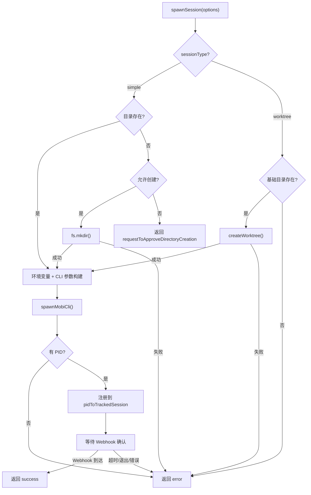
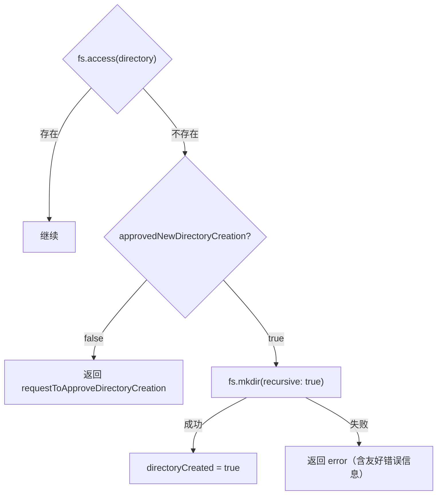
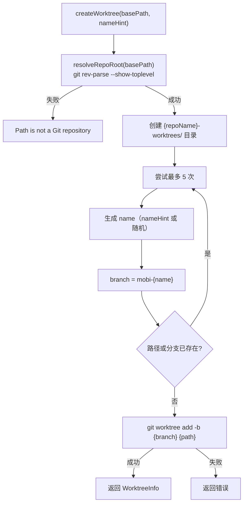
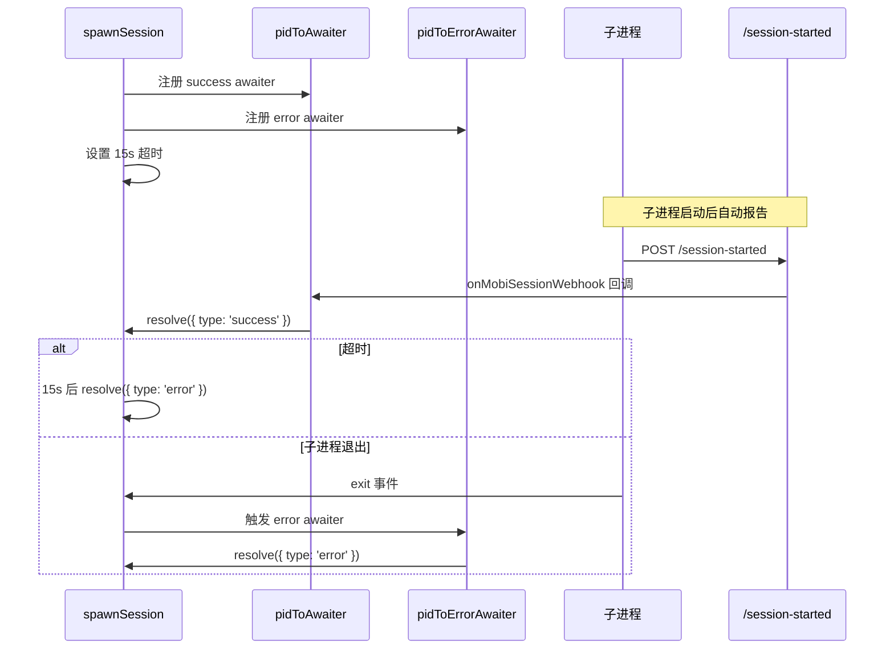
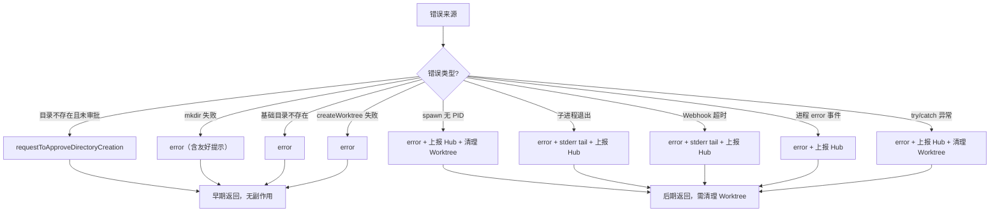

# spawnSession 实现

Runner 中最核心的函数，负责创建一个新的 Claude 会话进程并等待其就绪。

**文件**: [`cli/src/runner/run.ts:208-556`](/cli/src/runner/run.ts)

## 整体流程



## 输入输出

### SpawnSessionOptions

**文件**: [`cli/src/modules/common/rpcTypes.ts`](/cli/src/modules/common/rpcTypes.ts)

| 字段 | 类型 | 默认值 | 说明 |
|------|------|--------|------|
| `directory` | `string` | - | 工作目录（必填） |
| `sessionType` | `'simple' \| 'worktree'` | `'simple'` | 会话类型 |
| `worktreeName` | `string?` | - | Worktree 名称提示 |
| `agent` | `'claude'` | `'claude'` | Agent 类型（当前仅 Claude） |
| `model` | `string?` | - | 指定模型 |
| `yolo` | `boolean?` | `false` | 跳过权限确认 |
| `token` | `string?` | - | OAuth 认证 token |
| `machineId` | `string?` | - | 机器 ID |
| `sessionId` | `string?` | - | 会话 ID（保留字段） |
| `resumeSessionId` | `string?` | - | 恢复已有会话 |
| `approvedNewDirectoryCreation` | `boolean?` | `true` | 是否允许自动创建目录 |

### SpawnSessionResult

三种联合类型，对应三种结局：

| type | 说明 | 场景 |
|------|------|------|
| `success` | `{ sessionId }` | 会话成功创建并收到 Webhook 确认 |
| `requestToApproveDirectoryCreation` | `{ directory }` | 目录不存在且未获审批，需用户确认 |
| `error` | `{ errorMessage }` | 任何阶段的失败 |

## 阶段一：目录准备（Lines 222-276）

根据 `sessionType` 分两种路径：

### simple 模式



目录创建失败时提供针对性错误提示：

| 错误码 | 用户提示 |
|--------|----------|
| `EACCES` | 权限不足 |
| `ENOTDIR` | 路径冲突（已有同名文件） |
| `ENOSPC` | 磁盘空间不足 |
| `EROFS` | 只读文件系统 |

### worktree 模式

- 基础目录**必须**已存在（不会自动创建）
- 调用 [`createWorktree()`](#worktree-创建) 创建 Git Worktree
- 创建成功后 `spawnDirectory` 指向 worktree 路径

## 阶段二：Worktree 创建（Lines 278-321）

**文件**: [`cli/src/runner/worktree.ts`](/cli/src/runner/worktree.ts)

仅当 `sessionType === 'worktree'` 时执行。

### createWorktree 流程



### WorktreeInfo 结构

```typescript
interface WorktreeInfo {
  basePath: string    // Git 仓库根目录
  worktreePath: string  // Worktree 工作目录
  branch: string      // 分支名（mobi-{name}）
  name: string        // Worktree 名称
  createdAt: number   // 创建时间戳
}
```

### Worktree 清理

定义了两个清理函数，在 spawn 失败时调用：

| 函数 | 行为 |
|------|------|
| `cleanupWorktree()` | 无条件执行 `git worktree remove --force` |
| `maybeCleanupWorktree(reason)` | 检查子进程是否仍存活，**仅在进程已退出时**才清理 |

清理触发时机：
- spawn 无 PID → `maybeCleanupWorktree('no-pid')`
- spawn 结果为 error → `maybeCleanupWorktree('spawn-error')`
- 异常 → `maybeCleanupWorktree('exception')`

## 阶段三：环境变量构建（Lines 326-343）

### 认证 Token

```typescript
if (options.token) {
  extraEnv.CLAUDE_CODE_OAUTH_TOKEN = options.token;
}
```

### Worktree 环境变量

若创建了 worktree，注入以下环境变量供子会话使用：

| 环境变量 | 来源 | 说明 |
|----------|------|------|
| `MOBI_WORKTREE_BASE_PATH` | `worktreeInfo.basePath` | 仓库根目录 |
| `MOBI_WORKTREE_BRANCH` | `worktreeInfo.branch` | 分支名 |
| `MOBI_WORKTREE_NAME` | `worktreeInfo.name` | Worktree 名称 |
| `MOBI_WORKTREE_PATH` | `worktreeInfo.worktreePath` | 工作目录 |
| `MOBI_WORKTREE_CREATED_AT` | `worktreeInfo.createdAt` | 创建时间戳 |

## 阶段四：CLI 参数构建（Lines 345-357）

```typescript
const args = ['claude'];                              // mobi claude 子命令
if (options.resumeSessionId) {
  args.push('--resume', options.resumeSessionId);     // 恢复已有会话
}
args.push('--mobi-starting-mode', 'remote');           // 远程模式
args.push('--started-by', 'runner');                   // 标记为 Runner 启动
if (options.model) {
  args.push('--model', options.model);                 // 指定模型
}
if (yolo) {
  args.push('--yolo');                                 // 跳过权限确认
}
```

> **注意**: `'claude'` 是 mobi CLI 的子命令名（flavor），通过 `spawnMobiCli` 路由到 claude 命令处理器，最终由 `getDefaultClaudeCodePath()` 定位实际的 Claude 可执行文件。

## 阶段五：进程 Spawn（Lines 378-418）

```typescript
MobiProcess = spawnMobiCli(args, {
  cwd: spawnDirectory,         // simple: directory | worktree: worktreePath
  detached: true,              // 父进程退出后子进程继续运行
  stdio: ['ignore', 'pipe', 'pipe'],  // 捕获 stdout/stderr
  env: { ...process.env, ...extraEnv }
});
```

### stderr 滑动窗口

维护一个 4000 字符的 stderr 滑动窗口，用于错误诊断：

```typescript
const MAX_TAIL_CHARS = 4000;
let stderrTail = '';
// stderr 数据追加，超长则截断保留尾部
MobiProcess.stderr?.on('data', (data) => {
  stderrTail = appendTail(stderrTail, data);
});
```

### PID 检查

```typescript
if (!MobiProcess.pid) {
  // 使用 setImmediate 等待异步 error 事件
  await new Promise((resolve) => setImmediate(resolve));
  // 读取可能已触发的 spawnErrorBeforePidCheck
  // ...
  return { type: 'error', errorMessage: ... };
}
```

- spawn 后立即检查 PID，若无 PID 说明 spawn 失败
- `setImmediate` 确保异步 `error` 事件有机会触发
- 失败时通过 `reportSpawnOutcomeToHub` 上报 Hub

## 阶段六：会话追踪（Lines 453-488）

### 注册 TrackedSession

```typescript
const trackedSession: TrackedSession = {
  startedBy: 'runner',
  pid,
  childProcess: MobiProcess,
  directoryCreated,                    // 是否创建了新目录
  message: directoryCreated ? `...` : undefined  // 给用户的提示
};
pidToTrackedSession.set(pid, trackedSession);
```

### 进程事件监听

| 事件 | 行为 |
|------|------|
| **exit** | 记录 exitCode/signal，若非正常退出则打印 stderr；通知 errorAwaiter |
| **error** | 记录错误，通知 errorAwaiter |

两个事件处理器都会调用 `onChildExited(pid)` 清理追踪数据。

## 阶段七：Webhook 确认（Lines 490-540）

这是整个 `spawnSession` 最关键的等待机制。

### Awaiter 系统



### 三种完成路径

| 路径 | 触发条件 | 结果 |
|------|----------|------|
| **Webhook 成功** | 子进程通过 `/session-started` 报告 | `{ type: 'success', sessionId }` |
| **子进程退出** | exit 事件触发 | `{ type: 'error', errorMessage }` 含 exit code |
| **超时** | 15 秒无 Webhook | `{ type: 'error', errorMessage }` 含 stderr tail |

### Webhook 回调链


`onMobiSessionWebhook`（定义在 `run.ts:165`）的逻辑：
1. 从 metadata 中提取 `hostPid`
2. 查找 `pidToTrackedSession` 中对应的 session
3. 若 session 存在且 `startedBy === 'runner'`，更新其 `MobiSessionId` 和 metadata
4. 触发 `pidToAwaiter` 中对应的 awaiter，完成 spawnSession 的 Promise

### 错误信息构建

`buildWebhookFailureMessage` 根据失败原因生成详细错误信息：

| 原因 | 消息模板 |
|------|----------|
| `exit-before-webhook` | `Session process exited before webhook for PID {pid}` |
| `process-error-before-webhook` | `Session process error before webhook for PID {pid}` |
| `timeout` | `Session webhook timeout for PID {pid}` |

附加信息：
- exit code 或 signal（如 `(exit code 1)`）
- stderr 最后 800 字符（压缩空白后）

## 结果上报

spawn 完成后通过 `reportSpawnOutcomeToHub` 向 Hub 上报结果：

```typescript
// 成功
reportSpawnOutcomeToHub?.({ type: 'success' });

// 失败
reportSpawnOutcomeToHub?.({
  type: 'error',
  details: { message, pid, exitCode, signal }
});
```

Hub 端会更新 `RunnerState.lastSpawnError`，用于 Web 端展示错误信息。

## 错误处理全景



## 调用方

`spawnSession` 通过两个入口被调用：

| 调用方 | 方式 | 说明 |
|--------|------|------|
| **HTTP POST /spawn-session** | ControlServer 端点 | CLI 命令 `mobi runner list --spawn` 触发 |
| **RPC spawnSession** | Socket.IO | Hub 远程下发创建会话请求 |

## 代码入口

| 文件 | 说明 |
|------|------|
| [`run.ts:208-556`](/cli/src/runner/run.ts) | `spawnSession` 实现 |
| [`rpcTypes.ts`](/cli/src/modules/common/rpcTypes.ts) | `SpawnSessionOptions` / `SpawnSessionResult` 类型 |
| [`types.ts`](/cli/src/runner/types.ts) | `TrackedSession` 类型 |
| [`worktree.ts`](/cli/src/runner/worktree.ts) | `createWorktree` / `removeWorktree` |
| [`spawnMobiCli.ts`](/cli/src/utils/spawnMobiCli.ts) | 子进程 spawn 工具 |
| [`controlServer.ts`](/cli/src/runner/controlServer.ts) | `/spawn-session` 端点 |
