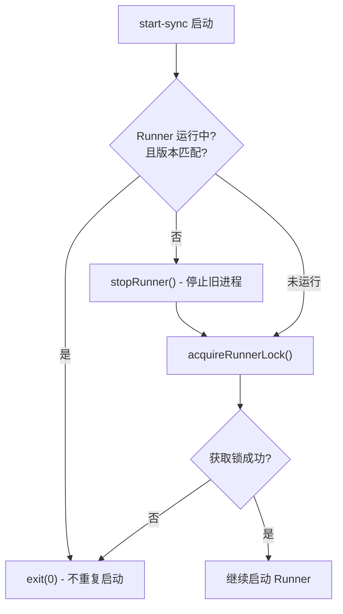
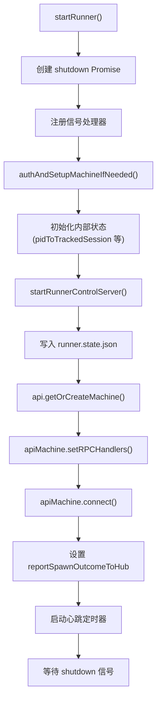
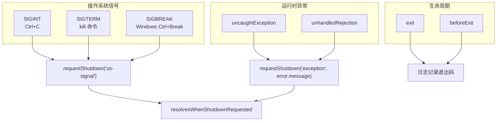
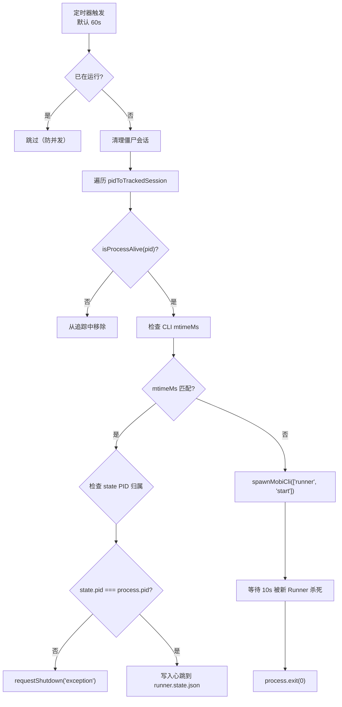
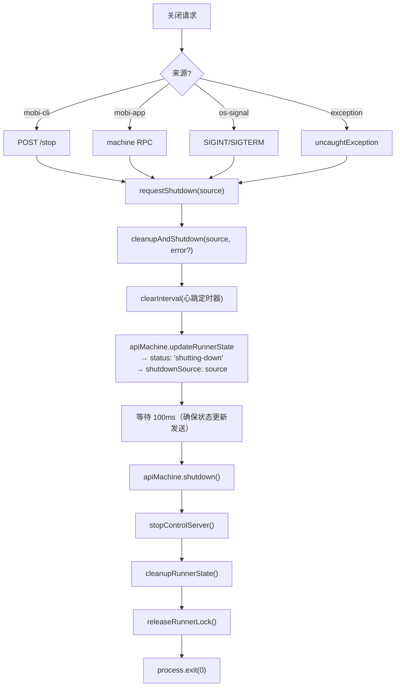

# start-sync 子命令

Runner 通过同步方式启动，作为前台进程运行，仅用于内部调用或不暴露给用户。

- **入口**: `cli/src/commands/runner.ts:95-98`
- **核心逻辑**: `cli/src/runner/run.ts:40-833`
- **用途**: 同步启动 Runner，供 `mobi runner start` 内部调用

## 防重复启动机制

`start-sync` 启动时会检查是否已有 Runner 运行，避免重复启动：



### 1. 版本检查

**文件**: `cli/src/runner/run.ts:115-123`

检查是否已有 Runner 运行，且版本与当前 CLI 匹配：

```typescript
const runningRunnerVersionMatches = await isRunnerRunningCurrentlyInstalledMobiVersion();
if (!runningRunnerVersionMatches) {
    // 版本不匹配 → 停止旧 runner，继续启动新的
    await stopRunner();
} else {
    // 版本匹配 → 已有 runner 运行中，直接退出
    console.log('Runner already running with matching version');
    process.exit(0);
}
```

### 2. 文件锁

**文件**: `cli/src/runner/run.ts:126-130`

确保同一时间只有一个 Runner 进程：

```typescript
const runnerLockHandle = await acquireRunnerLock(5, 200);
if (!runnerLockHandle) {
    logger.debug('[RUNNER RUN] Runner lock file already held, another runner is running');
    process.exit(0);
}
```

## 启动流程



## 信号处理

**文件**: `cli/src/runner/run.ts:70-108`

Runner 注册了完整的信号和异常处理器，所有处理器最终触发同一个 `requestShutdown` 函数：



| 信号/事件 | 来源 | shutdown source | 说明 |
|-----------|------|----------------|------|
| `SIGINT` | 终端 Ctrl+C | `os-signal` | 用户在终端中断 |
| `SIGTERM` | `kill <pid>` | `os-signal` | 外部终止请求 |
| `SIGBREAK` | Windows Ctrl+Break | `os-signal` | 仅 Windows 注册 |
| `uncaughtException` | 代码异常 | `exception` | 带错误消息 |
| `unhandledRejection` | 未捕获的 Promise 拒绝 | `exception` | 转换为 Error 对象 |
| `exit` | 进程退出 | — | 仅记录日志 |
| `beforeExit` | 事件循环清空 | — | 仅记录日志 |

**安全机制**: `requestShutdown` 内置 1 秒超时兜底，若 `cleanupAndShutdown` 未完成，强制 `process.exit(1)`：

```typescript
requestShutdown = (source, errorMessage) => {
  // 兜底：1 秒后强制退出（防止清理挂死）
  setTimeout(async () => {
    process.exit(1);
  }, 1_000);

  // 正常流程：触发优雅关闭
  resolve({ source, errorMessage });
};
```

## Shutdown 来源分类

**文件**: `cli/src/runner/run.ts:50-51`

四种关闭来源，贯穿整个关闭流程：

```typescript
type ShutdownSource = 'mobi-app' | 'mobi-cli' | 'os-signal' | 'exception'
```

| 来源 | 触发方式 | 典型场景 |
|------|----------|----------|
| `mobi-app` | `apiMachine.setRPCHandlers` 中的 `requestShutdown` | Hub 通过 RPC 远程停止 Runner |
| `mobi-cli` | ControlServer `POST /stop` 端点 | `mobi runner stop` 命令 |
| `os-signal` | SIGINT/SIGTERM/SIGBREAK 信号处理器 | 终端 Ctrl+C 或 kill 命令 |
| `exception` | `uncaughtException`/`unhandledRejection` | Runner 内部致命错误 |

**来源传递链**:

```
mobi-app:  Hub RPC → apiMachine → requestShutdown('mobi-app')
mobi-cli:  CLI 命令 → HTTP POST /stop → ControlServer → requestShutdown('mobi-cli')
os-signal: 操作系统 → signal handler → requestShutdown('os-signal')
exception: 运行时异常 → process.on('uncaughtException') → requestShutdown('exception', msg)
```

来源信息最终写入 Hub 侧的 `RunnerState.shutdownSource` 字段，用于诊断关闭原因。

## 内部状态

**文件**: `cli/src/runner/run.ts:142-159`

Runner 核心运行时状态，全部在 `startRunner` 函数作用域内：

```typescript
// 会话追踪: PID → TrackedSession
const pidToTrackedSession = new Map<number, TrackedSession>()

// Webhook 等待器: PID → 成功回调
const pidToAwaiter = new Map<number, (session: TrackedSession) => void>()

// Webhook 错误等待器: PID → 失败回调
const pidToErrorAwaiter = new Map<number, (errorMessage: string) => void>()

// Spawn 结果上报函数（延迟初始化，连接 Hub 后才设置）
let reportSpawnOutcomeToHub: ((outcome) => void) | null = null
```

**Awaiter 系统工作流**:

```
spawnSession() 启动子进程
    │
    ├── 注册 pidToAwaiter[pid] = successCallback
    ├── 注册 pidToErrorAwaiter[pid] = errorCallback
    │
    ├── 等待 15s 超时
    │
    ├── 路径 1: Webhook 到达
    │   └── onMobiSessionWebhook → awaiter(session) → success
    │
    ├── 路径 2: 子进程退出
    │   └── on('exit') → errorAwaiter(message) → error
    │
    └── 路径 3: 超时
        └── clearTimeout + errorAwaiter → error
```

## RPC Handlers 注册

Runner 的 `ApiMachineClient` 注册了三层 RPC，供 Hub 远程调用：

### 第一层：通用 RPC（构造函数）

**文件**: `cli/src/api/apiMachine.ts:96`

```typescript
registerCommonHandlers(this.rpcHandlerManager, process.cwd())
```

在 `ApiMachineClient` 构造时自动注册 9 个通用 handler（与 Session 侧共享）：

| RPC 方法 | 说明 | workingDirectory |
|----------|------|-----------------|
| `bash` | Shell 命令执行 | `process.cwd()` |
| `readFile` | 文件读取（Base64） | `process.cwd()` |
| `writeFile` | 文件写入（Base64 + Hash） | `process.cwd()` |
| `listDirectory` | 目录平铺列表 | `process.cwd()` |
| `getDirectoryTree` | 递归目录树 | `process.cwd()` |
| `git-status` / `git-diff-*` | Git 操作 | `process.cwd()` |
| `ripgrep` | 代码搜索 | `process.cwd()` |
| `difftastic` | 结构化 Diff | `process.cwd()` |
| `listSlashCommands` | 命令发现 | `process.cwd()` |
| `listSkills` | Skill 发现 | `process.cwd()` |
| `uploadFile` / `deleteUpload` | 文件上传 | 独立 blobs 目录 |

> 详见 [Common RPC 文档](../../api/common-rpc/README.md)

**与 Session 侧的区别**: Session 侧的 `workingDirectory` 是会话的工作目录，而 Machine 侧使用 `process.cwd()`（Runner 启动目录）。

### 第二层：Machine 独有 RPC（构造函数）

**文件**: `cli/src/api/apiMachine.ts:98-115`

```typescript
this.rpcHandlerManager.registerHandler('path-exists', async (params) => {
  // 批量检查路径是否存在且为目录
  return { exists: Record<string, boolean> }
})
```

| RPC 方法 | 说明 |
|----------|------|
| `path-exists` | 批量检查路径是否存在（Hub 用于验证工作目录） |

### 第三层：Machine 生命周期 RPC（setRPCHandlers）

**文件**: `cli/src/runner/run.ts:660-664`

Runner 连接 Hub 后，通过 `apiMachine.setRPCHandlers` 注册 3 个管理 RPC：

```typescript
apiMachine.setRPCHandlers({
  spawnSession,                                         // 远程创建会话
  stopSession,                                          // 远程停止会话
  requestShutdown: () => requestShutdown('mobi-app')    // 远程关闭 Runner
});
```

| RPC 方法 | 对应函数 | 说明 |
|----------|----------|------|
| `spawn-mobi-session` | `spawnSession(options)` | Hub 请求 Runner 创建新会话 |
| `stop-session` | `stopSession(sessionId)` | Hub 请求 Runner 停止指定会话 |
| `stop-runner` | `requestShutdown('mobi-app')` | Hub 请求 Runner 关闭 |

### RPC 注册时序

```
构造 ApiMachineClient
    │
    ├── registerCommonHandlers(rpcManager, process.cwd())     ← 第一层：通用 RPC
    ├── registerHandler('path-exists', ...)                   ← 第二层：Machine 独有
    │
    │  ...连接 Hub 后...
    │
    └── setRPCHandlers({ spawnSession, stopSession, ... })    ← 第三层：生命周期
```

所有 RPC 方法通过 Socket.IO `rpc-request` 事件由 Hub 远程调用。

## reportSpawnOutcomeToHub

**文件**: `cli/src/runner/run.ts:669-705`

Spawn 结果上报机制，通过 `apiMachine.updateRunnerState` 将 spawn 结果同步到 Hub：

```typescript
reportSpawnOutcomeToHub = (outcome) => {
  void apiMachine.updateRunnerState((state) => {
    const baseState = { ...state } || defaultState

    if (outcome.type === 'success') {
      return { ...baseState, lastSpawnError: null }
    }

    return {
      ...baseState,
      lastSpawnError: {
        message: outcome.details.message,
        pid: outcome.details.pid,
        exitCode: outcome.details.exitCode ?? null,
        signal: outcome.details.signal ?? null,
        at: Date.now()
      }
    }
  })
}
```

**上报时机**:
- Spawn 成功 → 清除 `lastSpawnError`
- Spawn 失败（无 PID/进程退出/超时/异常） → 写入 `lastSpawnError` 详情

**lastSpawnError 结构**:

```typescript
{
  message: string     // 错误描述（含 stderr tail）
  pid?: number        // 子进程 PID
  exitCode?: number   // 退出码
  signal?: string     // 终止信号
  at: number          // 时间戳
}
```

## 心跳与健康检查

**文件**: `cli/src/runner/run.ts:707-791`

定时心跳循环，负责会话清理、版本自检和状态写入：



### 僵尸会话清理

```
心跳触发
    │
    └── 遍历 pidToTrackedSession
         └── isProcessAlive(pid)?
              ├── 否 → pidToTrackedSession.delete(pid)
              │         （会话进程已退出，但未通过 onChildExited 清理）
              └── 是 → 保留
```

**与 onChildExited 的区别**:
- `onChildExited`: 子进程触发 `exit` 事件时主动清理
- 心跳清理: 兜底机制，处理进程被强制杀死（SIGKILL）未触发事件的情况

### 版本自检与热重启

```
getInstalledCliMtimeMs() ≠ startedWithCliMtimeMs
    │
    ├── 清除心跳定时器
    ├── spawnMobiCli(['runner', 'start'], { detached: true })
    │   └── 新 CLI 进程会检测到旧 Runner → 停止 → 启动新 Runner
    └── 等待 10s → process.exit(0)（被新 Runner 的 stopRunner 杀死）
```

### PID 归属检查

心跳写入前检查 `runner.state.json` 中的 PID 是否仍为当前进程：

```typescript
const runnerState = await readRunnerState();
if (runnerState && runnerState.pid !== process.pid) {
  requestShutdown('exception', 'A different runner was started without killing us.')
}
```

防止竞态条件下多个 Runner 同时写入状态文件。

## 关闭流程

**文件**: `cli/src/runner/run.ts:794-821`

所有四种 shutdown 来源最终汇聚到 `cleanupAndShutdown`：



### cleanupAndShutdown 步骤

| 步骤 | 操作 | 说明 |
|------|------|------|
| 1 | `clearInterval(心跳)` | 停止健康检查定时器 |
| 2 | `updateRunnerState({ status: 'shutting-down', shutdownSource })` | 通知 Hub 正在关闭 |
| 3 | 等待 100ms | 确保 WebSocket 消息发送 |
| 4 | `apiMachine.shutdown()` | 断开 Socket.IO 连接 |
| 5 | `stopControlServer()` | 关闭 HTTP 服务 |
| 6 | `cleanupRunnerState()` | 删除 `runner.state.json` |
| 7 | `releaseRunnerLock()` | 释放文件锁 |
| 8 | `process.exit(0)` | 退出 |

## 代码入口

- **命令入口**: `cli/src/commands/runner.ts:95-98`
- **核心逻辑**: `cli/src/runner/run.ts:40-833`
