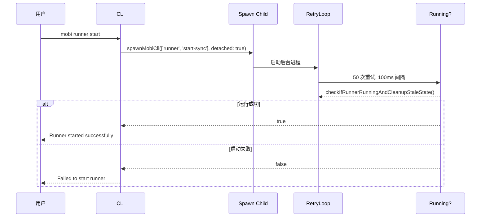

# start 子命令

Runner 通过 detached 方式启动，作为后台进程运行，允许用户离开终端后继续管理 Claude 会话。

## 命令流程



## 防重复启动

`start` 命令通过 spawn 执行 `start-sync` 时，不会与现有 Runner 进程冲突：

- **版本检查**: `start-sync` 启动时会检查是否有 Runner 正在运行且版本匹配，若有则直接退出
- **文件锁**: 获取独占锁失败说明已有 Runner 在运行，也会直接退出

详细流程见 [start-sync 文档](./start-sync.md)。

## 底层实现

### spawnMobiCli

**文件**: [`packages/cli/src/utils/spawnMobiCli.ts`](/packages/cli/src/utils/spawnMobiCli.ts)

启动一个新的 mobi CLI 进程（detached 模式），继承当前进程的环境变量。

```typescript
const child = spawnMobiCli(['runner', 'start-sync'], {
    detached: true,
    stdio: 'ignore',
    env: process.env
})
child.unref()  // 允许父进程退出
```

### checkIfRunnerRunningAndCleanupStaleState

**文件**: [`packages/cli/src/runner/controlClient.ts`](/packages/cli/src/runner/controlClient.ts)

检查 Runner 是否运行，并清理过期的状态文件。

```typescript
export async function checkIfRunnerRunningAndCleanupStaleState(): Promise<boolean> {
    const state = await readRunnerState();
    if (!state) {
        return false;
    }
    // 检查进程是否存活
    if (isProcessAlive(state.pid)) {
        return true;
    }
    // 进程已退出，清理状态文件
    await cleanupRunnerState();
    return false;
}
```

## 代码入口

- **命令入口**: `packages/cli/src/commands/runner.ts:69-93`
- **后台启动**: `packages/cli/src/utils/spawnMobiCli.ts`
- **Runner 主逻辑**: `packages/cli/src/runner/run.ts`
- **重试检查**: `packages/cli/src/runner/controlClient.ts`
