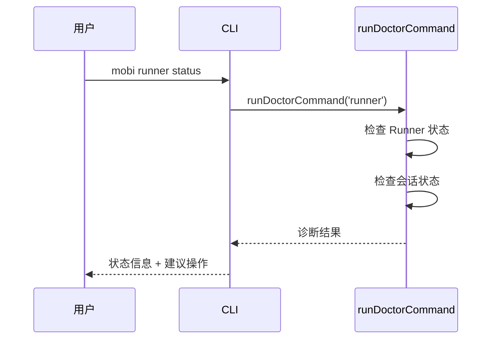

# status 子命令

运行诊断命令，检查 Runner 和会话的健康状态。

## 命令流程

## 诊断内容

`runDoctorCommand('runner')` 执行以下检查：

| 检查项 | 说明 |
|--------|------|
| Runner 进程 | 是否运行中，PID 是否有效 |
| 状态文件 | `runner.state.json` 是否存在且一致 |
| 会话进程 | 追踪的会话是否仍存活 |
| 版本匹配 | Runner 版本是否与当前 CLI 一致 |
| 连接状态 | Runner 是否已连接到 Hub |

## 相关命令

| 命令 | 说明 |
|------|------|
| `mobi runner status` | Runner 专项诊断 |
| `mobi doctor` | 全局诊断（包含 Runner 检查） |
| `mobi doctor clean` | 清理失控的 MOBI 进程（详见 [doctor](./doctor.md)） |

## 代码入口

- **命令入口**: [`cli/src/commands/runner.ts:106-109`](/cli/src/commands/runner.ts)
- **诊断实现**: [`cli/src/ui/doctor.ts`](/cli/src/ui/doctor.ts) — `runDoctorCommand()`
- **进程发现**: [`cli/src/runner/doctor.ts`](/cli/src/runner/doctor.ts) — `findAllMobiProcesses()`
