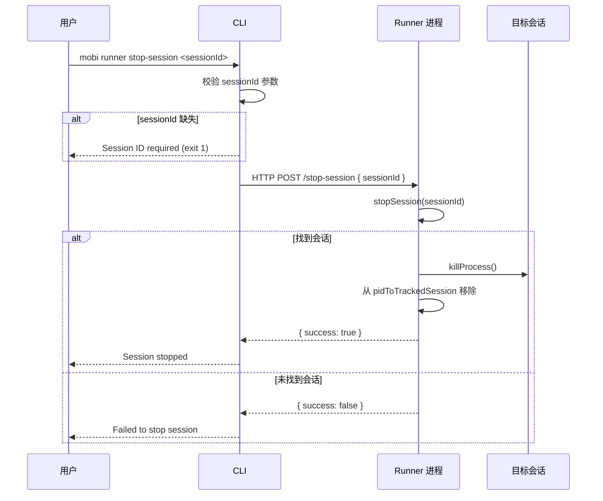
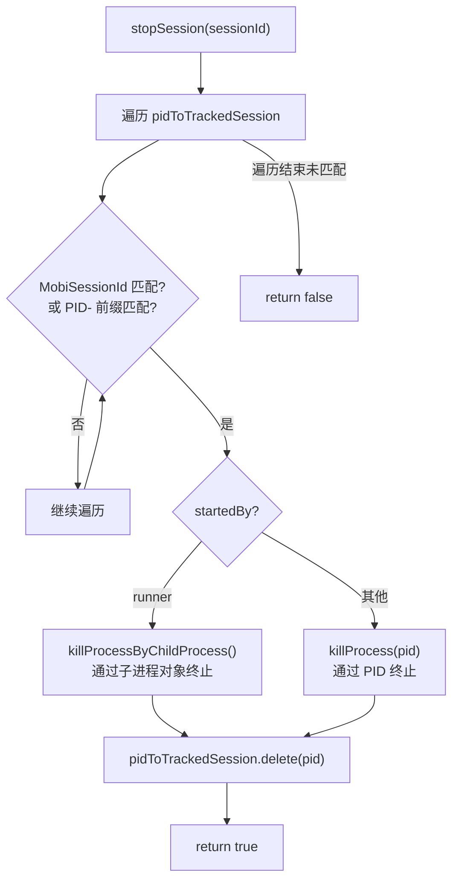

# stop-session 子命令

停止 Runner 管理的指定会话。

## 命令流程

## stopSession 实现

**文件**: [`packages/cli/src/runner/run.ts:559-592`](/packages/cli/src/runner/run.ts)

### 查找策略

支持两种查找方式：

| 格式 | 匹配逻辑 | 场景 |
|------|----------|------|
| `sessionId` | 匹配 `session.MobiSessionId` | 正常停止（通过 Hub 下发的会话 ID） |
| `PID-12345` | 匹配 `pid === 12345` | 兜底停止（通过进程 PID） |

### 终止方式差异

| 会话来源 | 终止方式 | 原因 |
|----------|----------|------|
| Runner 创建 (`startedBy === 'runner'`) | `killProcessByChildProcess(childProcess)` | 持有子进程对象，可发送 SIGTERM |
| 用户启动 | `killProcess(pid)` | 只有 PID，无子进程对象 |

## 错误处理

| 场景 | 行为 |
|------|------|
| sessionId 参数缺失 | 打印 `Session ID required`，exit(1) |
| Runner 未运行 | `runnerPost` 返回错误，catch 输出 `No runner running` |
| 会话未找到 | Runner 返回 `{ success: false }` |
| 进程终止失败 | catch 异常并记录日志，仍从追踪中移除 |

## 代码入口

- **命令入口**: [`packages/cli/src/commands/runner.ts:53-67`](/packages/cli/src/commands/runner.ts)
- **客户端调用**: [`packages/cli/src/runner/controlClient.ts:113-116`](/packages/cli/src/runner/controlClient.ts) — `stopRunnerSession()`
- **Runner 侧实现**: [`packages/cli/src/runner/run.ts:559-592`](/packages/cli/src/runner/run.ts) — `stopSession()`
- **服务端端点**: [`packages/cli/src/runner/controlServer.ts`](/packages/cli/src/runner/controlServer.ts) — `POST /stop-session`
