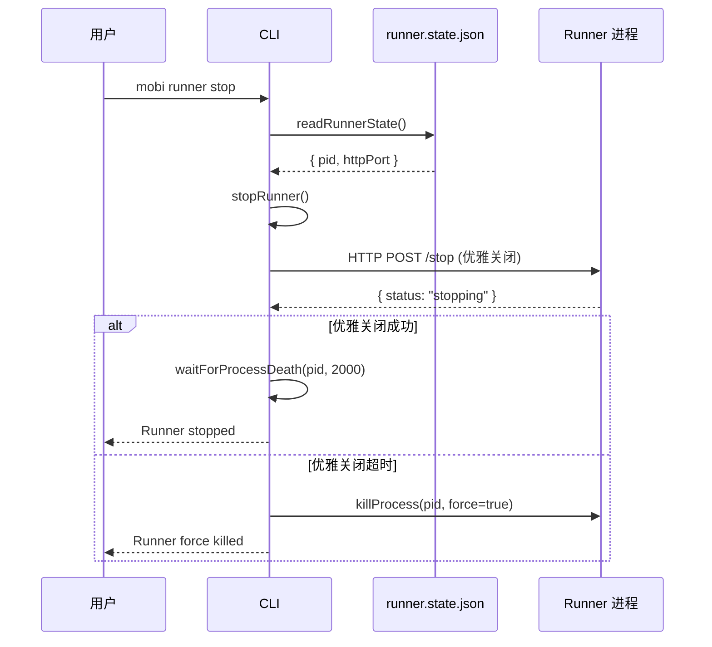

# stop 子命令

停止 Runner 进程。会话继续运行，但 Runner 不再管理它们。

## 命令流程



## 两阶段停止

**文件**: `cli/src/runner/controlClient.ts:233-265`

### 第一阶段: 优雅关闭

通过 HTTP `POST /stop` 请求 Runner 自行关闭：

```
POST http://127.0.0.1:{port}/stop
     → Runner 收到后延迟 50ms 触发 requestShutdown
     → 执行 cleanupAndShutdown 完整流程
```

Runner 自行关闭的优势：
- 断开 Hub 的 Socket.IO 连接
- 关闭 ControlServer
- 更新 Hub 侧 `RunnerState` 为 `shutting-down`
- 清理状态文件和文件锁

### 第二阶段: 强制杀死

如果 2 秒内 Runner 未退出，发送 SIGKILL 强制终止：

```
waitForProcessDeath(pid, 2000)
    → 每 100ms 检查 isProcessAlive(pid)
    → 超时 → killProcess(pid, force=true)
```

## 错误处理

| 场景 | 行为 |
|------|------|
| Runner 未运行 | `readRunnerState()` 返回 null，直接返回 |
| 状态文件过期 | 进程已退出，`stopRunnerHttp()` 返回错误，进入强制杀死 |
| HTTP 请求失败 | 跳过优雅关闭，直接强制杀死 |
| 强制杀死失败 | 进程可能已退出，静默忽略 |

## 代码入口

- **命令入口**: [`cli/src/commands/runner.ts:101-104`](/cli/src/commands/runner.ts)
- **核心逻辑**: [`cli/src/runner/controlClient.ts:233-265`](/cli/src/runner/controlClient.ts) — `stopRunner()`
- **服务端处理**: [`cli/src/runner/controlServer.ts`](/cli/src/runner/controlServer.ts) — `POST /stop`
