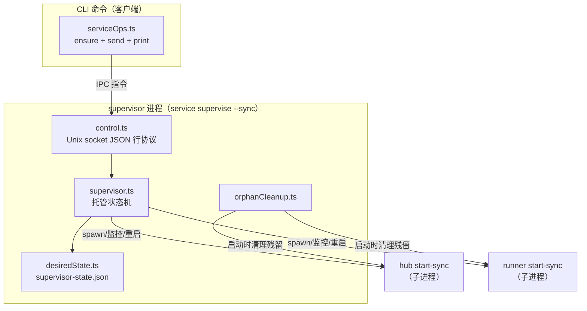
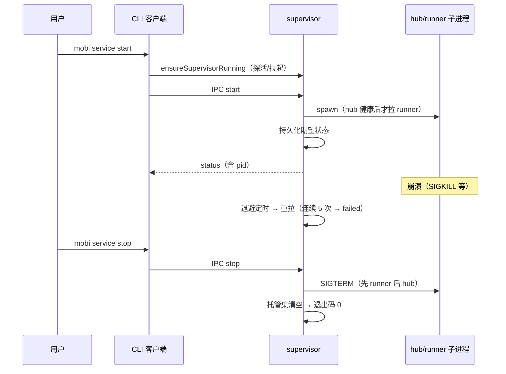

# Service 命令与 Supervisor — 进程托管

文件 [`packages/cli/src/commands/service.ts`](/packages/cli/src/commands/service.ts)
模块 [`packages/cli/src/supervisor/`](/packages/cli/src/supervisor/)

`mobi service` 通过常驻 **supervisor** 进程托管 hub 与 runner：崩溃自动退避重启、连续 5 次放弃（failed）、期望状态持久化、PPID 看门狗保证"父死子亡"。`mobi hub` / `mobi runner` 顶层的 start/stop/restart/status 是 service 子命令的别名，全项目只有一套托管语义。

## 命令矩阵

```
mobi service start [--host H] [--port P]   # 托管 hub + runner
mobi service stop                           # 全停，supervisor 退出
mobi service restart / status

mobi service hub start|stop|restart|status     # 单组件
mobi service runner start|stop|restart|status

mobi hub start / mobi runner start             # 别名，行为与 service 子命令一致
mobi hub start-sync / runner start-sync        # 前台直跑（supervisor 内部也用它）
```

语义要点：

- **幂等**：重复 start 不再 spawn；未运行时 stop 不报错
- **冷启动探活**：`status`/`stop` 只探活不拉起——supervisor 未运行时打印 "Service is not running"，避免只读查询产生副作用（尤其是 desired state 非空时会恢复整套服务的场景）
- **start/restart** 才走 `ensureSupervisorRunning()` 拉起 supervisor
- runner 的 `list`/`stop-session`/`logs` 子命令保留原实现（直接与 runner 通信，不经 supervisor）

## 架构



### supervisor 模块文件

| 文件 | 职责 |
|------|------|
| [`supervisor.ts`](/packages/cli/src/supervisor/supervisor.ts) | 托管状态机：spawn/监控/退避重启/崩溃计数/有序关停。纯依赖注入（spawn/时钟/崩溃日志），不含业务逻辑 |
| [`control.ts`](/packages/cli/src/supervisor/control.ts) | IPC：Unix socket（`~/.mobi/supervisor.sock`）+ JSON 行协议；`ensureSupervisorRunning` 探活/拉起 |
| [`index.ts`](/packages/cli/src/supervisor/index.ts) | `runSupervisor()` 编排：幂等守卫 → bind 占锁 → 孤儿清理 → IPC server → 恢复期望状态 → 信号关停 |
| [`desiredState.ts`](/packages/cli/src/supervisor/desiredState.ts) | 期望状态持久化（原子写），崩溃/重启后恢复托管配置 |
| [`restartPolicy.ts`](/packages/cli/src/supervisor/restartPolicy.ts) | 纯函数：退避序列（1s→…→30s 封顶）、崩溃计数（<60s 累加、≥60s 重起算）、放弃阈值（5 次） |
| [`ppidWatchdog.ts`](/packages/cli/src/supervisor/ppidWatchdog.ts) | 父进程死亡看门狗：hub/runner 内部 5s 轮询，父死则 SIGTERM 自杀走优雅清理 |
| [`orphanCleanup.ts`](/packages/cli/src/supervisor/orphanCleanup.ts) | supervisor 启动时按 pid 文件清理残留 hub/runner |

## 崩溃重启策略

- 退避：第 n 次连续崩溃后等待 1s → 2s → 4s → … → 30s 封顶
- 计数：单次运行不足 60s 即退出算一次"连续崩溃"；稳定运行 ≥ 60s 后重新起算（偶发崩溃不累积）
- **连续 5 次 → `failed`**：不再自动拉起；崩溃现场（stderr 尾部）落盘 `~/.mobi/logs/<组件>-crash.log`；对应组件 `restart` 重置计数重新拉起；failed 不影响另一组件
- 显式 stop 不计崩溃

## 生命周期



关键时序保证：

- **幂等启动守卫**：supervisor 启动先探活自身 socket，已有应答则直接退出（防并发 spawn 竞态）；bind 失败（EADDRINUSE）再探活——有应答退让、无应答 unlink 残留重试
- **onEmpty 退出码 0**：配合 launchd `KeepAlive={SuccessfulExit:false}` / systemd `Restart=on-failure`，空托管集不会被系统拉起
- **空期望宽限 30s**：supervisor 空载启动时给首条指令留窗口（A 路径先 spawn 再发指令的竞态）
- **PPID 看门狗**：supervisor 被 SIGKILL 时子进程 5s 内感知并优雅退出，不留孤儿占端口/锁文件

## B 路径：系统服务（launchd/systemd）

`mobi setup service install` 安装的系统服务直接 `ExecStart = mobi service supervise --sync`（旧版 wrapper 脚本已废弃）：

- launchd：`RunAtLoad` + `KeepAlive={SuccessfulExit:false}`——开机自启、supervisor 异常退出才拉起
- systemd：`Restart=on-failure` + `enable-linger`
- 开机自启语义 = supervisor 被拉起 → 读期望状态 → 恢复停机前托管配置

## 代码结构

```
packages/cli/src/
├── commands/
│   ├── service.ts               # 命令矩阵入口 + supervise --sync
│   ├── serviceOps.ts            # CLI 侧操作：ensure + send + print
│   └── serviceArgs.ts           # parseHostPortArgs 纯函数（含端口校验）
└── supervisor/
    ├── index.ts                 # runSupervisor 编排
    ├── supervisor.ts            # 托管状态机
    ├── control.ts               # IPC server/client
    ├── desiredState.ts          # 期望状态持久化
    ├── restartPolicy.ts         # 重启策略纯函数
    ├── ppidWatchdog.ts          # PPID 看门狗
    └── orphanCleanup.ts         # 启动孤儿清理
```

已知边界（SIGTERM 无升级、pid 复用、编排层测试覆盖）见 `docs/pending.md`。
