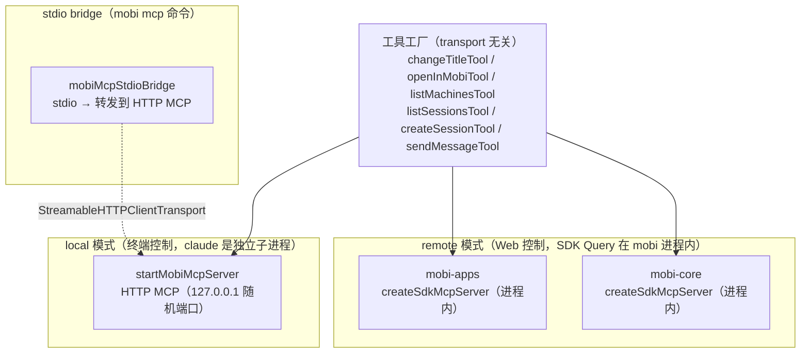
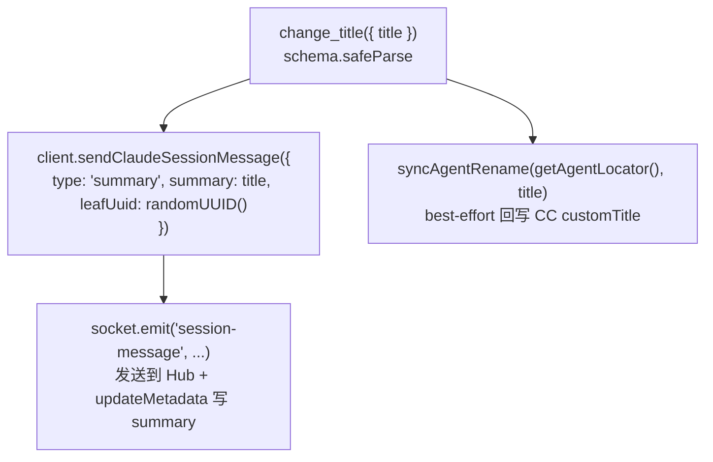
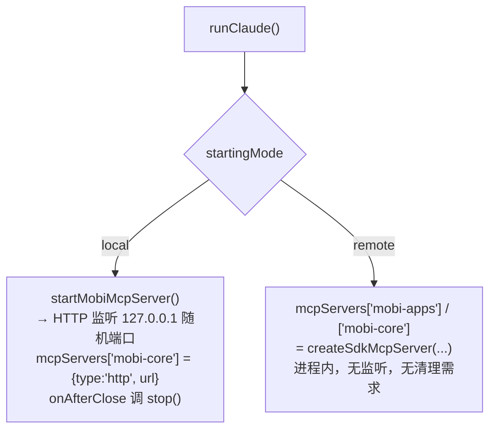

# MCP（会话内工具族）

**目录**: [`packages/cli/src/mcp/`](/packages/cli/src/mcp/)

mobi 会话里的 agent 通过 MCP 工具触达 mobi 自身——接受 UI 呈现指令、操作其他会话、改自己的标题。本模块是这批工具的**工具定义与装配层**：工具工厂写一次（transport 无关），三个壳按模式把它挂到 Claude Code 上。

## 三个壳

同一批工具核心，按「谁在控制会话」分三种挂载方式（transport 分流，见 [ADR 0001](/docs/adr/0001-transport-split-local-remote.md)）：



| 壳 | 文件 | 模式 | 挂载的工具 | 通信 |
|------|------|------|-----------|------|
| **mobi-apps** | [`mcp/mobiAppsServer.ts`](/packages/cli/src/mcp/mobiAppsServer.ts) | 仅 remote | A 类 + B 类（5 个） | SDK 进程内，零端口零临时文件 |
| **mobi-core** | [`mcp/mobiCoreServer.ts`](/packages/cli/src/mcp/mobiCoreServer.ts) | remote | change_title / web_search / web_fetch | 同上 |
| **HTTP 壳** | [`claude/utils/startMobiMcpServer.ts`](/packages/cli/src/claude/utils/startMobiMcpServer.ts) | 仅 local | 仅 change_title | StreamableHTTP，stateless（每请求独立 transport） |
| **stdio bridge** | [`mcp/mobiMcpStdioBridge.ts`](/packages/cli/src/mcp/mobiMcpStdioBridge.ts) | 独立命令 | 仅 change_title | stdio → HTTP 转发；**当前无实际使用场景** |

装配点在 [`mcp/sessionTransports.ts`](/packages/cli/src/mcp/sessionTransports.ts) 的 `buildSessionMcpServers()`：remote 传两个进程内 server 对象，local 传 `{'mobi-core': {type:'http', url}}`。local 模式缺 url 时**抛错而非静默传空串**——那是装配时序 bug（HTTP 壳未先启动）。同一函数还导出 remote 模式的内联 hook settings（`REMOTE_INLINE_HOOK_SETTINGS`，零临时文件）。

local 壳只挂 change_title：A/B 类工具都依赖 Hub 链路，local 不存在；web 工具在 local 模式下本就被 SDK 的 server 序列化过滤，从未生效，故不再挂载。

## 命名法：mobi-core / mobi-apps

两个 server 由「谁提供这个能力」划分，而不是按调用方向：

| Server | 含义 | 工具 |
|--------|------|------|
| `mobi-core` | mobi 的**内置基础能力**，与 mobi 应用无关 | `change_title`、`web_search`、`web_fetch` |
| `mobi-apps` | **mobi 应用提供的工具族**——agent 触达 mobi 的一切 | A 类 + B 类 |

`mobi-apps` 内部再分两类（照 OpenAI Codex 的 `codex_apps`：一个 namespace 装全部应用工具）：

- **A 类 · UI 呈现**：驱动 Web 界面（`open_in_mobi`，后续 `focus_session` / `set_theme` 进此）。依赖 Web 在线，瞬态呈现不落库。
- **B 类 · 系统操作**：会话操作（`list_machines` / `list_sessions` / `create_session` / `send_message_to_session`）。不依赖 Web，落库即终态。

接口形态的决策记录见 [ADR 0005](/docs/architecture/0005-agent-apps-mcp-route.md)。

两个 server 都不设 `alwaysLoad`——默认 tool search defer，工具定义不进上下文（决策与实测见 ADR 0005）。`instructions` 只回答「这个 server 谁提供的」（`mobi-apps` 为 `'Tools provided by the Mobi app.'`，照 codex 的一句话风格），检索与使用指导的责任在每个工具自己的 `description` 上。

## 工具清单

| 工具 | 全名 | 类 | 职责 |
|------|------|-----|------|
| change_title | `mcp__mobi-core__change_title` | core | 改当前会话标题 |
| web_search / web_fetch | `mcp__mobi-core__web_search` / `..._web_fetch` | core | 只读 web 工具，见 [webtools](/packages/cli/src/webtools/) |
| open_in_mobi | `mcp__mobi-apps__open_in_mobi` | A | 在 Web UI 打开工作区文件（可带行号）或终端 |
| list_machines | `mcp__mobi-apps__list_machines` | B | 列**当前在线**机器（离线机器不出现） |
| list_sessions | `mcp__mobi-apps__list_sessions` | B | 列可派活的会话（keyword / status / limit / projectId） |
| create_session | `mcp__mobi-apps__create_session` | B | 在某台机器上起新会话，默认等到「能收消息」再返回 |
| send_message_to_session | `mcp__mobi-apps__send_message_to_session` | B | 投消息给一个或多个会话 |

web 工具由 [`webtools/server.ts`](/packages/cli/src/webtools/server.ts) 提供、已是 SDK `tool()` 形态，`mobi-core` 直接挂载；模型仍用内置名 `WebSearch` / `WebFetch` 调用，经 [`claude/claudeRemote.ts`](/packages/cli/src/claude/claudeRemote.ts) 的 `toolAliases` 重定向过来。

### 预授权（allowedTools）

这张清单**不是手写的**：每个 server 模块（`mobiAppsServer` / `mobiCoreServer`）的注册表是「一行 = 一个工具的名字 + 怎么造」，`sessionTransports.ts` 从两张表派生 `MOBI_PREAUTHORIZED_TOOLS`（`mcp__<server>__<tool>`），[`claude/runClaude.ts`](/packages/cli/src/claude/runClaude.ts) 直接用它。**加一个工具只改它所在 server 的那张表一行**——此前两处各抄一份，漏掉后者的症状是编译过得去、行为退化成逐次弹审批。

- change_title 与 web 工具：避免 default 模式每次弹审批。工具前缀两种模式一致（SDK 按注册名、HTTP 壳按 key 生成），一条预授权覆盖两种 transport。
- B 类工具：逐个审批会让编排完全不可用，而编排正是本特性的价值。收窄手段是权限模式，不是逐次审批——调用本身在发件方会话里留下工具卡，人可事后审计。
- local 模式下 mobi-apps 前缀的预授权不会命中（工具根本没注册），无害；清单不按模式裁剪，免得把「当前是哪个模式」混进这份纯派生里。

## 工具工厂

每个工具一个文件，导出两样：

```typescript
export const XXX_TOOL_NAME = 'xxx' as const        // 工具名常量（预授权与测试共用）
export function createXxxTool(deps: XxxToolDeps)   // 工厂：依赖注入，便于单测
```

工厂返回 `{ name, title, description, inputSchema, execute }`。**`description` 是给模型的使用说明**（何时用、何时别用、id 从哪来、要不要等回复），它不是文档——改行为先改它。

「这些窄 deps 由谁填」只在一处回答：`mobiAppsServer.ts` 的 `buildMobiAppsTools(client)`（mobi-apps 一族唯一的装配点，纯函数、可脱离 SDK 直接测）。此前每个工具文件各导出一个 `createXxxToolForSession(client)`，三行、只转发一个方法——五个同尺寸的浅模块，删掉后复杂度集中到装配点一次。

三个助手：

| 助手 | 提供什么 |
|------|---------|
| [`mcp/toolResult.ts`](/packages/cli/src/mcp/toolResult.ts) | `MobiToolTextResult`（MCP text-only 结果子集）与 `textResult` / `errorTextResult`，消除各工厂的结果样板 |
| [`mcp/sdkTool.ts`](/packages/cli/src/mcp/sdkTool.ts) | `toSdkTool()`：工具体 → SDK `tool()` 定义的形状适配（两个 SDK server 壳共用，适配知识只有一处） |
| [`mcp/mcpSchemaCompat.ts`](/packages/cli/src/mcp/mcpSchemaCompat.ts) | `asMcpInputSchema()`：桥接 zod 4.4.3 classic schema 与 MCP SDK 的 `AnySchema` 约束（仅类型断言，runtime 由 SDK 的 zod-compat 解析） |
| [`mcp/sessionTransports.ts`](/packages/cli/src/mcp/sessionTransports.ts) | 按模式装配（见上） |

### 失败/成功文案的归属

**失败原因由上游（Hub）译成人话，工具只负责显示**——B 类工具的 `error` 字段就是 Hub 译好的句子。工具自己拼的话只有「逐目标清单」的框架（`renderDeliveryResults`：全成 / 部分成 / 全败三种话术），重点在部分失败时告诉 agent **不能盲目重发**。

成功文案反过来：Hub 只报事实（如 `readiness: 'ready' | 'not-ready' | 'not-checked'`），措辞在工具侧按事实拼。

### 与「会话此刻能收消息」的关系

`create_session` 的 `waitForReady`（默认 true）与 `send_message_to_session` 的失败解释，都依赖 CLI 上报的 sink 接通事实。**上报点不在本模块**（在 [`claude/claudeRemoteLauncher.ts`](/packages/cli/src/claude/claudeRemoteLauncher.ts) → [`api/apiSession.ts`](/packages/cli/src/api/apiSession.ts) 的 `reportReceiveReadiness`），落点与判据见 [Hub socket 文档](/docs/architecture/hub/socket/README.md) 与 [hub/sync 文档](/docs/architecture/hub/sync/README.md)。此处只需知道一件事：**「能收消息」是会反复翻转的「此刻」事实，工具不能拿它当闸门，只能拿它「等」和「把失败说准」**。

## change_title 核心流程



`sendClaudeSessionMessage` 对 `type: 'summary'` 的处理：① 经 Socket.IO 发消息到 Hub；② 自动 `updateMetadata()` 把标题写进 session metadata（`summary.text` + `summary.updatedAt`）。

`syncAgentRename`（经 agent capability registry 按 flavor 分发）调 SDK `renameSession(claudeSessionId, title, { dir })`，把标题回写到 Claude Code 的 session 文件（`custom-title` entry），保持 CC 会话列表标题与 mobi 一致（LWW）。会话未就绪 / SDK 失败时静默吞错（best-effort），不影响 mobi 侧已完成的改名。Web UI 重命名走 `rename-session` RPC，复用同一函数。

## 装配与清理



### 安全机制（local HTTP 壳）

| 机制 | 说明 |
|------|------|
| **本地绑定** | `127.0.0.1`，外部不可访问 |
| **随机端口** | 端口由 OS 分配，每次启动不同 |
| **敏感环境变量过滤** | `TerminalManager` 把 `MOBI_HTTP_MCP_URL` 列入敏感变量，不传给子进程 |

remote 的进程内 server 不经网络，无攻击面。stdio bridge 把 `--url` 换成 `MOBI_HTTP_MCP_URL` 环境变量或命令行参数，**不得写 stdout**（会破坏 MCP stdio 协议），诊断信息一律走 stderr。

## 代码结构

```
packages/cli/src/mcp/
├── mobiAppsServer.ts        # remote：mobi-apps SDK server 壳（A 类 + B 类）
├── mobiCoreServer.ts        # remote：mobi-core SDK server 壳（change_title / web 工具）
├── sessionTransports.ts     # 按模式装配 server + remote 内联 hook settings
├── mobiMcpStdioBridge.ts    # stdio MCP server，转发到 HTTP MCP（mobi mcp 命令）
├── mcpSchemaCompat.ts       # zod ↔ MCP SDK AnySchema 类型桥
├── sdkTool.ts               # 工具体 → SDK tool() 定义的形状适配（两个 server 壳共用）
├── toolResult.ts            # text-only 结果构造助手
├── changeTitleShape.ts      # change_title 的对外形状单源（名/说明/标题/schema，只依赖 zod）
├── changeTitleTool.ts       # change_title 核心（remote SDK / local HTTP / stdio bridge 共用形状）
├── openInMobiTool.ts        # open_in_mobi（A 类）
├── listMachinesTool.ts      # list_machines（B 类）
├── listSessionsTool.ts      # list_sessions（B 类）
├── createSessionTool.ts     # create_session（B 类）
└── sendMessageTool.ts       # send_message_to_session（B 类）
```

| 相邻入口 | 位置 |
|----------|------|
| local HTTP 壳 | [`claude/utils/startMobiMcpServer.ts`](/packages/cli/src/claude/utils/startMobiMcpServer.ts) |
| web 工具核心 | [`webtools/server.ts`](/packages/cli/src/webtools/server.ts) |
| 预授权与装配调用点 | [`claude/runClaude.ts`](/packages/cli/src/claude/runClaude.ts) |
| `mobi mcp` 命令入口 | [`commands/mcp.ts`](/packages/cli/src/commands/mcp.ts) |

## 测试入口

`packages/cli/tests/mcp/` 下按文件一一对应：`changeTitleTool.test.ts`、`openInMobiTool.test.ts`、`listMachinesTool.test.ts`、`listSessionsTool.test.ts`、`createSessionTool.test.ts`、`sendMessageTool.test.ts`、`sessionTransports.test.ts`（装配形态断言）。
