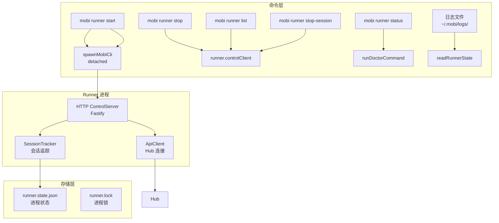
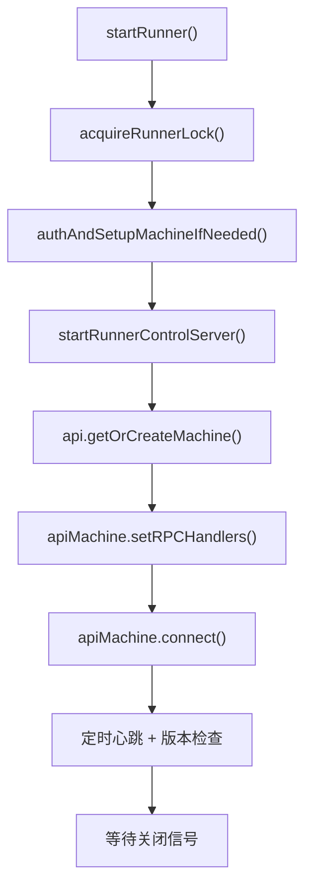
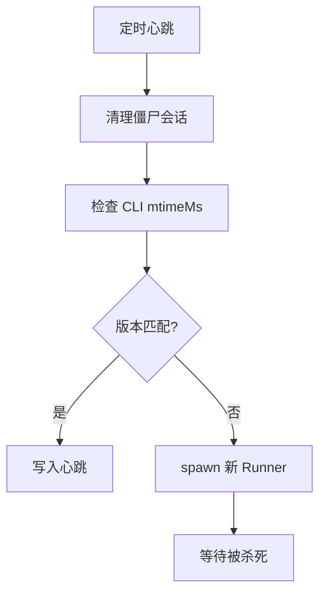
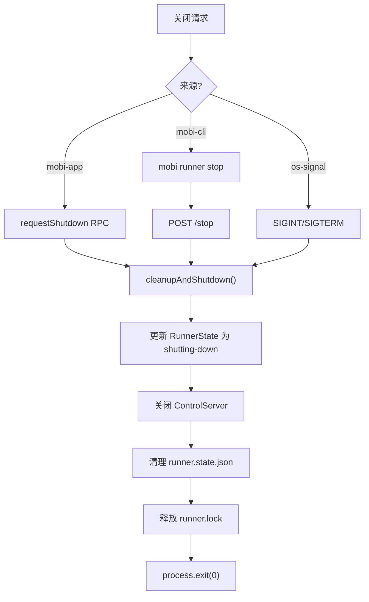

# Runner 命令

文件 [`cli/src/commands/runner.ts`](/cli/src/commands/runner.ts)

Runner 是 Mobi 的后台进程管理器，负责 Claude 会话的生命周期管理，允许用户离开终端后会话继续运行。

## 架构概览



## Runner 进程

Runner 是一个后台守护进程，核心职责：

1. **会话生命周期管理** - 启动、追踪、停止 Claude 会话
2. **版本自检与热更新** - 检测 CLI 升级后自动重启
3. **健康检查** - 定期心跳、清理僵尸会话

### 启动流程



### 通信机制

| 方式 | 说明 |
|------|------|
| **[HTTP ControlServer](./controlServer.md)** | 本地 HTTP 服务，提供 `/list`、`/stop-session`、`/spawn-session`、`/stop` 等端点 |
| **Socket.IO** | 与 Hub 的实时连接，接收远程命令 |
| **Webhook** | 会话启动后通过 `/session-started` 向 Runner 报告 |

### 会话追踪

Runner 追踪两种来源的会话：

| 来源 | startedBy 标识 | 说明 |
|------|----------------|------|
| Runner 启动 | `runner` | 通过 RPC 或 HTTP 请求远程启动 |
| 用户启动 | `mobi directly - likely by user from terminal` | 用户在终端直接运行 `mobi` |

## 子命令

| 子命令 | 说明 | 通信方式 |
|--------|------|----------|
| [`start`](./start.md) | 后台启动 Runner | 本地 spawn |
| [`start-sync`](./start-sync.md) | 同步启动（内部使用） | 直接调用 |
| [`stop`](./stop.md) | 停止 Runner | HTTP → Runner |
| [`status`](./status.md) | 查看状态 | doctor 命令 |
| [`list`](./list.md) | 列出活跃会话 | HTTP → Runner |
| [`stop-session`](./stop-session.md) | 停止指定会话 | HTTP → Runner |
| [`logs`](./logs.md) | 查看日志路径 | 本地文件读取 |

## 核心机制

| 机制 | 说明 |
|------|------|
| [**spawnSession**](./spawn-session.md) | 会话创建：目录准备 → Worktree → Spawn → Webhook 确认 |

## 文件结构

```
cli/src/
├── commands/
│   └── runner.ts              # 命令入口，路由子命令
├── runner/
│   ├── run.ts                 # Runner 核心逻辑
│   ├── controlServer.ts        # HTTP 控制服务器
│   ├── controlClient.ts        # HTTP 客户端（CLI → Runner）
│   ├── types.ts                # TrackedSession 类型定义
│   ├── worktree.ts             # Worktree 会话支持
│   └── doctor.ts               # Runner 诊断工具
├── persistence.ts              # runner.state.json 读写
└── ui/
    └── logger.ts                # 日志系统
```

## 持久化

| 文件 | 路径 | 说明 |
|------|------|------|
| runner.state.json | `~/.mobi/runner.state.json` | Runner 进程状态（PID、端口、版本） |
| runner.lock | `~/.mobi/runner.lock` | 进程锁，防止多实例 |
| 日志文件 | `~/.mobi/logs/*-runner.log` | Runner 运行日志 |

### runner.state.json 结构

```typescript
interface RunnerLocallyPersistedState {
  pid: number                      // Runner 进程 PID
  httpPort: number                 // ControlServer 端口
  startTime: string                // 启动时间
  startedWithCliVersion: string    // 启动时的 CLI 版本
  startedWithCliMtimeMs?: number   // CLI 文件修改时间（用于版本检测）
  lastHeartbeat?: string           // 最后心跳时间
  runnerLogPath?: string           // 日志文件路径
}
```

## 版本检测与热更新

Runner 每 60 秒执行健康检查：

1. 清理已退出的会话
2. 检测 CLI 是否更新（通过 mtimeMs 对比）
3. 若版本过时，自动 spawn 新 Runner 并等待被杀死



## 关闭流程


