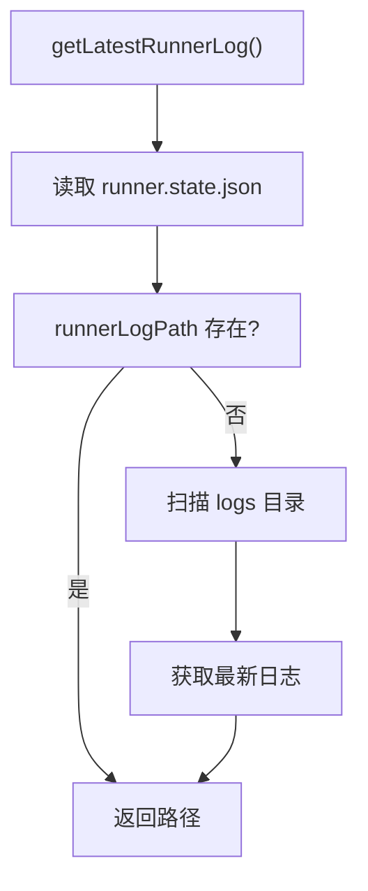

# logs 子命令
显示最新 Runner 日志文件的路径。

## 命令流程
```
mobi runner logs
        │
        │ 调用 `getLatestRunnerLog()`
        │
        │ 读取 runner.state.json
        │
        │ 返回日志路径
```
### 本地文件查询

### 日志文件查找逻辑
1. **优先级**: 从 `runner.state.json` 读取 `runnerLogPath`
2. **目录扫描**: 扫描 `~/.mobi/logs/` 中的 `*-runner.log` 文件
3. **排序**: 按修改时间降序排列
4. **返回**: 最新的日志文件路径

```typescript
// 日志文件命名格式
const timestamp = createTimestampForFilename()
    .toLocaleString('sv-SE', {
        timeZone: Intl.DateTimeFormat().resolvedOptions().timeZone,
        year: 'numeric',
        month: '2-digit',
        day: '2-digit',
        hour: '2-digit',
        minute: '2-digit',
        second: '2-digit',
    })
    .replace(/[: ]/g, '-').replace(/,/g, '') + '-pid-' + process.pid
```

结果: `YYYY-MM-DD-Hh-mm-ss-pid-<processId>-runner.log`
`` `

## 输出示例
```bash
# 显示日志路径（用于调试)
mobi runner logs
# 输出: ~/.mobi/logs/2026-03-30 22-13-45-pid-12345-runner.log
`` ```

## 代码入口
- **命令入口**: `cli/src/commands/runner.ts:111-119`
- **核心逻辑**: `cli/src/ui/logger.ts:317-320`
    `getLatestRunnerLog()`
