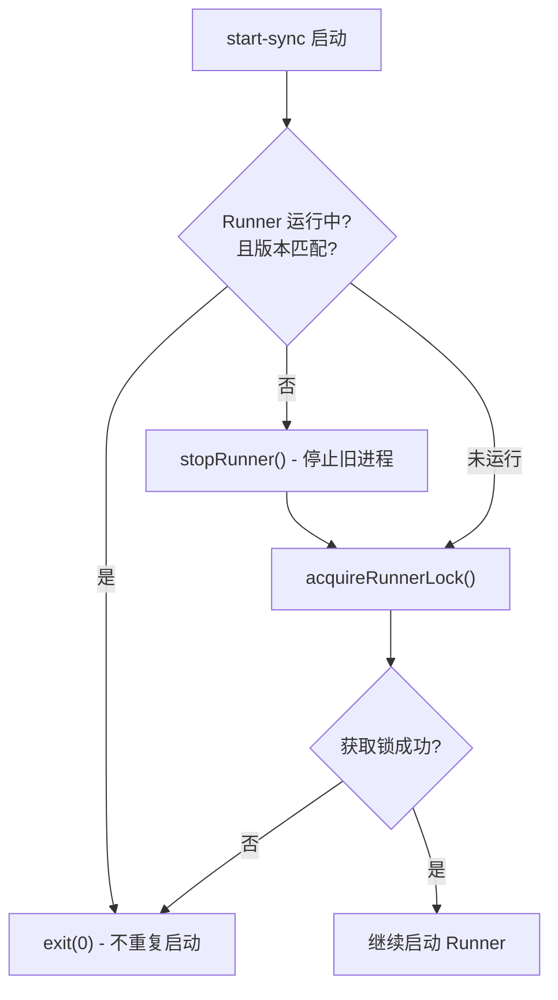
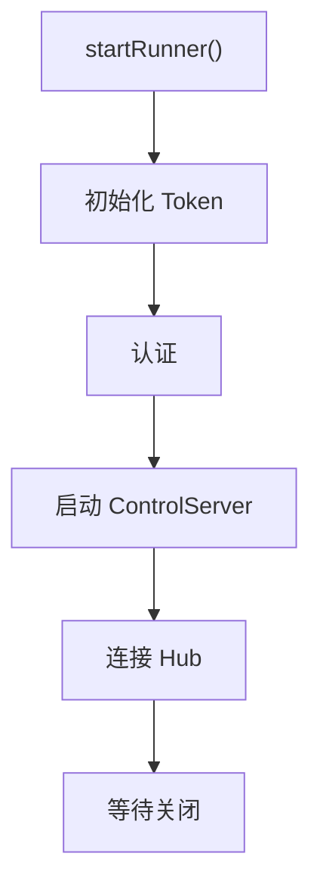
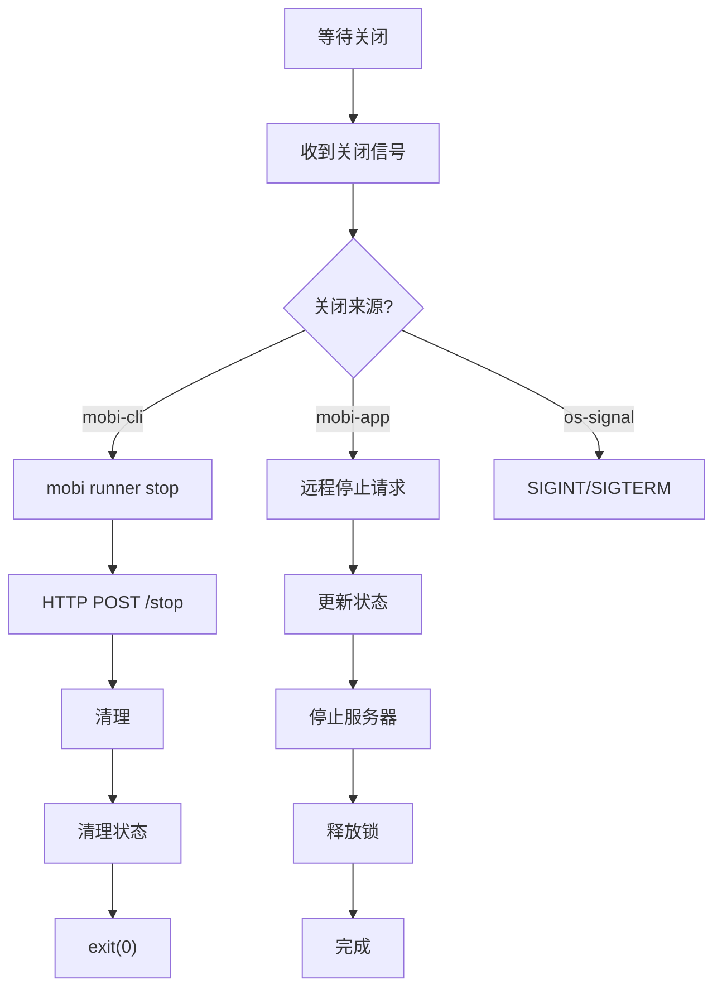

# start-sync 子命令

Runner 通过同步方式启动，作为前台进程运行，仅用于内部调用或不暴露给用户。

## 如述

- **入口**: `cli/src/commands/runner.ts:95-98`
- **核心逻辑**: `cli/src/runner/run.ts:40-830`
- **用途**: 同步启动 Runner，供 `mobi runner start` 内部调用

## 防重复启动机制

`start-sync` 启动时会检查是否已有 Runner 运行，避免重复启动：



### 1. 版本检查

**文件**: `cli/src/runner/run.ts:115-123`

检查是否已有 Runner 运行，且版本与当前 CLI 匹配：

```typescript
const runningRunnerVersionMatches = await isRunnerRunningCurrentlyInstalledMobiVersion();
if (!runningRunnerVersionMatches) {
    // 版本不匹配 → 停止旧 runner，继续启动新的
    await stopRunner();
} else {
    // 版本匹配 → 已有 runner 运行中，直接退出
    console.log('Runner already running with matching version');
    process.exit(0);
}
```

### 2. 文件锁

**文件**: `cli/src/runner/run.ts:126-130`

确保同一时间只有一个 Runner 进程：

```typescript
const runnerLockHandle = await acquireRunnerLock(5, 200);
if (!runnerLockHandle) {
    logger.debug('[RUNNER RUN] Runner lock file already held, another runner is running');
    process.exit(0);
}
```

## 启动流程



## 核心初始化
1. **认证**: `authAndSetupMachineIfNeeded()`
2. **启动 ControlServer**: Fastify HTTP 服务器，3. **连接 Hub**: 创建 ApiClient 并注册机器
4. **设置 RPC 处理程序**: 处理来自 Hub 的远程命令
5. **启动心跳定时器**: 每 60 秒执行健康检查

6. **等待关闭**: 等待 shutdown信号


## 关闭流程


## 代码入口

- **命令入口**: `cli/src/commands/runner.ts:95-98`
- **核心逻辑**: `cli/src/runner/run.ts:40-830`
