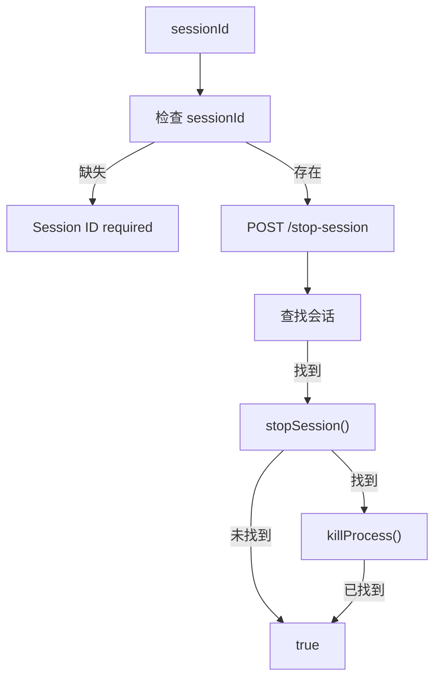
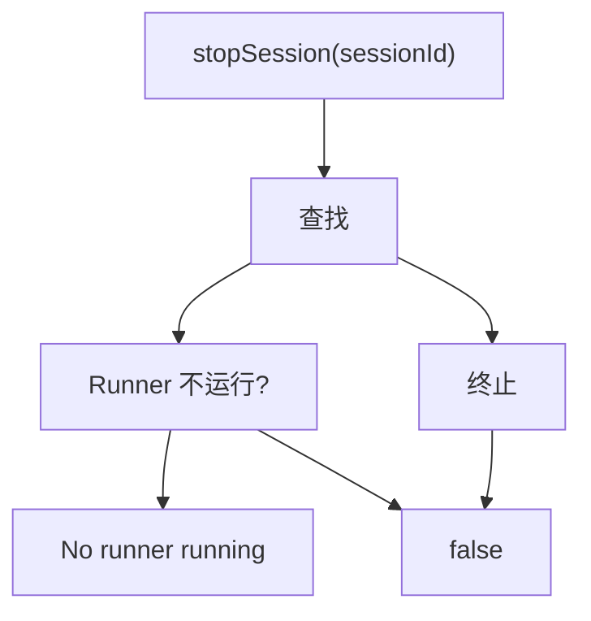

# stop-session 子命令
停止指定的会话。

## 命令流程
```
mobi runner stop-session <sessionId>
        │
        │ 检查 sessionId 参数
        │
        │ HTTP post /stop-session
        │
        │ 调用 stopSession()
        │
        │ 返回结果
```

### HTTP 请求
通过 HTTP 请求 `/stop-session` 猤点:
- **Body**: `{ sessionId: string }`
### 庽理处理

### stopSession 实现
**文件**: `cli/src/runner/run.ts:557-590`

1. **查找会话**: 通过 `MobiSessionId` 或 `PID-` 埥找
2. **终止会话**:
   - runner-spawned: `killProcessByChildProcess()`
   - 外部启动的 `killProcess(pid)`
3. **清理追踪**: 从 `pidToTrackedSession` 删除

4. **返回结果**: `true/false`
```mermaid
flowchart TB
    subgraph Find["查找"]
        Check1["for (const [pid, session] of pidToTrackedSession)"]
            Check -->|runner-spawned?| Check1["Yes"]
                Check2["no"]
            Check --> Check3["MobiSessionId 匹配?"]
                Check3 -->|匹配| Call["stopSession()"]
                    Call -->|childProcess| Kill
                Check4["else"]
                    Call -->|未找到
            Check4 -->|否
            Check -->|否
    end

```
## 错误处理
- Session ID 缺失 → 错误退出
- Runner 未运行 → 返回 "No runner running"
- HTTP 请求失败 → 捕获异常并返回 false

- 会话未找到 → 返回 false


## 代码入口
- **命令入口**: `cli/src/commands/runner.ts:53-67`
- **核心逻辑**: `cli/src/runner/controlClient.ts:113-116`
    `stopRunnerSession()`
- **停止逻辑**: `cli/src/runner/run.ts:557-590`
    `stopSession()`
