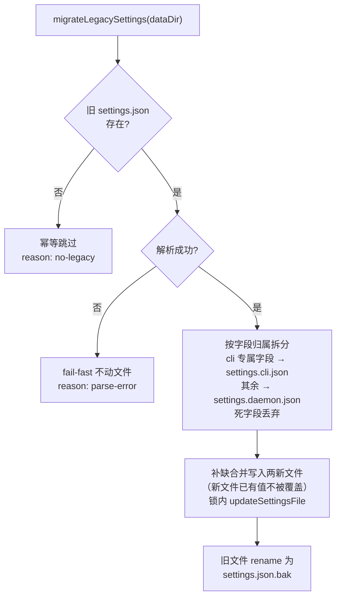
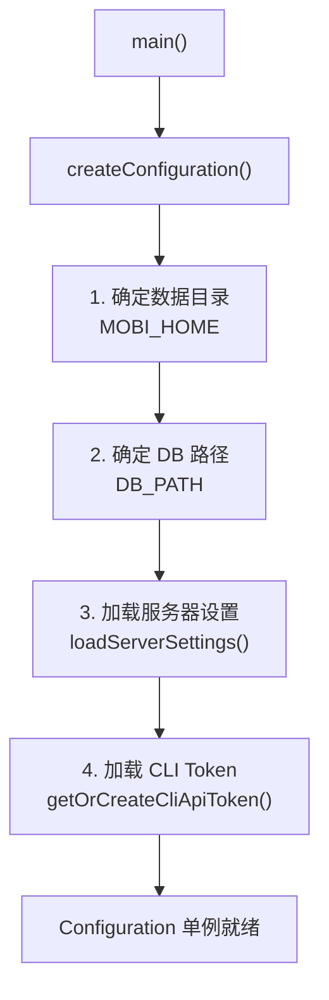
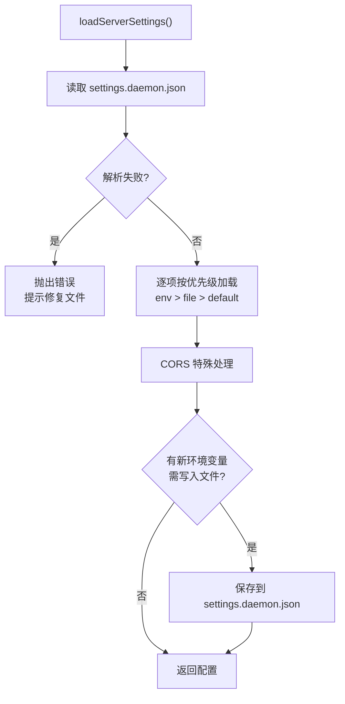
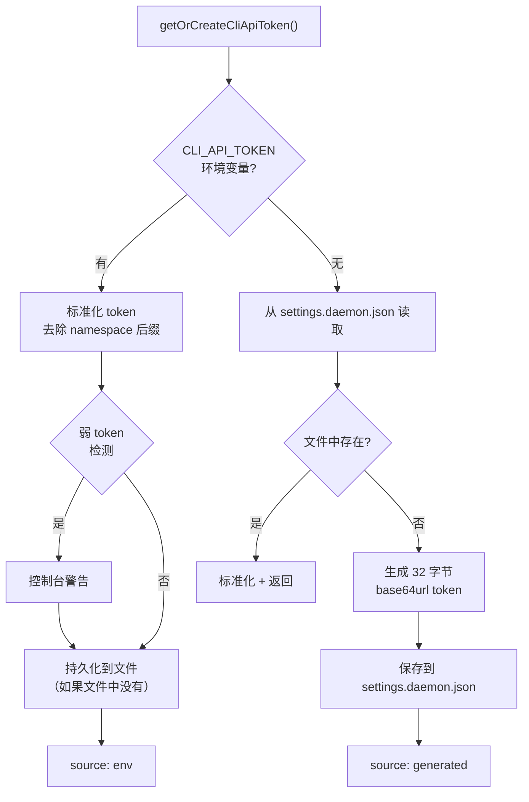
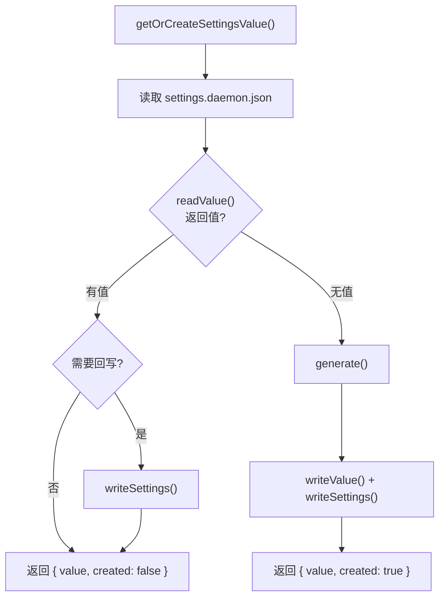

# Configuration 配置系统

**文件**:
- [`packages/daemon/src/configuration.ts`](/packages/daemon/src/configuration.ts) — 配置入口，单例管理
- [`packages/daemon/src/config/`](/packages/daemon/src/config/) — 各配置项的生成与持久化
- [`packages/daemon/src/config/memorySettings.ts`](/packages/daemon/src/config/memorySettings.ts) — 记忆设置与三档隔离裁决（agent-memory）
- [`packages/daemon/src/config/gitProject.ts`](/packages/daemon/src/config/gitProject.ts) — 会话目录 → git 项目名（与 vendored hook 探测算法一致）

Configuration 管理 daemon 的所有运行时配置，遵循统一的优先级策略，确保配置可追溯、可持久化。

## 记忆设置与三档隔离（agent-memory）

`settings.daemon.json` 的 `memory` 段（形状单源 `@mobi/shared` MemorySettingsSchema）。spawn 时 executor 逐次求值（`resolveMemoryEnv(directory, workspaceId)`）：读设置 → `resolveMemoryRule` 解析隔离规则（**路径规则最长前缀 > workspace 规则按 spawn 的 workspaceId > 默认 normal**）→ `resolveGitProjectName` 展开 tag → 按（档位 × tag）幂等生成 per-scope hindsight 配置文件（`<dataDir>/memory/hindsight/projects/<mode>-<tag>.json`，isolated 的 bank 覆盖进文件名防同 tag 互写）→ 返回注入子进程的 env（`MOBI_MEMORY_ENGINE` / `HINDSIGHT_API_URL` / `HINDSIGHT_API_TOKEN` / `HINDSIGHT_CONFIG`）。三档语义（normal/open/isolated）与设置项见 `docs/configuration.md`。

> 2026-09-05 起配置按部署归属拆分：daemon 配置在 `settings.daemon.json`，cli 配置在 `settings.cli.json`（归 cli 包所有，见 `docs/configuration.md`）。daemon 与 cli 支持不同机器部署。501 起文件名读旧写新（旧 `settings.hub.json` 首启自动 rename）。

## 配置文件拆分迁移

**文件**: [`packages/daemon/src/config/migrateSettings.ts`](/packages/daemon/src/config/migrateSettings.ts)

旧单文件 `settings.json` → `settings.daemon.json` + `settings.cli.json` 的自动迁移，在 `createConfiguration()` 加载服务器设置**之前**执行：



| 语义 | 行为 |
|------|------|
| 无旧文件 | 幂等跳过 |
| 解析失败 | fail-fast 终止启动（由调用方报错），不动任何文件 |
| 新文件已存在（如升级后先跑过 wizard） | 旧字段仅补缺、不覆盖新值，之后同样归档 |
| 旧文件无 cli 专属字段且 cli 文件不存在 | 不写空 `{}` 占位 cli 文件（避免阻断 co-located cliApiToken 同步） |

> cli 侧另有对称的单侧迁移（`packages/node-core/src/persistence.ts` 的 `migrateLegacyCliSettings`）：
> 远程部署形态下 daemon 的迁移够不到 cli 机器，cli 命令执行时把旧文件的 cli 专属字段
> 补缺搬进本机 `settings.cli.json`，不归档旧文件（归档权在本迁移）。

## 配置优先级

所有配置项遵循同一优先级链：


| 优先级 | 来源 | 说明 |
|--------|------|------|
| 1 | 环境变量 | 最高优先级，运行时覆盖 |
| 2 | `settings.daemon.json` | 持久化存储，跨重启保留 |
| 3 | 默认值 | 内置默认配置 |

**关键行为**：当配置来自环境变量且 `settings.daemon.json` 中不存在时，会自动写入文件。这确保了：
- 首次通过环境变量设置的值不会丢失
- 后续重启即使未设置环境变量也能从文件读取

## 整体架构



## Configuration 类

Configuration 是异步创建的只读单例，在 `main()` 中初始化：

```typescript
// 创建（只能调用一次）
const config = await createConfiguration()

// 获取（必须先创建）
const config = getConfiguration()

// Proxy 便捷访问（兼容旧代码）
configuration.listenPort
```

### 配置项一览

| 属性 | 类型 | 环境变量 | 默认值 | 持久化 |
|------|------|----------|--------|--------|
| `dataDir` | `string` | `MOBI_HOME` | `~/.mobi` | 不持久化 |
| `dbPath` | `string` | `DB_PATH` | `{dataDir}/mobi.db` | 不持久化 |
| `settingsFile` | `string` | — | `{dataDir}/settings.daemon.json` | 不持久化 |
| `listenHost` | `string` | `MOBI_LISTEN_HOST` | `127.0.0.1` | `settings.daemon.json` |
| `listenPort` | `number` | `MOBI_LISTEN_PORT` | `2222` | `settings.daemon.json` |
| `publicUrl` | `string` | `MOBI_PUBLIC_URL` | `http://localhost:{port}` | `settings.daemon.json` |
| `corsOrigins` | `string[]` | `CORS_ORIGINS` | 从 publicUrl 派生 | `settings.daemon.json` |
| `cliApiToken` | `string` | `CLI_API_TOKEN` | 自动生成 | `settings.daemon.json` |
| `webApiToken` | `string` | `WEB_API_TOKEN` | 自动生成 | `settings.daemon.json` |

> `dataDir` 和 `dbPath` 仅通过环境变量设置，不持久化到 `settings.daemon.json`。

## 配置项详解

### 服务器设置（ServerSettings）

**文件**: [`packages/daemon/src/config/serverSettings.ts`](/packages/daemon/src/config/serverSettings.ts)

加载 `listenHost`、`listenPort`、`publicUrl`、`corsOrigins` 四项配置：



**CORS 特殊处理**：

| 场景 | 行为 |
|------|------|
| 设置 `CORS_ORIGINS=*` | 仅保留 `["*"]` |
| 设置具体域名 | 通过 `new URL()` 标准化 |
| 未设置 | 从 `publicUrl` 自动派生 origin |

### CLI API Token

**文件**: [`packages/daemon/src/config/cliApiToken.ts`](/packages/daemon/src/config/cliApiToken.ts)

CLI 客户端认证用的共享密钥，三级来源：



**安全机制**：

| 机制 | 说明 |
|------|------|
| 弱 token 检测 | 纯数字、重复字符、常见前缀（`password`、`secret`）触发警告 |
| Namespace 去除 | 如果 token 包含 `:` 后缀，自动剥离并警告 |
| 自动持久化 | 环境变量首次使用时写入文件，防止丢失 |
| 加密安全生成 | 32 字节（256 位）随机数，base64url 编码 |

### Web API Token

**文件**: [`packages/daemon/src/config/webApiToken.ts`](/packages/daemon/src/config/webApiToken.ts)

Web 浏览器登录专用密钥（`POST /api/auth` 的校验源），与 CLI 的 `cliApiToken` **完全独立、互不通用**。三级来源：环境变量 `WEB_API_TOKEN` > `settings.daemon.json` > 自动生成（32 字节 base64url）。

| 属性 | 说明 |
|------|------|
| 用途 | Web 登录（换 JWT）；不可访问 `/cli/*` |
| 生成 | 32 字节（256 位）随机数，base64url 编码 |
| 自动持久化 | 环境变量首次使用时写入文件，防止丢失 |
| 热轮换 | `mobi auth rotate-web-token` 经 daemon API（`POST /cli/web-token`，cliApiToken 鉴权）调用 `rotateWebApiToken()` 落盘并即时热更新 configuration 单例；settingsWatcher 兜底监听文件变化，无需重启 daemon。远程部署（cli/daemon 不同机器）下 API 是唯一轮换途径 |

> 轮换后已签发的 JWT 最长 1 天自然失效；新登录需用新 webApiToken。查看当前值：`mobi auth web-token`。

### JWT Secret

**文件**: [`packages/daemon/src/config/jwtSecret.ts`](/packages/daemon/src/config/jwtSecret.ts)

Web 端 JWT 签名密钥，独立存储在 `jwt-secret.json` 中：

| 属性 | 说明 |
|------|------|
| 格式 | 32 字节随机数，base64 编码 |
| 存储 | `{dataDir}/jwt-secret.json` |
| 权限 | `0o600`（仅所有者可读写） |
| 验证 | Zod schema 验证文件格式和密钥长度 |

### VAPID Keys

**文件**: [`packages/daemon/src/config/vapidKeys.ts`](/packages/daemon/src/config/vapidKeys.ts)

Web Push 通知的 VAPID 密钥对，存储在 `settings.daemon.json` 中：

| 属性 | 说明 |
|------|------|
| 生成 | `web-push` 库的 `generateVAPIDKeys()` |
| 存储 | `settings.daemon.json` 的 `vapidKeys` 字段 |
| 用途 | PushService 推送时的身份验证 |

### Owner ID

**文件**: [`packages/daemon/src/config/ownerId.ts`](/packages/daemon/src/config/ownerId.ts)

daemon 所有者的数字标识，用于 CLI 认证：

| 属性 | 说明 |
|------|------|
| 格式 | 6 字节随机正整数 |
| 存储 | `{dataDir}/owner-id.json` |
| 缓存 | 内存缓存，首次加载后不再读文件 |
| 验证 | Zod schema 验证为安全正整数 |

## 通用持久化工具

### getOrCreateSettingsValue

**文件**: [`packages/daemon/src/config/generators.ts`](/packages/daemon/src/config/generators.ts)

"存在则读取，不存在则生成并保存"的通用模式，操作 `settings.daemon.json` 中的字段：



使用者：`cliApiToken`、`vapidKeys`

### getOrCreateJsonFile

同文件中的另一个通用模式，操作独立的 JSON 文件：

- 自动创建目录（权限 `0o700`）
- 原子写入（先写 `.tmp` 再 `rename`）
- 文件权限设为 `0o600`

使用者：`jwtSecret`、`ownerId`

### Settings 读写

**文件**: [`packages/daemon/src/config/settings.ts`](/packages/daemon/src/config/settings.ts)

`settings.daemon.json` 的底层读写与锁协议：

| 函数 | 说明 |
|------|------|
| `getSettingsFile(dataDir)` | 返回 `settings.daemon.json` 路径 |
| `getCliSettingsFile(dataDir)` | 返回 `settings.cli.json` 路径（迁移/同步代写用） |
| `getLegacySettingsFile(dataDir)` | 返回旧 `settings.json` 路径（迁移用） |
| `readSettings()` | 读取并解析 JSON，解析失败返回 `null`（不覆盖） |
| `readSettingsOrThrow()` | 读取失败抛出错误 |
| `writeSettings()` | 原子写入（`.tmp` + `rename`），调用方须持锁 |
| `withSettingsLock()` | 文件锁（`.lock` wx 独占 + 重试 + stale 清理，与 cli 侧对称） |
| `updateSettingsFile()` | 锁内读-改-写统一入口；泛型支持对 cli 文件做受限写 |

> 所有 daemon 对设置文件的写都必须走 `updateSettingsFile`（或持锁后 `writeSettings`），与 cli 侧受限写互斥，避免整文件覆盖丢字段。

## 代码结构

```
packages/daemon/src/
├── configuration.ts          # Configuration 单例 + createConfiguration()（含迁移触发、co-located cliApiToken 同步）
└── config/
    ├── migrateSettings.ts    # 旧 settings.json 自动迁移（拆分 + 补缺合并 + .bak 归档）
    ├── cliApiToken.ts        # CLI API Token 管理
    ├── webApiToken.ts        # Web API Token 管理（与 cliApiToken 独立；含 rotateWebApiToken）
    ├── settingsWatcher.ts    # settings.daemon.json 监听（webApiToken 热轮换）
    ├── serverSettings.ts     # 服务器设置（host/port/CORS）
    ├── jwtSecret.ts          # JWT 签名密钥
    ├── vapidKeys.ts          # Web Push VAPID 密钥
    ├── ownerId.ts            # 所有者 ID
    ├── generators.ts         # 通用 getOrCreate 模式（锁内读-改-写）
    └── settings.ts           # settings.daemon.json 读写 + 锁协议
```

## 文件分布

```
~/.mobi/
├── settings.daemon.json       # daemon 配置（服务器设置、CLI/Web Token、VAPID Keys）
├── settings.cli.json       # CLI 配置（claudeEnv/webTools 等，归 cli 所有）
├── jwt-secret.json     # JWT 密钥（独立文件，权限 600）
├── owner-id.json       # 所有者 ID（独立文件，权限 600）
└── mobi.db             # SQLite 数据库
```

## 环境变量汇总

| 环境变量 | 配置项 | 持久化 |
|----------|--------|--------|
| `MOBI_HOME` | 数据目录 | 不持久化 |
| `DB_PATH` | 数据库路径 | 不持久化 |
| `MOBI_LISTEN_HOST` | 监听地址 | `settings.daemon.json` |
| `MOBI_LISTEN_PORT` | 监听端口 | `settings.daemon.json` |
| `MOBI_PUBLIC_URL` | 公开 URL | `settings.daemon.json` |
| `CORS_ORIGINS` | CORS 来源 | `settings.daemon.json` |
| `CLI_API_TOKEN` | CLI 认证 Token（CLI 专用） | `settings.daemon.json` |
| `WEB_API_TOKEN` | Web 登录 Token（Web 专用，与 CLI 独立） | `settings.daemon.json` |
| `VAPID_SUBJECT` | Web Push 联系方式 | 不持久化 |
