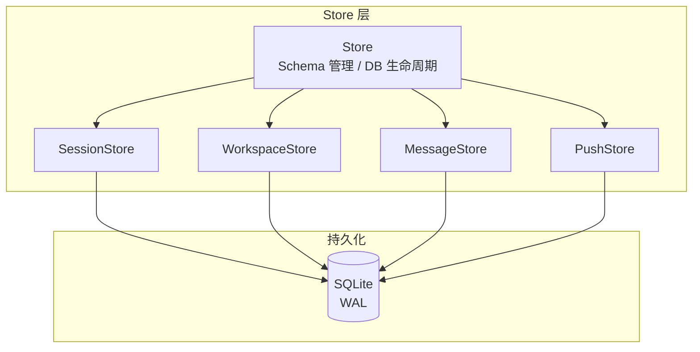

# Store 数据层

**文件**: [`packages/daemon/src/store/index.ts`](/packages/daemon/src/store/index.ts)

SQLite 数据库封装，使用 Bun 原生 SQLite，WAL 模式。

## 整体架构



## Store 子模块

| 子 Store | 职责 |
|----------|------|
| **SessionStore** | 会话 CRUD、按工作区 / 「最近」分页查询（workspaceId 游标）、置顶、metadata / agentState / runtimeState 乐观锁更新 |
| **WorkspaceStore** | 工作区 CRUD（folders 校验）、删除时同事务解绑名下会话 |
| **MessageStore** | 消息追加、按位置分页查询（byPosition）、sidechain 查询、排队消息 push/cancel/ack |
| **PushStore** | Web Push 订阅管理（按命名空间） |

## 数据库配置

```typescript
PRAGMA journal_mode = WAL     // 写前日志，提升并发
PRAGMA synchronous = NORMAL   // 平衡性能和安全
PRAGMA foreign_keys = ON      // 启用外键约束
PRAGMA busy_timeout = 5000    // 5 秒超时
```

## Schema 版本管理

使用 `PRAGMA user_version` 跟踪 schema 版本，由 `/db-schema` skill 管理变更流程：

| `SCHEMA_RELEASE_BASELINE` | 状态 | 变更方式 |
|---|---|---|
| `0` | 未发布 | 直接修改 `createSchema()` |
| `> 0` | 已发布 | 递增 `SCHEMA_VERSION`，编写迁移方法 |

## 表结构

### sessions

| 字段 | 类型 | 约束 | 说明 |
|------|------|------|------|
| id | TEXT | PRIMARY KEY | 会话 ID |
| tag | TEXT | | 会话标签 |
| namespace | TEXT | NOT NULL DEFAULT 'default' | 命名空间 |
| created_at | INTEGER | NOT NULL | 创建时间 |
| updated_at | INTEGER | NOT NULL | 更新时间 |
| metadata | TEXT | | 元数据（JSON） |
| metadata_version | INTEGER | DEFAULT 1 | metadata 乐观锁版本号 |
| agent_state | TEXT | | Agent 状态（JSON） |
| agent_state_version | INTEGER | DEFAULT 1 | agentState 乐观锁版本号 |
| runtime_state | TEXT | | 运行时状态（JSON） |
| runtime_state_updated_at | INTEGER | | 运行时状态最后更新时间 |
| workspace_id | TEXT | | 归属工作区（NULL = 游离，进「最近」） |
| pinned | INTEGER | DEFAULT 0 | 置顶 |
| seq | INTEGER | DEFAULT 0 | 序号 |

**索引**:
- `idx_sessions_tag` → `(tag)`
- `idx_sessions_tag_namespace` → `(tag, namespace)`
- `idx_sessions_workspace` → `(workspace_id)`

### workspaces

「工作区实体化」引入的工作区实体，会话通过 `sessions.workspace_id` 归属工作区。machineId 已随 remove-machine 彻底删除（ADR 0011）——folders 即宿主本地路径。

| 字段 | 类型 | 约束 | 说明 |
|------|------|------|------|
| id | TEXT | PRIMARY KEY | 工作区 ID（UUID） |
| namespace | TEXT | NOT NULL DEFAULT 'default' | 命名空间 |
| name | TEXT | NOT NULL | 工作区名称 |
| folders | TEXT | NOT NULL | 源文件夹列表（JSON，`[{ path, primary }]`，恰好一项 primary） |
| created_at | INTEGER | NOT NULL | 创建时间 |
| updated_at | INTEGER | NOT NULL | 更新时间 |
| seq | INTEGER | DEFAULT 0 | 序号 |

**索引**:
- `idx_workspaces_namespace` → `(namespace)`

**删除语义**：`deleteWorkspace()` 在同一事务内将名下会话解绑（`workspace_id` 置 NULL，并成对递增 `updated_at`/`seq` 以便 SSE 增量同步感知），会话本身不删。存量库的 `group_key` 数据由一次性脚本 `scripts/migrate-workspaces.ts` 回填为工作区实体。

### messages

| 字段 | 类型 | 约束 | 说明 |
|------|------|------|------|
| id | TEXT | PRIMARY KEY | 消息 ID |
| session_id | TEXT | NOT NULL, FK → sessions(id) ON DELETE CASCADE | 会话 ID |
| content | TEXT | NOT NULL | 消息内容（JSON） |
| created_at | INTEGER | NOT NULL | 创建时间 |
| seq | INTEGER | NOT NULL | 序号 |
| local_id | TEXT | | 客户端本地 ID |
| native_id | TEXT | STORED 生成列 | 值恒等于 `metadata.nativeId`，供按锚点查询的索引 |
| metadata | TEXT | | 消息元数据（nativeId/nativeAckAt 等） |
| deleted_at | INTEGER | | 软删除时刻 |
| is_sidechain | INTEGER | NOT NULL DEFAULT 0 | 是否为 sidechain 消息 |
| parent_tool_use_id | TEXT | | 所属 tool_use 的消息 ID |
| category | TEXT | NOT NULL DEFAULT 'persistent' | 消息分类（persistent/ephemeral） |
| lifecycle | TEXT | | 用户消息生命周期（'queued'/'pushed'/'acked'/'processing'/'done'/'cancelled'/'discarded'/'refused'，'withdrawn' 撤回留档）；NULL 表示非排队轨道。写入单调推进（`advanceMessagesLifecycle`，CASE rank 防乱序回退，终态含 refused 互不覆盖） |
| lifecycle_at | INTEGER | | 最近一次 lifecycle 转换的时刻 |
| position_at | INTEGER | NOT NULL | 排序锚点（insert 时 = created_at，push 时跳到 push 时刻） |

**索引**:
- `idx_messages_session` → `(session_id, seq)`
- `idx_messages_session_main` → `(session_id, seq, is_sidechain)`
- `idx_messages_parent_tool` → `(parent_tool_use_id)`
- `idx_messages_local_id` → `UNIQUE (session_id, local_id) WHERE local_id IS NOT NULL`
- `idx_messages_native_id` → `(session_id, native_id) WHERE native_id IS NOT NULL`
- `idx_messages_session_position` → `(session_id, position_at DESC, seq DESC)`（byPosition 分页）
- `idx_messages_session_queued` → `(session_id) WHERE lifecycle = 'queued'`（部分索引，悬浮排队消息查询）

**迁移**：存量库的 `queue_state`/`submitted_at` 列 → `lifecycle`/`lifecycle_at` 由一次性脚本 `scripts/migrate-lifecycle-p1.sql`（表重建法，含 `.bail on`）在 deploy 前手动执行。

### push_subscriptions

| 字段 | 类型 | 约束 | 说明 |
|------|------|------|------|
| id | INTEGER | PRIMARY KEY AUTOINCREMENT | 订阅 ID |
| namespace | TEXT | NOT NULL | 命名空间 |
| endpoint | TEXT | NOT NULL | Push 端点 URL |
| p256dh | TEXT | NOT NULL | 公钥 |
| auth | TEXT | NOT NULL | 认证密钥 |
| created_at | INTEGER | NOT NULL | 创建时间 |

**约束**:
- `UNIQUE(namespace, endpoint)`

**索引**:
- `idx_push_subscriptions_namespace` → `(namespace)`

## 代码入口

```
packages/daemon/src/store/
├── index.ts              # Store 主入口（DB 生命周期、Schema 管理）
├── types.ts              # Stored* 类型定义、VersionedUpdateResult
├── json.ts               # safeJsonParse 工具函数
├── versionedUpdates.ts   # 乐观锁通用更新 updateVersionedField()
├── sessions.ts           # 会话 SQL 操作（底层函数）
├── sessionStore.ts       # SessionStore 类（委托 sessions.ts）
├── workspaces.ts         # 工作区 SQL 操作（底层函数，含删除时解绑会话）
├── workspaceStore.ts     # WorkspaceStore 类（委托 workspaces.ts）
├── messages.ts           # 消息 SQL 操作（底层函数）
├── messageStore.ts       # MessageStore 类（委托 messages.ts）
├── pushSubscriptions.ts  # Push 订阅 SQL 操作（底层函数）
└── pushStore.ts          # PushStore 类（委托 pushSubscriptions.ts）
```

每个子模块采用 **Store 类 + SQL 函数文件** 的分层模式：Store 类封装业务接口，同名（小写）文件包含纯 SQL 操作函数，两者通过 `Database` 实例连接。
