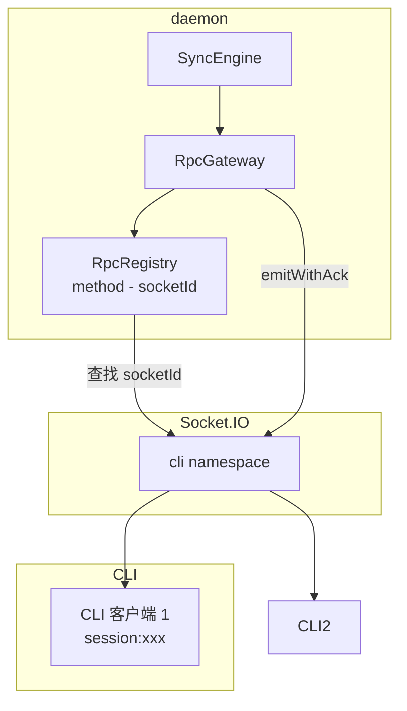
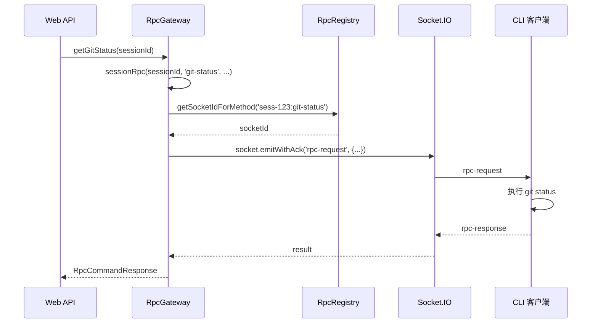

# RpcGateway

**文件**:
- [`packages/daemon/src/sync/rpcGateway.ts`](/packages/daemon/src/sync/rpcGateway.ts)
- [`packages/daemon/src/socket/rpcRegistry.ts`](/packages/daemon/src/socket/rpcRegistry.ts)

RPC 网关，通过 Socket.IO 调用 CLI 的功能。

## 架构



## 核心组件

### RpcRegistry

管理 RPC 方法到 Socket 的映射。

| 方法 | 作用 |
|------|------|
| `register(socket, method)` | 注册方法（CLI 连接时调用） |
| `unregister(socket, method)` | 注销单个方法 |
| `unregisterAll(socket)` | 注销该 socket 的所有方法（断开时调用） |
| `getSocketIdForMethod(method)` | 查找方法对应的 socketId |

**Method 命名规则**：
- Session 级别：`{sessionId}:{method}`（如 `sess-123:git-status`）

> machine 级 RPC（原 `{machineId}:{method}`）已随 machine 通道删除本地直调化（ExecutorHost，
> ticket-17/20 / remove-machine），本网关只剩会话族。

### RpcGateway

发起 RPC 调用。

| 方法 | 作用 | RPC Method |
|------|------|------------|
| `approvePermission` | 批准权限请求 | `{sessionId}:permission` |
| `denyPermission` | 拒绝权限请求 | `{sessionId}:permission` |
| `abortSession` | 中止会话（`stopKind` 三档：`turn`/`turn-queue`/`turn-queue-tasks`，缺省 `turn`；后两档 daemon 侧同步 `cancelAllQueuedMessages` 批量清 queued 行） | `{sessionId}:abort` |
| `switchSession` | 切换 local/remote | `{sessionId}:switch` |
| `requestSessionConfig` | 请求配置更新 | `{sessionId}:set-session-config` |
| `requestRename` | 回写 CC customTitle（Mobi → CC 标题同步，best-effort） | `{sessionId}:rename-session` |
| `killSession` | 杀死会话 | `{sessionId}:killSession` |
| `getGitStatus` | 获取 Git 状态 | `{sessionId}:git-status` |
| `readSessionFile` | 读取文件 | `{sessionId}:readFile` |
| `listDirectory` | 列出目录 | `{sessionId}:listDirectory` |
| `uploadFile` | 上传文件 | `{sessionId}:uploadFile` |
| `deleteUploadFile` | 删除上传文件 | `{sessionId}:deleteUpload` |
| `searchSessionFiles` | 搜索会话文件 | `{sessionId}:searchSessionFiles` |
| `listSessionDirectory` | 列出会话目录 | `{sessionId}:listSessionDirectory` |
| `refreshMetadata` | 刷新 SDK 元数据 | `{sessionId}:refreshMetadata` |
| `stopTask` | 停止后台任务 | `{sessionId}:stop-task` |
| `runRipgrep` | 搜索代码 | `{sessionId}:ripgrep` |
| `cancelCliQueuedMessage` | 取消 CLI 内存队列中缓冲的排队消息（两阶段取消的 CLI 侧） | `{sessionId}:cancel-queued-message` |

## RPC 调用流程



## RPC 超时

```typescript
// 30 秒超时
socket.timeout(30_000).emitWithAck('rpc-request', {
    method,
    params: JSON.stringify(params)
})
```

## 错误处理

失败一律以**带分类**的 `RpcFailure` 抛出（`sync/rpcFailure.ts`）：`kind` 是给程序分支的、稳定的三元值，`message` 是给人看的句子。

| 错误 | 场景 | kind |
|------|------|------|
| `RPC handler not registered` | 方法未注册（CLI 未连接或已断开） | `unreachable` |
| `RPC socket disconnected` | Socket 已断开 | `unreachable` |
| 超时 | CLI 30 秒内未响应（socket.io 文案 `operation has timed out`） | `timeout` |
| 其他传输异常 | 框架/序列化等 | `other` |

**分类在产生它的这一层定下**——`unreachable` 两句由 `rpcCall` 自己抛出时直接带上，不再靠下游读文案反解。剩下还在读句子的只有**别处产出的散文**（socket.io 的 ack 超时、executor lifecycle 的 `Session webhook timeout for PID N`），判据集中在文件内的 `classifyTransportFailure`，要彻底拆掉它得让 executor 的回执带结构化字段（见 `docs/pending.md` #78）。

`spawnSession` 把异常收敛成结果值，失败支同样带上分类（`{ type:'error'; message; failure }`）——这条链路里混着 rpcCall 的分类错、executor 的人话与本地合成句，分类在这里一次定完。`SyncEngine.spawnSession`（Web 出口）只透出 `message`，分类是 daemon 内部的说法，不进 HTTP body。
