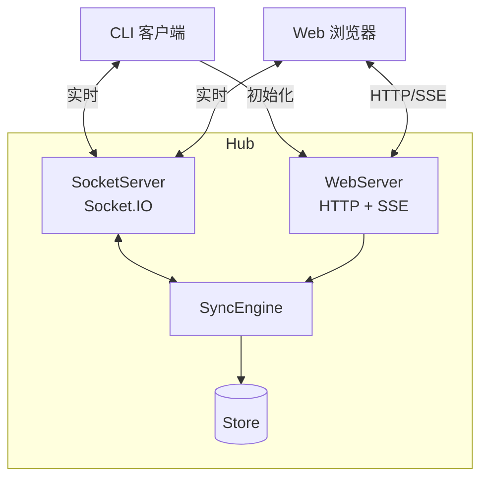
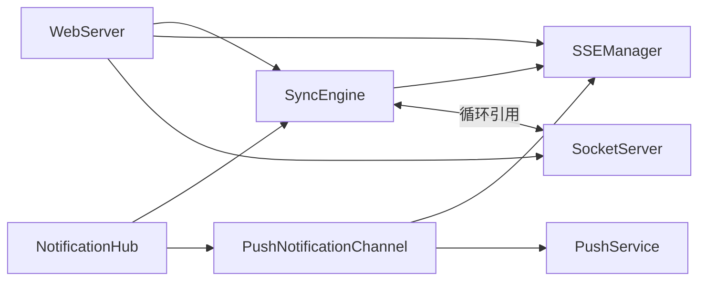

# Hub 模块

Hub 是 Mobi 的核心服务器，连接 CLI 客户端和 Web 前端。

## 新人指引

### 前置知识

阅读本文档前，建议了解以下概念：

- **Socket.IO**：实时双向通信框架，Hub 用它管理 CLI 和 Web 的实时连接
- **SSE (Server-Sent Events)**：服务器单向推送协议，Hub 用它向 Web 推送实时事件
- **SQLite (WAL 模式)**：嵌入式数据库，Hub 用它持久化会话、消息等数据
- **Web Push (VAPID)**：浏览器推送通知协议，Hub 用它实现离线通知

### 建议阅读顺序

1. **本文件** — 建立整体架构认知
2. [Configuration](./config) — 了解配置体系，后续模块都依赖配置
3. [Store](./store) — 了解数据存储层，SyncEngine 在此基础上运作
4. [SyncEngine](./sync) — **核心模块**，建议按 README → 各子文档的顺序精读
5. [SocketServer](./socket) — CLI 连接管理，先看 README，再按需查看 handlers / rpc / terminal
6. [WebServer](./web) — HTTP API 层，先看 README 和 auth，再按需查看各 API 端点
7. [SSEManager](./sse) — Web 实时推送
8. [VisibilityTracker](./visibility) — 页面可见性追踪（影响通知策略）
9. [NotificationHub](./notification) → [PushService](./push) — 通知链路

### 术语表

| 术语 | 含义 |
|------|------|
| **Session** | 一次 Agent 会话，对应 CLI 的一次 `claude` 运行实例 |
| **Machine** | 一台运行 CLI 的机器，一个 Machine 可运行多个 Session |
| **Namespace** | Socket.IO 的多租户隔离机制，Hub 使用 `/cli`（CLI 连接）和 `/web`（Web 连接）两个 namespace |
| **SyncEvent** | SyncEngine 产生的事件，如 `session-updated`、`message-created`，用于通知其他组件 |
| **RpcGateway** | Web → CLI 的远程调用网关，支持权限审批、文件操作、Git 操作等 |
| **SyncEngine** | 核心同步引擎，协调所有数据操作（Session、Machine、Message），是 Hub 的"大脑" |
| **Store** | SQLite 数据存储层，提供 Cache（内存缓存）和 Persistence（持久化）两层抽象 |
| **Terminal** | 终端通道，CLI ↔ Web 的实时双向终端 I/O，不经过 SyncEngine |
| **VAPID** | Voluntary Application Server Identification，Web Push 的服务器身份验证协议 |
| **SSE** | Server-Sent Events，服务器向浏览器单向推送事件的协议 |
| **Visibility** | 页面可见性状态（visible/hidden），影响通知策略——可见时用 SSE 推送，不可见时用 Web Push |

## 整体架构



## 数据通道

### 上行流（CLI → Hub → Web）

| 路径 | 场景 |
|------|------|
| **HTTP** | 会话/机器初始化、消息回填 |
| **Socket.IO** | 心跳、消息、状态更新、终端事件 |

### 下行流（Web → Hub → CLI）

| 路径 | 场景 |
|------|------|
| **MessageService** | 发送消息 |
| **RpcGateway** | 权限操作、会话控制、文件操作、Git 操作 |

### 终端通道

CLI ↔ Socket.IO(/terminal) ↔ Web，实时双向，不经过 SyncEngine。

详见 [SyncEngine 架构](./sync)。

## 核心组件

| 组件 | 职责 |
|------|------|
| **[Configuration](./config)** | 配置管理，统一优先级与持久化 |
| **[SyncEngine](./sync)** | 同步引擎，协调所有数据操作 |
| **[SocketServer](./socket)** | Socket.IO 服务器，处理 CLI 连接 |
| **[WebServer](./web)** | HTTP 服务器，提供 API 和静态资源 |
| **[SSEManager](./sse)** | 管理 SSE 连接，向 Web 推送实时事件 |
| **[VisibilityTracker](./visibility)** | 页面可见性追踪，通知降级策略 |
| **[PushService](./push)** | Web Push 通知，离线时推送通知 |
| **[NotificationHub](./notification)** | 通知调度，监听事件并分发通知 |
| **[Store](./store)** | 数据存储，SQLite 数据库 |

## 组件依赖关系

箭头方向：A → B 表示 A 依赖 B



- **Store** 被 SyncEngine、PushService、WebServer 共享依赖
- **VisibilityTracker** 被 SSEManager、PushNotificationChannel、WebServer 共享依赖
- **循环引用**：SocketServer ↔ SyncEngine，通过 lazy getter 解决
- **通知链路**：SyncEngine → NotificationHub → PushNotificationChannel → SSEManager / PushService

## 启动流程

```mermaid
flowchart LR
    A[Configuration] --> B[Store]
    B --> C[JwtSecret]
    C --> D[VapidKeys]
    D --> E[PushService]
    E --> F[VisibilityTracker]
    F --> G[SSEManager]
    G --> H[SocketServer]
    H --> I[SyncEngine]
    I --> J[PushNotificationChannel]
    J --> K[NotificationHub]
    K --> L[WebServer]
    L --> M[就绪]
```



## 代码入口

```
packages/hub/src/
├── index.ts                     # 主入口，组件组装
├── configuration.ts             # 配置管理
├── config/
│   ├── jwtSecret.ts             # JWT 密钥
│   └── vapidKeys.ts             # VAPID 密钥
├── sync/
│   ├── syncEngine.ts            # 同步引擎
│   ├── backgroundTasks.ts       # 后台任务增量提取
│   └── tasks.ts                 # 任务增量提取与合并
├── socket/
│   └── server.ts                # Socket.IO 服务器
├── web/
│   ├── server.ts                # HTTP 服务器
│   └── routes/
│       └── manifest.ts          # PWA Manifest 路由
├── sse/
│   └── sseManager.ts            # SSE 管理器
├── visibility/
│   └── visibilityTracker.ts     # 可见性追踪
├── push/
│   └── pushService.ts           # Web Push 服务
├── notifications/
│   └── notificationHub.ts       # 通知中心
├── store/
│   ├── index.ts                 # 数据存储
│   ├── json.ts                  # JSON 序列化/反序列化工具
│   ├── versionedUpdates.ts      # 乐观锁版本化更新
│   └── pushSubscriptions.ts     # 推送订阅存储
├── utils/
│   ├── accessToken.ts           # Access Token 工具
│   ├── bunCompiled.ts           # 编译模式检测
│   └── crypto.ts                # 加密工具
└── types/
    └── webAssetImports.d.ts     # Web 资源类型声明
```
