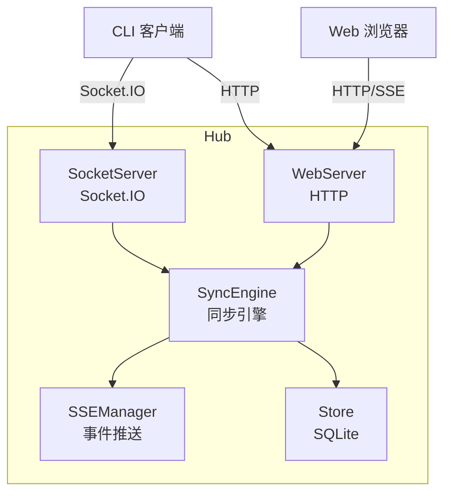
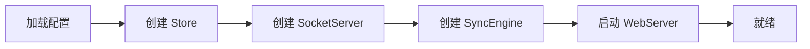

# Hub 模块

Hub 是 Mobi 的核心服务器。

## 整体架构



## 核心组件

| 组件 | 职责 |
|------|------|
| **SyncEngine** | 同步引擎，协调所有数据操作 |
| **SocketServer** | Socket.IO 服务器，处理 CLI 连接 |
| **[WebServer](./web-server)** | HTTP 服务器，提供 API 和静态资源 |
| **SSEManager** | 管理 SSE 连接，向 Web 推送实时事件 |
| **Store** | 数据存储，SQLite 数据库 |

## 启动流程



## 代码入口

```
hub/src/
├── index.ts           # 主入口
├── sync/
│   └── syncEngine.ts  # 同步引擎
├── socket/
│   └── server.ts      # Socket.IO 服务器
├── web/
│   └── server.ts      # HTTP 服务器
├── sse/
│   └── sseManager.ts  # SSE 管理器
└── store/
    └── index.ts       # 数据存储
```
