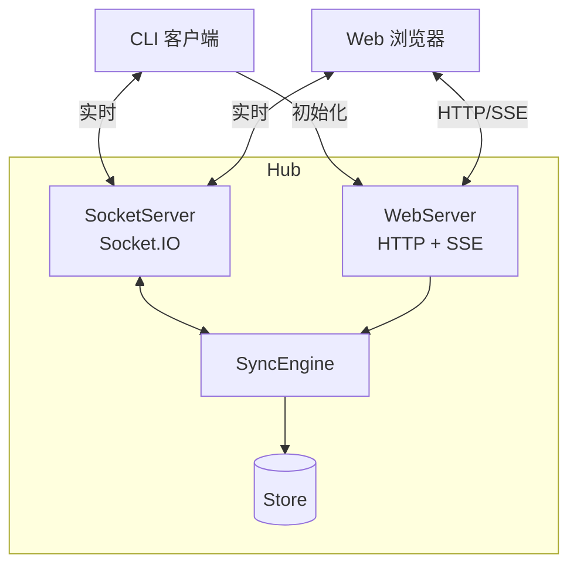
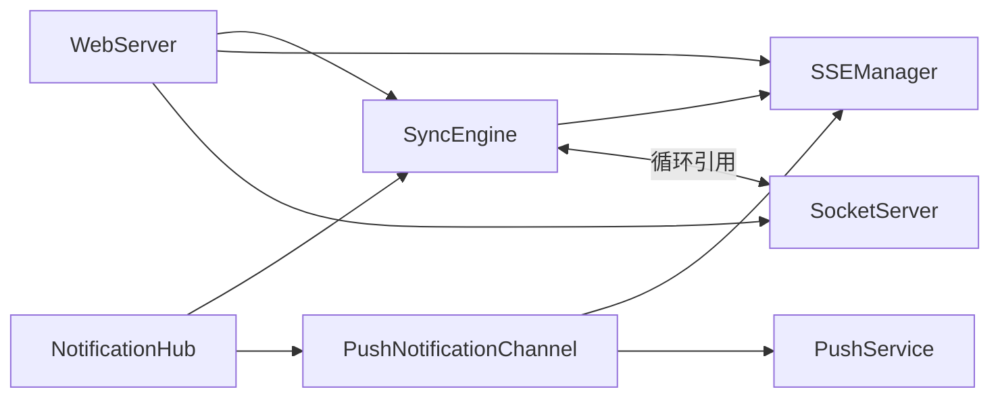

# Hub 模块

Hub 是 Mobi 的核心服务器，连接 CLI 客户端和 Web 前端。

## 整体架构



## 数据通道

### 上行流（CLI → Hub → Web）

| 路径 | 场景 |
|------|------|
| **HTTP** | 会话/机器初始化、消息回填 |
| **Socket.IO** | 心跳、消息、状态更新、终端事件 |

### 下行流（Web → Hub → CLI）

| 路径 | 场景 |
|------|------|
| **MessageService** | 发送消息 |
| **RpcGateway** | 权限操作、会话控制、文件操作、Git 操作 |

### 终端通道

CLI ↔ Socket.IO(/terminal) ↔ Web，实时双向，不经过 SyncEngine。

详见 [SyncEngine 架构](./sync)。

## 核心组件

| 组件 | 职责 |
|------|------|
| **[SyncEngine](./sync)** | 同步引擎，协调所有数据操作 |
| **[SocketServer](./socket)** | Socket.IO 服务器，处理 CLI 连接 |
| **[WebServer](./web)** | HTTP 服务器，提供 API 和静态资源 |
| **[SSEManager](./sse)** | 管理 SSE 连接，向 Web 推送实时事件 |
| **[PushService](./push)** | Web Push 通知，离线时推送通知 |
| **[NotificationHub](./notification)** | 通知调度，监听事件并分发通知 |
| **[Store](./store)** | 数据存储，SQLite 数据库 |

## 组件依赖关系

箭头方向：A → B 表示 A 依赖 B



- **Store** 被 SyncEngine、PushService、WebServer 共享依赖
- **VisibilityTracker** 被 SSEManager、PushNotificationChannel、WebServer 共享依赖
- **循环引用**：SocketServer ↔ SyncEngine，通过 lazy getter 解决
- **通知链路**：SyncEngine → NotificationHub → PushNotificationChannel → SSEManager / PushService

## 启动流程


## 代码入口

```
hub/src/
├── index.ts                     # 主入口，组件组装
├── configuration.ts             # 配置管理
├── config/
│   ├── jwtSecret.ts             # JWT 密钥
│   └── vapidKeys.ts             # VAPID 密钥
├── sync/
│   └── syncEngine.ts            # 同步引擎
├── socket/
│   └── server.ts                # Socket.IO 服务器
├── web/
│   └── server.ts                # HTTP 服务器
├── sse/
│   └── sseManager.ts            # SSE 管理器
├── visibility/
│   └── visibilityTracker.ts     # 可见性追踪
├── push/
│   └── pushService.ts           # Web Push 服务
├── notifications/
│   └── notificationHub.ts       # 通知中心
└── store/
    └── index.ts                 # 数据存储
```
