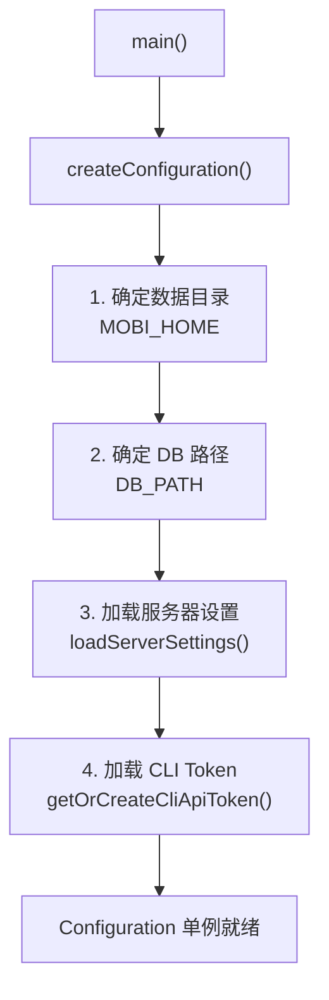
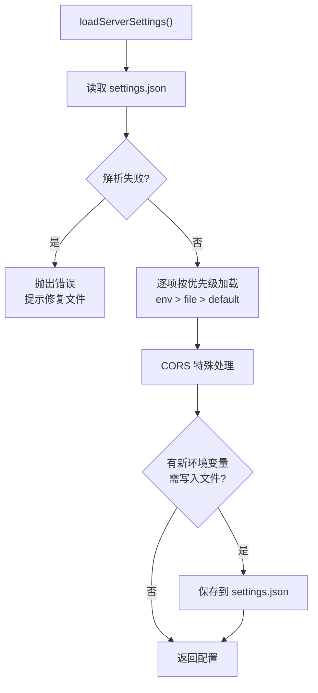
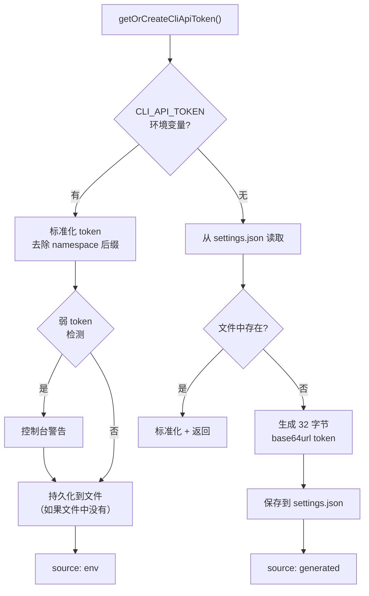
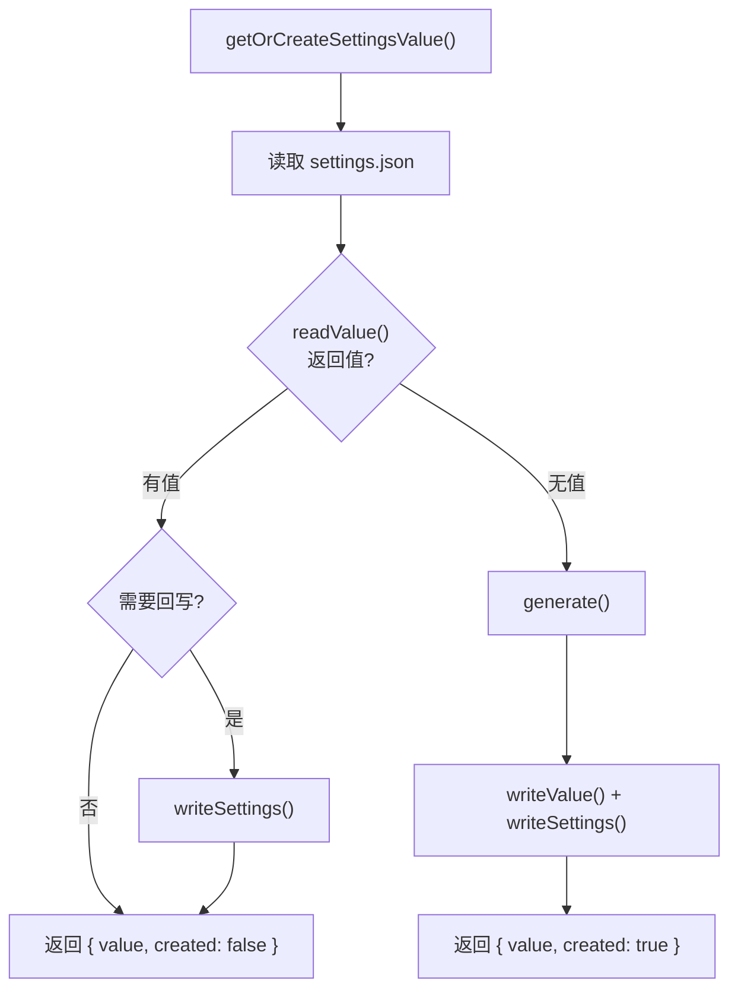

# Configuration 配置系统

**文件**:
- [`packages/hub/src/configuration.ts`](/packages/hub/src/configuration.ts) — 配置入口，单例管理
- [`packages/hub/src/config/`](/packages/hub/src/config/) — 各配置项的生成与持久化

Configuration 管理 Hub 的所有运行时配置，遵循统一的优先级策略，确保配置可追溯、可持久化。

## 配置优先级

所有配置项遵循同一优先级链：


| 优先级 | 来源 | 说明 |
|--------|------|------|
| 1 | 环境变量 | 最高优先级，运行时覆盖 |
| 2 | `settings.json` | 持久化存储，跨重启保留 |
| 3 | 默认值 | 内置默认配置 |

**关键行为**：当配置来自环境变量且 `settings.json` 中不存在时，会自动写入文件。这确保了：
- 首次通过环境变量设置的值不会丢失
- 后续重启即使未设置环境变量也能从文件读取

## 整体架构



## Configuration 类

Configuration 是异步创建的只读单例，在 `main()` 中初始化：

```typescript
// 创建（只能调用一次）
const config = await createConfiguration()

// 获取（必须先创建）
const config = getConfiguration()

// Proxy 便捷访问（兼容旧代码）
configuration.listenPort
```

### 配置项一览

| 属性 | 类型 | 环境变量 | 默认值 | 持久化 |
|------|------|----------|--------|--------|
| `dataDir` | `string` | `MOBI_HOME` | `~/.mobi` | 不持久化 |
| `dbPath` | `string` | `DB_PATH` | `{dataDir}/mobi.db` | 不持久化 |
| `settingsFile` | `string` | — | `{dataDir}/settings.json` | 不持久化 |
| `listenHost` | `string` | `MOBI_LISTEN_HOST` | `127.0.0.1` | `settings.json` |
| `listenPort` | `number` | `MOBI_LISTEN_PORT` | `2222` | `settings.json` |
| `publicUrl` | `string` | `MOBI_PUBLIC_URL` | `http://localhost:{port}` | `settings.json` |
| `corsOrigins` | `string[]` | `CORS_ORIGINS` | 从 publicUrl 派生 | `settings.json` |
| `cliApiToken` | `string` | `CLI_API_TOKEN` | 自动生成 | `settings.json` |
| `webApiToken` | `string` | `WEB_API_TOKEN` | 自动生成 | `settings.json` |

> `dataDir` 和 `dbPath` 仅通过环境变量设置，不持久化到 `settings.json`。

## 配置项详解

### 服务器设置（ServerSettings）

**文件**: [`packages/hub/src/config/serverSettings.ts`](/packages/hub/src/config/serverSettings.ts)

加载 `listenHost`、`listenPort`、`publicUrl`、`corsOrigins` 四项配置：



**CORS 特殊处理**：

| 场景 | 行为 |
|------|------|
| 设置 `CORS_ORIGINS=*` | 仅保留 `["*"]` |
| 设置具体域名 | 通过 `new URL()` 标准化 |
| 未设置 | 从 `publicUrl` 自动派生 origin |

### CLI API Token

**文件**: [`packages/hub/src/config/cliApiToken.ts`](/packages/hub/src/config/cliApiToken.ts)

CLI 客户端认证用的共享密钥，三级来源：



**安全机制**：

| 机制 | 说明 |
|------|------|
| 弱 token 检测 | 纯数字、重复字符、常见前缀（`password`、`secret`）触发警告 |
| Namespace 去除 | 如果 token 包含 `:` 后缀，自动剥离并警告 |
| 自动持久化 | 环境变量首次使用时写入文件，防止丢失 |
| 加密安全生成 | 32 字节（256 位）随机数，base64url 编码 |

### Web API Token

**文件**: [`packages/hub/src/config/webApiToken.ts`](/packages/hub/src/config/webApiToken.ts)

Web 浏览器登录专用密钥（`POST /api/auth` 的校验源），与 CLI 的 `cliApiToken` **完全独立、互不通用**。三级来源：环境变量 `WEB_API_TOKEN` > `settings.json` > 自动生成（32 字节 base64url）。

| 属性 | 说明 |
|------|------|
| 用途 | Web 登录（换 JWT）；不可访问 `/cli/*` |
| 生成 | 32 字节（256 位）随机数，base64url 编码 |
| 自动持久化 | 环境变量首次使用时写入文件，防止丢失 |
| 热轮换 | `mobi auth rotate-web-token` 重写 settings.json，hub 经 [`settingsWatcher.ts`](./settingsWatcher.ts)（fs.watch）热 reload，无需重启 |

> 轮换后已签发的 JWT 最长 1 天自然失效；新登录需用新 webApiToken。查看当前值：`mobi auth web-token`。

### JWT Secret

**文件**: [`packages/hub/src/config/jwtSecret.ts`](/packages/hub/src/config/jwtSecret.ts)

Web 端 JWT 签名密钥，独立存储在 `jwt-secret.json` 中：

| 属性 | 说明 |
|------|------|
| 格式 | 32 字节随机数，base64 编码 |
| 存储 | `{dataDir}/jwt-secret.json` |
| 权限 | `0o600`（仅所有者可读写） |
| 验证 | Zod schema 验证文件格式和密钥长度 |

### VAPID Keys

**文件**: [`packages/hub/src/config/vapidKeys.ts`](/packages/hub/src/config/vapidKeys.ts)

Web Push 通知的 VAPID 密钥对，存储在 `settings.json` 中：

| 属性 | 说明 |
|------|------|
| 生成 | `web-push` 库的 `generateVAPIDKeys()` |
| 存储 | `settings.json` 的 `vapidKeys` 字段 |
| 用途 | PushService 推送时的身份验证 |

### Owner ID

**文件**: [`packages/hub/src/config/ownerId.ts`](/packages/hub/src/config/ownerId.ts)

Hub 所有者的数字标识，用于 CLI 认证：

| 属性 | 说明 |
|------|------|
| 格式 | 6 字节随机正整数 |
| 存储 | `{dataDir}/owner-id.json` |
| 缓存 | 内存缓存，首次加载后不再读文件 |
| 验证 | Zod schema 验证为安全正整数 |

## 通用持久化工具

### getOrCreateSettingsValue

**文件**: [`packages/hub/src/config/generators.ts`](/packages/hub/src/config/generators.ts)

"存在则读取，不存在则生成并保存"的通用模式，操作 `settings.json` 中的字段：



使用者：`cliApiToken`、`vapidKeys`

### getOrCreateJsonFile

同文件中的另一个通用模式，操作独立的 JSON 文件：

- 自动创建目录（权限 `0o700`）
- 原子写入（先写 `.tmp` 再 `rename`）
- 文件权限设为 `0o600`

使用者：`jwtSecret`、`ownerId`

### Settings 读写

**文件**: [`packages/hub/src/config/settings.ts`](/packages/hub/src/config/settings.ts)

`settings.json` 的底层读写：

| 函数 | 说明 |
|------|------|
| `readSettings()` | 读取并解析 JSON，解析失败返回 `null`（不覆盖） |
| `readSettingsOrThrow()` | 读取失败抛出错误 |
| `writeSettings()` | 原子写入（`.tmp` + `rename`） |

## 代码结构

```
packages/hub/src/
├── configuration.ts          # Configuration 单例 + createConfiguration()
└── config/
    ├── cliApiToken.ts        # CLI API Token 管理
    ├── webApiToken.ts        # Web API Token 管理（与 cliApiToken 独立）
    ├── settingsWatcher.ts    # settings.json 监听（webApiToken 热轮换）
    ├── serverSettings.ts     # 服务器设置（host/port/CORS）
    ├── jwtSecret.ts          # JWT 签名密钥
    ├── vapidKeys.ts          # Web Push VAPID 密钥
    ├── ownerId.ts            # 所有者 ID
    ├── generators.ts         # 通用 getOrCreate 模式
    └── settings.ts           # settings.json 读写
```

## 文件分布

```
~/.mobi/
├── settings.json       # 主配置文件（服务器设置、CLI/Web Token、VAPID Keys）
├── jwt-secret.json     # JWT 密钥（独立文件，权限 600）
├── owner-id.json       # 所有者 ID（独立文件，权限 600）
└── mobi.db             # SQLite 数据库
```

## 环境变量汇总

| 环境变量 | 配置项 | 持久化 |
|----------|--------|--------|
| `MOBI_HOME` | 数据目录 | 不持久化 |
| `DB_PATH` | 数据库路径 | 不持久化 |
| `MOBI_LISTEN_HOST` | 监听地址 | `settings.json` |
| `MOBI_LISTEN_PORT` | 监听端口 | `settings.json` |
| `MOBI_PUBLIC_URL` | 公开 URL | `settings.json` |
| `CORS_ORIGINS` | CORS 来源 | `settings.json` |
| `CLI_API_TOKEN` | CLI 认证 Token（CLI 专用） | `settings.json` |
| `WEB_API_TOKEN` | Web 登录 Token（Web 专用，与 CLI 独立） | `settings.json` |
| `VAPID_SUBJECT` | Web Push 联系方式 | 不持久化 |
