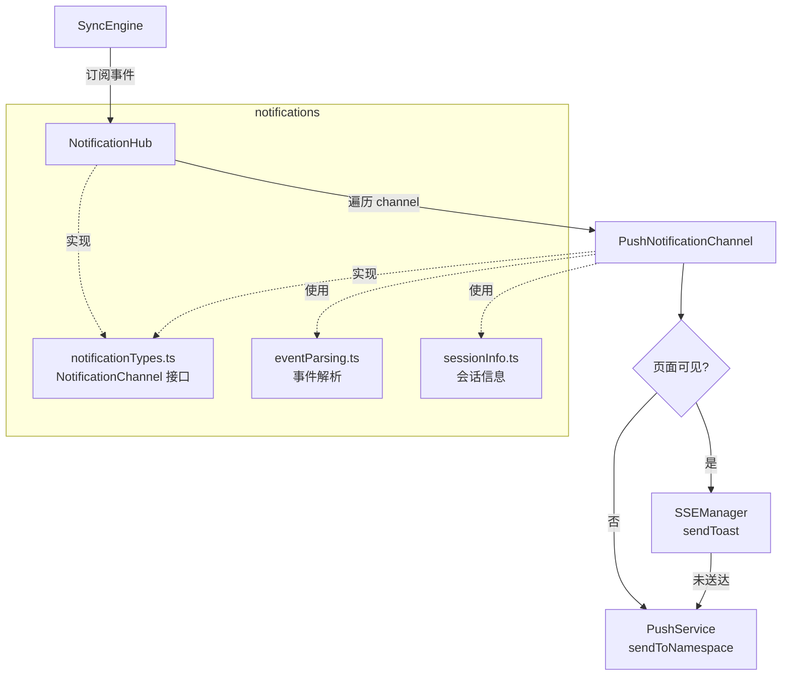
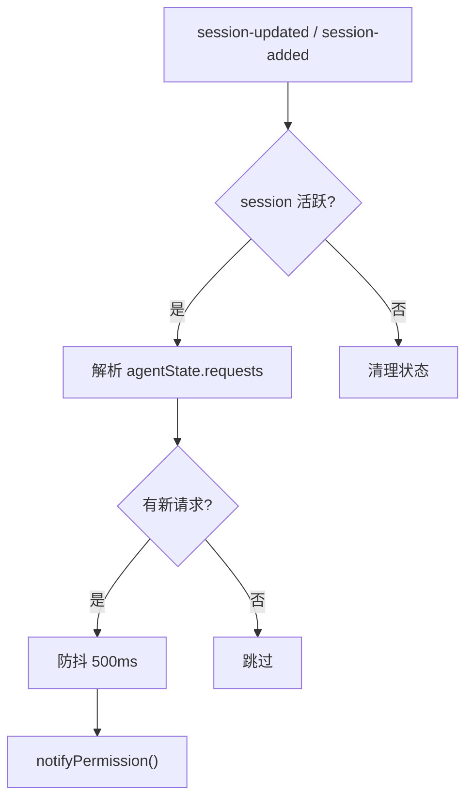
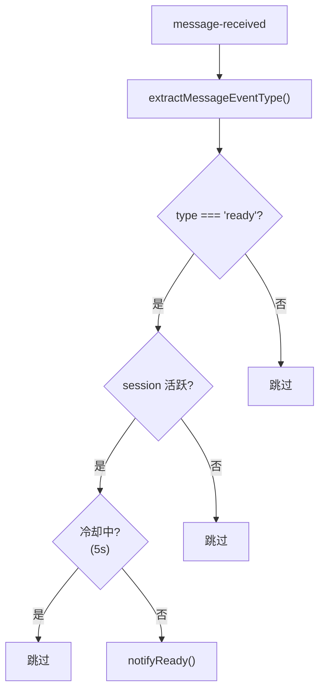

# 通知系统架构

**文件**:
- [`packages/hub/src/notifications/notificationHub.ts`](/packages/hub/src/notifications/notificationHub.ts)
- [`packages/hub/src/notifications/notificationTypes.ts`](/packages/hub/src/notifications/notificationTypes.ts)
- [`packages/hub/src/notifications/eventParsing.ts`](/packages/hub/src/notifications/eventParsing.ts)
- [`packages/hub/src/notifications/sessionInfo.ts`](/packages/hub/src/notifications/sessionInfo.ts)

通知系统监听 SyncEngine 事件，在适当时机通过多种渠道向用户发送通知。

## 整体架构



## 模块职责

### NotificationHub（调度层）

订阅 SyncEngine 事件，检测通知触发时机，分发给所有 channel。

| 文件 | 职责 |
|------|------|
| `notificationHub.ts` | 事件监听、防抖/冷却、分发通知 |
| `notificationTypes.ts` | 定义 `NotificationChannel` 接口和配置 |
| `eventParsing.ts` | 从消息中提取事件类型（检测 ready 事件） |
| `sessionInfo.ts` | 提取会话名称、Agent 名称等显示信息 |

### PushNotificationChannel（执行层）

实现 `NotificationChannel` 接口，负责具体的通知发送策略。

**文件**: [`packages/hub/src/push/pushNotificationChannel.ts`](/packages/hub/src/push/pushNotificationChannel.ts)

详细文档: [推送服务](../push/README.md) | [通知通道](../push/notification-channel.md)

## 通知触发流程

### 权限请求通知



**触发条件**: `session.agentState.requests` 中出现新的 requestId。

### Ready 通知



**触发条件**: 收到 `message-received` 事件且消息类型为 `ready`。

## 降级策略

详见 [通知通道文档](../push/notification-channel.md)

```
页面可见 → SSE Toast 优先 → 未送达则 Web Push
页面不可见 → 直接 Web Push
```

## 组装过程

在 `packages/hub/src/index.ts` 中组装：

```
PushService ←── vapidKeys + store
VisibilityTracker ←── new()
SSEManager ←── heartbeat + VisibilityTracker
PushNotificationChannel ←── PushService + SSEManager + VisibilityTracker
NotificationHub ←── SyncEngine + [PushNotificationChannel]
```

## NotificationChannel 接口

```typescript
interface NotificationChannel {
    sendReady(session: Session): Promise<void>
    sendPermissionRequest(session: Session): Promise<void>
}
```

目前只有一个实现 `PushNotificationChannel`，接口设计支持扩展其他渠道（邮件、Slack 等）。

## 配置项

| 参数 | 默认值 | 说明 |
|------|--------|------|
| `readyCooldownMs` | 5000 | Ready 通知冷却时间，避免频繁通知 |
| `permissionDebounceMs` | 500 | 权限请求防抖时间，合并短时间内的多次请求 |
