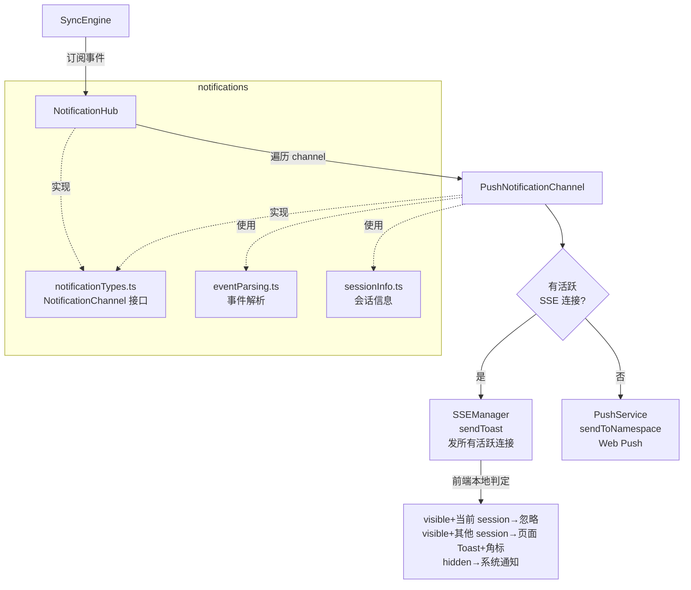
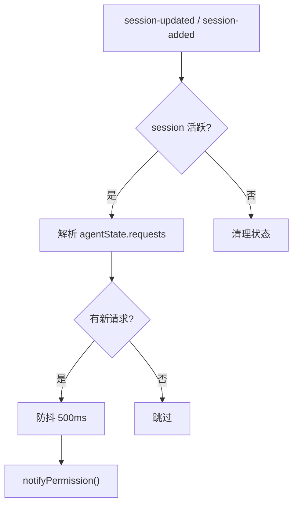
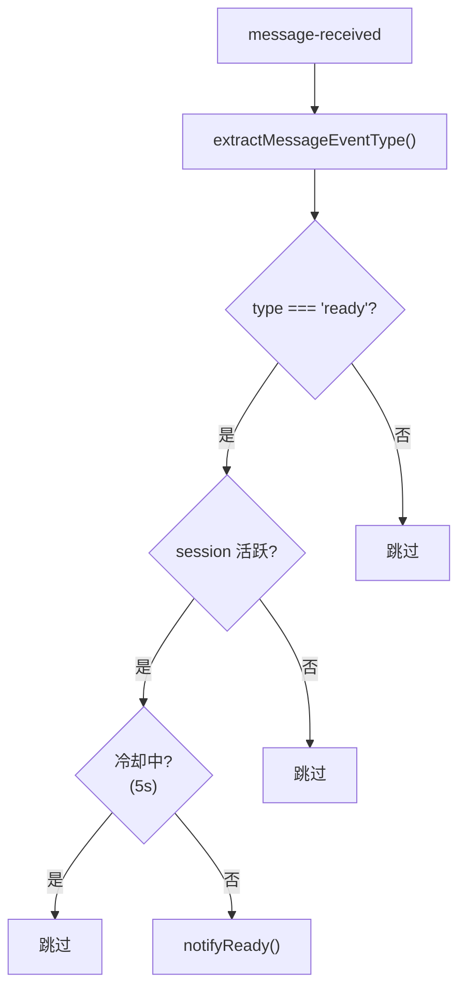

# 通知系统架构

**文件**:
- [`packages/hub/src/notifications/notificationHub.ts`](/packages/hub/src/notifications/notificationHub.ts)
- [`packages/hub/src/notifications/notificationTypes.ts`](/packages/hub/src/notifications/notificationTypes.ts)
- [`packages/hub/src/notifications/eventParsing.ts`](/packages/hub/src/notifications/eventParsing.ts)
- [`packages/hub/src/notifications/sessionInfo.ts`](/packages/hub/src/notifications/sessionInfo.ts)

通知系统监听 SyncEngine 事件，在适当时机通过多种渠道向用户发送通知。

## 整体架构



## 模块职责

### NotificationHub（调度层）

订阅 SyncEngine 事件，检测通知触发时机，分发给所有 channel。

| 文件 | 职责 |
|------|------|
| `notificationHub.ts` | 事件监听、防抖/冷却、分发通知 |
| `notificationTypes.ts` | 定义 `NotificationChannel` 接口和配置 |
| `eventParsing.ts` | 从消息中提取事件类型（检测 ready 事件） |
| `sessionInfo.ts` | 提取会话名称、Agent 名称等显示信息 |

### PushNotificationChannel（执行层）

实现 `NotificationChannel` 接口，负责具体的通知发送策略。

**文件**: [`packages/hub/src/push/pushNotificationChannel.ts`](/packages/hub/src/push/pushNotificationChannel.ts)

详细文档: [推送服务](../push/README.md) | [通知通道](../push/notification-channel.md)

## 通知触发流程

### 权限请求通知



**触发条件**: `session.agentState.requests` 中出现新的 requestId。

### Ready 通知



**触发条件**: 收到 `message-received` 事件且消息类型为 `ready`。

## 降级策略

详见 [通知通道文档](../push/notification-channel.md)

```
有活跃 SSE 连接 → sendToast（发给该 namespace 所有活跃连接，含后台 hidden）
无活跃 SSE 连接 → Web Push
```

**通道选择由 Hub 判定**（`PushNotificationChannel` 调用 `sseManager.hasActiveConnection(namespace)`）：
- **有活跃 SSE 连接**（visible 或 hidden）→ `sendToast` 投递给该 namespace 所有活跃连接；每条连接在前端本地决定如何展示。
- **无活跃 SSE 连接** → `PushService.sendToNamespace` 发送 Web Push。

**「要不要打扰」由前端本地判定**：收到 toast 后，前端 `decideToastAction(sessionId, { activeSessionId, isHidden })` 三分支：

| 连接状态 + 当前路由 | 处理方式 |
|------|---------|
| visible 且当前路由在该 session | 忽略（用户已看到） |
| visible 但不在该 session | 页面 Toast + 角标 |
| hidden | 系统通知（Web Notification） |

多设备天然支持：每个活跃 SSE 连接独立在前端判定展示方式，Hub 不需关心各连接的可见性。

## 组装过程

在 `packages/hub/src/index.ts` 中组装：

```
PushService ←── vapidKeys + store
VisibilityTracker ←── new()
SSEManager ←── heartbeat + VisibilityTracker
PushNotificationChannel ←── PushService + SSEManager
NotificationHub ←── SyncEngine + [PushNotificationChannel]
```

> 注：`PushNotificationChannel` 不再依赖 `VisibilityTracker`（构造参数已移除）。通知链路通过 `sseManager.hasActiveConnection()` 判定通道选择。`VisibilityTracker` 仍被 SSEManager/WebServer 持有（一期保留不删），但通知链路不再消费它，作为后续清理项（见 [docs/pending.md](../../../pending.md) #17）。

## NotificationChannel 接口

```typescript
interface NotificationChannel {
    sendReady(session: Session): Promise<void>
    sendPermissionRequest(session: Session): Promise<void>
}
```

目前只有一个实现 `PushNotificationChannel`，接口设计支持扩展其他渠道（邮件、Slack 等）。

## 配置项

| 参数 | 默认值 | 说明 |
|------|--------|------|
| `readyCooldownMs` | 5000 | Ready 通知冷却时间，避免频繁通知 |
| `permissionDebounceMs` | 500 | 权限请求防抖时间，合并短时间内的多次请求 |
